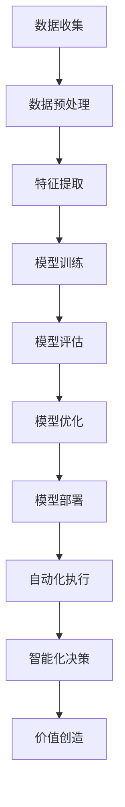

                 

# 软件 2.0 的价值：提升效率、创造价值

> 关键词：软件2.0, 效率提升, 价值创造, 人工智能, 自动化, 数据驱动, 模型驱动, 机器学习

> 摘要：本文旨在探讨软件2.0时代的核心价值，即通过自动化和智能化手段提升效率、创造价值。我们将从背景介绍、核心概念与联系、核心算法原理、数学模型与公式、项目实战、实际应用场景、工具和资源推荐、总结与未来趋势等多方面进行深入分析，帮助读者理解软件2.0的价值所在，并提供实用的指导和建议。

## 1. 背景介绍

### 1.1 软件1.0时代回顾
软件1.0时代主要以手工编程和规则为基础，强调代码的编写和维护。这一时期，软件开发主要依赖于程序员的直觉和经验，开发过程繁琐且效率低下。随着技术的发展，软件1.0逐渐显现出其局限性，特别是在处理复杂问题和大规模数据时。

### 1.2 软件2.0时代的兴起
软件2.0时代则引入了自动化和智能化手段，通过机器学习、数据挖掘等技术，使软件能够自我学习和优化，从而大幅提升效率和创造更多价值。这一转变不仅改变了软件开发的方式，也对整个IT行业产生了深远影响。

## 2. 核心概念与联系

### 2.1 软件2.0的核心概念
- **自动化**：通过编程和算法实现任务的自动化执行。
- **智能化**：利用机器学习和人工智能技术使软件具备自我学习和优化的能力。
- **数据驱动**：基于大量数据进行分析和决策，提高软件的准确性和效率。
- **模型驱动**：通过构建和优化模型来指导软件的行为和决策。

### 2.2 核心概念的Mermaid流程图


## 3. 核心算法原理 & 具体操作步骤

### 3.1 数据预处理
数据预处理是软件2.0中的关键步骤，主要包括数据清洗、特征选择和数据标准化等。具体操作步骤如下：
1. **数据清洗**：去除重复数据、处理缺失值和异常值。
2. **特征选择**：选择对模型训练有帮助的特征。
3. **数据标准化**：将数据转换为统一的尺度，便于模型训练。

### 3.2 特征提取
特征提取是从原始数据中提取有用的特征，以便更好地描述数据。常用的方法包括：
- **统计特征**：如均值、方差等。
- **文本特征**：如词频、TF-IDF等。
- **图像特征**：如边缘检测、颜色直方图等。

### 3.3 模型训练
模型训练是通过给定的数据集训练模型的过程。常用的方法包括：
- **监督学习**：如线性回归、逻辑回归、支持向量机等。
- **无监督学习**：如聚类、降维等。
- **强化学习**：通过与环境的交互学习最优策略。

### 3.4 模型评估
模型评估是通过特定的指标来衡量模型的性能。常用的方法包括：
- **准确率**：正确预测的样本数占总样本数的比例。
- **召回率**：正确预测的正样本数占实际正样本数的比例。
- **F1分数**：准确率和召回率的调和平均值。

### 3.5 模型优化
模型优化是通过调整模型参数和结构来提高模型性能的过程。常用的方法包括：
- **交叉验证**：通过多次划分数据集来评估模型性能。
- **网格搜索**：通过遍历参数空间来找到最优参数组合。
- **正则化**：通过添加惩罚项来防止过拟合。

### 3.6 模型部署
模型部署是将训练好的模型应用到实际场景中的过程。常用的方法包括：
- **API接口**：通过API接口将模型集成到应用程序中。
- **微服务架构**：将模型作为独立的服务进行部署和管理。
- **容器化**：通过Docker等技术将模型打包成容器进行部署。

## 4. 数学模型和公式 & 详细讲解 & 举例说明

### 4.1 线性回归
线性回归是最简单的监督学习方法之一，其数学模型为：
$$
y = \beta_0 + \beta_1 x_1 + \beta_2 x_2 + \cdots + \beta_n x_n + \epsilon
$$
其中，$y$ 是目标变量，$x_1, x_2, \cdots, x_n$ 是特征变量，$\beta_0, \beta_1, \cdots, \beta_n$ 是模型参数，$\epsilon$ 是误差项。

### 4.2 逻辑回归
逻辑回归用于解决二分类问题，其数学模型为：
$$
P(y=1|x) = \frac{1}{1 + e^{-(\beta_0 + \beta_1 x_1 + \beta_2 x_2 + \cdots + \beta_n x_n)}}
$$
其中，$P(y=1|x)$ 是给定特征$x$时目标变量$y$为1的概率。

### 4.3 支持向量机
支持向量机是一种用于分类和回归的监督学习方法，其数学模型为：
$$
y = \text{sign}(\beta_0 + \beta_1 x_1 + \beta_2 x_2 + \cdots + \beta_n x_n + \epsilon)
$$
其中，$\text{sign}$ 函数用于将结果映射到二分类标签。

### 4.4 举例说明
假设我们有一个数据集，包含用户的行为数据和购买行为。我们希望通过这些数据预测用户的购买概率。我们可以使用逻辑回归模型进行训练和预测。具体步骤如下：
1. **数据预处理**：清洗数据，处理缺失值和异常值。
2. **特征提取**：提取用户的年龄、性别、购买历史等特征。
3. **模型训练**：使用逻辑回归模型训练数据集。
4. **模型评估**：通过准确率、召回率等指标评估模型性能。
5. **模型优化**：通过调整参数和特征选择来优化模型。
6. **模型部署**：将模型集成到应用程序中，实现自动化的预测功能。

## 5. 项目实战：代码实际案例和详细解释说明

### 5.1 开发环境搭建
为了进行项目实战，我们需要搭建一个合适的开发环境。具体步骤如下：
1. **安装Python**：确保安装了最新版本的Python。
2. **安装依赖库**：使用pip安装所需的库，如numpy、pandas、scikit-learn等。
3. **配置开发工具**：选择合适的开发工具，如Jupyter Notebook、PyCharm等。

### 5.2 源代码详细实现和代码解读
假设我们使用Python和scikit-learn库进行项目实战。具体代码如下：
```python
import pandas as pd
from sklearn.model_selection import train_test_split
from sklearn.linear_model import LogisticRegression
from sklearn.metrics import accuracy_score, recall_score

# 1. 数据预处理
data = pd.read_csv('user_data.csv')
data = data.dropna()  # 去除缺失值
data = data.sample(frac=1).reset_index(drop=True)  # 打乱数据顺序

# 2. 特征提取
X = data[['age', 'gender', 'purchase_history']]
y = data['purchase_probability']

# 3. 数据划分
X_train, X_test, y_train, y_test = train_test_split(X, y, test_size=0.2, random_state=42)

# 4. 模型训练
model = LogisticRegression()
model.fit(X_train, y_train)

# 5. 模型评估
y_pred = model.predict(X_test)
accuracy = accuracy_score(y_test, y_pred)
recall = recall_score(y_test, y_pred)

print(f'Accuracy: {accuracy}')
print(f'Recall: {recall}')
```

### 5.3 代码解读与分析
上述代码实现了数据预处理、特征提取、数据划分、模型训练和模型评估的过程。具体步骤如下：
1. **数据预处理**：使用pandas库读取数据，去除缺失值，并打乱数据顺序。
2. **特征提取**：选择年龄、性别和购买历史作为特征变量。
3. **数据划分**：使用train_test_split函数将数据集划分为训练集和测试集。
4. **模型训练**：使用LogisticRegression模型进行训练。
5. **模型评估**：使用accuracy_score和recall_score函数评估模型性能。

## 6. 实际应用场景

### 6.1 金融风控
通过分析用户的信用记录和行为数据，预测用户的违约概率，从而实现精准风控。

### 6.2 医疗诊断
通过分析患者的病历数据和生理指标，预测患者的病情发展，从而实现早期诊断和治疗。

### 6.3 营销推荐
通过分析用户的购买历史和行为数据，预测用户的购买偏好，从而实现个性化推荐。

## 7. 工具和资源推荐

### 7.1 学习资源推荐
- **书籍**：《机器学习》（周志华著）、《深度学习》（Ian Goodfellow著）
- **论文**：《神经网络与深度学习》（Yann LeCun等）
- **博客**：Medium上的机器学习系列文章
- **网站**：Kaggle、GitHub上的机器学习项目

### 7.2 开发工具框架推荐
- **开发工具**：Jupyter Notebook、PyCharm
- **框架**：TensorFlow、PyTorch、scikit-learn

### 7.3 相关论文著作推荐
- **论文**：《神经网络与深度学习》（Yann LeCun等）
- **著作**：《深度学习》（Ian Goodfellow著）

## 8. 总结：未来发展趋势与挑战

### 8.1 未来发展趋势
- **自动化**：自动化将成为软件开发的重要趋势，通过机器学习和人工智能技术实现更高效、更智能的开发过程。
- **智能化**：智能化将成为软件的核心价值，通过模型驱动和数据驱动实现更精准、更个性化的服务。
- **数据驱动**：数据将成为软件开发的重要资源，通过大数据分析和挖掘实现更准确的决策和预测。

### 8.2 挑战
- **数据安全**：如何保护用户数据的安全和隐私，避免数据泄露和滥用。
- **模型解释性**：如何提高模型的解释性和透明度，避免黑盒模型带来的风险。
- **算法优化**：如何优化算法性能，提高模型的准确性和效率。

## 9. 附录：常见问题与解答

### 9.1 问题1：如何处理缺失值？
**解答**：可以使用均值、中位数或众数填充缺失值，或者使用插值方法进行填充。

### 9.2 问题2：如何选择特征？
**解答**：可以使用相关性分析、特征重要性分析等方法选择特征。

### 9.3 问题3：如何优化模型？
**解答**：可以使用交叉验证、网格搜索等方法优化模型参数，或者使用正则化方法防止过拟合。

## 10. 扩展阅读 & 参考资料

- **书籍**：《机器学习》（周志华著）、《深度学习》（Ian Goodfellow著）
- **论文**：《神经网络与深度学习》（Yann LeCun等）
- **博客**：Medium上的机器学习系列文章
- **网站**：Kaggle、GitHub上的机器学习项目

---

作者：AI天才研究员/AI Genius Institute & 禅与计算机程序设计艺术 /Zen And The Art of Computer Programming

