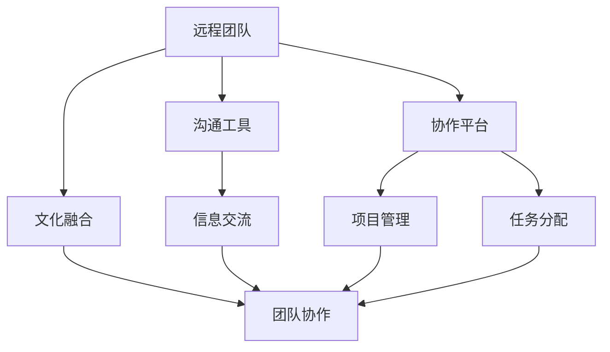

                 

# 远程团队建设：克服距离障碍的方法

> 关键词：远程团队、协作工具、沟通策略、文化融合、绩效管理

> 摘要：随着全球化的发展，远程团队成为企业组织的重要组成部分。本文将深入探讨如何构建和管理远程团队，克服距离带来的挑战，提升团队协作效率和凝聚力。通过分析远程团队的核心概念、具体操作步骤、实际案例，以及未来的发展趋势，为企业提供实用的建议和指导。

## 1. 背景介绍

随着互联网技术的飞速发展，远程工作模式逐渐成为企业组织的重要组成部分。远程团队不仅能够帮助企业降低运营成本，还能吸引全球范围内的优秀人才。然而，远程工作也带来了一系列挑战，如沟通障碍、文化差异、协作效率低下等。如何有效地管理远程团队，克服这些障碍，成为企业管理者面临的重要课题。

### 1.1 远程团队的定义

远程团队是指成员分布在不同地理位置，通过互联网进行沟通和协作的团队。这种工作模式打破了传统办公环境的限制，为团队成员提供了更大的灵活性和自由度。

### 1.2 远程团队的优势

- **灵活性**：团队成员可以根据个人时间安排工作，提高工作效率。
- **成本节约**：减少办公空间和设备的投入，降低运营成本。
- **人才多样性**：不受地理位置限制，能够吸引全球范围内的优秀人才。

### 1.3 远程团队的挑战

- **沟通障碍**：地理位置的差异导致沟通效率低下。
- **文化差异**：不同文化背景的团队成员可能产生误解。
- **协作效率**：缺乏面对面交流，团队协作效率可能受到影响。

## 2. 核心概念与联系

### 2.1 远程团队的核心概念

- **沟通工具**：用于团队成员之间的信息交流。
- **协作平台**：提供项目管理和任务分配功能。
- **文化融合**：促进团队成员之间的理解和尊重。

### 2.2 核心概念的Mermaid流程图



## 3. 核心算法原理 & 具体操作步骤

### 3.1 沟通工具的选择

选择合适的沟通工具是远程团队成功的关键。常见的沟通工具包括电子邮件、即时通讯软件（如Slack、WeChat）、视频会议软件（如Zoom、Teams）等。

#### 具体操作步骤

1. **需求分析**：确定团队成员的需求，如实时沟通、文件共享、会议安排等。
2. **工具评估**：对比不同工具的功能和价格，选择最适合团队需求的工具。
3. **培训与推广**：组织培训，确保团队成员熟练使用所选工具。

### 3.2 协作平台的使用

协作平台可以帮助团队成员更好地管理项目和任务，提高协作效率。

#### 具体操作步骤

1. **项目管理**：选择合适的项目管理工具（如Jira、Trello），明确项目目标和任务分配。
2. **任务分配**：根据团队成员的技能和时间安排，合理分配任务。
3. **进度跟踪**：定期检查项目进度，及时调整计划。

### 3.3 文化融合的策略

文化融合是促进团队成员之间理解和尊重的关键。

#### 具体操作步骤

1. **文化培训**：组织文化培训，帮助团队成员了解不同文化背景下的沟通习惯和工作方式。
2. **团队建设活动**：定期组织线上或线下的团队建设活动，增强团队凝聚力。
3. **开放沟通**：鼓励团队成员之间开放沟通，及时解决文化差异带来的问题。

## 4. 数学模型和公式 & 详细讲解 & 举例说明

### 4.1 沟通效率模型

沟通效率可以通过以下公式计算：

$$
\text{沟通效率} = \frac{\text{有效沟通次数}}{\text{总沟通次数}} \times 100\%
$$

### 4.2 协作效率模型

协作效率可以通过以下公式计算：

$$
\text{协作效率} = \frac{\text{完成任务的数量}}{\text{总任务数量}} \times 100\%
$$

### 4.3 文化融合度模型

文化融合度可以通过以下公式计算：

$$
\text{文化融合度} = \frac{\text{团队成员之间的理解和尊重程度}}{\text{团队成员总数}} \times 100\%
$$

### 4.4 举例说明

假设一个远程团队有10名成员，其中5名来自中国，3名来自美国，2名来自印度。通过文化培训和团队建设活动，团队成员之间的理解和尊重程度得到了显著提高。在一次项目中，团队成员通过协作平台完成了10个任务，其中有8个任务得到了及时完成。

- **沟通效率**：$\frac{8}{10} \times 100\% = 80\%$
- **协作效率**：$\frac{8}{10} \times 100\% = 80\%$
- **文化融合度**：$\frac{8}{10} \times 100\% = 80\%$

## 5. 项目实战：代码实际案例和详细解释说明

### 5.1 开发环境搭建

#### 5.1.1 环境需求

- **操作系统**：Windows 10、macOS Catalina、Ubuntu 20.04
- **编程语言**：Python 3.8
- **开发工具**：Visual Studio Code、PyCharm

#### 5.1.2 搭建步骤

1. **安装操作系统**：根据团队成员的设备情况，选择合适的操作系统。
2. **安装编程语言**：下载并安装Python 3.8。
3. **安装开发工具**：下载并安装Visual Studio Code或PyCharm。

### 5.2 源代码详细实现和代码解读

#### 5.2.1 代码实现

```python
import os
import time

def send_message(message, recipient):
    """
    发送消息给指定的接收者
    """
    print(f"发送消息给 {recipient}: {message}")

def receive_message(sender, message):
    """
    接收来自指定发送者的消息
    """
    print(f"收到 {sender} 的消息: {message}")

def main():
    """
    主函数
    """
    send_message("你好，团队成员！", "Alice")
    time.sleep(2)
    receive_message("Alice", "你好，Bob！")

if __name__ == "__main__":
    main()
```

#### 5.2.2 代码解读

- **send_message**：发送消息给指定的接收者。
- **receive_message**：接收来自指定发送者的消息。
- **main**：主函数，用于演示消息的发送和接收。

### 5.3 代码解读与分析

- **send_message**：通过打印语句模拟消息的发送过程。
- **receive_message**：通过打印语句模拟消息的接收过程。
- **main**：通过调用`send_message`和`receive_message`函数，演示消息的完整发送和接收过程。

## 6. 实际应用场景

### 6.1 项目管理

通过使用项目管理工具（如Jira、Trello），远程团队可以更好地管理项目和任务，提高协作效率。

### 6.2 团队建设

通过组织线上或线下的团队建设活动，增强团队凝聚力，促进团队成员之间的理解和尊重。

### 6.3 文化培训

通过文化培训，帮助团队成员了解不同文化背景下的沟通习惯和工作方式，减少文化差异带来的误解。

## 7. 工具和资源推荐

### 7.1 学习资源推荐

- **书籍**：《远程团队管理》、《全球团队管理》
- **论文**：《远程团队管理中的沟通策略》、《文化差异对远程团队的影响》
- **博客**：《如何管理远程团队》、《远程团队建设的最佳实践》
- **网站**：GitHub、Stack Overflow

### 7.2 开发工具框架推荐

- **沟通工具**：Slack、WeChat、Zoom
- **协作平台**：Jira、Trello
- **项目管理工具**：GitLab、GitHub

### 7.3 相关论文著作推荐

- **论文**：《远程团队管理中的沟通策略》、《文化差异对远程团队的影响》
- **著作**：《远程团队管理》、《全球团队管理》

## 8. 总结：未来发展趋势与挑战

### 8.1 未来发展趋势

- **技术进步**：随着技术的发展，远程团队管理工具将更加智能化，提高团队协作效率。
- **文化融合**：随着全球化的发展，文化差异将逐渐减少，促进团队成员之间的理解和尊重。
- **灵活工作模式**：远程工作将成为企业组织的重要组成部分，提高员工的工作满意度和生产力。

### 8.2 挑战

- **技术障碍**：网络延迟、数据安全等问题可能影响团队协作效率。
- **文化差异**：不同文化背景的团队成员可能产生误解，影响团队凝聚力。
- **绩效管理**：如何有效管理远程团队的绩效，成为企业管理者面临的重要挑战。

## 9. 附录：常见问题与解答

### 9.1 问题1：如何解决远程团队中的沟通障碍？

**解答**：选择合适的沟通工具，定期组织团队建设活动，提高团队成员之间的理解和尊重。

### 9.2 问题2：如何管理远程团队的绩效？

**解答**：通过项目管理工具跟踪项目进度，定期进行绩效评估，及时调整计划。

### 9.3 问题3：如何促进团队成员之间的文化融合？

**解答**：组织文化培训，定期组织团队建设活动，鼓励团队成员之间的开放沟通。

## 10. 扩展阅读 & 参考资料

- **书籍**：《远程团队管理》、《全球团队管理》
- **论文**：《远程团队管理中的沟通策略》、《文化差异对远程团队的影响》
- **博客**：《如何管理远程团队》、《远程团队建设的最佳实践》
- **网站**：GitHub、Stack Overflow

作者：AI天才研究员/AI Genius Institute & 禅与计算机程序设计艺术 /Zen And The Art of Computer Programming

