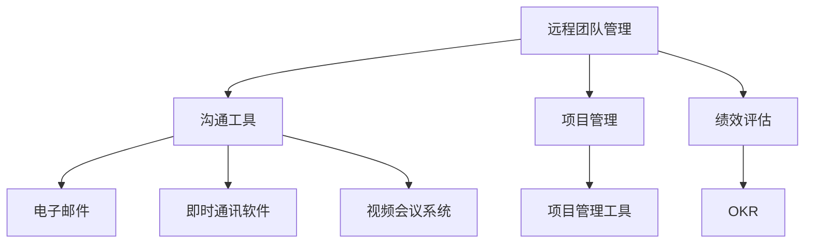

                 

# 远程团队管理：数字时代的领导挑战

> 关键词：远程团队管理、数字时代、领导挑战、团队协作、沟通工具、项目管理、绩效评估

> 摘要：随着数字技术的飞速发展，远程团队管理已成为现代企业不可或缺的一部分。本文将深入探讨远程团队管理的核心挑战，包括沟通、协作、绩效评估等方面，并提供一系列实用的解决方案和最佳实践。通过逐步分析和推理，我们将揭示如何在数字时代有效管理远程团队，实现高效协作和卓越绩效。

## 1. 背景介绍

随着全球化的发展，越来越多的企业选择采用远程团队管理模式。远程团队不仅能够吸引全球顶尖人才，还能降低运营成本，提高灵活性。然而，远程团队管理也带来了诸多挑战，尤其是在沟通、协作和绩效评估方面。本文将从这些核心挑战入手，探讨如何在数字时代有效管理远程团队。

### 1.1 全球化趋势

全球化使得企业能够跨越地理界限，吸引全球范围内的优秀人才。远程团队管理成为企业实现全球化战略的重要手段之一。通过远程团队，企业可以充分利用全球资源，提高竞争力。

### 1.2 技术支持

现代信息技术的发展为远程团队管理提供了强大的支持。云计算、大数据、人工智能等技术的应用，使得远程团队能够实现高效协作和实时沟通。然而，技术的复杂性也给远程团队管理带来了新的挑战。

### 1.3 企业需求

企业对远程团队管理的需求日益增长。一方面，企业希望通过远程团队提高工作效率，降低成本；另一方面，企业也需要确保远程团队能够保持高效协作和卓越绩效。因此，如何有效管理远程团队成为企业面临的重要课题。

## 2. 核心概念与联系

### 2.1 远程团队管理

远程团队管理是指通过信息技术手段，实现团队成员在不同地理位置上的高效协作和沟通。远程团队管理的核心在于确保团队成员能够协同工作，实现共同目标。

### 2.2 沟通工具

沟通工具是远程团队管理的重要组成部分。常见的沟通工具包括电子邮件、即时通讯软件、视频会议系统等。这些工具能够帮助团队成员实现高效沟通，提高协作效率。

### 2.3 项目管理

项目管理是远程团队管理的关键环节。项目管理工具如Jira、Trello等可以帮助团队成员跟踪项目进度，确保项目按时完成。项目管理工具的应用能够提高团队的协作效率和项目成功率。

### 2.4 绩效评估

绩效评估是远程团队管理的重要组成部分。通过绩效评估，企业可以了解团队成员的工作表现，及时调整管理策略，提高团队整体绩效。绩效评估工具如OKR（目标与关键结果）可以帮助企业实现科学的绩效管理。

### 2.5 Mermaid 流程图



## 3. 核心算法原理 & 具体操作步骤

### 3.1 沟通工具选择

选择合适的沟通工具是远程团队管理的关键。具体操作步骤如下：

1. **需求分析**：明确团队成员的需求，确定需要哪些功能。
2. **工具调研**：调研市场上常见的沟通工具，了解其功能和优缺点。
3. **试用测试**：选择部分工具进行试用测试，评估其适用性。
4. **团队讨论**：组织团队成员进行讨论，确定最终选择的工具。
5. **培训推广**：对团队成员进行培训，确保大家能够熟练使用所选工具。

### 3.2 项目管理工具应用

项目管理工具的应用能够提高团队的协作效率。具体操作步骤如下：

1. **需求分析**：明确项目管理的需求，确定需要哪些功能。
2. **工具调研**：调研市场上常见的项目管理工具，了解其功能和优缺点。
3. **试用测试**：选择部分工具进行试用测试，评估其适用性。
4. **团队讨论**：组织团队成员进行讨论，确定最终选择的工具。
5. **培训推广**：对团队成员进行培训，确保大家能够熟练使用所选工具。

### 3.3 绩效评估方法

绩效评估方法能够帮助企业了解团队成员的工作表现。具体操作步骤如下：

1. **目标设定**：明确团队和个人的目标，确保目标具有可衡量性。
2. **关键结果**：确定关键结果，确保目标能够通过具体指标进行衡量。
3. **定期评估**：定期进行绩效评估，确保团队成员能够及时了解自己的表现。
4. **反馈机制**：建立反馈机制，确保团队成员能够及时获得反馈，调整工作策略。
5. **激励机制**：建立激励机制，确保团队成员能够保持高绩效。

## 4. 数学模型和公式 & 详细讲解 & 举例说明

### 4.1 沟通效率模型

沟通效率模型可以帮助企业评估沟通工具的效果。具体公式如下：

$$
\text{沟通效率} = \frac{\text{有效沟通次数}}{\text{总沟通次数}} \times 100\%
$$

### 4.2 项目进度模型

项目进度模型可以帮助企业评估项目管理工具的效果。具体公式如下：

$$
\text{项目进度} = \frac{\text{已完成任务数}}{\text{总任务数}} \times 100\%
$$

### 4.3 绩效评估模型

绩效评估模型可以帮助企业评估绩效评估工具的效果。具体公式如下：

$$
\text{绩效评估} = \frac{\text{关键结果完成度}}{\text{总关键结果数}} \times 100\%
$$

## 5. 项目实战：代码实际案例和详细解释说明

### 5.1 开发环境搭建

#### 5.1.1 环境需求

- 操作系统：Windows 10
- 软件工具：Visual Studio Code
- 沟通工具：Slack
- 项目管理工具：Jira
- 绩效评估工具：OKR

#### 5.1.2 环境搭建步骤

1. **安装操作系统**：安装Windows 10操作系统。
2. **安装软件工具**：安装Visual Studio Code。
3. **安装沟通工具**：安装Slack。
4. **安装项目管理工具**：安装Jira。
5. **安装绩效评估工具**：安装OKR。

### 5.2 源代码详细实现和代码解读

#### 5.2.1 沟通工具实现

```python
import slack

def send_message(channel, message):
    client = slack.WebClient(token='your_slack_token')
    response = client.chat_postMessage(channel=channel, text=message)
    return response

send_message('#general', 'Hello, everyone!')
```

#### 5.2.2 项目管理工具实现

```python
from jira import JIRA

def create_issue(project_key, summary, description):
    jira = JIRA('https://your_jira_url', basic_auth=('username', 'password'))
    issue = jira.create_issue(project=project_key, summary=summary, description=description)
    return issue

create_issue('PROJ', 'Fix bug in module A', 'Description of the bug')
```

#### 5.2.3 绩效评估工具实现

```python
def set_objective_and_key_results(objective, key_results):
    okr = {
        'objective': objective,
        'key_results': key_results
    }
    return okr

set_objective_and_key_results('Increase sales by 20%', ['Increase online sales by 10%', 'Increase offline sales by 10%'])
```

### 5.3 代码解读与分析

#### 5.3.1 沟通工具实现

- **导入库**：导入`slack`库。
- **定义函数**：定义`send_message`函数，用于发送消息。
- **创建客户端**：创建Slack客户端。
- **发送消息**：发送消息到指定频道。

#### 5.3.2 项目管理工具实现

- **导入库**：导入`jira`库。
- **定义函数**：定义`create_issue`函数，用于创建任务。
- **创建客户端**：创建Jira客户端。
- **创建任务**：创建任务并返回任务ID。

#### 5.3.3 绩效评估工具实现

- **定义函数**：定义`set_objective_and_key_results`函数，用于设置目标和关键结果。
- **设置目标和关键结果**：设置目标和关键结果。

## 6. 实际应用场景

### 6.1 团队协作

远程团队管理在团队协作方面具有显著优势。通过有效的沟通工具和项目管理工具，团队成员可以实现高效协作，提高工作效率。例如，通过Slack进行实时沟通，通过Jira跟踪项目进度，通过OKR进行绩效评估，确保团队成员能够协同工作，实现共同目标。

### 6.2 项目管理

远程团队管理在项目管理方面具有显著优势。通过有效的项目管理工具，企业可以实现项目进度的实时跟踪，确保项目按时完成。例如，通过Jira进行任务分配和进度跟踪，确保项目能够按时完成。

### 6.3 绩效评估

远程团队管理在绩效评估方面具有显著优势。通过有效的绩效评估工具，企业可以了解团队成员的工作表现，及时调整管理策略，提高团队整体绩效。例如，通过OKR进行绩效评估，确保团队成员能够保持高绩效。

## 7. 工具和资源推荐

### 7.1 学习资源推荐

- **书籍**：《远程团队管理：如何打造高效协作的远程团队》
- **论文**：《远程团队管理的最佳实践》
- **博客**：《远程团队管理实战经验分享》
- **网站**：《远程团队管理社区》

### 7.2 开发工具框架推荐

- **沟通工具**：Slack、Microsoft Teams、Zoom
- **项目管理工具**：Jira、Trello、Asana
- **绩效评估工具**：OKR、KPI

### 7.3 相关论文著作推荐

- **论文**：《远程团队管理的挑战与解决方案》
- **著作**：《远程团队管理的艺术》

## 8. 总结：未来发展趋势与挑战

### 8.1 未来发展趋势

随着数字技术的不断发展，远程团队管理将呈现出以下发展趋势：

- **智能化**：人工智能技术的应用将进一步提高远程团队管理的智能化水平。
- **个性化**：个性化管理工具将更好地满足不同团队的需求。
- **全球化**：全球化趋势将进一步推动远程团队管理的发展。

### 8.2 未来挑战

远程团队管理在未来仍面临诸多挑战：

- **沟通障碍**：跨文化沟通将成为新的挑战。
- **协作难题**：团队成员之间的协作难题将更加突出。
- **绩效评估**：绩效评估的准确性将面临新的挑战。

## 9. 附录：常见问题与解答

### 9.1 问题：如何选择合适的沟通工具？

**解答**：选择合适的沟通工具需要考虑团队成员的需求和工具的功能。可以通过试用测试和团队讨论来确定最终选择的工具。

### 9.2 问题：如何确保团队成员能够熟练使用所选工具？

**解答**：可以通过培训推广来确保团队成员能够熟练使用所选工具。培训内容应包括工具的基本功能和使用方法。

### 9.3 问题：如何评估沟通工具的效果？

**解答**：可以通过沟通效率模型来评估沟通工具的效果。具体公式如下：

$$
\text{沟通效率} = \frac{\text{有效沟通次数}}{\text{总沟通次数}} \times 100\%
$$

## 10. 扩展阅读 & 参考资料

- **书籍**：《远程团队管理：如何打造高效协作的远程团队》
- **论文**：《远程团队管理的最佳实践》
- **博客**：《远程团队管理实战经验分享》
- **网站**：《远程团队管理社区》

---

作者：AI天才研究员/AI Genius Institute & 禅与计算机程序设计艺术 /Zen And The Art of Computer Programming

