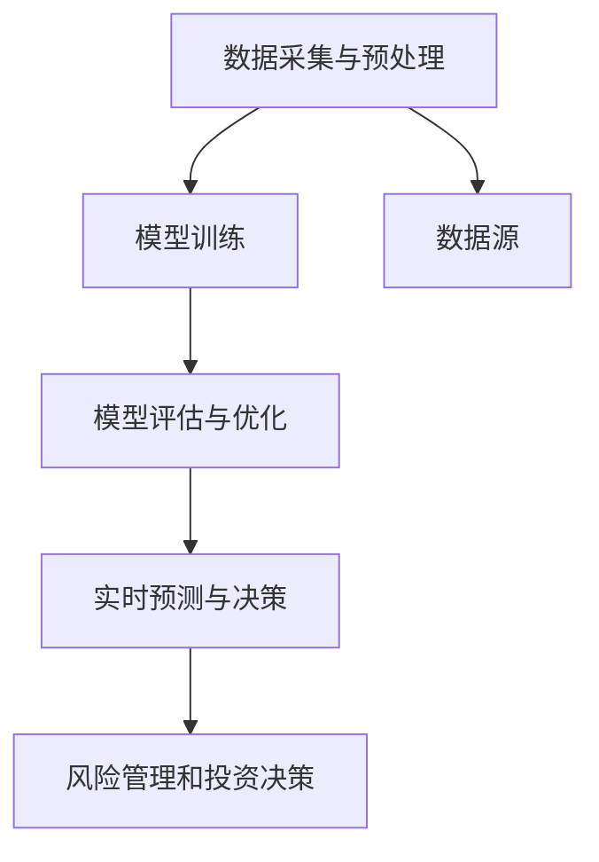

                 

# 金融大模型:精准的风险管理和投资决策

> 关键词：金融大模型, 风险管理, 投资决策, 机器学习, 深度学习, 量化投资, 高频交易, 风险评估, 投资组合优化

> 摘要：本文旨在探讨如何利用金融大模型实现精准的风险管理和投资决策。通过深入分析金融市场的复杂性，本文将介绍金融大模型的核心概念、算法原理、数学模型、实战案例以及实际应用场景。我们将从理论到实践，逐步解析如何构建一个高效的风险管理和投资决策系统，帮助读者理解并掌握这一领域的关键技术。

## 1. 背景介绍

金融市场的复杂性和不确定性一直是困扰投资者和风险管理者的难题。传统的金融模型往往难以捕捉市场的复杂动态，导致风险管理与投资决策的准确性不足。近年来，随着人工智能技术的发展，特别是机器学习和深度学习技术的应用，金融大模型逐渐成为解决这一问题的有效工具。金融大模型通过模拟和预测市场行为，为投资者和风险管理者提供了更为精准的风险管理和投资决策支持。

### 1.1 金融市场复杂性

金融市场具有高度的复杂性和不确定性，主要体现在以下几个方面：

- **市场参与者众多**：包括机构投资者、个人投资者、交易员、分析师等，他们的行为和决策相互影响，增加了市场的复杂性。
- **信息不对称**：不同参与者获取信息的渠道和能力不同，导致信息不对称，增加了市场的不确定性。
- **市场波动性**：市场受到多种因素的影响，如经济政策、自然灾害、政治事件等，导致市场波动频繁。
- **非线性关系**：金融市场中的变量之间往往存在非线性关系，传统的线性模型难以准确描述这些关系。

### 1.2 传统金融模型的局限性

传统的金融模型，如CAPM（资本资产定价模型）、VaR（风险价值）模型等，虽然在一定程度上能够描述市场的某些特征，但存在以下局限性：

- **线性假设**：传统模型通常基于线性假设，无法准确描述市场的非线性特征。
- **参数估计困难**：传统模型需要大量的历史数据进行参数估计，但在实际应用中，数据往往存在缺失或噪声。
- **模型假设过于简化**：传统模型往往假设市场参与者的行为是理性的，忽略了实际市场中的非理性行为。

### 1.3 金融大模型的优势

金融大模型通过引入机器学习和深度学习技术，能够更好地捕捉市场的复杂性和不确定性，具有以下优势：

- **非线性建模**：能够处理非线性关系，提高模型的准确性和泛化能力。
- **数据驱动**：利用大量历史数据进行训练，能够更好地反映市场的实际特征。
- **自适应性**：能够根据市场变化自动调整模型参数，提高模型的实时性和适应性。
- **多因素分析**：能够同时考虑多个因素的影响，提高模型的综合分析能力。

## 2. 核心概念与联系

### 2.1 金融大模型概述

金融大模型是一种基于机器学习和深度学习技术的金融模型，旨在通过模拟和预测市场行为，为投资者和风险管理者提供精准的风险管理和投资决策支持。金融大模型的核心在于利用大数据和先进的算法，从海量历史数据中提取有价值的信息，从而实现对市场的精准预测和分析。

### 2.2 机器学习与深度学习

机器学习和深度学习是金融大模型的核心技术，它们通过学习历史数据中的模式和规律，实现对市场的预测和分析。机器学习和深度学习的主要区别在于：

- **机器学习**：通过算法自动学习数据中的模式和规律，适用于结构化数据和小规模数据集。
- **深度学习**：通过多层神经网络学习数据中的复杂特征和模式，适用于大规模数据集和非结构化数据。

### 2.3 金融大模型的架构

金融大模型的架构主要包括以下几个部分：

- **数据采集与预处理**：从各种数据源（如交易所、新闻网站、社交媒体等）采集数据，并进行预处理，包括数据清洗、特征提取等。
- **模型训练**：利用机器学习和深度学习算法对数据进行训练，生成预测模型。
- **模型评估与优化**：通过评估模型的性能，进行参数调整和优化，提高模型的准确性和泛化能力。
- **实时预测与决策**：将训练好的模型应用于实时数据，进行风险管理和投资决策。

### 2.4 Mermaid 流程图



## 3. 核心算法原理 & 具体操作步骤

### 3.1 机器学习算法

机器学习算法主要包括监督学习、无监督学习和强化学习。在金融大模型中，监督学习和无监督学习的应用最为广泛。

#### 3.1.1 监督学习

监督学习通过训练数据集中的标签信息，学习输入数据与输出数据之间的映射关系。在金融大模型中，监督学习常用于预测股票价格、汇率等。

#### 3.1.2 无监督学习

无监督学习通过学习数据中的内在结构和模式，发现数据之间的关系。在金融大模型中，无监督学习常用于聚类分析、异常检测等。

#### 3.1.3 强化学习

强化学习通过与环境的交互，学习最优策略。在金融大模型中，强化学习常用于交易策略优化、风险管理等。

### 3.2 深度学习算法

深度学习算法主要包括卷积神经网络（CNN）、循环神经网络（RNN）和长短时记忆网络（LSTM）等。在金融大模型中，深度学习算法常用于时间序列预测、情感分析等。

#### 3.2.1 卷积神经网络（CNN）

卷积神经网络通过卷积层提取数据中的局部特征，适用于图像和时间序列数据的处理。在金融大模型中，CNN常用于股票价格预测、新闻情感分析等。

#### 3.2.2 循环神经网络（RNN）

循环神经网络通过循环层处理序列数据，适用于时间序列预测和自然语言处理。在金融大模型中，RNN常用于股票价格预测、新闻情感分析等。

#### 3.2.3 长短时记忆网络（LSTM）

长短时记忆网络通过门控机制处理长期依赖问题，适用于时间序列预测和自然语言处理。在金融大模型中，LSTM常用于股票价格预测、新闻情感分析等。

### 3.3 具体操作步骤

1. **数据采集与预处理**：
   - 从交易所、新闻网站、社交媒体等数据源采集数据。
   - 对数据进行清洗，去除噪声和异常值。
   - 提取特征，如股票价格、成交量、新闻情感等。

2. **模型训练**：
   - 选择合适的机器学习或深度学习算法。
   - 划分训练集和测试集，进行模型训练。
   - 调整模型参数，优化模型性能。

3. **模型评估与优化**：
   - 使用测试集评估模型性能，如准确率、召回率、F1分数等。
   - 根据评估结果调整模型参数，优化模型性能。

4. **实时预测与决策**：
   - 将训练好的模型应用于实时数据，进行风险管理和投资决策。
   - 根据预测结果生成投资建议，如买入、卖出、持有等。

## 4. 数学模型和公式 & 详细讲解 & 举例说明

### 4.1 机器学习算法

#### 4.1.1 线性回归

线性回归是最简单的监督学习算法，通过学习输入数据与输出数据之间的线性关系，预测输出值。

$$
y = \beta_0 + \beta_1 x_1 + \beta_2 x_2 + \cdots + \beta_n x_n + \epsilon
$$

其中，$y$ 是输出值，$x_1, x_2, \cdots, x_n$ 是输入特征，$\beta_0, \beta_1, \cdots, \beta_n$ 是模型参数，$\epsilon$ 是误差项。

#### 4.1.2 逻辑回归

逻辑回归用于分类问题，通过学习输入数据与输出数据之间的非线性关系，预测输出值的概率。

$$
P(y=1|x) = \frac{1}{1 + e^{-(\beta_0 + \beta_1 x_1 + \beta_2 x_2 + \cdots + \beta_n x_n)}}
$$

其中，$P(y=1|x)$ 是输出值为1的概率，$\beta_0, \beta_1, \cdots, \beta_n$ 是模型参数。

### 4.2 深度学习算法

#### 4.2.1 卷积神经网络（CNN）

卷积神经网络通过卷积层提取数据中的局部特征，适用于图像和时间序列数据的处理。

$$
z = \sigma(W * x + b)
$$

其中，$z$ 是卷积层的输出，$W$ 是卷积核，$x$ 是输入数据，$b$ 是偏置项，$\sigma$ 是激活函数。

#### 4.2.2 循环神经网络（RNN）

循环神经网络通过循环层处理序列数据，适用于时间序列预测和自然语言处理。

$$
h_t = \sigma(W_h h_{t-1} + W_x x_t + b)
$$

其中，$h_t$ 是隐藏层的输出，$h_{t-1}$ 是前一时刻的隐藏层输出，$x_t$ 是当前时刻的输入数据，$W_h$ 和 $W_x$ 是权重矩阵，$b$ 是偏置项，$\sigma$ 是激活函数。

#### 4.2.3 长短时记忆网络（LSTM）

长短时记忆网络通过门控机制处理长期依赖问题，适用于时间序列预测和自然语言处理。

$$
i_t = \sigma(W_i [h_{t-1}, x_t] + b_i)
$$

$$
f_t = \sigma(W_f [h_{t-1}, x_t] + b_f)
$$

$$
c_t = f_t \odot c_{t-1} + i_t \odot \sigma(W_c [h_{t-1}, x_t] + b_c)
$$

$$
o_t = \sigma(W_o [h_{t-1}, x_t] + b_o)
$$

$$
h_t = o_t \odot \sigma(c_t)
$$

其中，$i_t$ 是输入门，$f_t$ 是遗忘门，$c_t$ 是细胞状态，$o_t$ 是输出门，$\odot$ 是逐元素乘法，$\sigma$ 是激活函数。

### 4.3 举例说明

#### 4.3.1 线性回归

假设我们有一个股票价格预测问题，输入特征为前一天的收盘价和成交量，输出特征为当天的收盘价。我们可以使用线性回归模型进行预测。

$$
y = \beta_0 + \beta_1 x_1 + \beta_2 x_2
$$

其中，$y$ 是当天的收盘价，$x_1$ 是前一天的收盘价，$x_2$ 是前一天的成交量，$\beta_0, \beta_1, \beta_2$ 是模型参数。

#### 4.3.2 逻辑回归

假设我们有一个股票买入卖出决策问题，输入特征为股票价格、成交量、新闻情感等，输出特征为买入或卖出。我们可以使用逻辑回归模型进行预测。

$$
P(y=1|x) = \frac{1}{1 + e^{-(\beta_0 + \beta_1 x_1 + \beta_2 x_2 + \cdots + \beta_n x_n)}}
$$

其中，$P(y=1|x)$ 是买入的概率，$\beta_0, \beta_1, \cdots, \beta_n$ 是模型参数。

#### 4.3.3 卷积神经网络（CNN）

假设我们有一个股票价格预测问题，输入数据为股票价格的时间序列。我们可以使用卷积神经网络进行预测。

$$
z = \sigma(W * x + b)
$$

其中，$z$ 是卷积层的输出，$W$ 是卷积核，$x$ 是输入数据，$b$ 是偏置项，$\sigma$ 是激活函数。

#### 4.3.4 循环神经网络（RNN）

假设我们有一个股票价格预测问题，输入数据为股票价格的时间序列。我们可以使用循环神经网络进行预测。

$$
h_t = \sigma(W_h h_{t-1} + W_x x_t + b)
$$

其中，$h_t$ 是隐藏层的输出，$h_{t-1}$ 是前一时刻的隐藏层输出，$x_t$ 是当前时刻的输入数据，$W_h$ 和 $W_x$ 是权重矩阵，$b$ 是偏置项，$\sigma$ 是激活函数。

#### 4.3.5 长短时记忆网络（LSTM）

假设我们有一个股票价格预测问题，输入数据为股票价格的时间序列。我们可以使用长短时记忆网络进行预测。

$$
i_t = \sigma(W_i [h_{t-1}, x_t] + b_i)
$$

$$
f_t = \sigma(W_f [h_{t-1}, x_t] + b_f)
$$

$$
c_t = f_t \odot c_{t-1} + i_t \odot \sigma(W_c [h_{t-1}, x_t] + b_c)
$$

$$
o_t = \sigma(W_o [h_{t-1}, x_t] + b_o)
$$

$$
h_t = o_t \odot \sigma(c_t)
$$

其中，$i_t$ 是输入门，$f_t$ 是遗忘门，$c_t$ 是细胞状态，$o_t$ 是输出门，$\odot$ 是逐元素乘法，$\sigma$ 是激活函数。

## 5. 项目实战：代码实际案例和详细解释说明

### 5.1 开发环境搭建

为了实现金融大模型，我们需要搭建一个合适的开发环境。以下是开发环境的搭建步骤：

1. **安装Python**：确保安装了最新版本的Python。
2. **安装依赖库**：安装常用的机器学习和深度学习库，如TensorFlow、PyTorch、scikit-learn等。
3. **安装数据处理库**：安装常用的数据处理库，如Pandas、NumPy等。
4. **安装可视化库**：安装常用的可视化库，如Matplotlib、Seaborn等。

### 5.2 源代码详细实现和代码解读

以下是一个简单的股票价格预测模型的实现代码：

```python
import pandas as pd
import numpy as np
from sklearn.model_selection import train_test_split
from sklearn.linear_model import LinearRegression
from sklearn.metrics import mean_squared_error

# 1. 数据采集与预处理
data = pd.read_csv('stock_prices.csv')
data['Date'] = pd.to_datetime(data['Date'])
data.set_index('Date', inplace=True)

# 2. 特征提取
data['Prev Close'] = data['Close'].shift(1)
data['Volume'] = data['Volume'].shift(1)
data.dropna(inplace=True)

# 3. 划分训练集和测试集
X = data[['Prev Close', 'Volume']]
y = data['Close']
X_train, X_test, y_train, y_test = train_test_split(X, y, test_size=0.2, random_state=42)

# 4. 模型训练
model = LinearRegression()
model.fit(X_train, y_train)

# 5. 模型评估
y_pred = model.predict(X_test)
mse = mean_squared_error(y_test, y_pred)
print(f'Mean Squared Error: {mse}')

# 6. 实时预测与决策
new_data = pd.DataFrame({'Prev Close': [100], 'Volume': [1000000]})
predicted_price = model.predict(new_data)
print(f'Predicted Price: {predicted_price[0]}')
```

### 5.3 代码解读与分析

1. **数据采集与预处理**：
   - 使用Pandas读取股票价格数据。
   - 将日期转换为时间戳，并设置为索引。
   - 提取前一天的收盘价和成交量作为特征。

2. **特征提取**：
   - 使用shift函数提取前一天的收盘价和成交量。
   - 删除缺失值。

3. **划分训练集和测试集**：
   - 使用train_test_split函数将数据划分为训练集和测试集。

4. **模型训练**：
   - 使用LinearRegression模型进行训练。

5. **模型评估**：
   - 使用mean_squared_error函数计算预测值与真实值之间的均方误差。

6. **实时预测与决策**：
   - 使用训练好的模型进行实时预测，并输出预测结果。

## 6. 实际应用场景

金融大模型在实际应用中具有广泛的应用场景，主要包括以下几个方面：

1. **风险管理**：通过预测市场波动，帮助投资者和风险管理者更好地控制风险。
2. **投资决策**：通过预测股票价格、汇率等，帮助投资者做出更明智的投资决策。
3. **高频交易**：通过实时预测市场变化，实现高频交易策略。
4. **量化投资**：通过量化分析，实现自动化投资策略。

## 7. 工具和资源推荐

### 7.1 学习资源推荐

- **书籍**：《统计学习方法》、《机器学习》、《深度学习》
- **论文**：《金融大模型在风险管理中的应用》、《深度学习在股票价格预测中的应用》
- **博客**：Medium、Towards Data Science
- **网站**：Kaggle、GitHub

### 7.2 开发工具框架推荐

- **Python**：TensorFlow、PyTorch、scikit-learn
- **数据处理**：Pandas、NumPy
- **可视化**：Matplotlib、Seaborn

### 7.3 相关论文著作推荐

- **论文**：《金融大模型在风险管理中的应用》、《深度学习在股票价格预测中的应用》
- **著作**：《统计学习方法》、《机器学习》、《深度学习》

## 8. 总结：未来发展趋势与挑战

金融大模型在未来的发展中具有广阔的应用前景，但也面临着一些挑战。未来的发展趋势主要包括以下几个方面：

1. **模型复杂性**：随着模型复杂性的增加，如何提高模型的解释性和可解释性将成为一个重要问题。
2. **数据质量**：高质量的数据是模型性能的关键，如何获取和处理高质量的数据将成为一个挑战。
3. **实时性**：实时预测和决策是金融大模型的重要应用，如何提高模型的实时性将成为一个关键问题。
4. **伦理问题**：金融大模型的应用涉及到伦理问题，如何确保模型的公平性和透明性将成为一个重要问题。

## 9. 附录：常见问题与解答

### 9.1 问题1：如何处理缺失数据？

**解答**：可以使用插值方法（如线性插值、多项式插值）或删除缺失值的方法来处理缺失数据。

### 9.2 问题2：如何提高模型的泛化能力？

**解答**：可以通过增加训练数据量、使用正则化技术（如L1、L2正则化）和使用数据增强技术来提高模型的泛化能力。

### 9.3 问题3：如何评估模型的性能？

**解答**：可以使用交叉验证、均方误差、准确率、召回率等指标来评估模型的性能。

## 10. 扩展阅读 & 参考资料

- **书籍**：《统计学习方法》、《机器学习》、《深度学习》
- **论文**：《金融大模型在风险管理中的应用》、《深度学习在股票价格预测中的应用》
- **博客**：Medium、Towards Data Science
- **网站**：Kaggle、GitHub

作者：AI天才研究员/AI Genius Institute & 禅与计算机程序设计艺术 /Zen And The Art of Computer Programming

