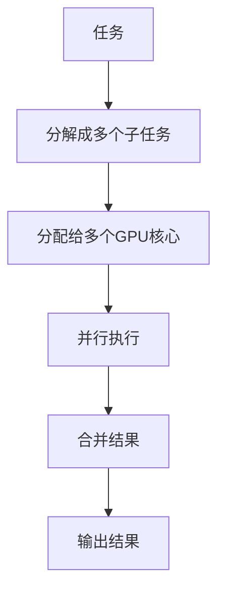
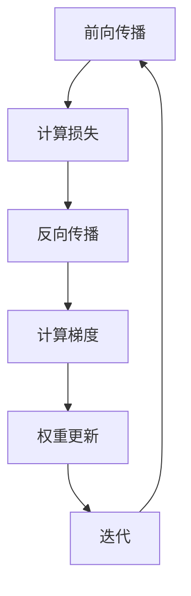

                 

# 黄仁勋与NVIDIA的AI算力革命

> 关键词：黄仁勋, NVIDIA, AI算力, GPU计算, 深度学习, 人工智能, 算法优化, 机器学习

> 摘要：本文将深入探讨NVIDIA创始人黄仁勋及其团队如何通过GPU计算技术推动AI算力革命。我们将从背景介绍出发，解析核心概念与联系，详细阐述核心算法原理，展示数学模型和公式，通过实际代码案例进行项目实战，探讨实际应用场景，并推荐相关学习资源和开发工具。最后，我们将展望未来发展趋势与挑战。

## 1. 背景介绍

### 1.1 黄仁勋与NVIDIA的崛起

黄仁勋，NVIDIA的创始人，自1993年创立NVIDIA以来，他带领公司从一家小型图形处理芯片制造商成长为全球领先的高性能计算和人工智能技术提供商。NVIDIA的GPU（图形处理单元）最初是为了提高计算机图形处理能力而设计的，但随着深度学习和人工智能的兴起，GPU因其并行计算能力而成为这些领域不可或缺的计算资源。

### 1.2 GPU计算与深度学习的结合

GPU计算技术的兴起，特别是NVIDIA的CUDA（Compute Unified Device Architecture）平台，为深度学习和人工智能提供了强大的计算支持。GPU的并行处理能力使得大规模数据并行计算成为可能，从而加速了深度学习模型的训练和推理过程。黄仁勋及其团队通过不断优化GPU架构和算法，使得NVIDIA GPU成为深度学习领域的首选计算平台。

## 2. 核心概念与联系

### 2.1 GPU计算与并行处理

#### 2.1.1 GPU计算原理

GPU（图形处理单元）是一种专门用于处理图形和图像数据的处理器。与CPU（中央处理器）相比，GPU具有更多的计算核心，能够同时处理大量数据。GPU计算的核心原理是并行处理，即将任务分解成多个子任务，同时在多个核心上并行执行，从而提高计算效率。

#### 2.1.2 并行处理流程图



### 2.2 深度学习与人工智能

#### 2.2.1 深度学习原理

深度学习是一种机器学习方法，通过构建多层神经网络模型来模拟人脑的神经网络结构，从而实现对复杂数据的自动学习和识别。深度学习的核心在于神经网络的训练过程，通过反向传播算法不断调整权重，使得模型能够更好地拟合训练数据。

#### 2.2.2 人工智能与深度学习的关系

人工智能是涵盖多种技术的综合领域，而深度学习是其中一种重要的技术。深度学习通过强大的计算能力，使得机器能够从大量数据中自动学习和提取特征，从而实现各种复杂的任务，如图像识别、语音识别、自然语言处理等。NVIDIA的GPU计算技术为深度学习提供了强大的计算支持，使得深度学习模型的训练和推理过程更加高效。

## 3. 核心算法原理 & 具体操作步骤

### 3.1 深度学习中的反向传播算法

#### 3.1.1 反向传播算法原理

反向传播算法是一种用于训练神经网络的算法，通过计算损失函数对权重的梯度，然后使用梯度下降法更新权重，从而使得模型能够更好地拟合训练数据。反向传播算法的核心步骤包括前向传播、计算损失、反向传播和权重更新。

#### 3.1.2 反向传播算法流程图



### 3.2 GPU计算中的并行处理

#### 3.2.1 并行处理原理

GPU计算中的并行处理原理是将任务分解成多个子任务，然后在多个GPU核心上并行执行。通过并行处理，可以显著提高计算效率，特别是在处理大规模数据时。GPU计算的核心在于数据并行和模型并行，数据并行是指将数据分割成多个部分，分别在不同的GPU核心上并行处理；模型并行是指将模型的计算任务分割成多个部分，分别在不同的GPU核心上并行执行。

#### 3.2.2 并行处理流程图


## 4. 数学模型和公式 & 详细讲解 & 举例说明

### 4.1 深度学习中的损失函数

#### 4.1.1 损失函数原理

损失函数是衡量模型预测结果与真实结果之间差异的函数。常见的损失函数包括均方误差（MSE）、交叉熵损失（Cross-Entropy Loss）等。损失函数的选择取决于具体任务和数据类型。

#### 4.1.2 损失函数公式

$$
\text{MSE} = \frac{1}{n} \sum_{i=1}^{n} (y_i - \hat{y}_i)^2
$$

$$
\text{Cross-Entropy Loss} = -\frac{1}{n} \sum_{i=1}^{n} \left[ y_i \log(\hat{y}_i) + (1 - y_i) \log(1 - \hat{y}_i) \right]
$$

### 4.2 反向传播中的梯度计算

#### 4.2.1 梯度计算原理

梯度是损失函数对权重的偏导数，通过计算梯度，可以确定权重更新的方向和幅度。梯度计算的核心在于链式法则，即通过前向传播计算中间变量，然后通过反向传播计算梯度。

#### 4.2.2 梯度计算公式

$$
\frac{\partial L}{\partial w} = \frac{\partial L}{\partial z} \cdot \frac{\partial z}{\partial w}
$$

其中，$L$ 是损失函数，$w$ 是权重，$z$ 是中间变量。

### 4.3 GPU计算中的并行处理

#### 4.3.1 并行处理原理

GPU计算中的并行处理原理是将任务分解成多个子任务，然后在多个GPU核心上并行执行。通过并行处理，可以显著提高计算效率，特别是在处理大规模数据时。GPU计算的核心在于数据并行和模型并行，数据并行是指将数据分割成多个部分，分别在不同的GPU核心上并行处理；模型并行是指将模型的计算任务分割成多个部分，分别在不同的GPU核心上并行执行。

#### 4.3.2 并行处理公式

$$
\text{并行效率} = \frac{\text{单个GPU计算时间}}{\text{多个GPU并行计算时间}}
$$

## 5. 项目实战：代码实际案例和详细解释说明

### 5.1 开发环境搭建

#### 5.1.1 环境准备

为了进行GPU计算和深度学习项目，需要准备以下环境：

1. **操作系统**：Windows、Linux 或 macOS
2. **Python**：推荐使用Python 3.7或更高版本
3. **CUDA**：NVIDIA GPU计算平台和编程模型
4. **cuDNN**：NVIDIA深度神经网络库
5. **PyTorch或TensorFlow**：深度学习框架

#### 5.1.2 安装步骤

1. **安装Python**：可以从Python官方网站下载并安装最新版本的Python。
2. **安装CUDA**：访问NVIDIA官方网站下载并安装CUDA Toolkit。
3. **安装cuDNN**：下载cuDNN库并安装。
4. **安装PyTorch或TensorFlow**：使用pip安装PyTorch或TensorFlow。

### 5.2 源代码详细实现和代码解读

#### 5.2.1 代码实现

以下是一个简单的PyTorch代码示例，用于实现一个简单的线性回归模型：

```python
import torch
import torch.nn as nn
import torch.optim as optim

# 定义数据
x = torch.tensor([[1.0], [2.0], [3.0], [4.0]], dtype=torch.float32)
y = torch.tensor([[2.0], [4.0], [6.0], [8.0]], dtype=torch.float32)

# 定义模型
class LinearRegression(nn.Module):
    def __init__(self):
        super(LinearRegression, self).__init__()
        self.linear = nn.Linear(1, 1)

    def forward(self, x):
        return self.linear(x)

# 初始化模型
model = LinearRegression()

# 定义损失函数和优化器
criterion = nn.MSELoss()
optimizer = optim.SGD(model.parameters(), lr=0.01)

# 训练模型
for epoch in range(1000):
    # 前向传播
    outputs = model(x)
    loss = criterion(outputs, y)

    # 反向传播和优化
    optimizer.zero_grad()
    loss.backward()
    optimizer.step()

    if (epoch+1) % 100 == 0:
        print(f'Epoch [{epoch+1}/1000], Loss: {loss.item():.4f}')

# 测试模型
with torch.no_grad():
    predicted = model(x)
    print(f'预测结果: {predicted}')
```

#### 5.2.2 代码解读

1. **数据准备**：定义输入数据`x`和输出数据`y`。
2. **模型定义**：定义一个简单的线性回归模型，使用`nn.Linear`定义线性层。
3. **损失函数和优化器**：定义均方误差损失函数`MSELoss`和随机梯度下降优化器`SGD`。
4. **训练模型**：通过前向传播计算预测值，计算损失，反向传播计算梯度，更新权重。
5. **测试模型**：使用测试数据进行预测，并输出预测结果。

### 5.3 代码解读与分析

通过上述代码，我们可以看到GPU计算和深度学习的基本流程。首先，我们定义了输入数据和输出数据，然后定义了一个简单的线性回归模型。接着，我们定义了损失函数和优化器，通过前向传播计算预测值，计算损失，反向传播计算梯度，更新权重。最后，我们使用测试数据进行预测，并输出预测结果。

## 6. 实际应用场景

### 6.1 图像识别

通过GPU计算和深度学习技术，可以实现高效的图像识别。例如，使用卷积神经网络（CNN）进行图像分类，通过GPU并行计算加速模型训练和推理过程。

### 6.2 语音识别

GPU计算和深度学习技术也可以应用于语音识别领域。通过使用循环神经网络（RNN）或长短期记忆网络（LSTM），可以实现高效的语音识别和语音合成。

### 6.3 自然语言处理

GPU计算和深度学习技术在自然语言处理领域也有广泛应用。例如，使用Transformer模型进行机器翻译、情感分析等任务，通过GPU并行计算加速模型训练和推理过程。

## 7. 工具和资源推荐

### 7.1 学习资源推荐

1. **书籍**：《深度学习》（Goodfellow, Bengio, Courville）
2. **论文**：《Understanding the difficulty of training deep feedforward neural networks》（Xavier Glorot, Yoshua Bengio）
3. **博客**：NVIDIA开发者博客（https://developer.nvidia.com/blog）
4. **网站**：PyTorch官网（https://pytorch.org/）和TensorFlow官网（https://www.tensorflow.org/）

### 7.2 开发工具框架推荐

1. **PyTorch**：https://pytorch.org/
2. **TensorFlow**：https://www.tensorflow.org/
3. **Jupyter Notebook**：https://jupyter.org/

### 7.3 相关论文著作推荐

1. **《深度学习》**（Goodfellow, Bengio, Courville）
2. **《神经网络与深度学习》**（Michael Nielsen）
3. **《深度学习实战》**（Ian Goodfellow, Yoshua Bengio, Aaron Courville）

## 8. 总结：未来发展趋势与挑战

### 8.1 未来发展趋势

1. **计算能力的提升**：随着GPU技术的不断进步，计算能力将不断提升，为深度学习和人工智能提供更强的计算支持。
2. **模型复杂度的增加**：随着模型复杂度的增加，对计算资源的需求也将增加，GPU计算将成为主流。
3. **应用场景的拓展**：GPU计算和深度学习技术将在更多领域得到应用，如自动驾驶、医疗健康、金融科技等。

### 8.2 面临的挑战

1. **能耗问题**：随着计算能力的提升，能耗问题将成为一个重要的挑战。
2. **数据安全**：在处理大规模数据时，数据安全和隐私保护将成为一个重要问题。
3. **算法优化**：如何进一步优化算法，提高计算效率和模型性能，将是未来的重要研究方向。

## 9. 附录：常见问题与解答

### 9.1 问题1：如何选择合适的深度学习框架？

**解答**：选择合适的深度学习框架需要考虑多个因素，如易用性、社区支持、性能等。PyTorch和TensorFlow是目前最流行的两个框架，可以根据具体需求选择。

### 9.2 问题2：如何优化GPU计算性能？

**解答**：可以通过以下方法优化GPU计算性能：

1. **数据并行**：将数据分割成多个部分，分别在不同的GPU核心上并行处理。
2. **模型并行**：将模型的计算任务分割成多个部分，分别在不同的GPU核心上并行执行。
3. **优化算法**：使用更高效的优化算法，如Adam、RMSprop等。

## 10. 扩展阅读 & 参考资料

1. **NVIDIA开发者博客**：https://developer.nvidia.com/blog
2. **PyTorch官网**：https://pytorch.org/
3. **TensorFlow官网**：https://www.tensorflow.org/
4. **《深度学习》**（Goodfellow, Bengio, Courville）
5. **《神经网络与深度学习》**（Michael Nielsen）

---

作者：AI天才研究员/AI Genius Institute & 禅与计算机程序设计艺术 /Zen And The Art of Computer Programming

