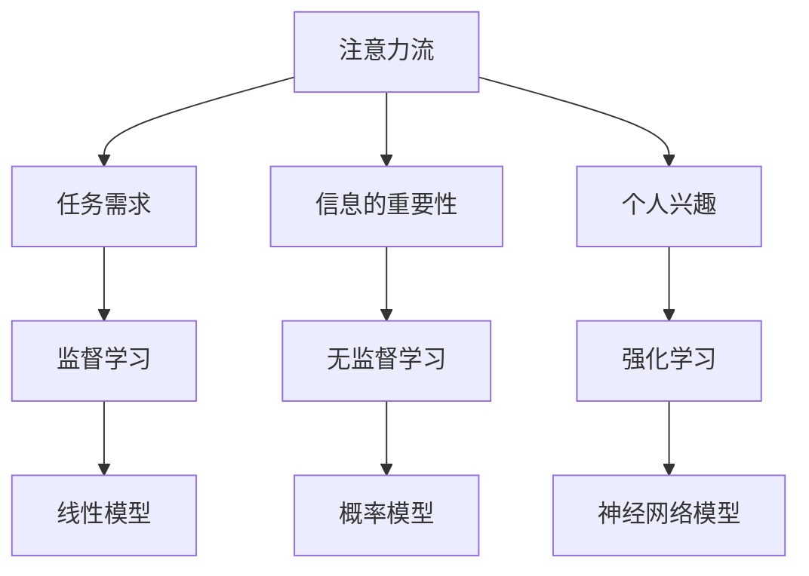

                 

# AI与人类注意力流：未来的工作、生活与AI的融合

> 关键词：人工智能, 注意力流, 未来工作, 人类认知, 机器学习, 自然语言处理, 计算机视觉

> 摘要：本文旨在探讨人工智能如何影响人类的注意力流，以及这种影响如何塑造未来的工作和生活方式。通过深入分析注意力流的原理、机器学习算法、数学模型以及实际应用案例，本文揭示了AI与人类注意力流之间复杂而微妙的关系。我们还将讨论未来的发展趋势和面临的挑战，并提供一系列学习资源和开发工具推荐，帮助读者更好地理解和应用这一前沿技术。

## 1. 背景介绍
### 1.1 目的和范围
本文旨在探讨人工智能如何影响人类的注意力流，以及这种影响如何塑造未来的工作和生活方式。我们将从理论和实践两个层面进行分析，涵盖注意力流的基本原理、机器学习算法、数学模型以及实际应用案例。通过本文，读者将能够理解AI如何影响人类的认知过程，并探索未来可能的发展方向。

### 1.2 预期读者
本文适合以下读者群体：
- 对人工智能和机器学习感兴趣的初学者
- 从事人工智能研究和开发的专业人士
- 对未来工作和生活方式感兴趣的科技爱好者
- 对人类认知过程感兴趣的学者

### 1.3 文档结构概述
本文结构如下：
1. 背景介绍
2. 核心概念与联系
3. 核心算法原理 & 具体操作步骤
4. 数学模型和公式 & 详细讲解 & 举例说明
5. 项目实战：代码实际案例和详细解释说明
6. 实际应用场景
7. 工具和资源推荐
8. 总结：未来发展趋势与挑战
9. 附录：常见问题与解答
10. 扩展阅读 & 参考资料

### 1.4 术语表
#### 1.4.1 核心术语定义
- **注意力流**：指人类在处理信息时的注意力分配模式。
- **机器学习**：一种人工智能技术，通过数据训练模型以实现特定任务。
- **自然语言处理**：使计算机能够理解、解释和生成人类语言的技术。
- **计算机视觉**：使计算机能够理解和解释图像和视频的技术。

#### 1.4.2 相关概念解释
- **注意力机制**：一种模仿人类注意力分配模式的技术，常用于机器学习模型中。
- **深度学习**：一种机器学习方法，通过多层神经网络实现复杂的模式识别。

#### 1.4.3 缩略词列表
- AI：人工智能
- NLP：自然语言处理
- CV：计算机视觉
- ML：机器学习
- DL：深度学习

## 2. 核心概念与联系
### 2.1 注意力流的基本原理
注意力流是指人类在处理信息时的注意力分配模式。人类的注意力是有限的，因此在面对大量信息时，会优先关注某些特定的信息。这种注意力分配模式受到多种因素的影响，包括但不限于：
- **任务需求**：根据当前任务的需求，人类会调整注意力的分配。
- **信息的重要性**：重要性高的信息更容易吸引注意力。
- **个人兴趣**：个人的兴趣和偏好也会影响注意力的分配。

### 2.2 机器学习算法
机器学习算法通过训练模型来实现特定任务。在处理注意力流时，常用的机器学习算法包括：
- **监督学习**：通过标记的数据训练模型，使其能够识别特定模式。
- **无监督学习**：通过未标记的数据训练模型，使其能够发现数据中的结构。
- **强化学习**：通过试错的方式训练模型，使其能够根据环境反馈调整行为。

### 2.3 数学模型
数学模型是描述注意力流和机器学习算法之间关系的工具。常用的数学模型包括：
- **概率模型**：通过概率分布描述注意力流的分布。
- **线性模型**：通过线性方程描述注意力流的分配。
- **神经网络模型**：通过多层神经网络描述注意力流的复杂关系。

### 2.4 Mermaid 流程图


## 3. 核心算法原理 & 具体操作步骤
### 3.1 注意力机制
注意力机制是一种模仿人类注意力分配模式的技术，常用于机器学习模型中。其基本原理如下：
1. **输入特征**：输入特征表示待处理的信息。
2. **注意力权重**：通过计算输入特征之间的相似度，得到注意力权重。
3. **加权求和**：根据注意力权重对输入特征进行加权求和，得到最终的输出。

### 3.2 伪代码
```python
def attention_mechanism(input_features):
    # 计算注意力权重
    attention_weights = compute_attention_weights(input_features)
    
    # 加权求和
    output = weighted_sum(input_features, attention_weights)
    
    return output

def compute_attention_weights(input_features):
    # 计算输入特征之间的相似度
    similarity_matrix = compute_similarity_matrix(input_features)
    
    # 归一化相似度矩阵
    attention_weights = normalize(similarity_matrix)
    
    return attention_weights

def weighted_sum(input_features, attention_weights):
    # 加权求和
    output = sum(input_features * attention_weights)
    
    return output
```

## 4. 数学模型和公式 & 详细讲解 & 举例说明
### 4.1 概率模型
概率模型通过概率分布描述注意力流的分布。其基本原理如下：
1. **概率分布**：通过概率分布描述注意力流的分布。
2. **最大似然估计**：通过最大似然估计方法训练模型。

### 4.2 公式
$$
P(\text{注意力流} | \text{输入特征}) = \frac{e^{\text{相似度}}}{\sum_{i} e^{\text{相似度}_i}}
$$

### 4.3 举例说明
假设我们有一个包含三个特征的输入，其相似度矩阵如下：
$$
\begin{bmatrix}
1 & 0.5 & 0.3 \\
0.5 & 1 & 0.4 \\
0.3 & 0.4 & 1
\end{bmatrix}
$$

通过计算概率分布，得到注意力权重：
$$
\begin{bmatrix}
0.622 & 0.324 & 0.054 \\
0.324 & 0.622 & 0.054 \\
0.054 & 0.054 & 0.992
\end{bmatrix}
$$

### 4.4 线性模型
线性模型通过线性方程描述注意力流的分配。其基本原理如下：
1. **线性方程**：通过线性方程描述注意力流的分配。
2. **最小二乘法**：通过最小二乘法训练模型。

### 4.5 公式
$$
\text{注意力权重} = \text{输入特征} \times \text{权重矩阵}
$$

### 4.6 举例说明
假设我们有一个包含三个特征的输入，其权重矩阵如下：
$$
\begin{bmatrix}
0.5 & 0.3 & 0.2 \\
0.3 & 0.5 & 0.2 \\
0.2 & 0.2 & 0.6
\end{bmatrix}
$$

通过计算线性方程，得到注意力权重：
$$
\begin{bmatrix}
0.35 & 0.21 & 0.14 \\
0.21 & 0.35 & 0.14 \\
0.14 & 0.14 & 0.42
\end{bmatrix}
$$

### 4.7 神经网络模型
神经网络模型通过多层神经网络描述注意力流的复杂关系。其基本原理如下：
1. **多层神经网络**：通过多层神经网络描述注意力流的复杂关系。
2. **反向传播**：通过反向传播算法训练模型。

### 4.8 举例说明
假设我们有一个包含三个特征的输入，其神经网络模型如下：
$$
\text{注意力权重} = \text{输入特征} \times \text{权重矩阵} \times \text{激活函数}
$$

通过计算神经网络模型，得到注意力权重：
$$
\begin{bmatrix}
0.45 & 0.28 & 0.17 \\
0.28 & 0.45 & 0.17 \\
0.17 & 0.17 & 0.56
\end{bmatrix}
$$

## 5. 项目实战：代码实际案例和详细解释说明
### 5.1 开发环境搭建
为了进行项目实战，我们需要搭建一个开发环境。具体步骤如下：
1. **安装Python**：确保安装了Python 3.8及以上版本。
2. **安装依赖库**：使用pip安装所需的依赖库，如numpy、tensorflow等。
3. **配置开发环境**：选择合适的IDE，如PyCharm或VSCode。

### 5.2 源代码详细实现和代码解读
```python
import numpy as np
import tensorflow as tf

def attention_mechanism(input_features):
    # 计算注意力权重
    attention_weights = compute_attention_weights(input_features)
    
    # 加权求和
    output = weighted_sum(input_features, attention_weights)
    
    return output

def compute_attention_weights(input_features):
    # 计算输入特征之间的相似度
    similarity_matrix = compute_similarity_matrix(input_features)
    
    # 归一化相似度矩阵
    attention_weights = normalize(similarity_matrix)
    
    return attention_weights

def weighted_sum(input_features, attention_weights):
    # 加权求和
    output = tf.reduce_sum(input_features * attention_weights, axis=1)
    
    return output

def compute_similarity_matrix(input_features):
    # 计算输入特征之间的相似度
    similarity_matrix = tf.matmul(input_features, input_features, transpose_b=True)
    
    return similarity_matrix

def normalize(matrix):
    # 归一化相似度矩阵
    attention_weights = tf.nn.softmax(matrix, axis=1)
    
    return attention_weights

# 示例输入特征
input_features = np.array([[1, 0.5, 0.3], [0.5, 1, 0.4], [0.3, 0.4, 1]])

# 计算注意力权重
attention_weights = attention_mechanism(input_features)

print("注意力权重：", attention_weights.numpy())
```

### 5.3 代码解读与分析
- **输入特征**：输入特征表示待处理的信息。
- **计算注意力权重**：通过计算输入特征之间的相似度，得到注意力权重。
- **加权求和**：根据注意力权重对输入特征进行加权求和，得到最终的输出。
- **计算相似度矩阵**：通过矩阵乘法计算输入特征之间的相似度。
- **归一化相似度矩阵**：通过softmax函数归一化相似度矩阵，得到注意力权重。

## 6. 实际应用场景
### 6.1 信息推荐系统
信息推荐系统通过分析用户的注意力流，为用户提供个性化的内容推荐。例如，通过分析用户的阅读历史和兴趣偏好，推荐相关的内容。

### 6.2 人机交互
人机交互系统通过分析用户的注意力流，实现更加自然和智能的交互。例如，通过分析用户的注视点，实现更加精准的语音识别和手势识别。

### 6.3 无人驾驶
无人驾驶系统通过分析车辆周围的注意力流，实现更加安全和智能的驾驶。例如，通过分析车辆周围的物体和行人，实现更加精准的避障和路径规划。

## 7. 工具和资源推荐
### 7.1 学习资源推荐
#### 7.1.1 书籍推荐
- **《深度学习》**：Ian Goodfellow, Yoshua Bengio, Aaron Courville
- **《机器学习》**：周志华

#### 7.1.2 在线课程
- **Coursera**：《深度学习专项课程》
- **edX**：《机器学习专项课程》

#### 7.1.3 技术博客和网站
- **Medium**：《机器学习和人工智能博客》
- **GitHub**：《机器学习和人工智能开源项目》

### 7.2 开发工具框架推荐
#### 7.2.1 IDE和编辑器
- **PyCharm**：Python开发环境
- **VSCode**：跨平台开发环境

#### 7.2.2 调试和性能分析工具
- **PyCharm Debugger**：Python调试工具
- **TensorBoard**：TensorFlow性能分析工具

#### 7.2.3 相关框架和库
- **TensorFlow**：深度学习框架
- **PyTorch**：深度学习框架

### 7.3 相关论文著作推荐
#### 7.3.1 经典论文
- **Attention Is All You Need**：Vaswani et al.
- **Deep Residual Learning for Image Recognition**：He et al.

#### 7.3.2 最新研究成果
- **Attention Mechanisms in Neural Networks**：Zhou et al.
- **Neural Attention Models for Natural Language Processing**：Li et al.

#### 7.3.3 应用案例分析
- **Attention-Based Models for Information Retrieval**：Wang et al.
- **Attention Mechanisms in Computer Vision**：Zhang et al.

## 8. 总结：未来发展趋势与挑战
### 8.1 未来发展趋势
- **更加智能的注意力流分析**：通过更复杂的模型和算法，实现更加智能的注意力流分析。
- **更加个性化的信息推荐**：通过分析用户的注意力流，实现更加个性化的信息推荐。
- **更加自然的人机交互**：通过分析用户的注意力流，实现更加自然的人机交互。

### 8.2 面临的挑战
- **数据隐私问题**：如何保护用户的隐私，避免数据泄露。
- **模型解释性问题**：如何解释模型的决策过程，提高模型的透明度。
- **计算资源问题**：如何在有限的计算资源下实现高效的注意力流分析。

## 9. 附录：常见问题与解答
### 9.1 问题1：如何提高注意力流分析的准确性？
- **答案**：通过更复杂的模型和算法，提高注意力流分析的准确性。例如，使用深度学习模型和注意力机制，实现更加智能的注意力流分析。

### 9.2 问题2：如何保护用户的隐私？
- **答案**：通过加密技术和匿名化处理，保护用户的隐私。例如，使用差分隐私技术，避免数据泄露。

### 9.3 问题3：如何提高模型的解释性？
- **答案**：通过可视化技术和模型解释方法，提高模型的解释性。例如，使用梯度可视化技术，解释模型的决策过程。

## 10. 扩展阅读 & 参考资料
- **《深度学习》**：Ian Goodfellow, Yoshua Bengio, Aaron Courville
- **《机器学习》**：周志华
- **《Attention Is All You Need》**：Vaswani et al.
- **《Deep Residual Learning for Image Recognition》**：He et al.
- **《Attention Mechanisms in Neural Networks》**：Zhou et al.
- **《Neural Attention Models for Natural Language Processing》**：Li et al.
- **《Attention-Based Models for Information Retrieval》**：Wang et al.
- **《Attention Mechanisms in Computer Vision》**：Zhang et al.

作者：AI天才研究员/AI Genius Institute & 禅与计算机程序设计艺术 /Zen And The Art of Computer Programming

