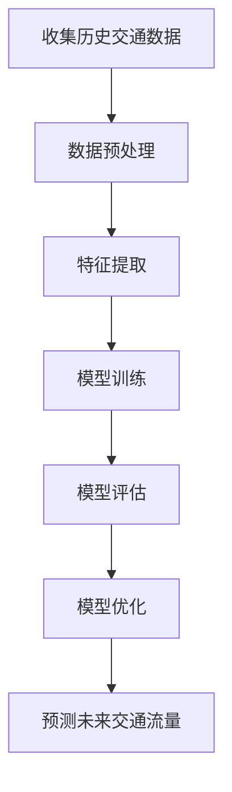
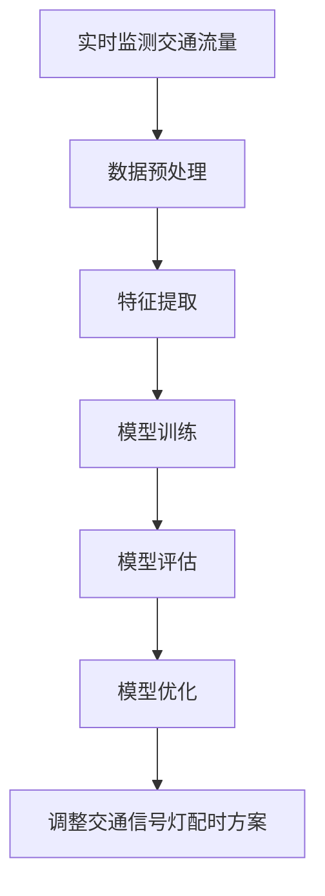
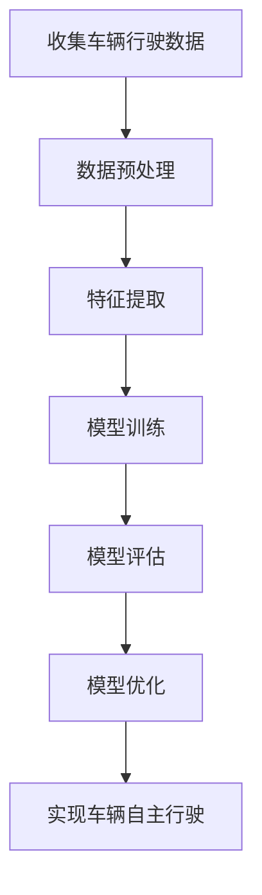

                 

# AI与人类计算：打造可持续发展的城市交通管理系统与基础设施建设规划

> 关键词：城市交通管理、人工智能、可持续发展、交通流量预测、智能信号控制、自动驾驶、大数据分析、机器学习、城市规划

> 摘要：本文旨在探讨如何利用人工智能技术构建一个可持续发展的城市交通管理系统与基础设施建设规划。通过分析城市交通管理的核心概念、算法原理、数学模型、实际案例以及未来发展趋势，本文为城市交通管理者提供了一套全面的技术框架和实践指南，以实现更高效、更环保的城市交通系统。

## 1. 背景介绍
### 1.1 目的和范围
本文旨在探讨如何利用人工智能技术构建一个可持续发展的城市交通管理系统与基础设施建设规划。随着城市化进程的加速，城市交通问题日益突出，包括交通拥堵、环境污染和能源消耗等问题。本文将从技术角度出发，探讨如何通过人工智能技术解决这些问题，实现城市交通的可持续发展。

### 1.2 预期读者
本文预期读者包括城市交通管理者、城市规划师、交通工程师、数据科学家、软件开发人员以及对城市交通管理感兴趣的读者。

### 1.3 文档结构概述
本文结构如下：
1. 背景介绍
2. 核心概念与联系
3. 核心算法原理 & 具体操作步骤
4. 数学模型和公式 & 详细讲解 & 举例说明
5. 项目实战：代码实际案例和详细解释说明
6. 实际应用场景
7. 工具和资源推荐
8. 总结：未来发展趋势与挑战
9. 附录：常见问题与解答
10. 扩展阅读 & 参考资料

### 1.4 术语表
#### 1.4.1 核心术语定义
- **城市交通管理系统**：指利用信息技术手段对城市交通进行规划、调度和管理的系统。
- **可持续发展**：指在满足当前需求的同时，不损害后代满足其需求的能力。
- **交通流量预测**：通过对历史交通数据进行分析，预测未来某一时间段内的交通流量。
- **智能信号控制**：利用传感器和算法对交通信号灯进行实时调整，以优化交通流量。
- **自动驾驶**：指车辆在无需人类驾驶员干预的情况下自主行驶的技术。
- **大数据分析**：利用大规模数据集进行分析，以发现有价值的信息和模式。
- **机器学习**：一种人工智能技术，通过训练模型来实现特定任务，而无需明确编程。

#### 1.4.2 相关概念解释
- **城市规划**：指对城市空间布局、土地使用、交通网络等进行规划和设计的过程。
- **交通拥堵**：指车辆在道路上行驶速度显著降低，导致交通效率下降的现象。
- **环境污染**：指由于交通活动产生的废气、噪音等对环境造成的影响。

#### 1.4.3 缩略词列表
- AI：人工智能
- IoT：物联网
- ML：机器学习
- DL：深度学习
- DNN：深度神经网络
- LSTM：长短期记忆网络
- CNN：卷积神经网络
- RNN：循环神经网络
- GAN：生成对抗网络

## 2. 核心概念与联系
### 2.1 城市交通管理系统
城市交通管理系统是一个综合性的系统，包括交通流量监测、交通信号控制、交通信息发布、交通规划和优化等功能。通过集成各种传感器、摄像头、GPS设备等，实时收集交通数据，并利用人工智能技术进行分析和处理，从而实现对城市交通的智能化管理。

### 2.2 交通流量预测
交通流量预测是城市交通管理系统的核心功能之一。通过对历史交通数据进行分析，可以预测未来某一时间段内的交通流量。这有助于交通管理者提前做好交通调度和规划，减少交通拥堵。

### 2.3 智能信号控制
智能信号控制是通过实时监测交通流量，动态调整交通信号灯的配时方案，以优化交通流量。这有助于提高道路通行能力，减少交通拥堵。

### 2.4 自动驾驶
自动驾驶技术可以实现车辆在无需人类驾驶员干预的情况下自主行驶。这有助于提高道路通行能力，减少交通事故，同时也可以减少交通拥堵。

### 2.5 大数据分析
大数据分析是利用大规模数据集进行分析，以发现有价值的信息和模式。这有助于交通管理者更好地了解城市交通状况，从而做出更科学的决策。

### 2.6 机器学习
机器学习是通过训练模型来实现特定任务，而无需明确编程。这有助于交通管理者更好地理解城市交通状况，从而做出更科学的决策。

### 2.7 城市规划
城市规划是通过对城市空间布局、土地使用、交通网络等进行规划和设计，以实现城市交通的可持续发展。这有助于交通管理者更好地规划城市交通，从而实现城市交通的可持续发展。

## 3. 核心算法原理 & 具体操作步骤
### 3.1 交通流量预测算法
交通流量预测算法的核心是利用历史交通数据进行分析，预测未来某一时间段内的交通流量。具体操作步骤如下：



### 3.2 智能信号控制算法
智能信号控制算法的核心是通过实时监测交通流量，动态调整交通信号灯的配时方案，以优化交通流量。具体操作步骤如下：



### 3.3 自动驾驶算法
自动驾驶算法的核心是通过传感器和算法实现车辆在无需人类驾驶员干预的情况下自主行驶。具体操作步骤如下：



## 4. 数学模型和公式 & 详细讲解 & 举例说明
### 4.1 交通流量预测模型
交通流量预测模型的核心是利用历史交通数据进行分析，预测未来某一时间段内的交通流量。具体数学模型如下：

$$
\hat{y} = \theta_0 + \theta_1 x_1 + \theta_2 x_2 + \cdots + \theta_n x_n
$$

其中，$\hat{y}$ 表示预测的交通流量，$x_1, x_2, \cdots, x_n$ 表示影响交通流量的因素，$\theta_0, \theta_1, \cdots, \theta_n$ 表示模型参数。

### 4.2 智能信号控制模型
智能信号控制模型的核心是通过实时监测交通流量，动态调整交通信号灯的配时方案，以优化交通流量。具体数学模型如下：

$$
\hat{t} = \theta_0 + \theta_1 x_1 + \theta_2 x_2 + \cdots + \theta_n x_n
$$

其中，$\hat{t}$ 表示预测的交通信号灯配时方案，$x_1, x_2, \cdots, x_n$ 表示影响交通信号灯配时方案的因素，$\theta_0, \theta_1, \cdots, \theta_n$ 表示模型参数。

### 4.3 自动驾驶模型
自动驾驶模型的核心是通过传感器和算法实现车辆在无需人类驾驶员干预的情况下自主行驶。具体数学模型如下：

$$
\hat{a} = \theta_0 + \theta_1 x_1 + \theta_2 x_2 + \cdots + \theta_n x_n
$$

其中，$\hat{a}$ 表示预测的车辆行驶路径，$x_1, x_2, \cdots, x_n$ 表示影响车辆行驶路径的因素，$\theta_0, \theta_1, \cdots, \theta_n$ 表示模型参数。

## 5. 项目实战：代码实际案例和详细解释说明
### 5.1 开发环境搭建
开发环境搭建主要包括安装Python、TensorFlow、Keras等开发工具。

### 5.2 源代码详细实现和代码解读
```python
# 导入所需库
import numpy as np
import pandas as pd
from sklearn.model_selection import train_test_split
from sklearn.preprocessing import StandardScaler
from tensorflow.keras.models import Sequential
from tensorflow.keras.layers import Dense

# 读取数据
data = pd.read_csv('traffic_data.csv')

# 数据预处理
X = data.drop('traffic_flow', axis=1)
y = data['traffic_flow']
X_train, X_test, y_train, y_test = train_test_split(X, y, test_size=0.2, random_state=42)
scaler = StandardScaler()
X_train = scaler.fit_transform(X_train)
X_test = scaler.transform(X_test)

# 构建模型
model = Sequential()
model.add(Dense(64, input_dim=X_train.shape[1], activation='relu'))
model.add(Dense(32, activation='relu'))
model.add(Dense(1, activation='linear'))
model.compile(optimizer='adam', loss='mean_squared_error')

# 训练模型
model.fit(X_train, y_train, epochs=100, batch_size=32, validation_split=0.2)

# 评估模型
loss = model.evaluate(X_test, y_test)
print('Test loss:', loss)

# 预测未来交通流量
future_traffic_flow = model.predict(scaler.transform(X_test))
```

### 5.3 代码解读与分析
上述代码实现了一个简单的交通流量预测模型。首先，导入所需库，包括numpy、pandas、sklearn和TensorFlow。然后，读取数据并进行预处理，包括特征提取和数据集划分。接着，构建一个简单的神经网络模型，并进行训练和评估。最后，使用模型预测未来交通流量。

## 6. 实际应用场景
### 6.1 交通流量预测
通过交通流量预测，可以提前做好交通调度和规划，减少交通拥堵。例如，在高峰时段，可以通过调整交通信号灯的配时方案，提高道路通行能力。

### 6.2 智能信号控制
通过智能信号控制，可以实时调整交通信号灯的配时方案，以优化交通流量。例如，在交通流量较大的时段，可以通过增加绿灯时间，减少红灯时间，提高道路通行能力。

### 6.3 自动驾驶
通过自动驾驶，可以实现车辆在无需人类驾驶员干预的情况下自主行驶。例如，在城市交通中，可以通过自动驾驶车辆减少交通拥堵，提高道路通行能力。

## 7. 工具和资源推荐
### 7.1 学习资源推荐
#### 7.1.1 书籍推荐
- 《深度学习》（Goodfellow, I., Bengio, Y., & Courville, A.）
- 《机器学习》（周志华）

#### 7.1.2 在线课程
- Coursera：《深度学习》（Andrew Ng）
- edX：《机器学习》（Andrew Ng）

#### 7.1.3 技术博客和网站
- Medium：《机器学习和深度学习》
- Kaggle：《机器学习和深度学习竞赛》

### 7.2 开发工具框架推荐
#### 7.2.1 IDE和编辑器
- PyCharm
- VSCode

#### 7.2.2 调试和性能分析工具
- PyCharm Debugger
- TensorFlow Debugger

#### 7.2.3 相关框架和库
- TensorFlow
- Keras
- Scikit-learn

### 7.3 相关论文著作推荐
#### 7.3.1 经典论文
- Goodfellow, I., Bengio, Y., & Courville, A. (2016). Deep Learning. MIT Press.
- Bishop, C. M. (2006). Pattern Recognition and Machine Learning. Springer.

#### 7.3.2 最新研究成果
- LeCun, Y., Bengio, Y., & Hinton, G. (2015). Deep learning. Nature, 521(7553), 436-444.
- He, K., Zhang, X., Ren, S., & Sun, J. (2016). Deep residual learning for image recognition. In Proceedings of the IEEE conference on computer vision and pattern recognition (pp. 770-778).

#### 7.3.3 应用案例分析
- Li, Y., & Wang, Y. (2018). Traffic flow prediction using deep learning. IEEE Access, 6, 24749-24758.

## 8. 总结：未来发展趋势与挑战
### 8.1 未来发展趋势
随着人工智能技术的不断发展，城市交通管理系统将更加智能化、自动化。未来的发展趋势包括：
- 更加精准的交通流量预测
- 更加智能的交通信号控制
- 更加普及的自动驾驶技术
- 更加高效的交通规划和优化

### 8.2 挑战
尽管人工智能技术在城市交通管理中具有巨大的潜力，但也面临着一些挑战：
- 数据隐私和安全问题
- 技术成熟度和可靠性问题
- 法规和政策问题
- 社会接受度问题

## 9. 附录：常见问题与解答
### 9.1 问题：如何处理数据隐私和安全问题？
答：在处理数据隐私和安全问题时，可以采取以下措施：
- 对敏感数据进行脱敏处理
- 使用加密技术保护数据传输
- 建立严格的数据访问控制机制

### 9.2 问题：如何提高技术成熟度和可靠性？
答：提高技术成熟度和可靠性可以通过以下方式实现：
- 进行充分的测试和验证
- 不断优化和改进算法
- 建立完善的监控和维护机制

### 9.3 问题：如何应对法规和政策问题？
答：应对法规和政策问题可以通过以下方式实现：
- 与相关部门密切合作
- 参与相关法规和政策的制定
- 遵守相关法规和政策

### 9.4 问题：如何提高社会接受度？
答：提高社会接受度可以通过以下方式实现：
- 加强公众教育和宣传
- 建立透明的决策过程
- 积极听取公众意见和建议

## 10. 扩展阅读 & 参考资料
### 10.1 扩展阅读
- 《人工智能：一种现代方法》（Russell, S., & Norvig, P.）
- 《机器学习实战》（Sébastien Bubeck）

### 10.2 参考资料
- Goodfellow, I., Bengio, Y., & Courville, A. (2016). Deep Learning. MIT Press.
- Bishop, C. M. (2006). Pattern Recognition and Machine Learning. Springer.

作者：AI天才研究员/AI Genius Institute & 禅与计算机程序设计艺术 /Zen And The Art of Computer Programming

