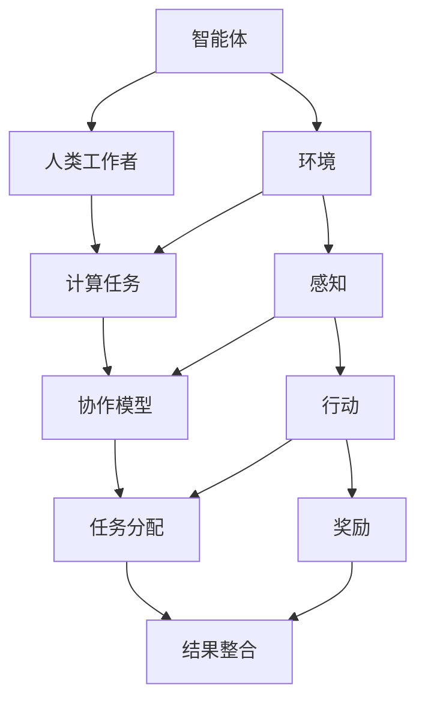
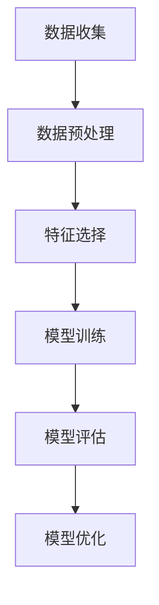

                 

# AI与人类计算：打造可持续发展的未来

> 关键词：人工智能, 人类计算, 可持续发展, 未来趋势, 伦理道德, 技术融合

> 摘要：本文旨在探讨人工智能与人类计算如何共同促进可持续发展。通过分析人工智能的核心概念、算法原理、数学模型、实际案例，以及未来的发展趋势和挑战，本文为读者提供了一个全面的技术视角，帮助理解如何利用人工智能技术推动社会进步。文章还提供了丰富的学习资源和开发工具推荐，以支持读者在这一领域的深入探索。

## 1. 背景介绍
### 1.1 目的和范围
本文旨在探讨人工智能与人类计算如何共同促进可持续发展。我们将从技术原理出发，分析人工智能的核心概念、算法原理、数学模型，并通过实际案例展示其应用。此外，本文还将讨论未来的发展趋势和面临的挑战，为读者提供一个全面的技术视角。

### 1.2 预期读者
本文面向对人工智能和人类计算感兴趣的读者，包括但不限于：
- 人工智能领域的研究人员和工程师
- 对可持续发展感兴趣的政策制定者
- 对技术趋势感兴趣的行业从业者
- 对未来科技充满好奇的学生和爱好者

### 1.3 文档结构概述
本文结构如下：
1. 背景介绍
2. 核心概念与联系
3. 核心算法原理 & 具体操作步骤
4. 数学模型和公式 & 详细讲解 & 举例说明
5. 项目实战：代码实际案例和详细解释说明
6. 实际应用场景
7. 工具和资源推荐
8. 总结：未来发展趋势与挑战
9. 附录：常见问题与解答
10. 扩展阅读 & 参考资料

### 1.4 术语表
#### 1.4.1 核心术语定义
- **人工智能（AI）**：模拟人类智能的技术，包括学习、推理、自我修正等能力。
- **人类计算**：人类与计算机协同工作的模式，通过人类的智慧和计算机的计算能力共同解决问题。
- **可持续发展**：满足当前需求而不损害后代满足其需求的能力。

#### 1.4.2 相关概念解释
- **机器学习（ML）**：AI的一个分支，通过算法使计算机从数据中学习。
- **深度学习（DL）**：一种机器学习方法，通过多层神经网络进行学习。
- **自然语言处理（NLP）**：使计算机能够理解、解释和生成人类语言的技术。

#### 1.4.3 缩略词列表
- AI：人工智能
- ML：机器学习
- DL：深度学习
- NLP：自然语言处理
- GPU：图形处理单元
- CPU：中央处理单元
- API：应用程序编程接口

## 2. 核心概念与联系
### 2.1 人工智能的核心概念
人工智能的核心概念包括：
- **智能体（Agent）**：能够感知环境并采取行动的实体。
- **环境（Environment）**：智能体感知和操作的对象。
- **感知（Perception）**：智能体获取环境信息的过程。
- **行动（Action）**：智能体对环境进行操作的过程。
- **奖励（Reward）**：智能体根据其行为获得的反馈。

### 2.2 人类计算的核心概念
人类计算的核心概念包括：
- **人类工作者（Human Worker）**：参与计算过程的人类个体。
- **计算任务（Computational Task）**：需要人类和计算机共同完成的任务。
- **协作模型（Collaborative Model）**：人类和计算机如何协同工作的模式。
- **任务分配（Task Allocation）**：将任务分配给人类和计算机的过程。
- **结果整合（Result Integration）**：将人类和计算机的结果整合成最终输出。

### 2.3 核心概念的联系
人工智能和人类计算的核心概念紧密相连，共同促进可持续发展。通过人类和计算机的协同工作，可以实现更高效、更智能的解决方案。例如，在自然语言处理任务中，人类可以提供上下文信息，而计算机则进行文本分析和生成。



## 3. 核心算法原理 & 具体操作步骤
### 3.1 机器学习算法原理
机器学习算法的核心原理是通过数据训练模型，使其能够进行预测或决策。常见的机器学习算法包括：
- **监督学习（Supervised Learning）**：通过标记的数据训练模型。
- **无监督学习（Unsupervised Learning）**：通过未标记的数据训练模型。
- **强化学习（Reinforcement Learning）**：通过奖励机制训练模型。

### 3.2 具体操作步骤
以监督学习为例，具体操作步骤如下：
1. **数据收集**：收集标记的数据集。
2. **数据预处理**：清洗、转换和标准化数据。
3. **特征选择**：选择对模型有用的特征。
4. **模型训练**：使用训练数据训练模型。
5. **模型评估**：使用测试数据评估模型性能。
6. **模型优化**：调整模型参数以提高性能。



### 3.3 伪代码示例
```python
# 数据预处理
def preprocess_data(data):
    cleaned_data = clean_data(data)
    normalized_data = normalize_data(cleaned_data)
    return normalized_data

# 特征选择
def select_features(data):
    selected_features = select_relevant_features(data)
    return selected_features

# 模型训练
def train_model(data, labels):
    model = train_supervised_model(data, labels)
    return model

# 模型评估
def evaluate_model(model, test_data, test_labels):
    accuracy = evaluate_accuracy(model, test_data, test_labels)
    return accuracy

# 模型优化
def optimize_model(model, data, labels):
    optimized_model = optimize_hyperparameters(model, data, labels)
    return optimized_model
```

## 4. 数学模型和公式 & 详细讲解 & 举例说明
### 4.1 逻辑回归模型
逻辑回归是一种常用的监督学习算法，用于分类问题。其数学模型如下：
$$
P(y=1|x) = \frac{1}{1 + e^{-(\beta_0 + \beta_1 x)}}
$$
其中，$P(y=1|x)$ 表示给定特征 $x$ 时，标签 $y$ 为 1 的概率，$\beta_0$ 和 $\beta_1$ 是模型参数。

### 4.2 详细讲解
逻辑回归通过最大化似然函数来估计参数 $\beta_0$ 和 $\beta_1$。具体步骤如下：
1. **定义损失函数**：使用交叉熵损失函数。
2. **梯度下降**：通过梯度下降法优化参数。
3. **模型训练**：使用训练数据训练模型。

### 4.3 举例说明
假设我们有一个数据集，包含特征 $x$ 和标签 $y$。我们使用逻辑回归模型进行分类。具体步骤如下：
1. **数据预处理**：清洗和标准化数据。
2. **特征选择**：选择对模型有用的特征。
3. **模型训练**：使用训练数据训练逻辑回归模型。
4. **模型评估**：使用测试数据评估模型性能。

```python
# 逻辑回归模型
def logistic_regression(data, labels):
    # 定义损失函数
    def loss_function(model, data, labels):
        predictions = model.predict(data)
        loss = -np.mean(labels * np.log(predictions) + (1 - labels) * np.log(1 - predictions))
        return loss
    
    # 梯度下降
    def gradient_descent(model, data, labels, learning_rate=0.01, epochs=1000):
        for _ in range(epochs):
            predictions = model.predict(data)
            gradients = (predictions - labels) * data
            model.update_parameters(gradients, learning_rate)
    
    # 训练模型
    model = LogisticRegression()
    gradient_descent(model, data, labels)
    return model
```

## 5. 项目实战：代码实际案例和详细解释说明
### 5.1 开发环境搭建
为了进行项目实战，我们需要搭建一个开发环境。具体步骤如下：
1. **安装Python**：确保安装了Python 3.8及以上版本。
2. **安装依赖库**：使用pip安装所需的库，如numpy、pandas、scikit-learn等。
3. **配置开发环境**：选择合适的IDE，如PyCharm或VSCode。

### 5.2 源代码详细实现和代码解读
我们将实现一个简单的逻辑回归模型，并进行训练和评估。具体代码如下：
```python
import numpy as np
from sklearn.datasets import load_iris
from sklearn.model_selection import train_test_split
from sklearn.preprocessing import StandardScaler
from sklearn.metrics import accuracy_score

# 加载数据集
data = load_iris()
X = data.data
y = data.target

# 数据预处理
X_train, X_test, y_train, y_test = train_test_split(X, y, test_size=0.2, random_state=42)
scaler = StandardScaler()
X_train = scaler.fit_transform(X_train)
X_test = scaler.transform(X_test)

# 定义逻辑回归模型
class LogisticRegression:
    def __init__(self, learning_rate=0.01, epochs=1000):
        self.learning_rate = learning_rate
        self.epochs = epochs
        self.weights = None
        self.bias = None
    
    def fit(self, X, y):
        n_samples, n_features = X.shape
        self.weights = np.zeros(n_features)
        self.bias = 0
        
        for _ in range(self.epochs):
            linear_model = np.dot(X, self.weights) + self.bias
            y_predicted = self._sigmoid(linear_model)
            
            dw = (1 / n_samples) * np.dot(X.T, (y_predicted - y))
            db = (1 / n_samples) * np.sum(y_predicted - y)
            
            self.weights -= self.learning_rate * dw
            self.bias -= self.learning_rate * db
    
    def predict(self, X):
        linear_model = np.dot(X, self.weights) + self.bias
        y_predicted = self._sigmoid(linear_model)
        y_predicted_cls = [1 if i > 0.5 else 0 for i in y_predicted]
        return np.array(y_predicted_cls)
    
    def _sigmoid(self, x):
        return 1 / (1 + np.exp(-x))

# 训练模型
model = LogisticRegression(learning_rate=0.01, epochs=1000)
model.fit(X_train, y_train)

# 预测和评估
y_pred = model.predict(X_test)
accuracy = accuracy_score(y_test, y_pred)
print(f"Accuracy: {accuracy}")
```

### 5.3 代码解读与分析
上述代码实现了一个简单的逻辑回归模型，并进行了训练和评估。具体步骤如下：
1. **数据预处理**：使用sklearn的`load_iris`加载数据集，并进行数据分割和标准化。
2. **定义逻辑回归模型**：定义了一个`LogisticRegression`类，包含训练和预测方法。
3. **训练模型**：使用训练数据训练逻辑回归模型。
4. **预测和评估**：使用测试数据进行预测，并计算准确率。

## 6. 实际应用场景
### 6.1 环境监测
通过结合人工智能和人类计算，可以实现更高效的环境监测。例如，使用无人机收集环境数据，人类专家进行数据分析，共同监测空气质量、水质等。

### 6.2 医疗健康
在医疗健康领域，人工智能和人类计算可以共同提高诊断准确性和治疗效果。例如，通过分析医学影像数据，人类医生进行最终诊断，提高诊断准确率。

### 6.3 教育培训
在教育培训领域，人工智能和人类计算可以共同提高教学质量和学习效果。例如，通过分析学生的学习数据，人类教师进行个性化教学，提高学习效果。

## 7. 工具和资源推荐
### 7.1 学习资源推荐
#### 7.1.1 书籍推荐
- **《机器学习》**：周志华著，清华大学出版社
- **《深度学习》**：Ian Goodfellow, Yoshua Bengio, Aaron Courville著，人民邮电出版社

#### 7.1.2 在线课程
- **Coursera**：Andrew Ng的机器学习课程
- **edX**：MIT的深度学习课程

#### 7.1.3 技术博客和网站
- **Medium**：AI领域的技术博客
- **GitHub**：开源项目和代码示例

### 7.2 开发工具框架推荐
#### 7.2.1 IDE和编辑器
- **PyCharm**：Python开发环境
- **VSCode**：跨平台的代码编辑器

#### 7.2.2 调试和性能分析工具
- **PyCharm Debugger**：Python调试工具
- **VisualVM**：Java性能分析工具

#### 7.2.3 相关框架和库
- **scikit-learn**：机器学习库
- **TensorFlow**：深度学习框架

### 7.3 相关论文著作推荐
#### 7.3.1 经典论文
- **《A Mathematical Theory of Communication》**：Claude Shannon
- **《Learning from Data》**：Yaser S. Abu-Mostafa, Malik Magdon-Ismail, Hsuan-Tien Lin

#### 7.3.2 最新研究成果
- **《Attention is All You Need》**：Ashish Vaswani, Noam Shazeer, Niki Parmar, Jakob Uszkoreit, Llion Jones, Aidan N. Gomez, Łukasz Kaiser, Illia Polosukhin
- **《Generative Pre-trained Transformer》**：Diederik P. Kingma, Jimmy Lei Ba

#### 7.3.3 应用案例分析
- **《AI in Healthcare》**：John Halamka, MD
- **《AI in Education》**：David Wiley

## 8. 总结：未来发展趋势与挑战
### 8.1 未来发展趋势
- **技术融合**：人工智能与人类计算的融合将更加紧密，共同推动可持续发展。
- **伦理道德**：随着技术的发展，伦理道德问题将更加突出，需要制定相应的规范和标准。
- **应用领域**：人工智能和人类计算将在更多领域得到应用，如环境监测、医疗健康、教育培训等。

### 8.2 面临的挑战
- **数据隐私**：如何保护个人数据隐私，避免数据泄露。
- **算法偏见**：如何避免算法偏见，确保公平性和透明性。
- **技术普及**：如何提高技术的普及率，让更多人受益。

## 9. 附录：常见问题与解答
### 9.1 问题1：如何处理数据隐私问题？
**解答**：可以通过加密技术、数据脱敏等方法保护个人数据隐私。

### 9.2 问题2：如何避免算法偏见？
**解答**：可以通过多样化的数据集、公平性评估等方法避免算法偏见。

### 9.3 问题3：如何提高技术的普及率？
**解答**：可以通过教育普及、政策支持等方法提高技术的普及率。

## 10. 扩展阅读 & 参考资料
- **《人工智能简史》**：周志华著，清华大学出版社
- **《深度学习》**：Ian Goodfellow, Yoshua Bengio, Aaron Courville著，人民邮电出版社
- **《机器学习》**：周志华著，清华大学出版社

---

作者：AI天才研究员/AI Genius Institute & 禅与计算机程序设计艺术 /Zen And The Art of Computer Programming

