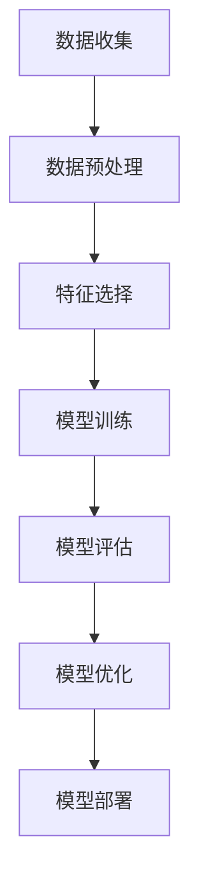
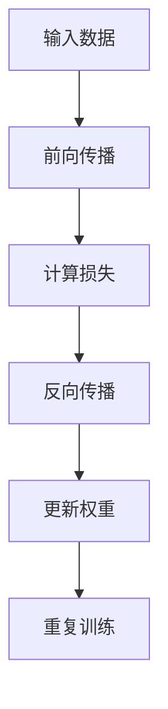

                 

# AI与人类计算：道德、伦理和社会影响

> 关键词：人工智能, 伦理, 道德, 社会影响, 人类计算, 机器学习, 自动化, 数据隐私

> 摘要：本文旨在探讨人工智能与人类计算之间的关系，以及由此带来的道德、伦理和社会影响。通过逐步分析和推理，我们将深入探讨人工智能技术的核心概念、算法原理、数学模型、实际应用案例，并提出未来的发展趋势与挑战。本文适合对人工智能技术感兴趣的读者，特别是那些希望深入了解其伦理和社会影响的技术专家和决策者。

## 1. 背景介绍
### 1.1 目的和范围
本文旨在全面分析人工智能与人类计算之间的关系，探讨其带来的道德、伦理和社会影响。我们将从技术原理出发，逐步深入到实际应用案例，最终展望未来的发展趋势与挑战。本文的目标读者包括但不限于技术专家、决策者、政策制定者以及对人工智能技术感兴趣的公众。

### 1.2 预期读者
- 技术专家：希望深入了解人工智能技术原理和应用的工程师和研究人员。
- 决策者：希望了解人工智能技术对社会影响的政府官员和企业领导者。
- 公众：希望了解人工智能技术如何影响日常生活和社会的普通读者。

### 1.3 文档结构概述
本文将按照以下结构展开：
1. 背景介绍
2. 核心概念与联系
3. 核心算法原理 & 具体操作步骤
4. 数学模型和公式 & 详细讲解 & 举例说明
5. 项目实战：代码实际案例和详细解释说明
6. 实际应用场景
7. 工具和资源推荐
8. 总结：未来发展趋势与挑战
9. 附录：常见问题与解答
10. 扩展阅读 & 参考资料

### 1.4 术语表
#### 1.4.1 核心术语定义
- **人工智能（AI）**：模拟人类智能的技术，包括学习、推理、自我修正等能力。
- **机器学习（ML）**：AI的一个分支，通过算法使计算机系统能够从数据中学习并改进性能。
- **深度学习（DL）**：一种机器学习方法，通过多层神经网络实现复杂的模式识别。
- **伦理**：关于行为正确与否的道德规范。
- **隐私**：个人数据的保护和控制。

#### 1.4.2 相关概念解释
- **人类计算**：人类与计算机系统之间的协作，通过人类的智能和计算机的计算能力共同解决问题。
- **自动化**：通过技术手段减少或替代人类的劳动。

#### 1.4.3 缩略词列表
- AI：人工智能
- ML：机器学习
- DL：深度学习
- NLP：自然语言处理
- CV：计算机视觉
- RL：强化学习

## 2. 核心概念与联系
### 2.1 人工智能的核心概念
- **定义**：人工智能是模拟、扩展和增强人类智能的技术。
- **分类**：根据智能类型，可以分为弱人工智能和强人工智能。
- **发展历程**：从符号主义到连接主义，再到深度学习。

### 2.2 机器学习的核心概念
- **定义**：机器学习是通过算法使计算机系统能够从数据中学习并改进性能。
- **分类**：监督学习、无监督学习、半监督学习、强化学习。
- **流程图**：


### 2.3 深度学习的核心概念
- **定义**：深度学习是机器学习的一个分支，通过多层神经网络实现复杂的模式识别。
- **关键组件**：输入层、隐藏层、输出层、激活函数、损失函数。
- **流程图**：


## 3. 核心算法原理 & 具体操作步骤
### 3.1 机器学习算法原理
- **监督学习**：通过标记数据训练模型。
- **无监督学习**：通过未标记数据训练模型。
- **强化学习**：通过试错学习最优策略。
- **伪代码**：
```python
# 监督学习
def supervised_learning(data, labels):
    model = Model()
    model.train(data, labels)
    return model

# 无监督学习
def unsupervised_learning(data):
    model = Model()
    model.train(data)
    return model

# 强化学习
def reinforcement_learning(env):
    model = Model()
    for episode in range(num_episodes):
        state = env.reset()
        while not env.is_done():
            action = model.choose_action(state)
            next_state, reward, done, _ = env.step(action)
            model.update(state, action, reward, next_state)
            state = next_state
    return model
```

### 3.2 深度学习算法原理
- **前向传播**：输入数据通过网络逐层传递。
- **反向传播**：计算损失并更新权重。
- **伪代码**：
```python
# 前向传播
def forward_pass(input_data, model):
    output = input_data
    for layer in model.layers:
        output = layer.forward(output)
    return output

# 反向传播
def backward_pass(output, target, model):
    error = output - target
    for layer in reversed(model.layers):
        error = layer.backward(error)
    return error
```

## 4. 数学模型和公式 & 详细讲解 & 举例说明
### 4.1 机器学习数学模型
- **线性回归**：最小化均方误差。
- **逻辑回归**：最大化似然函数。
- **公式**：
$$
\text{线性回归: } \hat{y} = \theta_0 + \theta_1 x
$$
$$
\text{逻辑回归: } \hat{y} = \frac{1}{1 + e^{-(\theta_0 + \theta_1 x)}}
$$

### 4.2 深度学习数学模型
- **神经网络**：通过多层非线性变换实现复杂模式识别。
- **公式**：
$$
\text{激活函数: } \sigma(z) = \frac{1}{1 + e^{-z}}
$$
$$
\text{损失函数: } L = \frac{1}{2} (y - \hat{y})^2
$$

## 5. 项目实战：代码实际案例和详细解释说明
### 5.1 开发环境搭建
- **操作系统**：Windows 10, macOS, Linux
- **编程语言**：Python 3.8+
- **依赖库**：numpy, pandas, scikit-learn, tensorflow, keras

### 5.2 源代码详细实现和代码解读
```python
# 导入库
import numpy as np
from sklearn.datasets import load_iris
from sklearn.model_selection import train_test_split
from sklearn.preprocessing import StandardScaler
from sklearn.linear_model import LogisticRegression
from sklearn.metrics import accuracy_score

# 加载数据
data = load_iris()
X = data.data
y = data.target

# 数据预处理
X_train, X_test, y_train, y_test = train_test_split(X, y, test_size=0.2, random_state=42)
scaler = StandardScaler()
X_train = scaler.fit_transform(X_train)
X_test = scaler.transform(X_test)

# 训练模型
model = LogisticRegression()
model.fit(X_train, y_train)

# 预测
y_pred = model.predict(X_test)

# 评估模型
accuracy = accuracy_score(y_test, y_pred)
print(f"Accuracy: {accuracy}")
```

### 5.3 代码解读与分析
- **数据加载**：使用`load_iris`加载鸢尾花数据集。
- **数据预处理**：使用`train_test_split`将数据集分为训练集和测试集，使用`StandardScaler`进行标准化。
- **模型训练**：使用`LogisticRegression`训练模型。
- **模型评估**：使用`accuracy_score`评估模型性能。

## 6. 实际应用场景
### 6.1 金融领域
- **风险评估**：通过机器学习模型预测贷款违约风险。
- **欺诈检测**：通过异常检测技术识别欺诈行为。

### 6.2 医疗领域
- **疾病诊断**：通过深度学习模型辅助医生进行疾病诊断。
- **个性化治疗**：通过机器学习模型推荐个性化治疗方案。

### 6.3 交通领域
- **自动驾驶**：通过深度学习模型实现车辆自动驾驶。
- **交通流量预测**：通过机器学习模型预测交通流量，优化交通管理。

## 7. 工具和资源推荐
### 7.1 学习资源推荐
#### 7.1.1 书籍推荐
- **《机器学习》**：周志华
- **《深度学习》**：Ian Goodfellow, Yoshua Bengio, Aaron Courville

#### 7.1.2 在线课程
- **Coursera**：Andrew Ng的机器学习课程
- **edX**：MIT的深度学习课程

#### 7.1.3 技术博客和网站
- **Medium**：机器学习和人工智能领域的技术博客
- **Kaggle**：机器学习竞赛和资源

### 7.2 开发工具框架推荐
#### 7.2.1 IDE和编辑器
- **PyCharm**：专业的Python开发环境
- **Jupyter Notebook**：交互式编程环境

#### 7.2.2 调试和性能分析工具
- **PyCharm Debugger**：Python调试工具
- **TensorBoard**：TensorFlow的可视化工具

#### 7.2.3 相关框架和库
- **TensorFlow**：深度学习框架
- **PyTorch**：深度学习框架

### 7.3 相关论文著作推荐
#### 7.3.1 经典论文
- **《神经网络与学习机器》**：Tom M. Mitchell
- **《机器学习》**：Tom M. Mitchell

#### 7.3.2 最新研究成果
- **《深度学习在自然语言处理中的应用》**：Ian Goodfellow, Yoshua Bengio, Aaron Courville

#### 7.3.3 应用案例分析
- **《深度学习在医疗领域的应用》**：Ian Goodfellow, Yoshua Bengio, Aaron Courville

## 8. 总结：未来发展趋势与挑战
### 8.1 未来发展趋势
- **技术进步**：算法优化、计算能力提升、数据量增加。
- **应用场景**：更多领域的人工智能应用。
- **伦理挑战**：隐私保护、公平性、透明度。

### 8.2 挑战
- **数据隐私**：如何保护个人数据不被滥用。
- **公平性**：如何确保算法的公平性，避免偏见。
- **透明度**：如何提高算法的透明度，便于理解和解释。

## 9. 附录：常见问题与解答
### 9.1 问题1：如何处理数据隐私问题？
- **答案**：使用差分隐私技术，确保数据在不泄露个体信息的前提下进行分析。

### 9.2 问题2：如何避免算法偏见？
- **答案**：在数据预处理阶段进行偏见检测和校正，确保训练数据的公平性。

### 9.3 问题3：如何提高算法的透明度？
- **答案**：使用可解释性模型，如LIME和SHAP，提高模型的透明度。

## 10. 扩展阅读 & 参考资料
- **书籍**：《机器学习》周志华
- **论文**：《深度学习在自然语言处理中的应用》Ian Goodfellow, Yoshua Bengio, Aaron Courville
- **网站**：Kaggle, Medium

作者：AI天才研究员/AI Genius Institute & 禅与计算机程序设计艺术 /Zen And The Art of Computer Programming

