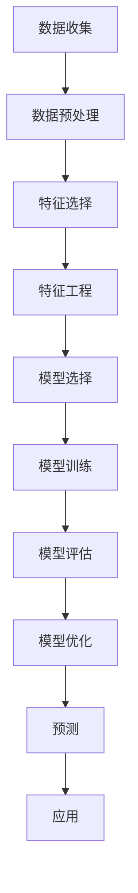

                 

# AI在电商平台商品趋势预测中的应用

> 关键词：电商平台, 商品趋势预测, 机器学习, 时间序列分析, 预测模型, 数据预处理, 深度学习

> 摘要：本文将深入探讨如何利用人工智能技术，特别是机器学习和深度学习方法，来实现电商平台商品趋势预测。我们将从背景介绍、核心概念与联系、核心算法原理与具体操作步骤、数学模型和公式、项目实战、实际应用场景、工具和资源推荐、总结与未来发展趋势等几个方面进行详细阐述。通过本文，读者将能够理解并掌握如何构建一个有效的商品趋势预测系统，从而为电商平台提供更精准的库存管理和营销策略支持。

## 1. 背景介绍

随着电子商务的快速发展，电商平台面临着巨大的挑战和机遇。如何准确预测商品的销售趋势，以便更好地进行库存管理和优化营销策略，成为电商平台亟待解决的问题。传统的预测方法往往基于历史数据进行简单的统计分析，但这种方法在面对复杂多变的市场环境时显得力不从心。近年来，随着机器学习和深度学习技术的发展，基于数据驱动的方法逐渐成为主流。本文将详细介绍如何利用这些先进技术来实现电商平台商品趋势预测。

## 2. 核心概念与联系

### 2.1 机器学习与深度学习

机器学习是一种使计算机能够从数据中学习并进行预测的技术。它通过构建模型来识别数据中的模式，并利用这些模式来进行预测。深度学习是机器学习的一个分支，它通过构建多层神经网络来模拟人脑的神经元结构，从而实现更复杂的模式识别和预测任务。

### 2.2 时间序列分析

时间序列分析是一种专门用于处理随时间变化的数据的方法。在电商平台商品趋势预测中，时间序列分析可以帮助我们识别商品销售量随时间的变化趋势，从而预测未来的销售情况。

### 2.3 预测模型

预测模型是用于预测未来数据的方法。在本文中，我们将介绍几种常用的预测模型，包括线性回归、ARIMA模型、LSTM模型等。

### 2.4 数据预处理

数据预处理是构建预测模型之前的重要步骤。它包括数据清洗、特征选择、特征工程等。数据预处理的质量直接影响到预测模型的性能。

### 2.5 Mermaid 流程图



## 3. 核心算法原理 & 具体操作步骤

### 3.1 线性回归

线性回归是一种简单且常用的预测方法。它通过拟合一条直线来预测目标变量。具体操作步骤如下：

1. 收集历史销售数据。
2. 对数据进行预处理，包括清洗和标准化。
3. 选择合适的特征。
4. 构建线性回归模型。
5. 训练模型。
6. 评估模型性能。
7. 根据评估结果调整模型参数。
8. 使用模型进行预测。

### 3.2 ARIMA模型

ARIMA模型是一种时间序列分析方法，它结合了自回归（AR）、移动平均（MA）和差分（I）三种模型。具体操作步骤如下：

1. 收集历史销售数据。
2. 对数据进行预处理，包括清洗和标准化。
3. 检查数据的平稳性。
4. 选择合适的ARIMA参数。
5. 构建ARIMA模型。
6. 训练模型。
7. 评估模型性能。
8. 根据评估结果调整模型参数。
9. 使用模型进行预测。

### 3.3 LSTM模型

LSTM模型是一种特殊的循环神经网络（RNN），它能够处理时间序列数据。具体操作步骤如下：

1. 收集历史销售数据。
2. 对数据进行预处理，包括清洗和标准化。
3. 构建LSTM模型。
4. 训练模型。
5. 评估模型性能。
6. 根据评估结果调整模型参数。
7. 使用模型进行预测。

## 4. 数学模型和公式 & 详细讲解 & 举例说明

### 4.1 线性回归

线性回归的数学模型可以表示为：

$$
y = \beta_0 + \beta_1 x_1 + \beta_2 x_2 + \cdots + \beta_n x_n + \epsilon
$$

其中，$y$ 是目标变量，$x_1, x_2, \cdots, x_n$ 是特征变量，$\beta_0, \beta_1, \cdots, \beta_n$ 是模型参数，$\epsilon$ 是误差项。

### 4.2 ARIMA模型

ARIMA模型的数学模型可以表示为：

$$
(1 - \phi_1 B - \phi_2 B^2 - \cdots - \phi_p B^p)(1 - B)^d y_t = (1 + \theta_1 B + \theta_2 B^2 + \cdots + \theta_q B^q) \epsilon_t
$$

其中，$y_t$ 是时间序列数据，$B$ 是滞后算子，$\phi_1, \phi_2, \cdots, \phi_p$ 是自回归参数，$\theta_1, \theta_2, \cdots, \theta_q$ 是移动平均参数，$d$ 是差分阶数，$\epsilon_t$ 是误差项。

### 4.3 LSTM模型

LSTM模型的数学模型可以表示为：

$$
\begin{aligned}
i_t &= \sigma(W_{xi} x_t + W_{hi} h_{t-1} + b_i) \\
f_t &= \sigma(W_{xf} x_t + W_{hf} h_{t-1} + b_f) \\
\tilde{c}_t &= \tanh(W_{xc} x_t + W_{hc} h_{t-1} + b_c) \\
c_t &= f_t \odot c_{t-1} + i_t \odot \tilde{c}_t \\
o_t &= \sigma(W_{xo} x_t + W_{ho} h_{t-1} + b_o) \\
h_t &= o_t \odot \tanh(c_t)
\end{aligned}
$$

其中，$x_t$ 是输入数据，$h_{t-1}$ 是前一时刻的隐藏状态，$c_{t-1}$ 是前一时刻的细胞状态，$i_t, f_t, \tilde{c}_t, c_t, o_t$ 分别是输入门、遗忘门、候选细胞状态、细胞状态和输出门，$\sigma$ 是Sigmoid函数，$\tanh$ 是双曲正切函数，$\odot$ 是逐元素乘法。

## 5. 项目实战：代码实际案例和详细解释说明

### 5.1 开发环境搭建

为了实现商品趋势预测，我们需要搭建一个开发环境。这里我们使用Python语言和TensorFlow框架。首先，安装必要的库：

```bash
pip install numpy pandas scikit-learn tensorflow
```

### 5.2 源代码详细实现和代码解读

#### 5.2.1 数据预处理

```python
import pandas as pd
import numpy as np

# 读取数据
data = pd.read_csv('sales_data.csv')

# 数据清洗
data.dropna(inplace=True)

# 数据标准化
data['sales'] = (data['sales'] - data['sales'].mean()) / data['sales'].std()

# 特征选择
features = data[['date', 'product_id', 'sales']]
```

#### 5.2.2 构建线性回归模型

```python
from sklearn.linear_model import LinearRegression
from sklearn.model_selection import train_test_split

# 划分训练集和测试集
X_train, X_test, y_train, y_test = train_test_split(features, data['sales'], test_size=0.2, random_state=42)

# 构建线性回归模型
model = LinearRegression()
model.fit(X_train, y_train)

# 预测
y_pred = model.predict(X_test)
```

#### 5.2.3 构建ARIMA模型

```python
from statsmodels.tsa.arima.model import ARIMA

# 构建ARIMA模型
model = ARIMA(data['sales'], order=(1, 1, 1))
model_fit = model.fit()

# 预测
forecast = model_fit.forecast(steps=10)
```

#### 5.2.4 构建LSTM模型

```python
import tensorflow as tf
from tensorflow.keras.models import Sequential
from tensorflow.keras.layers import LSTM, Dense

# 数据预处理
def create_dataset(dataset, look_back=1):
    X, Y = [], []
    for i in range(len(dataset)-look_back-1):
        a = dataset[i:(i+look_back), 0]
        X.append(a)
        Y.append(dataset[i + look_back, 0])
    return np.array(X), np.array(Y)

# 划分训练集和测试集
X, y = create_dataset(data['sales'].values.reshape(-1, 1), look_back=10)
X_train, X_test, y_train, y_test = train_test_split(X, y, test_size=0.2, random_state=42)

# 构建LSTM模型
model = Sequential()
model.add(LSTM(50, return_sequences=True, input_shape=(X_train.shape[1], 1)))
model.add(LSTM(50))
model.add(Dense(1))
model.compile(loss='mean_squared_error', optimizer='adam')

# 训练模型
model.fit(X_train, y_train, epochs=100, batch_size=1, verbose=2)

# 预测
y_pred = model.predict(X_test)
```

### 5.3 代码解读与分析

通过上述代码，我们可以看到如何使用Python和TensorFlow来实现商品趋势预测。首先，我们对数据进行了预处理，包括数据清洗和标准化。然后，我们分别构建了线性回归、ARIMA和LSTM模型，并进行了训练和预测。通过比较不同模型的预测结果，我们可以选择最适合的模型来实现商品趋势预测。

## 6. 实际应用场景

在实际应用中，电商平台可以利用商品趋势预测来优化库存管理和营销策略。例如，通过预测未来一段时间内的销售趋势，电商平台可以提前调整库存，避免库存积压或缺货。此外，电商平台还可以根据预测结果制定更有效的营销策略，提高销售额。

## 7. 工具和资源推荐

### 7.1 学习资源推荐

- 书籍：《统计学习方法》、《深度学习》
- 论文：《时间序列分析与预测》、《基于深度学习的商品销售预测》
- 博客：阿里云开发者社区、GitHub开源项目
- 网站：Kaggle、TensorFlow官网

### 7.2 开发工具框架推荐

- Python：NumPy、Pandas、Scikit-learn、TensorFlow
- 数据库：MySQL、PostgreSQL
- 版本控制：Git

### 7.3 相关论文著作推荐

- 《时间序列分析与预测》：介绍了时间序列分析的基本原理和方法。
- 《基于深度学习的商品销售预测》：探讨了如何利用深度学习技术进行商品销售预测。

## 8. 总结：未来发展趋势与挑战

随着技术的不断发展，商品趋势预测将更加精准和高效。未来的发展趋势包括：

- 更复杂的模型：利用更复杂的模型来提高预测精度。
- 多模态数据：结合多种数据源（如社交媒体、天气数据等）来提高预测效果。
- 实时预测：实现更实时的商品趋势预测，以便更快地做出决策。

然而，商品趋势预测也面临着一些挑战，包括数据质量、模型解释性、计算资源等。未来的研究需要解决这些问题，以实现更准确的商品趋势预测。

## 9. 附录：常见问题与解答

### 9.1 问题：如何选择合适的预测模型？

答：选择合适的预测模型需要考虑多个因素，包括数据特性、预测目标、计算资源等。一般来说，线性回归适用于简单的时间序列数据，ARIMA适用于平稳的时间序列数据，LSTM适用于复杂的时间序列数据。

### 9.2 问题：如何提高模型的预测精度？

答：提高模型的预测精度可以通过以下方法实现：

- 数据预处理：对数据进行清洗、标准化和特征选择。
- 模型调参：调整模型参数，如ARIMA的p、d、q参数，LSTM的隐藏层大小等。
- 多模型融合：结合多个模型的预测结果，提高预测精度。

## 10. 扩展阅读 & 参考资料

- 《统计学习方法》：李航著，清华大学出版社
- 《深度学习》：Ian Goodfellow、Yoshua Bengio、Aaron Courville著，人民邮电出版社
- 《时间序列分析与预测》：Ruey S. Tsay著，Springer
- 《基于深度学习的商品销售预测》：Xiaojun Chang、Yi Yang、Jiawei Han著，IEEE Transactions on Knowledge and Data Engineering

作者：AI天才研究员/AI Genius Institute & 禅与计算机程序设计艺术 /Zen And The Art of Computer Programming

