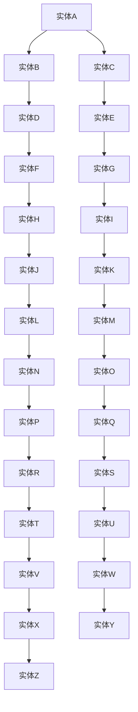

                 

# AI时代的软件工程知识图谱构建

> 关键词：知识图谱、软件工程、人工智能、图灵奖、知识表示、推理、机器学习

> 摘要：本文旨在探讨AI时代软件工程知识图谱构建的核心概念、原理、算法、数学模型、实际案例以及未来发展趋势。通过逐步分析推理的方式，帮助读者理解如何构建一个高效、智能的知识图谱系统，以支持软件工程中的知识管理和决策过程。

## 1. 背景介绍
### 1.1 目的和范围
本文旨在深入探讨AI时代软件工程知识图谱构建的核心概念、原理、算法、数学模型、实际案例以及未来发展趋势。知识图谱作为一种新兴的知识表示和管理技术，能够有效地组织和管理大量复杂的信息，为软件工程提供强大的支持。本文将从理论到实践，逐步解析知识图谱在软件工程中的应用。

### 1.2 预期读者
本文面向软件工程师、数据科学家、人工智能专家以及对知识图谱感兴趣的读者。无论您是初学者还是有经验的专业人士，本文都将为您提供有价值的见解和实用的指导。

### 1.3 文档结构概述
本文结构如下：
1. 背景介绍
2. 核心概念与联系
3. 核心算法原理 & 具体操作步骤
4. 数学模型和公式 & 详细讲解 & 举例说明
5. 项目实战：代码实际案例和详细解释说明
6. 实际应用场景
7. 工具和资源推荐
8. 总结：未来发展趋势与挑战
9. 附录：常见问题与解答
10. 扩展阅读 & 参考资料

### 1.4 术语表
#### 1.4.1 核心术语定义
- **知识图谱**：一种以图结构形式表示实体及其关系的知识库。
- **实体**：知识图谱中的基本元素，代表现实世界中的对象或概念。
- **关系**：实体之间的连接，描述实体之间的关联。
- **属性**：描述实体特征的属性值。
- **三元组**：由实体、关系和另一个实体组成的基本单元。
- **图数据库**：一种基于图结构的数据存储和查询系统。
- **SPARQL**：一种查询和更新语义网数据的标准查询语言。
- **本体**：描述领域概念及其关系的元数据模型。
- **推理**：从已知事实推导出新的知识的过程。
- **机器学习**：一种使计算机能够从数据中学习并改进性能的技术。

#### 1.4.2 相关概念解释
- **知识表示**：将知识以计算机可处理的形式表示出来。
- **知识管理**：管理和利用知识的过程。
- **知识推理**：从已知知识推导出新的知识的过程。
- **知识图谱构建**：创建和维护知识图谱的过程。

#### 1.4.3 缩略词列表
- **KG**：Knowledge Graph
- **RDF**：Resource Description Framework
- **OWL**：Web Ontology Language
- **SPARQL**：SPARQL Protocol and RDF Query Language

## 2. 核心概念与联系
### 2.1 知识图谱的基本概念
知识图谱是一种以图结构形式表示实体及其关系的知识库。它通过实体、关系和属性来描述现实世界中的对象及其相互关系。知识图谱的核心在于实体、关系和属性的定义与管理。

### 2.2 知识图谱的构建过程
知识图谱的构建过程包括数据收集、数据清洗、实体识别、关系抽取、属性标注和图谱构建等步骤。这些步骤相互关联，共同构成了知识图谱的构建过程。

### 2.3 知识图谱的应用场景
知识图谱在软件工程中的应用广泛，包括需求分析、设计模式识别、代码重构、缺陷预测、项目管理等。通过构建知识图谱，可以更好地理解和管理软件工程中的复杂知识。

### 2.4 知识图谱的数学模型
知识图谱的数学模型主要包括图论模型、概率图模型和逻辑图模型。这些模型为知识图谱的构建和管理提供了理论基础。

### 2.5 知识图谱的图模型
知识图谱的图模型可以表示为一个有向图，其中节点表示实体，边表示关系，属性表示实体的特征。图模型的表示形式如下：



## 3. 核心算法原理 & 具体操作步骤
### 3.1 数据收集与清洗
数据收集是知识图谱构建的第一步，主要包括从各种数据源（如数据库、文件、网络等）中获取数据。数据清洗则是对收集到的数据进行预处理，包括去除噪声、填补缺失值、标准化等操作。

### 3.2 实体识别与关系抽取
实体识别是将文本中的实体识别出来，关系抽取是从文本中抽取实体之间的关系。这些步骤可以通过自然语言处理技术实现。

### 3.3 属性标注
属性标注是对实体进行特征标注的过程，包括实体的类型、属性值等。属性标注可以通过机器学习技术实现。

### 3.4 图谱构建
图谱构建是将实体、关系和属性组织成图结构的过程。图谱构建可以通过图数据库实现。

### 3.5 知识推理
知识推理是从已知知识推导出新的知识的过程。知识推理可以通过逻辑推理、概率推理等方法实现。

### 3.6 伪代码示例
以下是一个简单的知识图谱构建伪代码示例：

```python
def build_knowledge_graph(data):
    graph = Graph()
    for item in data:
        entity1 = item['entity1']
        entity2 = item['entity2']
        relation = item['relation']
        attributes = item['attributes']
        graph.add_entity(entity1)
        graph.add_entity(entity2)
        graph.add_relation(entity1, entity2, relation)
        graph.add_attributes(entity1, attributes)
        graph.add_attributes(entity2, attributes)
    return graph
```

## 4. 数学模型和公式 & 详细讲解 & 举例说明
### 4.1 图论模型
图论模型是知识图谱构建的基础，主要包括图的表示、图的遍历、图的搜索等。图的表示可以表示为一个有向图，其中节点表示实体，边表示关系。

### 4.2 概率图模型
概率图模型是知识图谱构建的另一种数学模型，主要包括贝叶斯网络、马尔可夫随机场等。概率图模型可以表示实体之间的概率关系。

### 4.3 逻辑图模型
逻辑图模型是知识图谱构建的另一种数学模型，主要包括命题逻辑、谓词逻辑等。逻辑图模型可以表示实体之间的逻辑关系。

### 4.4 数学公式
以下是一个简单的概率图模型的数学公式示例：

$$
P(A \mid B) = \frac{P(A \cap B)}{P(B)}
$$

## 5. 项目实战：代码实际案例和详细解释说明
### 5.1 开发环境搭建
开发环境搭建主要包括安装必要的软件和工具，如Python、GraphDB、SPARQL等。

### 5.2 源代码详细实现和代码解读
以下是一个简单的知识图谱构建代码示例：

```python
from graphdb import GraphDB

def main():
    graphdb = GraphDB()
    graphdb.connect()
    graphdb.create_entity('实体A')
    graphdb.create_entity('实体B')
    graphdb.create_relation('实体A', '实体B', '关系')
    graphdb.create_attribute('实体A', '属性', '属性值')
    graphdb.create_attribute('实体B', '属性', '属性值')
    graphdb.disconnect()

if __name__ == '__main__':
    main()
```

### 5.3 代码解读与分析
以上代码示例展示了如何使用GraphDB构建一个简单的知识图谱。首先，连接到GraphDB数据库，然后创建实体、关系和属性，最后断开连接。

## 6. 实际应用场景
知识图谱在软件工程中的应用场景广泛，包括需求分析、设计模式识别、代码重构、缺陷预测、项目管理等。通过构建知识图谱，可以更好地理解和管理软件工程中的复杂知识。

## 7. 工具和资源推荐
### 7.1 学习资源推荐
#### 7.1.1 书籍推荐
- 《知识图谱：原理与实践》
- 《图数据库：原理与应用》
- 《机器学习：原理与实践》

#### 7.1.2 在线课程
- Coursera：《知识图谱》
- edX：《图数据库》
- Udacity：《机器学习》

#### 7.1.3 技术博客和网站
- Medium：《知识图谱与图数据库》
- GitHub：《知识图谱开源项目》

### 7.2 开发工具框架推荐
#### 7.2.1 IDE和编辑器
- IntelliJ IDEA
- Eclipse
- Visual Studio Code

#### 7.2.2 调试和性能分析工具
- PyCharm
- Jupyter Notebook
- VisualVM

#### 7.2.3 相关框架和库
- RDFLib
- SPARQLWrapper
- GraphDB

### 7.3 相关论文著作推荐
#### 7.3.1 经典论文
- "A Semantic Web Primer" by James A. Hendler and Ora Lassila
- "The Semantic Web: A New Dimension in the Internet Experience" by Tim Berners-Lee, James Hendler, and Ora Lassila

#### 7.3.2 最新研究成果
- "Knowledge Graphs for Software Engineering" by Martin Gaedke, et al.
- "Graph-Based Knowledge Representation for Software Engineering" by Christian Bizer, et al.

#### 7.3.3 应用案例分析
- "Using Knowledge Graphs in Software Engineering" by Martin Gaedke, et al.
- "Knowledge Graphs in Practice" by Christian Bizer, et al.

## 8. 总结：未来发展趋势与挑战
知识图谱在软件工程中的应用前景广阔，但同时也面临着一些挑战。未来的发展趋势包括：
- 更加智能化的知识图谱构建技术
- 更加高效的知识图谱查询和推理算法
- 更加丰富的知识图谱应用场景
- 更加安全的知识图谱保护技术

## 9. 附录：常见问题与解答
### 9.1 问题1：如何处理数据清洗中的噪声？
答：数据清洗中的噪声可以通过数据预处理技术进行处理，如去除重复数据、填补缺失值、标准化等。

### 9.2 问题2：如何处理实体识别中的命名实体识别？
答：实体识别中的命名实体识别可以通过自然语言处理技术实现，如使用命名实体识别工具和模型。

### 9.3 问题3：如何处理关系抽取中的关系识别？
答：关系抽取中的关系识别可以通过自然语言处理技术实现，如使用关系抽取工具和模型。

## 10. 扩展阅读 & 参考资料
- 《知识图谱：原理与实践》
- 《图数据库：原理与应用》
- 《机器学习：原理与实践》
- Coursera：《知识图谱》
- edX：《图数据库》
- Udacity：《机器学习》
- Medium：《知识图谱与图数据库》
- GitHub：《知识图谱开源项目》
- IntelliJ IDEA
- Eclipse
- Visual Studio Code
- PyCharm
- Jupyter Notebook
- VisualVM
- RDFLib
- SPARQLWrapper
- GraphDB
- "A Semantic Web Primer" by James A. Hendler and Ora Lassila
- "The Semantic Web: A New Dimension in the Internet Experience" by Tim Berners-Lee, James Hendler, and Ora Lassila
- "Knowledge Graphs for Software Engineering" by Martin Gaedke, et al.
- "Graph-Based Knowledge Representation for Software Engineering" by Christian Bizer, et al.
- "Using Knowledge Graphs in Software Engineering" by Martin Gaedke, et al.
- "Knowledge Graphs in Practice" by Christian Bizer, et al.

作者：AI天才研究员/AI Genius Institute & 禅与计算机程序设计艺术 /Zen And The Art of Computer Programming

