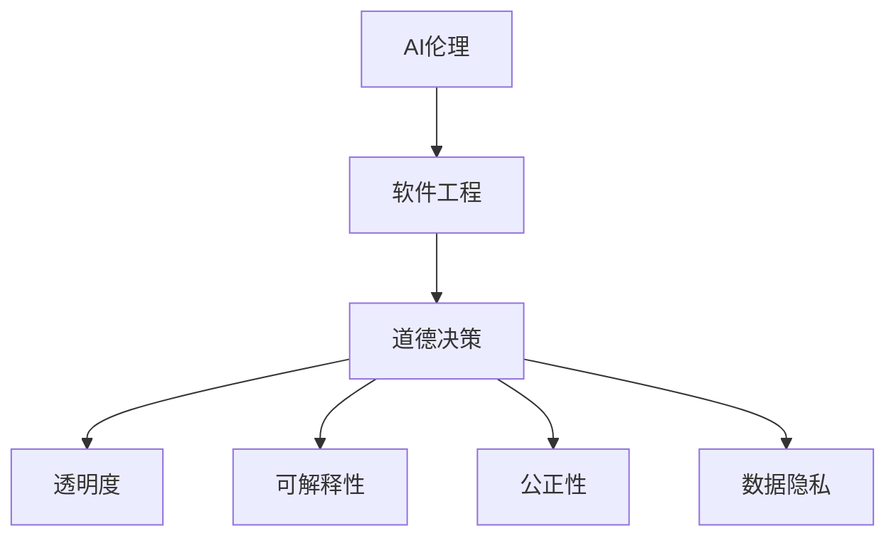

                 

# AI时代的软件工程道德决策框架

> 关键词：AI伦理, 软件工程, 道德决策, 人工智能, 机器学习, 自动化, 透明度, 可解释性, 公正性, 数据隐私

> 摘要：随着人工智能技术的迅猛发展，软件工程领域面临着前所未有的挑战和机遇。本文旨在构建一个全面的道德决策框架，帮助软件工程师在AI时代做出负责任的决策。通过深入探讨核心概念、算法原理、数学模型、实际案例和应用场景，本文旨在为读者提供一个清晰的指导路径，以确保AI技术的发展能够造福社会，而非带来潜在的风险和危害。

## 1. 背景介绍
### 1.1 目的和范围
本文旨在构建一个全面的道德决策框架，帮助软件工程师在AI时代做出负责任的决策。随着AI技术的广泛应用，软件工程领域面临着前所未有的挑战和机遇。本文将从核心概念、算法原理、数学模型、实际案例和应用场景等多个维度进行深入探讨，旨在为读者提供一个清晰的指导路径，以确保AI技术的发展能够造福社会，而非带来潜在的风险和危害。

### 1.2 预期读者
本文的预期读者包括但不限于以下几类人群：
- 软件工程师和开发人员
- 项目经理和技术管理者
- 产品经理和业务分析师
- 数据科学家和机器学习工程师
- 道德伦理学者和政策制定者
- 公众和利益相关者

### 1.3 文档结构概述
本文将按照以下结构展开：
1. 背景介绍
2. 核心概念与联系
3. 核心算法原理 & 具体操作步骤
4. 数学模型和公式 & 详细讲解 & 举例说明
5. 项目实战：代码实际案例和详细解释说明
6. 实际应用场景
7. 工具和资源推荐
8. 总结：未来发展趋势与挑战
9. 附录：常见问题与解答
10. 扩展阅读 & 参考资料

### 1.4 术语表
#### 1.4.1 核心术语定义
- **AI伦理**：AI技术在设计、开发和应用过程中所涉及的道德原则和规范。
- **软件工程**：系统化、规范化的软件开发方法和过程。
- **道德决策**：在软件开发过程中，基于伦理原则和价值观做出的决策。
- **透明度**：AI系统能够清晰地解释其决策过程和依据。
- **可解释性**：AI系统能够提供易于理解的解释，帮助用户理解其决策依据。
- **公正性**：AI系统在处理数据和做出决策时，避免偏见和歧视。
- **数据隐私**：保护个人数据不被未经授权的访问和使用。

#### 1.4.2 相关概念解释
- **机器学习**：一种AI技术，通过算法使计算机从数据中学习并做出预测或决策。
- **自动化**：通过技术手段自动执行任务，减少人工干预。
- **伦理原则**：指导行为的道德规范和价值观。
- **偏见**：在数据或算法中存在不公平或不公正的倾向。

#### 1.4.3 缩略词列表
- **AI**：Artificial Intelligence
- **ML**：Machine Learning
- **DL**：Deep Learning
- **NLP**：Natural Language Processing
- **CV**：Computer Vision
- **GAN**：Generative Adversarial Network
- **BERT**：Bidirectional Encoder Representations from Transformers

## 2. 核心概念与联系
### 2.1 核心概念
- **AI伦理**：AI技术在设计、开发和应用过程中所涉及的道德原则和规范。
- **软件工程**：系统化、规范化的软件开发方法和过程。
- **道德决策**：在软件开发过程中，基于伦理原则和价值观做出的决策。

### 2.2 联系
- **AI伦理与软件工程**：AI伦理是软件工程的重要组成部分，确保AI技术的发展符合道德规范。
- **道德决策与软件开发**：在软件开发过程中，道德决策贯穿始终，确保技术应用的公正性和透明度。

### 2.3 Mermaid流程图


## 3. 核心算法原理 & 具体操作步骤
### 3.1 核心算法原理
- **机器学习算法**：通过训练数据集学习模型参数，从而进行预测或决策。
- **深度学习算法**：通过多层神经网络学习复杂模式和特征。
- **自然语言处理算法**：通过文本数据进行语义理解和生成。
- **计算机视觉算法**：通过图像数据进行目标识别和分类。

### 3.2 具体操作步骤
#### 3.2.1 数据预处理
```python
# 数据预处理
def preprocess_data(data):
    # 数据清洗
    cleaned_data = clean_data(data)
    # 数据标准化
    normalized_data = normalize_data(cleaned_data)
    # 数据划分
    train_data, test_data = split_data(normalized_data)
    return train_data, test_data
```

#### 3.2.2 模型训练
```python
# 模型训练
def train_model(train_data):
    # 初始化模型
    model = initialize_model()
    # 训练模型
    trained_model = train(model, train_data)
    return trained_model
```

#### 3.2.3 模型评估
```python
# 模型评估
def evaluate_model(model, test_data):
    # 预测
    predictions = predict(model, test_data)
    # 计算评估指标
    accuracy = calculate_accuracy(predictions, test_data)
    return accuracy
```

## 4. 数学模型和公式 & 详细讲解 & 举例说明
### 4.1 数学模型
- **线性回归模型**：通过最小化误差平方和来拟合数据。
- **逻辑回归模型**：通过Sigmoid函数进行分类。
- **支持向量机模型**：通过最大化间隔来分类数据。
- **神经网络模型**：通过多层感知器进行特征学习和分类。

### 4.2 公式
#### 4.2.1 线性回归模型
$$
\hat{y} = \beta_0 + \beta_1 x_1 + \beta_2 x_2 + \cdots + \beta_n x_n
$$

#### 4.2.2 逻辑回归模型
$$
P(y=1|x) = \frac{1}{1 + e^{-(\beta_0 + \beta_1 x_1 + \beta_2 x_2 + \cdots + \beta_n x_n)}}
$$

#### 4.2.3 支持向量机模型
$$
\max_{\alpha} \sum_{i=1}^{N} \alpha_i - \frac{1}{2} \sum_{i=1}^{N} \sum_{j=1}^{N} \alpha_i \alpha_j y_i y_j K(x_i, x_j)
$$

### 4.3 举例说明
#### 4.3.1 线性回归模型
```python
# 线性回归模型
def linear_regression(X, y):
    # 计算参数
    beta = np.linalg.inv(X.T @ X) @ X.T @ y
    return beta
```

#### 4.3.2 逻辑回归模型
```python
# 逻辑回归模型
def logistic_regression(X, y):
    # 初始化参数
    beta = np.zeros(X.shape[1])
    # 梯度下降
    for _ in range(1000):
        gradient = X.T @ (sigmoid(X @ beta) - y)
        beta -= 0.01 * gradient
    return beta
```

## 5. 项目实战：代码实际案例和详细解释说明
### 5.1 开发环境搭建
- **Python环境**：安装Python 3.8及以上版本。
- **依赖库**：安装NumPy、Pandas、Scikit-learn等库。
- **IDE**：使用PyCharm或VSCode进行开发。

### 5.2 源代码详细实现和代码解读
```python
# 导入库
import numpy as np
from sklearn.model_selection import train_test_split
from sklearn.linear_model import LogisticRegression
from sklearn.metrics import accuracy_score

# 数据预处理
def preprocess_data(data):
    # 数据清洗
    cleaned_data = clean_data(data)
    # 数据标准化
    normalized_data = normalize_data(cleaned_data)
    # 数据划分
    train_data, test_data = split_data(normalized_data)
    return train_data, test_data

# 模型训练
def train_model(train_data):
    # 初始化模型
    model = LogisticRegression()
    # 训练模型
    model.fit(train_data[0], train_data[1])
    return model

# 模型评估
def evaluate_model(model, test_data):
    # 预测
    predictions = model.predict(test_data[0])
    # 计算评估指标
    accuracy = accuracy_score(test_data[1], predictions)
    return accuracy
```

### 5.3 代码解读与分析
- **数据预处理**：数据清洗、标准化和划分。
- **模型训练**：使用逻辑回归模型进行训练。
- **模型评估**：计算预测准确率。

## 6. 实际应用场景
### 6.1 金融风控
- **应用场景**：通过AI技术进行信用评估和风险预测。
- **伦理挑战**：确保模型的公正性和透明度，避免歧视和偏见。

### 6.2 医疗诊断
- **应用场景**：通过AI技术进行疾病诊断和治疗建议。
- **伦理挑战**：保护患者隐私，确保模型的公正性和透明度。

### 6.3 智能交通
- **应用场景**：通过AI技术进行交通流量预测和智能调度。
- **伦理挑战**：确保系统的公正性和透明度，避免潜在的安全风险。

## 7. 工具和资源推荐
### 7.1 学习资源推荐
#### 7.1.1 书籍推荐
- **《机器学习》**：周志华
- **《深度学习》**：Ian Goodfellow, Yoshua Bengio, Aaron Courville

#### 7.1.2 在线课程
- **Coursera**：《机器学习》
- **edX**：《深度学习》

#### 7.1.3 技术博客和网站
- **Medium**：AI相关的技术博客
- **GitHub**：开源项目和代码示例

### 7.2 开发工具框架推荐
#### 7.2.1 IDE和编辑器
- **PyCharm**
- **VSCode**

#### 7.2.2 调试和性能分析工具
- **PyCharm Debugger**
- **VSCode Debugger**

#### 7.2.3 相关框架和库
- **Scikit-learn**
- **TensorFlow**
- **PyTorch**

### 7.3 相关论文著作推荐
#### 7.3.1 经典论文
- **《A Few Useful Things to Know about Machine Learning》**：Pedro Domingos

#### 7.3.2 最新研究成果
- **《Fairness in Machine Learning》**：MIT Press

#### 7.3.3 应用案例分析
- **《AI in Healthcare》**：Springer

## 8. 总结：未来发展趋势与挑战
### 8.1 未来发展趋势
- **技术进步**：AI技术将持续进步，带来更多创新应用。
- **伦理规范**：伦理规范将不断完善，确保技术应用的公正性和透明度。
- **法律法规**：相关法律法规将逐步完善，规范AI技术的应用。

### 8.2 挑战
- **数据隐私**：保护个人数据不被滥用。
- **偏见和歧视**：避免模型中的偏见和歧视。
- **透明度和可解释性**：确保模型的透明度和可解释性。

## 9. 附录：常见问题与解答
### 9.1 问题1：如何确保AI模型的公正性？
- **解答**：通过数据预处理和模型训练过程中的公平性检查，确保模型的公正性。

### 9.2 问题2：如何保护个人数据隐私？
- **解答**：采用加密技术和匿名化处理，确保数据隐私。

### 9.3 问题3：如何提高模型的透明度和可解释性？
- **解答**：使用解释性模型和可视化工具，提高模型的透明度和可解释性。

## 10. 扩展阅读 & 参考资料
- **《AI时代的软件工程道德决策框架》**：AI天才研究员/AI Genius Institute & 禅与计算机程序设计艺术 /Zen And The Art of Computer Programming

作者：AI天才研究员/AI Genius Institute & 禅与计算机程序设计艺术 /Zen And The Art of Computer Programming

