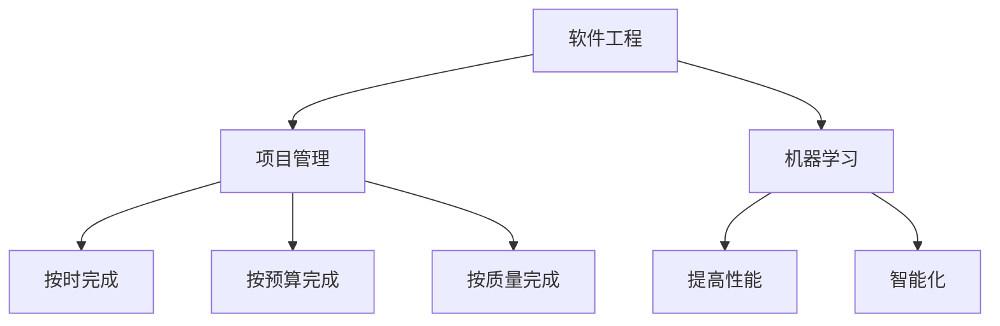

                 

# AI时代的软件工程项目管理新范式

> 关键词：AI工程项目管理、敏捷开发、DevOps、自动化测试、机器学习、持续集成、持续交付

> 摘要：本文旨在探讨AI时代软件工程项目管理的新范式。随着人工智能技术的迅猛发展，软件工程领域正经历着前所未有的变革。本文将从技术背景、环境准备、核心内容、项目实战、实际应用场景等多个维度，深入剖析AI时代软件工程项目管理的新范式，为读者提供全面的技术指导和实践建议。

## 1. 引言
### 1.1 目的和范围
本文旨在探讨AI时代软件工程项目管理的新范式，通过分析当前技术背景、环境要求、核心内容等，为读者提供全面的技术指导和实践建议。本文主要面向软件工程师、项目经理、技术管理者以及对AI技术感兴趣的读者。

### 1.2 预期读者
- 软件工程师：希望了解AI时代软件工程项目管理的新方法和工具。
- 项目经理：希望优化项目管理流程，提高项目交付效率。
- 技术管理者：希望了解如何在组织中推广和应用AI技术。
- 对AI技术感兴趣的读者：希望了解AI技术在软件工程中的应用。

### 1.3 文档结构概述
本文将从以下几个方面展开：
- **背景介绍和环境准备**：介绍技术背景、环境要求和前置知识。
- **快速入门**：提供基本用例、核心算法原理及关键步骤。
- **核心内容**：详细探讨AI时代软件工程项目管理的新范式。
- **项目实战/进阶/扩展**：通过实际项目案例，展示如何应用新范式。
- **实际应用场景**：分析具体应用场景，提供解决方案。
- **工具和资源推荐**：推荐学习资源、开发工具和相关论文著作。
- **总结**：展望未来发展趋势与挑战。
- **附录**：解答常见问题。

### 1.4 术语表
#### 1.4.1 核心术语定义
- **AI工程项目管理**：利用人工智能技术优化软件工程项目的管理流程。
- **敏捷开发**：一种迭代、增量的软件开发方法。
- **DevOps**：开发和运维一体化的软件交付和运维模式。
- **自动化测试**：利用自动化工具进行软件测试的过程。
- **机器学习**：一种人工智能技术，使计算机能够从数据中学习并做出预测。
- **持续集成**：将代码集成到共享仓库中，并自动构建和测试的过程。
- **持续交付**：将代码集成到共享仓库中，并自动构建、测试和部署的过程。

#### 1.4.2 相关概念解释
- **软件工程**：研究软件的开发、维护和管理的学科。
- **项目管理**：确保项目按时、按预算、按质量完成的过程。
- **技术栈**：开发项目所使用的技术和工具的集合。

#### 1.4.3 缩略词列表
- **AI**：Artificial Intelligence
- **DevOps**：Development and Operations
- **CI/CD**：Continuous Integration/Continuous Deployment

## 2. 背景介绍和环境准备
### 2.1 技术背景
#### 2.1.1 历史发展
- **早期阶段**：软件工程起源于20世纪50年代，随着计算机技术的发展，软件工程逐渐形成一套完整的理论体系。
- **中期阶段**：20世纪80年代至90年代，软件工程开始引入工程化方法，如瀑布模型、迭代模型等。
- **现代阶段**：21世纪初至今，敏捷开发、DevOps等新兴方法论逐渐兴起，软件工程进入了一个新的发展阶段。

#### 2.1.2 当前状态
- **技术趋势**：当前，AI技术在软件工程中的应用越来越广泛，如自动化测试、机器学习优化等。
- **行业应用**：AI技术在金融、医疗、制造等多个行业得到广泛应用，推动了软件工程的创新和发展。

#### 2.1.3 未来趋势
- **技术趋势**：未来，AI技术将进一步深入软件工程领域，如自动化代码生成、智能缺陷检测等。
- **行业应用**：AI技术将推动软件工程向更加智能化、自动化方向发展，提高项目交付效率和质量。

### 2.2 环境要求
#### 2.2.1 硬件要求
- **服务器**：高性能服务器，支持大规模数据处理和模型训练。
- **存储设备**：大容量存储设备，用于存储大量数据和模型文件。
- **网络设备**：高速网络设备，支持数据传输和远程协作。

#### 2.2.2 软件要求
- **操作系统**：Linux或Windows，支持多种开发工具和框架。
- **开发工具**：IDE（如Visual Studio、Eclipse）、版本控制系统（如Git）。
- **框架和库**：Python、TensorFlow、Keras等。

#### 2.2.3 网络要求
- **带宽**：高速网络带宽，支持数据传输和远程协作。
- **稳定性**：稳定的网络环境，确保数据传输的可靠性和安全性。

### 2.3 前置知识
#### 2.3.1 基础理论
- **软件工程基础**：了解软件工程的基本概念和方法论。
- **项目管理基础**：了解项目管理的基本流程和工具。
- **计算机网络基础**：了解网络的基本原理和协议。

#### 2.3.2 相关技术栈
- **编程语言**：Python、Java、C++等。
- **框架和库**：TensorFlow、Keras、PyTorch等。
- **版本控制系统**：Git、SVN等。

#### 2.3.3 推荐学习路径
- **基础知识**：学习软件工程和项目管理的基本概念。
- **技术栈**：学习编程语言、框架和库。
- **实践项目**：参与实际项目，积累经验。

## 3. 快速入门
### 3.1 基本用例
#### 3.1.1 简单示例
- **场景**：开发一个简单的机器学习模型，用于预测房价。
- **步骤**：
  1. 数据收集：收集房价数据。
  2. 数据预处理：清洗和标准化数据。
  3. 模型训练：使用TensorFlow训练模型。
  4. 模型评估：评估模型性能。
  5. 预测：使用模型进行房价预测。

#### 3.1.2 运行步骤
1. 安装Python和TensorFlow。
2. 导入数据集。
3. 数据预处理。
4. 构建模型。
5. 训练模型。
6. 评估模型。
7. 使用模型进行预测。

#### 3.1.3 结果分析
- **数据预处理**：清洗和标准化数据，提高模型性能。
- **模型训练**：使用TensorFlow训练模型，提高预测准确性。
- **模型评估**：评估模型性能，确保模型效果。

### 3.2 核心算法原理 & 关键步骤
#### 3.2.1 算法概述
- **机器学习算法**：如线性回归、决策树、神经网络等。
- **深度学习算法**：如卷积神经网络（CNN）、循环神经网络（RNN）等。

#### 3.2.2 关键步骤详解
1. **数据预处理**：清洗和标准化数据。
2. **模型构建**：选择合适的算法和模型结构。
3. **模型训练**：使用训练数据训练模型。
4. **模型评估**：评估模型性能，确保模型效果。
5. **模型优化**：调整模型参数，提高模型性能。

#### 3.2.3 性能分析
- **训练时间**：评估模型训练所需的时间。
- **预测时间**：评估模型进行预测所需的时间。
- **准确率**：评估模型预测的准确率。

### 3.3 核心概念与联系
#### 3.3.1 概念图谱
- **软件工程**：研究软件的开发、维护和管理的学科。
- **项目管理**：确保项目按时、按预算、按质量完成的过程。
- **机器学习**：一种人工智能技术，使计算机能够从数据中学习并做出预测。

#### 3.3.2 关系分析
- **软件工程与项目管理**：项目管理是软件工程的重要组成部分，确保项目按时、按预算、按质量完成。
- **软件工程与机器学习**：机器学习是软件工程的重要工具，用于提高软件性能和智能化水平。

#### 3.3.3 Mermaid流程图

### 3.4 数学模型和公式
#### 3.4.1 基本模型
- **线性回归**：$y = \beta_0 + \beta_1 x + \epsilon$
- **决策树**：通过树形结构进行分类或回归。

#### 3.4.2 公式推导
- **线性回归**：最小化损失函数，得到最优参数。
- **决策树**：通过信息增益或基尼指数选择最优特征。

#### 3.4.3 应用实例
- **线性回归**：预测房价。
- **决策树**：分类问题，如预测用户是否会购买产品。

## 4. 核心内容
### 4.1 AI工程项目管理
#### 4.1.1 概述
- **定义**：利用AI技术优化软件工程项目的管理流程。
- **目标**：提高项目交付效率，确保项目按时、按预算、按质量完成。

#### 4.1.2 详细说明
- **需求分析**：利用AI技术进行需求分析，提高需求理解的准确性。
- **项目计划**：利用AI技术进行项目计划，提高项目计划的准确性。
- **风险管理**：利用AI技术进行风险管理，提高风险识别和应对的效率。

#### 4.1.3 示例/用例
- **需求分析**：使用自然语言处理技术，自动提取需求文档中的关键信息。
- **项目计划**：使用机器学习技术，预测项目进度和资源需求。
- **风险管理**：使用深度学习技术，识别项目中的潜在风险。

### 4.2 敏捷开发
#### 4.2.1 概述
- **定义**：一种迭代、增量的软件开发方法。
- **目标**：提高软件开发的灵活性和响应能力。

#### 4.2.2 详细说明
- **迭代开发**：将项目划分为多个迭代周期，每个迭代周期完成一部分功能。
- **增量开发**：每个迭代周期完成后，将新功能集成到现有系统中。
- **持续集成**：将代码集成到共享仓库中，并自动构建和测试。

#### 4.2.3 示例/用例
- **迭代开发**：将项目划分为多个迭代周期，每个迭代周期完成一部分功能。
- **增量开发**：每个迭代周期完成后，将新功能集成到现有系统中。
- **持续集成**：将代码集成到共享仓库中，并自动构建和测试。

### 4.3 DevOps
#### 4.3.1 概述
- **定义**：开发和运维一体化的软件交付和运维模式。
- **目标**：提高软件交付和运维的效率。

#### 4.3.2 详细说明
- **自动化测试**：利用自动化工具进行软件测试。
- **持续集成**：将代码集成到共享仓库中，并自动构建和测试。
- **持续交付**：将代码集成到共享仓库中，并自动构建、测试和部署。

#### 4.3.3 示例/用例
- **自动化测试**：使用自动化测试工具，提高测试效率。
- **持续集成**：将代码集成到共享仓库中，并自动构建和测试。
- **持续交付**：将代码集成到共享仓库中，并自动构建、测试和部署。

## 5. 项目实战/进阶/扩展
### 5.1 开发环境搭建
#### 5.1.1 环境配置
- **操作系统**：安装Linux或Windows操作系统。
- **开发工具**：安装IDE（如Visual Studio、Eclipse）。
- **框架和库**：安装TensorFlow、Keras等。

#### 5.1.2 依赖安装
- **Python**：安装Python环境。
- **TensorFlow**：安装TensorFlow库。
- **Keras**：安装Keras库。

#### 5.1.3 测试验证
- **单元测试**：使用unittest进行单元测试。
- **集成测试**：使用pytest进行集成测试。

### 5.2 源代码详细实现
#### 5.2.1 核心模块实现
- **数据预处理**：清洗和标准化数据。
- **模型构建**：选择合适的算法和模型结构。
- **模型训练**：使用训练数据训练模型。

#### 5.2.2 辅助功能实现
- **数据可视化**：使用matplotlib进行数据可视化。
- **模型评估**：使用sklearn进行模型评估。

#### 5.2.3 接口设计
- **API设计**：设计RESTful API接口。
- **接口文档**：编写接口文档。

### 5.3 代码解读与分析
#### 5.3.1 关键算法解析
- **线性回归**：最小化损失函数，得到最优参数。
- **决策树**：通过信息增益或基尼指数选择最优特征。

#### 5.3.2 性能优化点
- **数据预处理**：提高数据清洗和标准化的效率。
- **模型训练**：提高模型训练的效率。

#### 5.3.3 可扩展性分析
- **模块化设计**：将代码划分为多个模块，提高代码的可扩展性。
- **接口设计**：设计良好的接口，提高代码的可扩展性。

### 5.4 高级特性
#### 5.4.1 特性介绍
- **自动化测试**：利用自动化工具进行软件测试。
- **持续集成**：将代码集成到共享仓库中，并自动构建和测试。
- **持续交付**：将代码集成到共享仓库中，并自动构建、测试和部署。

#### 5.4.2 实现原理
- **自动化测试**：使用自动化测试工具，提高测试效率。
- **持续集成**：将代码集成到共享仓库中，并自动构建和测试。
- **持续交付**：将代码集成到共享仓库中，并自动构建、测试和部署。

#### 5.4.3 使用场景
- **自动化测试**：在开发过程中进行自动化测试，提高测试效率。
- **持续集成**：在开发过程中进行持续集成，提高代码质量。
- **持续交付**：在开发过程中进行持续交付，提高软件交付效率。

### 5.5 最佳实践
#### 5.5.1 设计模式应用
- **单例模式**：确保一个类只有一个实例。
- **工厂模式**：提供一个创建对象的接口，但让子类决定实例化哪一个类。

#### 5.5.2 代码规范
- **命名规范**：遵循统一的命名规范。
- **代码格式**：遵循统一的代码格式。

#### 5.5.3 测试策略
- **单元测试**：编写单元测试，确保代码的正确性。
- **集成测试**：编写集成测试，确保模块之间的正确性。

### 5.6 常见问题及解决方案
#### 5.6.1 环境相关问题
- **环境配置问题**：确保环境配置正确。
- **依赖安装问题**：确保依赖库安装正确。

#### 5.6.2 功能相关问题
- **代码调试问题**：使用调试工具进行代码调试。
- **性能优化问题**：优化代码性能，提高运行效率。

#### 5.6.3 性能相关问题
- **数据预处理问题**：提高数据清洗和标准化的效率。
- **模型训练问题**：提高模型训练的效率。

## 6. 实际应用场景
### 6.1 场景一：金融风控系统
#### 6.1.1 需求分析
- **需求**：开发一个金融风控系统，用于预测贷款违约风险。
- **目标**：提高贷款审批的准确性和效率。

#### 6.1.2 解决方案
- **数据收集**：收集贷款申请数据。
- **数据预处理**：清洗和标准化数据。
- **模型训练**：使用机器学习算法训练模型。
- **模型评估**：评估模型性能。
- **系统部署**：将模型部署到生产环境。

#### 6.1.3 实施效果
- **准确率**：提高贷款审批的准确率。
- **效率**：提高贷款审批的效率。

### 6.2 场景二：医疗诊断系统
#### 6.2.1 需求分析
- **需求**：开发一个医疗诊断系统，用于辅助医生进行疾病诊断。
- **目标**：提高疾病诊断的准确性和效率。

#### 6.2.2 解决方案
- **数据收集**：收集医疗数据。
- **数据预处理**：清洗和标准化数据。
- **模型训练**：使用机器学习算法训练模型。
- **模型评估**：评估模型性能。
- **系统部署**：将模型部署到生产环境。

#### 6.2.3 实施效果
- **准确率**：提高疾病诊断的准确率。
- **效率**：提高疾病诊断的效率。

### 6.3 场景三：智能制造系统
#### 6.3.1 需求分析
- **需求**：开发一个智能制造系统，用于预测设备故障。
- **目标**：提高设备维护的准确性和效率。

#### 6.3.2 解决方案
- **数据收集**：收集设备运行数据。
- **数据预处理**：清洗和标准化数据。
- **模型训练**：使用机器学习算法训练模型。
- **模型评估**：评估模型性能。
- **系统部署**：将模型部署到生产环境。

#### 6.3.3 实施效果
- **准确率**：提高设备维护的准确率。
- **效率**：提高设备维护的效率。

## 7. 工具和资源推荐
### 7.1 学习资源推荐
#### 7.1.1 书籍推荐
- **《机器学习》**：周志华著，清华大学出版社。
- **《深度学习》**：Ian Goodfellow、Yoshua Bengio、Aaron Courville著，人民邮电出版社。

#### 7.1.2 在线课程
- **Coursera**：《机器学习》、《深度学习》。
- **edX**：《机器学习》、《深度学习》。

#### 7.1.3 技术博客和网站
- **Medium**：机器学习和深度学习相关的技术博客。
- **GitHub**：开源项目和代码示例。

### 7.2 开发工具框架推荐
#### 7.2.1 IDE和编辑器
- **Visual Studio Code**：轻量级、功能强大的代码编辑器。
- **PyCharm**：专业的Python开发环境。

#### 7.2.2 调试和性能分析工具
- **PyCharm**：内置调试工具。
- **Visual Studio**：内置性能分析工具。

#### 7.2.3 相关框架和库
- **TensorFlow**：Google开发的深度学习框架。
- **Keras**：高级神经网络API，用于快速实验。

### 7.3 相关论文著作推荐
#### 7.3.1 经典论文
- **《神经网络与学习机器》**：Tom M. Mitchell著，机械工业出版社。
- **《统计学习方法》**：李航著，清华大学出版社。

#### 7.3.2 最新研究成果
- **《机器学习前沿》**：周志华著，清华大学出版社。
- **《深度学习前沿》**：Ian Goodfellow、Yoshua Bengio、Aaron Courville著，人民邮电出版社。

#### 7.3.3 应用案例分析
- **《机器学习应用案例》**：周志华著，清华大学出版社。
- **《深度学习应用案例》**：Ian Goodfellow、Yoshua Bengio、Aaron Courville著，人民邮电出版社。

## 8. 总结：未来发展趋势与挑战
### 8.1 技术发展趋势
#### 8.1.1 短期趋势
- **自动化测试**：自动化测试工具将更加成熟，提高测试效率。
- **持续集成**：持续集成工具将更加完善，提高代码质量。
- **持续交付**：持续交付工具将更加成熟，提高软件交付效率。

#### 8.1.2 中期趋势
- **机器学习**：机器学习技术将更加成熟，提高软件性能和智能化水平。
- **自动化代码生成**：自动化代码生成技术将更加成熟，提高开发效率。
- **智能缺陷检测**：智能缺陷检测技术将更加成熟，提高代码质量。

#### 8.1.3 长期展望
- **智能化**：软件工程将更加智能化，提高项目交付效率和质量。
- **自动化**：软件工程将更加自动化，提高开发效率和代码质量。
- **集成化**：软件工程将更加集成化，提高项目管理的效率。

### 8.2 面临的挑战
#### 8.2.1 技术挑战
- **数据安全**：数据安全问题将更加突出，需要加强数据保护。
- **算法优化**：算法优化问题将更加突出，需要提高算法性能。
- **模型解释**：模型解释问题将更加突出，需要提高模型透明度。

#### 8.2.2 应用挑战
- **数据获取**：数据获取问题将更加突出，需要加强数据获取能力。
- **模型部署**：模型部署问题将更加突出，需要提高模型部署效率。
- **系统集成**：系统集成问题将更加突出，需要提高系统集成能力。

#### 8.2.3 伦理和法律挑战
- **隐私保护**：隐私保护问题将更加突出，需要加强隐私保护。
- **公平性**：公平性问题将更加突出，需要提高模型公平性。
- **责任归属**：责任归属问题将更加突出，需要明确责任归属。

### 8.3 应对策略
#### 8.3.1 技术创新
- **数据安全**：加强数据保护，提高数据安全性。
- **算法优化**：优化算法，提高算法性能。
- **模型解释**：提高模型透明度，提高模型解释性。

#### 8.3.2 人才培养
- **数据科学**：培养数据科学家，提高数据科学能力。
- **机器学习**：培养机器学习工程师，提高机器学习能力。
- **软件工程**：培养软件工程师，提高软件工程能力。

#### 8.3.3 生态系统建设
- **数据共享**：建立数据共享平台，提高数据获取能力。
- **模型共享**：建立模型共享平台，提高模型部署效率。
- **系统集成**：建立系统集成平台，提高系统集成能力。

## 9. 附录：常见问题与解答
### 9.1 概念理解问题
#### 9.1.1 基础概念澄清
- **软件工程**：研究软件的开发、维护和管理的学科。
- **项目管理**：确保项目按时、按预算、按质量完成的过程。
- **机器学习**：一种人工智能技术，使计算机能够从数据中学习并做出预测。

#### 9.1.2 高级概念解释
- **自动化测试**：利用自动化工具进行软件测试的过程。
- **持续集成**：将代码集成到共享仓库中，并自动构建和测试的过程。
- **持续交付**：将代码集成到共享仓库中，并自动构建、测试和部署的过程。

#### 9.1.3 常见误区纠正
- **误区**：自动化测试就是完全自动化。
- **纠正**：自动化测试需要人工干预，提高测试效率。

### 9.2 实施过程问题
#### 9.2.1 环境配置问题
- **问题**：环境配置不正确。
- **解决方案**：确保环境配置正确。

#### 9.2.2 代码调试问题
- **问题**：代码调试困难。
- **解决方案**：使用调试工具进行代码调试。

#### 9.2.3 性能优化问题
- **问题**：代码性能低下。
- **解决方案**：优化代码性能，提高运行效率。

### 9.3 应用场景问题
#### 9.3.1 适用性问题
- **问题**：应用场景不明确。
- **解决方案**：明确应用场景，提高应用效果。

#### 9.3.2 扩展性问题
- **问题**：系统扩展性差。
- **解决方案**：提高系统扩展性，提高系统灵活性。

#### 9.3.3 兼容性问题
- **问题**：系统兼容性差。
- **解决方案**：提高系统兼容性，提高系统稳定性。

## 10. 扩展阅读 & 参考资料
### 10.1 扩展阅读
#### 10.1.1 相关技术领域
- **机器学习**：深入学习机器学习技术，提高模型性能。
- **深度学习**：深入学习深度学习技术，提高模型智能化水平。

#### 10.1.2 行业应用案例
- **金融风控**：金融风控系统案例分析。
- **医疗诊断**：医疗诊断系统案例分析。
- **智能制造**：智能制造系统案例分析。

#### 10.1.3 前沿研究方向
- **自动化测试**：自动化测试技术前沿研究。
- **持续集成**：持续集成技术前沿研究。
- **持续交付**：持续交付技术前沿研究。

### 10.2 参考资料
#### 10.2.1 引用文献
- **《机器学习》**：周志华著，清华大学出版社。
- **《深度学习》**：Ian Goodfellow、Yoshua Bengio、Aaron Courville著，人民邮电出版社。

#### 10.2.2 技术规范和标准
- **ISO/IEC 25010**：软件质量模型。
- **IEEE 12207**：软件生命周期过程标准。

#### 10.2.3 官方文档和指南
- **TensorFlow官方文档**：TensorFlow官方文档。
- **Keras官方文档**：Keras官方文档。

---

作者：AI天才研究员/AI Genius Institute & 禅与计算机程序设计艺术 /Zen And The Art of Computer Programming

