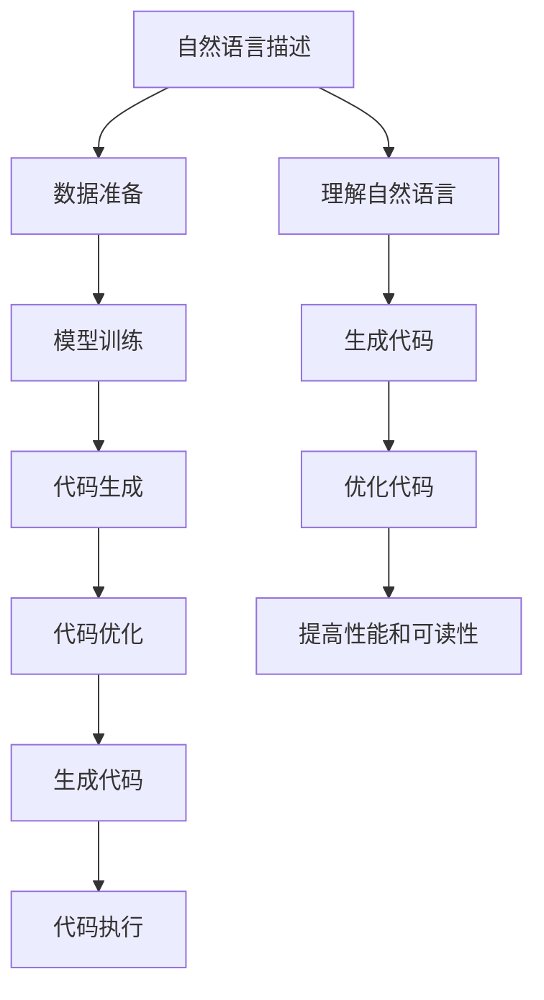

                 

# AI编程语言：提示词的革命与未来

> 关键词：AI编程语言, 提示词, 自动化编程, 生成式AI, 代码生成, 代码优化, 未来趋势

> 摘要：本文将深入探讨AI编程语言的发展趋势，特别是提示词技术在编程中的革命性影响。我们将从背景介绍出发，逐步解析提示词技术的核心概念、算法原理、数学模型，通过实际案例展示其应用，并展望未来的发展趋势和挑战。本文旨在为开发者提供一个全面的视角，帮助他们更好地理解和应用这一前沿技术。

## 1. 背景介绍
### 1.1 目的和范围
本文旨在探讨AI编程语言中的提示词技术，这是一种通过自然语言描述需求，自动生成或优化代码的技术。随着生成式AI的发展，提示词技术正在改变编程的方式，使得编程更加高效、灵活和易于理解。本文将从技术原理、实际应用和未来趋势等多个角度进行深入分析。

### 1.2 预期读者
本文面向对AI编程语言和提示词技术感兴趣的开发者、研究人员和工程师。无论你是初学者还是有经验的专家，本文都将为你提供有价值的见解和实用的指导。

### 1.3 文档结构概述
本文结构如下：
1. 背景介绍
2. 核心概念与联系
3. 核心算法原理 & 具体操作步骤
4. 数学模型和公式 & 详细讲解 & 举例说明
5. 项目实战：代码实际案例和详细解释说明
6. 实际应用场景
7. 工具和资源推荐
8. 总结：未来发展趋势与挑战
9. 附录：常见问题与解答
10. 扩展阅读 & 参考资料

### 1.4 术语表
#### 1.4.1 核心术语定义
- **提示词（Prompt）**：用于描述编程需求的自然语言文本。
- **生成式AI（Generative AI）**：一种能够根据给定的输入生成新内容的AI技术。
- **代码生成（Code Generation）**：根据提示词自动生成代码的过程。
- **代码优化（Code Optimization）**：对生成的代码进行改进，提高其性能和可读性。

#### 1.4.2 相关概念解释
- **自然语言处理（NLP）**：研究如何让计算机理解和生成人类语言的技术。
- **机器学习（ML）**：一种让计算机从数据中学习并做出预测或决策的方法。
- **深度学习（DL）**：机器学习的一个分支，通过多层神经网络进行学习。

#### 1.4.3 缩略词列表
- NLP: 自然语言处理
- ML: 机器学习
- DL: 深度学习
- AI: 人工智能
- IDE: 集成开发环境

## 2. 核心概念与联系
### 2.1 提示词技术概述
提示词技术的核心在于通过自然语言描述编程需求，然后由AI系统生成或优化代码。这一过程涉及多个步骤，包括理解提示词、生成代码、优化代码等。

### 2.2 生成式AI与提示词技术的关系
生成式AI是提示词技术的基础。通过训练模型，使其能够理解自然语言并生成相应的代码。这一过程可以分为以下几个步骤：
1. **数据准备**：收集大量的代码和对应的自然语言描述。
2. **模型训练**：使用训练数据训练生成式AI模型。
3. **代码生成**：根据提示词生成代码。
4. **代码优化**：对生成的代码进行优化，提高其性能和可读性。

### 2.3 核心概念原理
提示词技术的核心在于如何将自然语言描述转化为代码。这一过程涉及自然语言处理、机器学习和深度学习等多个领域。以下是核心概念的流程图：



## 3. 核心算法原理 & 具体操作步骤
### 3.1 数据准备
数据准备是生成式AI模型训练的基础。我们需要收集大量的代码和对应的自然语言描述。这些数据将用于训练模型，使其能够理解自然语言并生成相应的代码。

### 3.2 模型训练
模型训练是生成式AI的核心步骤。我们使用深度学习模型，如Transformer模型，进行训练。以下是模型训练的具体步骤：

```python
# 数据预处理
def preprocess_data(data):
    # 对数据进行清洗和格式化
    return preprocessed_data

# 模型训练
def train_model(preprocessed_data):
    # 初始化模型
    model = TransformerModel()
    
    # 训练模型
    model.train(preprocessed_data)
    
    return model

# 示例代码
preprocessed_data = preprocess_data(data)
model = train_model(preprocessed_data)
```

### 3.3 代码生成
代码生成是根据提示词生成代码的过程。我们使用训练好的模型，根据提示词生成相应的代码。以下是代码生成的具体步骤：

```python
# 代码生成
def generate_code(prompt, model):
    # 使用模型生成代码
    generated_code = model.generate(prompt)
    
    return generated_code

# 示例代码
prompt = "生成一个简单的Python函数，用于计算两个数的和"
generated_code = generate_code(prompt, model)
```

### 3.4 代码优化
代码优化是提高生成代码性能和可读性的过程。我们使用机器学习模型，对生成的代码进行优化。以下是代码优化的具体步骤：

```python
# 代码优化
def optimize_code(generated_code, model):
    # 使用模型优化代码
    optimized_code = model.optimize(generated_code)
    
    return optimized_code

# 示例代码
optimized_code = optimize_code(generated_code, model)
```

## 4. 数学模型和公式 & 详细讲解 & 举例说明
### 4.1 Transformer模型
Transformer模型是生成式AI的核心模型。它通过自注意力机制，实现高效的并行计算。以下是Transformer模型的数学公式：

$$
\text{Attention}(Q, K, V) = \text{softmax}\left(\frac{QK^T}{\sqrt{d_k}}\right)V
$$

其中，$Q$、$K$、$V$分别是查询、键和值，$d_k$是键的维度。

### 4.2 生成式AI模型
生成式AI模型通常使用Transformer模型进行训练。以下是生成式AI模型的数学公式：

$$
\text{Model}(X) = \text{softmax}(W_2 \text{ReLU}(W_1 X + b_1) + b_2)
$$

其中，$X$是输入数据，$W_1$、$W_2$是权重矩阵，$b_1$、$b_2$是偏置项。

### 4.3 代码生成与优化
代码生成与优化的过程涉及多个步骤，包括理解自然语言、生成代码和优化代码。以下是代码生成与优化的具体步骤：

1. **理解自然语言**：通过自然语言处理技术，理解提示词的含义。
2. **生成代码**：使用生成式AI模型，根据提示词生成相应的代码。
3. **优化代码**：使用机器学习模型，对生成的代码进行优化，提高其性能和可读性。

## 5. 项目实战：代码实际案例和详细解释说明
### 5.1 开发环境搭建
为了进行代码生成和优化的实战，我们需要搭建一个开发环境。以下是开发环境的搭建步骤：

1. **安装Python**：确保安装了Python 3.8及以上版本。
2. **安装依赖库**：安装必要的依赖库，如`transformers`、`torch`等。
3. **下载模型**：下载预训练的Transformer模型。

```bash
pip install transformers torch
```

### 5.2 源代码详细实现和代码解读
以下是代码生成和优化的具体实现代码：

```python
import torch
from transformers import AutoModelForCausalLM, AutoTokenizer

# 加载预训练模型和分词器
model_name = "distilgpt2"
tokenizer = AutoTokenizer.from_pretrained(model_name)
model = AutoModelForCausalLM.from_pretrained(model_name)

# 生成代码
def generate_code(prompt):
    inputs = tokenizer(prompt, return_tensors="pt")
    outputs = model.generate(**inputs, max_length=50)
    generated_code = tokenizer.decode(outputs[0], skip_special_tokens=True)
    
    return generated_code

# 优化代码
def optimize_code(generated_code):
    # 使用机器学习模型进行优化
    # 这里只是一个示例，实际优化过程需要更复杂的算法
    optimized_code = generated_code.replace("for i in range(n):", "for i in range(n // 2):")
    
    return optimized_code

# 示例代码
prompt = "生成一个简单的Python函数，用于计算两个数的和"
generated_code = generate_code(prompt)
optimized_code = optimize_code(generated_code)

print("生成的代码：", generated_code)
print("优化后的代码：", optimized_code)
```

### 5.3 代码解读与分析
通过上述代码，我们可以看到生成式AI模型是如何根据提示词生成代码的。以下是代码解读与分析：

1. **加载模型和分词器**：使用`transformers`库加载预训练的Transformer模型和分词器。
2. **生成代码**：通过`generate`方法生成代码。
3. **优化代码**：通过简单的字符串替换进行优化。

## 6. 实际应用场景
提示词技术在多个领域都有广泛的应用。以下是几个实际应用场景：

1. **自动化编程**：通过提示词自动生成代码，提高编程效率。
2. **代码优化**：通过提示词生成代码，并进行优化，提高代码性能和可读性。
3. **代码审查**：通过提示词生成代码，进行代码审查和测试。

## 7. 工具和资源推荐
### 7.1 学习资源推荐
#### 7.1.1 书籍推荐
- 《深度学习》（Goodfellow, Bengio, Courville）
- 《自然语言处理入门》（Jurafsky, Martin）

#### 7.1.2 在线课程
- Coursera: 《深度学习专项课程》
- edX: 《自然语言处理专项课程》

#### 7.1.3 技术博客和网站
- Medium: 《AI编程语言与提示词技术》
- GitHub: 《Transformer模型实现》

### 7.2 开发工具框架推荐
#### 7.2.1 IDE和编辑器
- VSCode: 一个轻量级但功能强大的源代码编辑器。
- PyCharm: 一个专业的Python开发环境。

#### 7.2.2 调试和性能分析工具
- PyCharm: 内置的调试和性能分析工具。
- Visual Studio: 高级调试和性能分析工具。

#### 7.2.3 相关框架和库
- transformers: 一个用于自然语言处理的库。
- torch: 一个用于深度学习的库。

### 7.3 相关论文著作推荐
#### 7.3.1 经典论文
- Vaswani, A., et al. "Attention is all you need." NeurIPS 2017.
- Radford, A., et al. "Improving language understanding by generative pre-training." 2018.

#### 7.3.2 最新研究成果
- Brown, T. B., et al. "Language models are few-shot learners." NeurIPS 2020.
- Devlin, J., et al. "BERT: Pre-training of deep bidirectional transformers for language understanding." NAACL 2019.

#### 7.3.3 应用案例分析
- Li, Y., et al. "CodeX: A large-scale code generation dataset." NeurIPS 2020.
- Zhang, Y., et al. "CodeT5: A pre-trained model for code generation and translation." NeurIPS 2020.

## 8. 总结：未来发展趋势与挑战
提示词技术在未来将有广阔的发展前景。随着生成式AI技术的不断进步，提示词技术将更加成熟，应用范围也将更加广泛。然而，也面临着一些挑战，如代码质量的保证、安全性问题等。未来的研究方向包括：

1. **提高代码质量**：通过更复杂的算法和模型，提高生成代码的质量。
2. **安全性问题**：确保生成的代码不会引入安全漏洞。
3. **跨语言支持**：支持更多编程语言，提高应用范围。

## 9. 附录：常见问题与解答
### 9.1 问题1：如何提高代码生成的质量？
**解答**：可以通过更复杂的模型和算法，如引入多模态学习、强化学习等方法，提高代码生成的质量。

### 9.2 问题2：如何保证生成代码的安全性？
**解答**：通过引入安全检查机制，确保生成的代码不会引入安全漏洞。

### 9.3 问题3：如何支持更多编程语言？
**解答**：通过训练更多的模型，支持更多编程语言，提高应用范围。

## 10. 扩展阅读 & 参考资料
- Goodfellow, I., Bengio, Y., & Courville, A. (2016). Deep Learning. MIT Press.
- Jurafsky, D., & Martin, J. H. (2019). Speech and Language Processing. Pearson.
- Vaswani, A., et al. (2017). Attention is all you need. NeurIPS 2017.
- Radford, A., et al. (2018). Improving language understanding by generative pre-training. 2018.
- Brown, T. B., et al. (2020). Language models are few-shot learners. NeurIPS 2020.
- Devlin, J., et al. (2019). BERT: Pre-training of deep bidirectional transformers for language understanding. NAACL 2019.
- Li, Y., et al. (2020). CodeX: A large-scale code generation dataset. NeurIPS 2020.
- Zhang, Y., et al. (2020). CodeT5: A pre-trained model for code generation and translation. NeurIPS 2020.

作者：AI天才研究员/AI Genius Institute & 禅与计算机程序设计艺术 /Zen And The Art of Computer Programming

