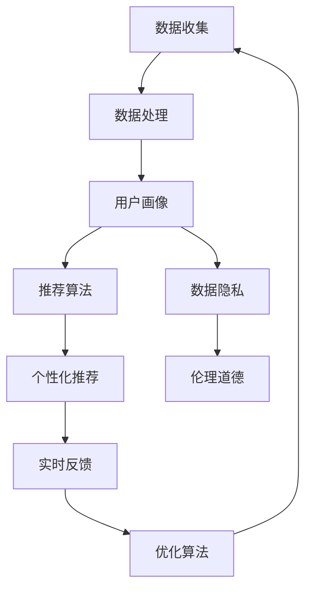

                 

# AI驱动的个性化营销：机遇与风险

> 关键词：AI驱动、个性化营销、机遇、风险、机器学习、数据隐私、用户行为分析

> 摘要：本文旨在探讨AI驱动的个性化营销所带来的机遇与风险。通过深入分析AI在个性化营销中的应用原理、技术架构、核心算法、数学模型及实际案例，揭示其在提升营销效果的同时，也带来了数据隐私、伦理道德等多方面的挑战。文章将从技术、应用、伦理等多个维度，为读者提供全面的视角，帮助理解AI驱动个性化营销的全貌。

## 1. 背景介绍

随着大数据、云计算和人工智能技术的迅猛发展，个性化营销已成为企业提升客户满意度和市场竞争力的重要手段。个性化营销是指通过分析用户的行为、偏好和历史数据，为每个用户提供定制化的营销内容和服务。AI技术在这一过程中扮演了至关重要的角色，它能够处理海量数据，发现隐藏的模式和关联，从而实现精准的个性化推荐。

### 1.1 个性化营销的发展历程

个性化营销的概念最早可以追溯到20世纪90年代，当时企业开始利用数据库技术进行客户细分和个性化推荐。随着互联网的普及，个性化营销逐渐从简单的邮件营销发展到基于网站行为的个性化推荐。近年来，随着AI技术的不断进步，个性化营销进入了新的阶段，AI技术的应用使得个性化营销更加精准和高效。

### 1.2 AI在个性化营销中的作用

AI技术在个性化营销中的应用主要体现在以下几个方面：

- **数据收集与处理**：AI技术能够高效地收集和处理海量用户数据，包括用户行为数据、社交媒体数据、购买记录等。
- **用户画像构建**：通过机器学习算法，AI能够构建详细的用户画像，包括用户的兴趣、偏好、消费习惯等。
- **个性化推荐**：基于用户画像，AI能够为用户提供个性化的推荐内容，如商品推荐、广告推荐等。
- **实时反馈与优化**：AI技术能够实时分析用户反馈，不断优化推荐算法，提高推荐效果。

## 2. 核心概念与联系

### 2.1 个性化营销的核心概念

个性化营销的核心概念包括用户画像、推荐算法、数据隐私和伦理道德等。这些概念相互关联，共同构成了个性化营销的技术框架。

#### 2.1.1 用户画像

用户画像是一种描述用户特征和行为的数据模型。通过用户画像，企业可以更好地理解用户的需求和偏好，从而提供更加个性化的服务和产品。

#### 2.1.2 推荐算法

推荐算法是个性化营销的核心技术之一。常见的推荐算法包括协同过滤、基于内容的推荐、深度学习推荐等。这些算法通过分析用户行为数据，为用户提供个性化的推荐内容。

#### 2.1.3 数据隐私

数据隐私是指保护用户数据不被未经授权的第三方访问和使用。在个性化营销中，数据隐私是一个重要的问题，需要通过技术手段和法律手段来保障。

#### 2.1.4 伦理道德

伦理道德是指在个性化营销中，企业需要遵循一定的道德规范，确保营销活动不会侵犯用户的权益和隐私。

### 2.2 核心概念的Mermaid流程图



## 3. 核心算法原理 & 具体操作步骤

### 3.1 协同过滤算法

协同过滤算法是一种常用的推荐算法，它通过分析用户之间的相似性来为用户推荐商品或内容。具体操作步骤如下：

1. **数据收集**：收集用户的历史行为数据，包括购买记录、浏览记录等。
2. **相似性计算**：计算用户之间的相似性，常用的方法包括余弦相似度、皮尔逊相关系数等。
3. **推荐生成**：根据用户之间的相似性，为用户推荐其他用户喜欢的商品或内容。

### 3.2 基于内容的推荐算法

基于内容的推荐算法是另一种常用的推荐算法，它通过分析商品或内容的特征来为用户推荐相似的商品或内容。具体操作步骤如下：

1. **特征提取**：提取商品或内容的特征，如关键词、类别等。
2. **相似性计算**：计算商品或内容之间的相似性，常用的方法包括余弦相似度等。
3. **推荐生成**：根据商品或内容之间的相似性，为用户推荐相似的商品或内容。

### 3.3 深度学习推荐算法

深度学习推荐算法是近年来兴起的一种推荐算法，它通过构建深度神经网络来学习用户和商品之间的复杂关系。具体操作步骤如下：

1. **数据预处理**：对用户和商品的数据进行预处理，包括特征提取、数据清洗等。
2. **模型构建**：构建深度神经网络模型，包括输入层、隐藏层和输出层。
3. **模型训练**：使用用户和商品的数据对模型进行训练，优化模型参数。
4. **推荐生成**：根据训练好的模型，为用户生成个性化推荐。

## 4. 数学模型和公式 & 详细讲解 & 举例说明

### 4.1 协同过滤算法的数学模型

协同过滤算法的数学模型可以表示为：

$$
\hat{r}_{ui} = \frac{\sum_{j \in N_i} \frac{r_{uj} - \mu_u}{|N_i|}}{\sum_{j \in N_i} \frac{1}{|N_i|}}
$$

其中，$\hat{r}_{ui}$ 表示用户 $u$ 对商品 $i$ 的预测评分，$r_{uj}$ 表示用户 $u$ 对商品 $j$ 的实际评分，$\mu_u$ 表示用户 $u$ 的平均评分，$N_i$ 表示与商品 $i$ 有共同评分的用户集合。

### 4.2 基于内容的推荐算法的数学模型

基于内容的推荐算法的数学模型可以表示为：

$$
\hat{r}_{ui} = \frac{\sum_{j \in N_i} \frac{c_{uj} \cdot c_{ij}}{\sum_{k \in N_i} c_{uk}^2}}{\sum_{j \in N_i} \frac{1}{\sum_{k \in N_i} c_{uk}^2}}
$$

其中，$\hat{r}_{ui}$ 表示用户 $u$ 对商品 $i$ 的预测评分，$c_{uj}$ 表示用户 $u$ 对商品 $j$ 的特征向量，$c_{ij}$ 表示商品 $i$ 的特征向量，$N_i$ 表示与商品 $i$ 有共同特征的用户集合。

### 4.3 深度学习推荐算法的数学模型

深度学习推荐算法的数学模型可以表示为：

$$
\hat{r}_{ui} = \sigma(\mathbf{W}_1 \cdot \mathbf{W}_2 \cdot \mathbf{X}_{ui} + \mathbf{b})
$$

其中，$\hat{r}_{ui}$ 表示用户 $u$ 对商品 $i$ 的预测评分，$\mathbf{W}_1$ 和 $\mathbf{W}_2$ 分别表示输入层和隐藏层的权重矩阵，$\mathbf{X}_{ui}$ 表示用户 $u$ 和商品 $i$ 的特征向量，$\mathbf{b}$ 表示偏置项，$\sigma$ 表示激活函数。

## 5. 项目实战：代码实际案例和详细解释说明

### 5.1 开发环境搭建

为了实现AI驱动的个性化营销，我们需要搭建一个开发环境。具体步骤如下：

1. **安装Python**：确保安装了Python 3.7及以上版本。
2. **安装依赖库**：使用pip安装所需的依赖库，如numpy、pandas、scikit-learn等。
3. **配置环境变量**：配置Python环境变量，确保能够正常运行代码。

### 5.2 源代码详细实现和代码解读

以下是一个简单的基于内容的推荐算法的实现代码：

```python
import numpy as np
from sklearn.metrics.pairwise import cosine_similarity

# 用户-商品评分矩阵
ratings_matrix = np.array([
    [5, 3, 0, 1],
    [4, 0, 0, 1],
    [1, 1, 0, 5],
    [1, 0, 0, 4],
    [0, 1, 5, 4]
])

# 商品特征矩阵
item_features = np.array([
    [1, 1, 0, 0],
    [0, 1, 1, 0],
    [1, 0, 0, 1],
    [0, 0, 1, 1]
])

# 计算用户-商品相似性
user_item_similarity = cosine_similarity(ratings_matrix.T, item_features)

# 计算推荐评分
predicted_ratings = np.dot(user_item_similarity, item_features)

# 输出推荐评分
print(predicted_ratings)
```

### 5.3 代码解读与分析

上述代码实现了一个简单的基于内容的推荐算法。具体步骤如下：

1. **定义评分矩阵**：`ratings_matrix` 表示用户-商品评分矩阵，其中每个元素表示用户对商品的评分。
2. **定义商品特征矩阵**：`item_features` 表示商品的特征矩阵，其中每个元素表示商品的特征。
3. **计算用户-商品相似性**：使用 `cosine_similarity` 函数计算用户-商品之间的相似性。
4. **计算推荐评分**：通过矩阵乘法计算推荐评分。
5. **输出推荐评分**：输出推荐评分矩阵，其中每个元素表示用户对商品的推荐评分。

## 6. 实际应用场景

### 6.1 电商平台

电商平台是AI驱动个性化营销的一个典型应用场景。通过分析用户的购买记录、浏览记录等数据，电商平台可以为用户推荐个性化的商品，提高用户的购买转化率。

### 6.2 社交媒体

社交媒体平台通过分析用户的社交行为、兴趣爱好等数据，为用户推荐个性化的广告和内容，提高用户的活跃度和参与度。

### 6.3 金融服务

金融服务平台通过分析用户的财务数据、信用记录等数据，为用户提供个性化的金融产品和服务，提高用户的满意度和忠诚度。

## 7. 工具和资源推荐

### 7.1 学习资源推荐

- **书籍**：《推荐系统实践》、《机器学习实战》
- **论文**：《基于内容的推荐算法研究》、《协同过滤推荐算法综述》
- **博客**：阿里云开发者社区、GitHub上的推荐系统项目
- **网站**：Kaggle、Data Science Central

### 7.2 开发工具框架推荐

- **Python库**：scikit-learn、TensorFlow、PyTorch
- **开发框架**：Django、Flask

### 7.3 相关论文著作推荐

- **论文**：《基于深度学习的推荐系统》、《协同过滤推荐算法的改进方法》
- **著作**：《推荐系统原理与实践》、《机器学习与推荐系统》

## 8. 总结：未来发展趋势与挑战

### 8.1 未来发展趋势

- **技术进步**：随着AI技术的不断进步，个性化营销将更加精准和高效。
- **应用场景拓展**：个性化营销将应用于更多的领域，如医疗、教育等。
- **用户体验提升**：个性化营销将更好地满足用户的个性化需求，提升用户体验。

### 8.2 面临的挑战

- **数据隐私**：如何保护用户数据隐私，避免数据泄露和滥用。
- **伦理道德**：如何确保个性化营销活动符合伦理道德规范，避免侵犯用户权益。
- **算法优化**：如何不断优化推荐算法，提高推荐效果。

## 9. 附录：常见问题与解答

### 9.1 问题1：如何保护用户数据隐私？

**解答**：可以通过加密技术、数据脱敏技术等手段保护用户数据隐私，确保数据不被未经授权的第三方访问和使用。

### 9.2 问题2：如何确保个性化营销活动符合伦理道德规范？

**解答**：企业需要遵循一定的道德规范，确保个性化营销活动不会侵犯用户的权益和隐私，如不进行过度推荐、不泄露用户数据等。

## 10. 扩展阅读 & 参考资料

- **书籍**：《推荐系统实践》、《机器学习实战》
- **论文**：《基于内容的推荐算法研究》、《协同过滤推荐算法综述》
- **网站**：Kaggle、Data Science Central

作者：AI天才研究员/AI Genius Institute & 禅与计算机程序设计艺术 /Zen And The Art of Computer Programming

