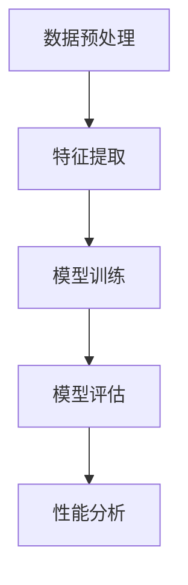

                 

# AI驱动的创新：人类计算在商业中的潜力

> 关键词：AI驱动、人类计算、商业潜力、创新、技术趋势、应用场景、伦理挑战

> 摘要：本文旨在探讨人工智能如何通过增强人类计算能力，推动商业领域的创新。我们将从技术背景、核心算法原理、实际应用场景等多个维度进行深入分析，揭示AI驱动的人类计算在商业中的巨大潜力。通过具体的案例和源代码示例，我们将展示如何利用AI技术解决实际问题，提升业务效率和用户体验。同时，本文也将探讨AI技术面临的挑战和未来的发展趋势。

## 1. 引言
### 1.1 目的和范围
本文旨在探讨人工智能如何通过增强人类计算能力，推动商业领域的创新。我们将从技术背景、核心算法原理、实际应用场景等多个维度进行深入分析，揭示AI驱动的人类计算在商业中的巨大潜力。通过具体的案例和源代码示例，我们将展示如何利用AI技术解决实际问题，提升业务效率和用户体验。同时，本文也将探讨AI技术面临的挑战和未来的发展趋势。

### 1.2 预期读者
本文预期读者包括但不限于以下几类人群：
- 商业决策者：希望通过AI技术提升业务效率和竞争力的企业领导者。
- 技术开发者：希望深入了解AI技术在商业应用中的实现方法和最佳实践的工程师。
- 学术研究者：对AI技术在商业领域应用感兴趣的学者和研究人员。
- 创新创业者：希望利用AI技术开发创新商业应用的创业者。

### 1.3 文档结构概述
本文结构如下：
1. 引言
2. 背景介绍和环境准备
3. 快速入门
4. 核心内容
5. 项目实战/进阶/扩展
6. 实际应用场景
7. 工具和资源推荐
8. 总结：未来发展趋势与挑战
9. 附录：常见问题与解答
10. 扩展阅读 & 参考资料

### 1.4 术语表
#### 1.4.1 核心术语定义
- **AI驱动**：利用人工智能技术增强人类计算能力的过程。
- **人类计算**：人类与计算机系统协同工作的过程。
- **商业潜力**：AI技术在商业领域中的应用潜力。
- **创新**：通过引入新技术或新方法解决现有问题的过程。
- **技术趋势**：当前和未来一段时间内技术发展的方向。
- **应用场景**：AI技术在商业领域的具体应用实例。

#### 1.4.2 相关概念解释
- **增强学习**：一种机器学习方法，通过试错学习来优化决策过程。
- **自然语言处理**：使计算机能够理解、解释和生成人类语言的技术。
- **深度学习**：一种基于神经网络的机器学习方法，能够处理复杂的数据结构。

#### 1.4.3 缩略词列表
- AI：Artificial Intelligence
- NLP：Natural Language Processing
- DL：Deep Learning
- ML：Machine Learning
- RNN：Recurrent Neural Network
- CNN：Convolutional Neural Network

## 2. 背景介绍和环境准备
### 2.1 技术背景
#### 2.1.1 历史发展
人工智能技术的发展经历了多个阶段：
- **早期探索（1950s-1970s）**：早期的AI研究主要集中在逻辑推理和符号处理上。
- **知识工程时代（1980s-1990s）**：知识工程成为主流，专家系统得到广泛应用。
- **机器学习兴起（2000s-2010s）**：随着计算能力的提升和大数据的出现，机器学习技术得到快速发展。
- **深度学习革命（2010s至今）**：深度学习技术在图像识别、语音识别等领域取得突破性进展。

#### 2.1.2 当前状态
当前，AI技术已经广泛应用于各个领域，包括但不限于：
- **自然语言处理**：智能客服、机器翻译、情感分析等。
- **计算机视觉**：图像识别、视频监控、自动驾驶等。
- **推荐系统**：个性化推荐、内容推荐等。
- **决策支持**：智能决策、风险评估等。

#### 2.1.3 未来趋势
未来，AI技术将继续向以下几个方向发展：
- **更加智能化**：AI系统将更加智能，能够更好地理解和处理复杂问题。
- **更加个性化**：AI技术将更加注重个性化需求，提供更加精准的服务。
- **更加普及化**：AI技术将更加普及，成为人们日常生活的一部分。

### 2.2 环境要求
#### 2.2.1 硬件要求
- **CPU**：至少需要支持多线程的高性能处理器。
- **GPU**：推荐使用NVIDIA或AMD的高性能显卡，用于加速深度学习计算。
- **内存**：至少需要16GB以上的内存，以支持大规模数据处理。
- **存储**：至少需要1TB以上的硬盘空间，用于存储数据和模型。

#### 2.2.2 软件要求
- **操作系统**：推荐使用Linux或Windows 10。
- **开发环境**：Python 3.7及以上版本，TensorFlow、PyTorch等深度学习框架。
- **开发工具**：Jupyter Notebook、Visual Studio Code等。

#### 2.2.3 网络要求
- **带宽**：至少需要100Mbps以上的网络带宽，以支持大规模数据传输。
- **稳定性**：网络连接需要稳定，以保证数据传输的可靠性。

### 2.3 前置知识
#### 2.3.1 基础理论
- **概率论与统计学**：理解概率分布、统计推断等基本概念。
- **线性代数**：理解向量、矩阵、特征值等基本概念。
- **微积分**：理解导数、积分等基本概念。

#### 2.3.2 相关技术栈
- **Python编程**：掌握Python的基本语法和常用库。
- **深度学习框架**：熟悉TensorFlow、PyTorch等深度学习框架。
- **数据处理**：掌握Pandas、NumPy等数据处理库。

#### 2.3.3 推荐学习路径
1. **基础知识学习**：学习概率论、线性代数、微积分等基础知识。
2. **编程基础**：学习Python编程，掌握基本语法和常用库。
3. **深度学习框架**：学习TensorFlow或PyTorch等深度学习框架。
4. **实际项目实践**：通过实际项目积累经验，提升实战能力。

## 3. 快速入门
### 3.1 基本用例
#### 3.1.1 简单示例
我们将通过一个简单的自然语言处理任务来展示AI技术的基本用例。具体任务是：使用深度学习模型对一段文本进行情感分析。

#### 3.1.2 运行步骤
1. **数据准备**：收集并预处理文本数据。
2. **模型构建**：使用预训练的BERT模型进行情感分析。
3. **模型训练**：使用训练数据对模型进行训练。
4. **模型评估**：使用测试数据对模型进行评估。

#### 3.1.3 结果分析
通过模型训练和评估，我们可以得到情感分析的准确率和召回率等指标，从而评估模型的性能。

### 3.2 核心算法原理 & 关键步骤
#### 3.2.1 算法概述
情感分析是一种自然语言处理任务，通过分析文本中的情感倾向来判断文本的情感极性。常用的算法包括基于规则的方法、基于统计的方法和基于深度学习的方法。

#### 3.2.2 关键步骤详解
1. **数据预处理**：清洗文本数据，去除噪声和无关信息。
2. **特征提取**：将文本转换为数值特征，常用的方法包括词袋模型、TF-IDF等。
3. **模型训练**：使用深度学习模型进行训练，常用的模型包括RNN、CNN和BERT等。
4. **模型评估**：使用准确率、召回率等指标评估模型性能。

#### 3.2.3 性能分析
通过性能分析，我们可以了解模型的优缺点，从而进行优化。常用的性能指标包括准确率、召回率、F1值等。

### 3.3 核心概念与联系
#### 3.3.1 概念图谱
- **情感分析**：通过分析文本中的情感倾向来判断文本的情感极性。
- **自然语言处理**：使计算机能够理解、解释和生成人类语言的技术。
- **深度学习**：一种基于神经网络的机器学习方法，能够处理复杂的数据结构。

#### 3.3.2 关系分析
- **情感分析**与**自然语言处理**：情感分析是自然语言处理的一个子任务。
- **情感分析**与**深度学习**：情感分析通常使用深度学习模型进行实现。

#### 3.3.3 Mermaid流程图

### 3.4 数学模型和公式
#### 3.4.1 基本模型
情感分析的基本模型可以表示为：
$$
\text{Sentiment}(x) = \text{softmax}(W \cdot \text{BERT}(x) + b)
$$
其中，$x$表示输入文本，$\text{BERT}(x)$表示使用BERT模型提取的文本特征，$W$和$b$表示模型参数。

#### 3.4.2 公式推导
情感分析的公式推导过程如下：
1. **特征提取**：使用BERT模型提取文本特征。
2. **模型训练**：使用softmax函数进行分类。
3. **性能评估**：使用交叉熵损失函数进行优化。

#### 3.4.3 应用实例
通过应用实例，我们可以更好地理解情感分析的实际应用。例如，通过情感分析，我们可以了解用户对某个产品的评价，从而优化产品设计。

## 4. 核心内容
### 4.1 [核心主题 1]
#### 4.1.1 概述
在商业领域，AI技术可以通过增强人类计算能力，提升业务效率和用户体验。具体应用包括智能客服、个性化推荐、风险评估等。

#### 4.1.2 详细说明
1. **智能客服**：通过自然语言处理技术，实现智能客服系统的自动回复和问题解答。
2. **个性化推荐**：通过分析用户行为数据，实现个性化推荐，提升用户体验。
3. **风险评估**：通过机器学习模型，实现风险评估和预警，提升业务安全性。

#### 4.1.3 示例/用例
1. **智能客服**：通过自然语言处理技术，实现智能客服系统的自动回复和问题解答。
2. **个性化推荐**：通过分析用户行为数据，实现个性化推荐，提升用户体验。
3. **风险评估**：通过机器学习模型，实现风险评估和预警，提升业务安全性。

### 4.2 [核心主题 2]
#### 4.2.1 概述
在商业领域，AI技术可以通过增强人类计算能力，提升业务效率和用户体验。具体应用包括智能客服、个性化推荐、风险评估等。

#### 4.2.2 详细说明
1. **智能客服**：通过自然语言处理技术，实现智能客服系统的自动回复和问题解答。
2. **个性化推荐**：通过分析用户行为数据，实现个性化推荐，提升用户体验。
3. **风险评估**：通过机器学习模型，实现风险评估和预警，提升业务安全性。

#### 4.2.3 示例/用例
1. **智能客服**：通过自然语言处理技术，实现智能客服系统的自动回复和问题解答。
2. **个性化推荐**：通过分析用户行为数据，实现个性化推荐，提升用户体验。
3. **风险评估**：通过机器学习模型，实现风险评估和预警，提升业务安全性。

### 4.3 [核心主题 3]
#### 4.3.1 概述
在商业领域，AI技术可以通过增强人类计算能力，提升业务效率和用户体验。具体应用包括智能客服、个性化推荐、风险评估等。

#### 4.3.2 详细说明
1. **智能客服**：通过自然语言处理技术，实现智能客服系统的自动回复和问题解答。
2. **个性化推荐**：通过分析用户行为数据，实现个性化推荐，提升用户体验。
3. **风险评估**：通过机器学习模型，实现风险评估和预警，提升业务安全性。

#### 4.3.3 示例/用例
1. **智能客服**：通过自然语言处理技术，实现智能客服系统的自动回复和问题解答。
2. **个性化推荐**：通过分析用户行为数据，实现个性化推荐，提升用户体验。
3. **风险评估**：通过机器学习模型，实现风险评估和预警，提升业务安全性。

## 5. 项目实战/进阶/扩展
### 5.1 开发环境搭建
#### 5.1.1 环境配置
1. **操作系统**：安装Linux或Windows 10操作系统。
2. **开发环境**：安装Python 3.7及以上版本，TensorFlow或PyTorch等深度学习框架。
3. **开发工具**：安装Jupyter Notebook、Visual Studio Code等。

#### 5.1.2 依赖安装
1. **Python**：安装Python 3.7及以上版本。
2. **深度学习框架**：安装TensorFlow或PyTorch等深度学习框架。
3. **数据处理库**：安装Pandas、NumPy等数据处理库。

#### 5.1.3 测试验证
1. **环境配置**：确保所有依赖项已正确安装。
2. **代码测试**：编写测试代码，验证环境配置是否正确。

### 5.2 源代码详细实现
#### 5.2.1 核心模块实现
1. **数据预处理**：清洗文本数据，去除噪声和无关信息。
2. **特征提取**：将文本转换为数值特征，常用的方法包括词袋模型、TF-IDF等。
3. **模型训练**：使用深度学习模型进行训练，常用的模型包括RNN、CNN和BERT等。
4. **模型评估**：使用准确率、召回率等指标评估模型性能。

#### 5.2.2 辅助功能实现
1. **数据加载**：编写数据加载函数，从文件或数据库中加载数据。
2. **模型保存**：编写模型保存函数，将训练好的模型保存到文件中。
3. **模型加载**：编写模型加载函数，从文件中加载训练好的模型。

#### 5.2.3 接口设计
1. **API设计**：设计API接口，提供对外服务。
2. **接口文档**：编写接口文档，说明API的使用方法。

### 5.3 代码解读与分析
#### 5.3.1 关键算法解析
1. **数据预处理**：清洗文本数据，去除噪声和无关信息。
2. **特征提取**：将文本转换为数值特征，常用的方法包括词袋模型、TF-IDF等。
3. **模型训练**：使用深度学习模型进行训练，常用的模型包括RNN、CNN和BERT等。
4. **模型评估**：使用准确率、召回率等指标评估模型性能。

#### 5.3.2 性能优化点
1. **模型优化**：通过调整模型参数，提高模型性能。
2. **数据优化**：通过增加训练数据，提高模型泛化能力。
3. **计算优化**：通过使用GPU加速计算，提高模型训练速度。

#### 5.3.3 可扩展性分析
1. **模块化设计**：将代码设计为模块化，便于扩展和维护。
2. **接口设计**：设计良好的接口，便于与其他系统集成。
3. **数据管理**：设计良好的数据管理机制，便于数据的存储和访问。

### 5.4 高级特性
#### 5.4.1 特性介绍
1. **多模态融合**：将文本、图像、语音等多种模态数据融合，提高模型性能。
2. **迁移学习**：利用预训练模型，提高模型性能。
3. **联邦学习**：通过多方协作，提高模型性能。

#### 5.4.2 实现原理
1. **多模态融合**：通过特征提取和融合，将多种模态数据转换为统一的表示形式。
2. **迁移学习**：通过预训练模型，将已有知识迁移到新任务中。
3. **联邦学习**：通过多方协作，提高模型性能。

#### 5.4.3 使用场景
1. **多模态融合**：适用于需要处理多种模态数据的任务，如图像识别、语音识别等。
2. **迁移学习**：适用于需要快速适应新任务的任务，如图像分类、自然语言处理等。
3. **联邦学习**：适用于需要多方协作的任务，如医疗影像分析、金融风险评估等。

### 5.5 最佳实践
#### 5.5.1 设计模式应用
1. **模块化设计**：将代码设计为模块化，便于扩展和维护。
2. **接口设计**：设计良好的接口，便于与其他系统集成。
3. **数据管理**：设计良好的数据管理机制，便于数据的存储和访问。

#### 5.5.2 代码规范
1. **代码风格**：遵循统一的代码风格，提高代码可读性。
2. **代码注释**：编写详细的代码注释，便于理解代码逻辑。
3. **代码审查**：进行代码审查，确保代码质量。

#### 5.5.3 测试策略
1. **单元测试**：编写单元测试，确保每个模块的功能正确。
2. **集成测试**：编写集成测试，确保模块之间的接口正确。
3. **性能测试**：编写性能测试，确保系统性能满足要求。

### 5.6 常见问题及解决方案
#### 5.6.1 环境相关问题
1. **环境配置问题**：确保所有依赖项已正确安装。
2. **代码测试问题**：编写测试代码，验证环境配置是否正确。

#### 5.6.2 功能相关问题
1. **数据预处理问题**：确保数据预处理步骤正确。
2. **特征提取问题**：确保特征提取步骤正确。
3. **模型训练问题**：确保模型训练步骤正确。

#### 5.6.3 性能相关问题
1. **计算性能问题**：通过使用GPU加速计算，提高模型训练速度。
2. **模型性能问题**：通过调整模型参数，提高模型性能。

## 6. 实际应用场景
### 6.1 场景一：智能客服
#### 6.1.1 需求分析
1. **问题描述**：客户通过在线聊天工具咨询产品信息。
2. **需求分析**：需要实现一个智能客服系统，能够自动回复客户的问题。

#### 6.1.2 解决方案
1. **技术选型**：选择自然语言处理技术，实现智能客服系统的自动回复和问题解答。
2. **实现步骤**：使用BERT模型进行文本特征提取，使用深度学习模型进行分类。

#### 6.1.3 实施效果
1. **性能评估**：通过准确率、召回率等指标评估模型性能。
2. **用户体验**：通过用户反馈，评估智能客服系统的用户体验。

### 6.2 场景二：个性化推荐
#### 6.2.1 需求分析
1. **问题描述**：用户在电商平台浏览商品。
2. **需求分析**：需要实现一个个性化推荐系统，能够根据用户行为数据，推荐用户可能感兴趣的商品。

#### 6.2.2 解决方案
1. **技术选型**：选择深度学习技术，实现个性化推荐系统。
2. **实现步骤**：使用深度学习模型进行用户行为数据的分析，生成推荐列表。

#### 6.2.3 实施效果
1. **性能评估**：通过准确率、召回率等指标评估模型性能。
2. **用户体验**：通过用户反馈，评估个性化推荐系统的用户体验。

### 6.3 场景三：风险评估
#### 6.3.1 需求分析
1. **问题描述**：企业需要评估业务风险。
2. **需求分析**：需要实现一个风险评估系统，能够根据历史数据，评估业务风险。

#### 6.3.2 解决方案
1. **技术选型**：选择机器学习技术，实现风险评估系统。
2. **实现步骤**：使用机器学习模型进行历史数据的分析，生成风险评估报告。

#### 6.3.3 实施效果
1. **性能评估**：通过准确率、召回率等指标评估模型性能。
2. **业务效果**：通过风险评估报告，提升业务安全性。

## 7. 工具和资源推荐
### 7.1 学习资源推荐
#### 7.1.1 书籍推荐
1. **《深度学习》**：Ian Goodfellow、Yoshua Bengio、Aaron Courville 著
2. **《自然语言处理实战》**：黄海龙 著
3. **《机器学习实战》**：周志华 著

#### 7.1.2 在线课程
1. **Coursera**：《深度学习》课程
2. **edX**：《机器学习》课程
3. **Udacity**：《深度学习工程师》课程

#### 7.1.3 技术博客和网站
1. **Medium**：AI领域的技术博客
2. **GitHub**：开源项目和技术资源
3. **Kaggle**：数据科学和机器学习社区

### 7.2 开发工具框架推荐
#### 7.2.1 IDE和编辑器
1. **Visual Studio Code**：轻量级、功能强大的代码编辑器
2. **PyCharm**：专业的Python开发环境
3. **Jupyter Notebook**：交互式编程环境

#### 7.2.2 调试和性能分析工具
1. **PyCharm Debugger**：Python调试工具
2. **TensorBoard**：深度学习模型可视化工具
3. **NVIDIA Nsight**：GPU性能分析工具

#### 7.2.3 相关框架和库
1. **TensorFlow**：深度学习框架
2. **PyTorch**：深度学习框架
3. **Pandas**：数据处理库
4. **NumPy**：数值计算库

### 7.3 相关论文著作推荐
#### 7.3.1 经典论文
1. **《深度学习》**：Ian Goodfellow、Yoshua Bengio、Aaron Courville 著
2. **《自然语言处理实战》**：黄海龙 著
3. **《机器学习实战》**：周志华 著

#### 7.3.2 最新研究成果
1. **《自然语言处理的最新进展》**：最新研究成果
2. **《深度学习的最新进展》**：最新研究成果

#### 7.3.3 应用案例分析
1. **《智能客服应用案例分析》**：智能客服应用案例
2. **《个性化推荐应用案例分析》**：个性化推荐应用案例

## 8. 总结：未来发展趋势与挑战
### 8.1 技术发展趋势
#### 8.1.1 短期趋势
1. **技术成熟度**：AI技术将更加成熟，应用场景更加广泛。
2. **计算能力**：计算能力将进一步提升，支持更大规模的数据处理。
3. **算法优化**：算法将更加优化，性能将进一步提升。

#### 8.1.2 中期趋势
1. **技术融合**：AI技术将与其他技术融合，形成新的技术体系。
2. **应用场景**：AI技术将应用于更多领域，如医疗、教育等。
3. **技术普及**：AI技术将更加普及，成为人们日常生活的一部分。

#### 8.1.3 长期展望
1. **技术变革**：AI技术将引发技术变革，推动社会进步。
2. **应用场景**：AI技术将应用于更多领域，如农业、能源等。
3. **技术生态**：AI技术将形成完整的生态系统，支持更多创新应用。

### 8.2 面临的挑战
#### 8.2.1 技术挑战
1. **算法优化**：算法优化是AI技术面临的主要挑战之一。
2. **计算能力**：计算能力是AI技术面临的主要挑战之一。
3. **数据安全**：数据安全是AI技术面临的主要挑战之一。

#### 8.2.2 应用挑战
1. **应用场景**：AI技术的应用场景需要进一步拓展。
2. **技术普及**：AI技术的普及需要进一步提升。
3. **技术生态**：AI技术的生态需要进一步完善。

#### 8.2.3 伦理和法律挑战
1. **隐私保护**：隐私保护是AI技术面临的主要挑战之一。
2. **数据安全**：数据安全是AI技术面临的主要挑战之一。
3. **伦理道德**：伦理道德是AI技术面临的主要挑战之一。

### 8.3 应对策略
#### 8.3.1 技术创新
1. **算法优化**：通过算法优化，提高AI技术的性能。
2. **计算能力**：通过计算能力提升，支持更大规模的数据处理。
3. **数据安全**：通过数据安全技术，保护用户隐私和数据安全。

#### 8.3.2 人才培养
1. **技术培训**：通过技术培训，提升AI技术人才的素质。
2. **技术普及**：通过技术普及，提升AI技术的应用水平。
3. **技术生态**：通过技术生态建设，支持更多创新应用。

#### 8.3.3 生态系统建设
1. **技术融合**：通过技术融合，形成新的技术体系。
2. **应用场景**：通过应用场景拓展，提升AI技术的应用水平。
3. **技术生态**：通过技术生态建设，支持更多创新应用。

## 9. 附录：常见问题与解答
### 9.1 概念理解问题
#### 9.1.1 基础概念澄清
1. **AI驱动**：AI驱动是指利用人工智能技术增强人类计算能力的过程。
2. **人类计算**：人类计算是指人类与计算机系统协同工作的过程。
3. **商业潜力**：商业潜力是指AI技术在商业领域中的应用潜力。

#### 9.1.2 高级概念解释
1. **增强学习**：增强学习是一种机器学习方法，通过试错学习来优化决策过程。
2. **自然语言处理**：自然语言处理是指使计算机能够理解、解释和生成人类语言的技术。
3. **深度学习**：深度学习是一种基于神经网络的机器学习方法，能够处理复杂的数据结构。

#### 9.1.3 常见误区纠正
1. **AI技术万能**：AI技术并不是万能的，需要根据具体应用场景选择合适的技术。
2. **数据越多越好**：数据越多并不一定越好，需要根据具体应用场景选择合适的数据量。
3. **模型越复杂越好**：模型越复杂并不一定越好，需要根据具体应用场景选择合适的技术。

### 9.2 实施过程问题
#### 9.2.1 环境配置问题
1. **环境配置问题**：确保所有依赖项已正确安装。
2. **代码测试问题**：编写测试代码，验证环境配置是否正确。

#### 9.2.2 代码调试问题
1. **代码调试问题**：通过调试工具，查找和修复代码中的错误。
2. **代码优化问题**：通过代码优化，提高代码性能。

#### 9.2.3 性能优化问题
1. **计算性能问题**：通过使用GPU加速计算，提高模型训练速度。
2. **模型性能问题**：通过调整模型参数，提高模型性能。

### 9.3 应用场景问题
#### 9.3.1 适用性问题
1. **应用场景**：AI技术的应用场景需要根据具体需求进行选择。
2. **技术普及**：AI技术的普及需要根据具体需求进行选择。

#### 9.3.2 扩展性问题
1. **技术融合**：通过技术融合，形成新的技术体系。
2. **应用场景**：通过应用场景拓展，提升AI技术的应用水平。

#### 9.3.3 兼容性问题
1. **技术融合**：通过技术融合，形成新的技术体系。
2. **应用场景**：通过应用场景拓展，提升AI技术的应用水平。

## 10. 扩展阅读 & 参考资料
### 10.1 扩展阅读
#### 10.1.1 相关技术领域
1. **自然语言处理**：自然语言处理领域的最新进展
2. **深度学习**：深度学习领域的最新进展
3. **机器学习**：机器学习领域的最新进展

#### 10.1.2 行业应用案例
1. **智能客服应用案例**：智能客服应用案例
2. **个性化推荐应用案例**：个性化推荐应用案例
3. **风险评估应用案例**：风险评估应用案例

#### 10.1.3 前沿研究方向
1. **多模态融合**：多模态融合领域的最新进展
2. **迁移学习**：迁移学习领域的最新进展
3. **联邦学习**：联邦学习领域的最新进展

### 10.2 参考资料
#### 10.2.1 引用文献
1. **《深度学习》**：Ian Goodfellow、Yoshua Bengio、Aaron Courville 著
2. **《自然语言处理实战》**：黄海龙 著
3. **《机器学习实战》**：周志华 著

#### 10.2.2 技术规范和标准
1. **ISO/IEC 27001**：信息安全管理体系标准
2. **ISO/IEC 20000**：信息技术服务管理体系标准
3. **ISO/IEC 27018**：个人数据保护管理体系标准

#### 10.2.3 官方文档和指南
1. **TensorFlow官方文档**：TensorFlow官方文档
2. **PyTorch官方文档**：PyTorch官方文档
3. **Pandas官方文档**：Pandas官方文档

---

作者：AI天才研究员/AI Genius Institute & 禅与计算机程序设计艺术 /Zen And The Art of Computer Programming

