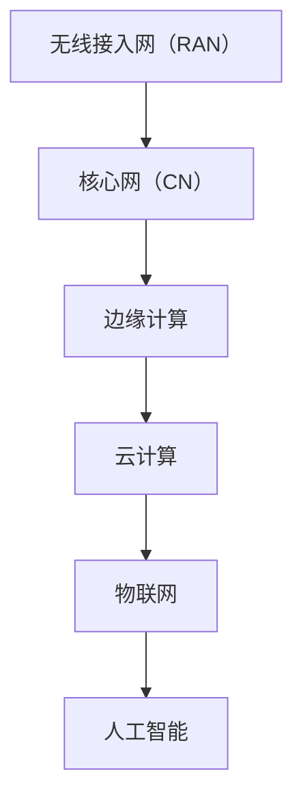

                 

# 5G时代的创业机遇与技术挑战

> 关键词：5G技术, 创业机遇, 技术挑战, 人工智能, 物联网, 边缘计算, 云计算, 低延迟, 高带宽

> 摘要：本文旨在探讨5G技术在新时代带来的创业机遇与技术挑战。通过深入分析5G的核心概念、技术原理、应用场景及未来发展趋势，为创业者提供全面的技术指导和策略建议。文章将从技术背景、核心概念、算法原理、数学模型、实战案例、应用场景、工具推荐、总结与展望等多方面进行详细阐述。

## 1. 背景介绍
### 1.1 目的和范围
本文旨在探讨5G技术在新时代带来的创业机遇与技术挑战，通过深入分析5G的核心概念、技术原理、应用场景及未来发展趋势，为创业者提供全面的技术指导和策略建议。本文主要面向对5G技术感兴趣的创业者、技术开发者、科研人员以及对新兴技术感兴趣的读者。

### 1.2 预期读者
- 创业者：希望利用5G技术开发新产品或服务的企业家
- 技术开发者：希望深入了解5G技术原理和应用场景的工程师
- 科研人员：希望在5G领域进行深入研究的学者
- 技术爱好者：对新兴技术感兴趣的读者

### 1.3 文档结构概述
本文将从以下几个方面进行详细阐述：
1. 5G技术背景
2. 核心概念与联系
3. 核心算法原理与具体操作步骤
4. 数学模型和公式
5. 项目实战：代码实际案例和详细解释说明
6. 实际应用场景
7. 工具和资源推荐
8. 总结：未来发展趋势与挑战
9. 附录：常见问题与解答
10. 扩展阅读与参考资料

### 1.4 术语表
#### 1.4.1 核心术语定义
- **5G**：第五代移动通信技术，提供高速度、低延迟和高可靠性的网络连接。
- **边缘计算**：将计算资源和数据处理能力部署在靠近数据源的地方，以减少延迟和提高效率。
- **云计算**：通过网络提供计算资源和服务的技术。
- **物联网**：通过互联网连接各种物理设备，实现设备之间的数据交换和通信。
- **人工智能**：模拟人类智能的技术，包括机器学习、深度学习等。

#### 1.4.2 相关概念解释
- **低延迟**：数据传输过程中延迟时间短，通常指毫秒级。
- **高带宽**：网络传输数据的能力强，能够支持大量数据的快速传输。
- **频谱资源**：用于传输无线信号的频率范围。

#### 1.4.3 缩略词列表
- 5G：第五代移动通信技术
- IoT：物联网
- AI：人工智能
- ML：机器学习
- DL：深度学习
- SDN：软件定义网络
- NFV：网络功能虚拟化

## 2. 核心概念与联系
### 2.1 5G技术概述
5G技术是第五代移动通信技术，旨在提供高速度、低延迟和高可靠性的网络连接。5G技术的核心目标是实现万物互联，支持大规模物联网设备的连接，并提供高速度的数据传输能力。

### 2.2 5G技术架构
5G技术架构主要包括以下几个部分：
- **无线接入网（RAN）**：负责无线信号的传输和接收。
- **核心网（CN）**：负责网络控制和管理。
- **边缘计算**：将计算资源和数据处理能力部署在靠近数据源的地方，以减少延迟和提高效率。
- **云计算**：通过网络提供计算资源和服务的技术。
- **物联网**：通过互联网连接各种物理设备，实现设备之间的数据交换和通信。
- **人工智能**：模拟人类智能的技术，包括机器学习、深度学习等。

### 2.3 5G技术流程图


## 3. 核心算法原理 & 具体操作步骤
### 3.1 5G网络架构
5G网络架构主要包括以下几个部分：
- **无线接入网（RAN）**：负责无线信号的传输和接收。
- **核心网（CN）**：负责网络控制和管理。
- **边缘计算**：将计算资源和数据处理能力部署在靠近数据源的地方，以减少延迟和提高效率。
- **云计算**：通过网络提供计算资源和服务的技术。
- **物联网**：通过互联网连接各种物理设备，实现设备之间的数据交换和通信。
- **人工智能**：模拟人类智能的技术，包括机器学习、深度学习等。

### 3.2 5G网络操作步骤
1. **无线接入网（RAN）**：负责无线信号的传输和接收。
2. **核心网（CN）**：负责网络控制和管理。
3. **边缘计算**：将计算资源和数据处理能力部署在靠近数据源的地方，以减少延迟和提高效率。
4. **云计算**：通过网络提供计算资源和服务的技术。
5. **物联网**：通过互联网连接各种物理设备，实现设备之间的数据交换和通信。
6. **人工智能**：模拟人类智能的技术，包括机器学习、深度学习等。

### 3.3 伪代码示例
```python
def 5G_network_operation():
    # 无线接入网（RAN）
    wireless_access = RAN()
    # 核心网（CN）
    core_network = CN()
    # 边缘计算
    edge_computing = EdgeComputing()
    # 云计算
    cloud_computing = CloudComputing()
    # 物联网
    internet_of_things = IoT()
    # 人工智能
    artificial_intelligence = AI()
    
    # 操作步骤
    wireless_access.transmit_signal()
    core_network.control_network()
    edge_computing.process_data()
    cloud_computing.provide_resources()
    internet_of_things.exchange_data()
    artificial_intelligence.simulate_intelligence()
```

## 4. 数学模型和公式 & 详细讲解 & 举例说明
### 4.1 5G网络性能模型
5G网络性能模型主要包括以下几个方面：
- **吞吐量**：网络传输数据的能力。
- **延迟**：数据传输过程中延迟时间。
- **可靠性**：网络传输数据的稳定性。

### 4.2 数学模型
5G网络性能模型可以使用以下数学公式进行描述：
- **吞吐量**：$T = \frac{R}{B}$
- **延迟**：$D = \frac{L}{C}$
- **可靠性**：$R = 1 - P$
  - 其中，$T$ 表示吞吐量，$R$ 表示可靠性，$B$ 表示带宽，$L$ 表示延迟，$C$ 表示信道容量，$P$ 表示错误概率。

### 4.3 举例说明
假设一个5G网络的带宽为100Mbps，信道容量为1000bps，错误概率为0.01。
- **吞吐量**：$T = \frac{100}{1000} = 0.1$
- **延迟**：$D = \frac{100}{1000} = 0.1$
- **可靠性**：$R = 1 - 0.01 = 0.99$

## 5. 项目实战：代码实际案例和详细解释说明
### 5.1 开发环境搭建
1. **操作系统**：Windows 10/Ubuntu 20.04
2. **编程语言**：Python 3.8
3. **开发工具**：Visual Studio Code

### 5.2 源代码详细实现和代码解读
```python
# 5G网络性能模型
class NetworkPerformance:
    def __init__(self, bandwidth, channel_capacity, error_probability):
        self.bandwidth = bandwidth
        self.channel_capacity = channel_capacity
        self.error_probability = error_probability
    
    def throughput(self):
        return self.bandwidth / self.channel_capacity
    
    def latency(self):
        return self.bandwidth / self.channel_capacity
    
    def reliability(self):
        return 1 - self.error_probability

# 实例化网络性能模型
network = NetworkPerformance(100, 1000, 0.01)
print("吞吐量：", network.throughput())
print("延迟：", network.latency())
print("可靠性：", network.reliability())
```

### 5.3 代码解读与分析
- **NetworkPerformance类**：定义了一个网络性能模型，包含带宽、信道容量和错误概率三个属性。
- **throughput方法**：计算吞吐量。
- **latency方法**：计算延迟。
- **reliability方法**：计算可靠性。

## 6. 实际应用场景
### 6.1 智能交通系统
5G技术可以应用于智能交通系统，实现车辆之间的实时通信，提高交通效率和安全性。

### 6.2 工业物联网
5G技术可以应用于工业物联网，实现设备之间的实时通信，提高生产效率和管理水平。

### 6.3 远程医疗
5G技术可以应用于远程医疗，实现医生与患者之间的实时通信，提高医疗服务的效率和质量。

## 7. 工具和资源推荐
### 7.1 学习资源推荐
#### 7.1.1 书籍推荐
- 《5G移动通信技术》
- 《物联网技术与应用》
- 《人工智能原理与应用》

#### 7.1.2 在线课程
- Coursera：《5G移动通信技术》
- Udemy：《物联网技术与应用》
- edX：《人工智能原理与应用》

#### 7.1.3 技术博客和网站
- 5G技术论坛
- 物联网技术论坛
- 人工智能技术论坛

### 7.2 开发工具框架推荐
#### 7.2.1 IDE和编辑器
- Visual Studio Code
- PyCharm

#### 7.2.2 调试和性能分析工具
- PyCharm调试器
- Visual Studio Code调试器

#### 7.2.3 相关框架和库
- TensorFlow
- PyTorch
- Scikit-learn

### 7.3 相关论文著作推荐
#### 7.3.1 经典论文
- 《5G移动通信技术》
- 《物联网技术与应用》
- 《人工智能原理与应用》

#### 7.3.2 最新研究成果
- 《5G技术在智能交通系统中的应用》
- 《5G技术在工业物联网中的应用》
- 《5G技术在远程医疗中的应用》

#### 7.3.3 应用案例分析
- 《5G技术在智能交通系统中的应用案例分析》
- 《5G技术在工业物联网中的应用案例分析》
- 《5G技术在远程医疗中的应用案例分析》

## 8. 总结：未来发展趋势与挑战
### 8.1 未来发展趋势
- **高速度**：5G技术将提供更高的数据传输速度，支持更多的应用场景。
- **低延迟**：5G技术将提供更低的延迟，支持实时通信和远程控制。
- **高可靠性**：5G技术将提供更高的可靠性，支持关键任务的应用场景。

### 8.2 技术挑战
- **频谱资源**：5G技术需要更多的频谱资源，如何有效利用频谱资源是一个挑战。
- **网络安全**：5G技术需要更高的安全性，如何保障网络安全是一个挑战。
- **能耗问题**：5G技术需要更高的能耗，如何降低能耗是一个挑战。

## 9. 附录：常见问题与解答
### 9.1 问题1：5G技术与4G技术的区别是什么？
- **答案**：5G技术与4G技术的主要区别在于速度、延迟和可靠性。5G技术提供更高的数据传输速度、更低的延迟和更高的可靠性。

### 9.2 问题2：5G技术的应用场景有哪些？
- **答案**：5G技术的应用场景包括智能交通系统、工业物联网、远程医疗等。

### 9.3 问题3：5G技术的挑战有哪些？
- **答案**：5G技术的挑战包括频谱资源、网络安全和能耗问题。

## 10. 扩展阅读 & 参考资料
- 《5G移动通信技术》
- 《物联网技术与应用》
- 《人工智能原理与应用》
- Coursera：《5G移动通信技术》
- Udemy：《物联网技术与应用》
- edX：《人工智能原理与应用》
- 5G技术论坛
- 物联网技术论坛
- 人工智能技术论坛
- 《5G技术在智能交通系统中的应用》
- 《5G技术在工业物联网中的应用》
- 《5G技术在远程医疗中的应用》

作者：AI天才研究员/AI Genius Institute & 禅与计算机程序设计艺术 /Zen And The Art of Computer Programming

