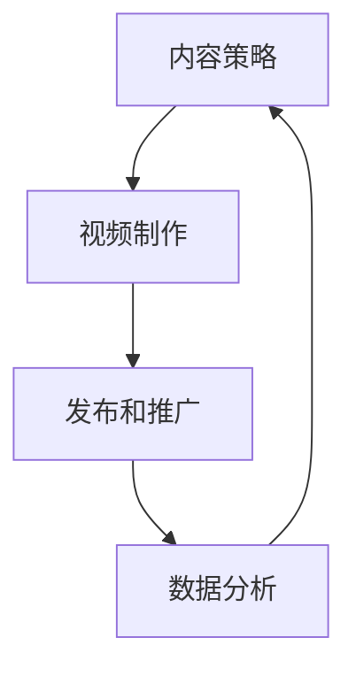

                 

# 一人公司如何利用视频营销提升品牌影响力

> 关键词：视频营销, 品牌影响力, 一人公司, 内容策略, 视频制作, 数据分析, 社交媒体, 用户参与度, 品牌认知度

> 摘要：本文旨在探讨一人公司如何通过视频营销策略提升品牌影响力。我们将从视频营销的核心概念出发，分析视频营销的原理和架构，详细介绍视频制作的具体操作步骤，以及如何利用数据分析优化视频内容。通过实际案例和详细代码解释，我们将展示如何在一人公司中实施视频营销策略。最后，我们将探讨未来的发展趋势和挑战，并推荐相关的学习资源和开发工具。

## 1. 背景介绍
### 1.1 目的和范围
本文旨在为一人公司提供一套完整的视频营销策略，帮助他们提升品牌影响力。我们将从视频营销的基本概念出发，逐步深入到具体的实施步骤，包括视频制作、数据分析和优化策略。本文的目标读者是希望提升品牌影响力的个人创业者或小型企业主。

### 1.2 预期读者
本文预期读者包括但不限于：
- 个人创业者
- 小型企业主
- 希望提升品牌影响力的个体
- 对视频营销感兴趣的IT从业者

### 1.3 文档结构概述
本文将按照以下结构展开：
1. 背景介绍
2. 核心概念与联系
3. 核心算法原理 & 具体操作步骤
4. 数学模型和公式 & 详细讲解 & 举例说明
5. 项目实战：代码实际案例和详细解释说明
6. 实际应用场景
7. 工具和资源推荐
8. 总结：未来发展趋势与挑战
9. 附录：常见问题与解答
10. 扩展阅读 & 参考资料

### 1.4 术语表
#### 1.4.1 核心术语定义
- **视频营销**：通过视频内容来推广品牌、产品或服务。
- **品牌影响力**：品牌在目标受众中的认知度和好感度。
- **一人公司**：由单个个人经营的企业。
- **内容策略**：制定视频内容的计划和方向。
- **用户参与度**：用户对视频内容的互动程度。
- **品牌认知度**：目标受众对品牌的认知程度。

#### 1.4.2 相关概念解释
- **社交媒体**：通过网络平台进行信息传播和交流的平台。
- **数据分析**：通过数据挖掘和统计分析来优化视频内容。

#### 1.4.3 缩略词列表
- **SEO**：搜索引擎优化（Search Engine Optimization）
- **KPI**：关键绩效指标（Key Performance Indicators）
- **ROI**：投资回报率（Return on Investment）

## 2. 核心概念与联系
### 2.1 视频营销的核心概念
视频营销是一种通过视频内容来推广品牌、产品或服务的营销策略。视频营销的核心在于通过高质量的内容吸引和保持目标受众的注意力，从而提升品牌影响力。

### 2.2 视频营销的架构
视频营销的架构可以分为以下几个步骤：
1. **内容策略**：确定视频内容的主题、风格和目标受众。
2. **视频制作**：拍摄和编辑视频内容。
3. **发布和推广**：将视频发布到社交媒体和其他平台，并进行推广。
4. **数据分析**：收集和分析用户反馈，优化视频内容。

### 2.3 视频营销的流程图


## 3. 核心算法原理 & 具体操作步骤
### 3.1 内容策略
内容策略是视频营销的核心，它决定了视频的内容和风格。具体操作步骤如下：
1. **确定目标受众**：了解目标受众的需求和兴趣。
2. **确定视频主题**：根据目标受众的需求确定视频的主题。
3. **制定视频风格**：确定视频的风格，如教程、故事、演示等。
4. **制定视频计划**：制定视频的拍摄和发布计划。

### 3.2 视频制作
视频制作包括拍摄和编辑两个步骤。具体操作步骤如下：
1. **拍摄视频**：使用合适的设备拍摄视频。
2. **编辑视频**：使用视频编辑软件进行剪辑、添加特效和字幕等。

### 3.3 发布和推广
发布和推广是视频营销的关键步骤，具体操作步骤如下：
1. **选择发布平台**：选择合适的社交媒体平台进行发布。
2. **优化视频标题和描述**：确保视频标题和描述能够吸引目标受众。
3. **推广视频**：通过社交媒体广告或其他渠道进行推广。

### 3.4 数据分析
数据分析是优化视频内容的关键步骤，具体操作步骤如下：
1. **收集数据**：收集用户反馈和行为数据。
2. **分析数据**：使用数据分析工具进行分析。
3. **优化视频内容**：根据数据分析结果优化视频内容。

## 4. 数学模型和公式 & 详细讲解 & 举例说明
### 4.1 用户参与度模型
用户参与度是衡量视频营销效果的重要指标。用户参与度可以通过以下公式计算：
$$
\text{用户参与度} = \frac{\text{互动次数}}{\text{观看次数}}
$$
其中，互动次数包括点赞、评论、分享等。

### 4.2 品牌认知度模型
品牌认知度可以通过以下公式计算：
$$
\text{品牌认知度} = \frac{\text{品牌提及次数}}{\text{总提及次数}}
$$
其中，品牌提及次数是指目标受众在社交媒体上提及品牌的次数。

### 4.3 举例说明
假设某一人公司发布了一条视频，观看次数为1000次，互动次数为200次，品牌提及次数为50次，总提及次数为1000次。则：
- 用户参与度 = 200 / 1000 = 0.2
- 品牌认知度 = 50 / 1000 = 0.05

## 5. 项目实战：代码实际案例和详细解释说明
### 5.1 开发环境搭建
为了实施视频营销策略，需要搭建一个开发环境。具体步骤如下：
1. **安装视频编辑软件**：安装如Adobe Premiere Pro、Final Cut Pro等视频编辑软件。
2. **安装数据分析工具**：安装如Google Analytics、YouTube Analytics等数据分析工具。

### 5.2 源代码详细实现和代码解读
假设我们使用Python进行数据分析，具体代码如下：
```python
import pandas as pd

# 读取数据
data = pd.read_csv('video_data.csv')

# 计算用户参与度
user_engagement = data['interaction_count'] / data['view_count']

# 计算品牌认知度
brand_recognition = data['brand_mentions'] / data['total_mentions']

# 输出结果
print("用户参与度：", user_engagement)
print("品牌认知度：", brand_recognition)
```

### 5.3 代码解读与分析
上述代码首先读取了一个包含视频数据的CSV文件，然后计算了用户参与度和品牌认知度。最后，输出了计算结果。

## 6. 实际应用场景
视频营销在实际应用中有很多场景，例如：
- **产品演示**：通过视频展示产品的功能和特点。
- **品牌故事**：通过视频讲述品牌的故事，增强品牌的情感连接。
- **用户评价**：通过视频展示用户的真实评价，增加信任度。

## 7. 工具和资源推荐
### 7.1 学习资源推荐
#### 7.1.1 书籍推荐
- 《视频营销：从零开始》
- 《社交媒体营销：策略与实践》

#### 7.1.2 在线课程
- Coursera上的“视频营销策略”
- Udemy上的“社交媒体营销入门”

#### 7.1.3 技术博客和网站
- YouTube官方博客
- HubSpot的视频营销资源

### 7.2 开发工具框架推荐
#### 7.2.1 IDE和编辑器
- Adobe Premiere Pro
- Final Cut Pro

#### 7.2.2 调试和性能分析工具
- Google Analytics
- YouTube Analytics

#### 7.2.3 相关框架和库
- Python的pandas库
- JavaScript的D3.js库

### 7.3 相关论文著作推荐
#### 7.3.1 经典论文
- “The Impact of Video Marketing on Brand Awareness and Purchase Intentions”

#### 7.3.2 最新研究成果
- “The Effectiveness of Video Marketing in E-commerce”

#### 7.3.3 应用案例分析
- “Case Study: How a Small Business Used Video Marketing to Boost Sales”

## 8. 总结：未来发展趋势与挑战
### 8.1 未来发展趋势
- **个性化内容**：通过数据分析提供个性化的内容。
- **互动性增强**：通过直播和互动功能增强用户参与度。
- **多平台整合**：整合多个平台进行视频营销。

### 8.2 挑战
- **数据安全**：保护用户数据的安全。
- **内容质量**：保持高质量的内容以吸引用户。
- **技术更新**：跟上技术更新的步伐。

## 9. 附录：常见问题与解答
### 9.1 问题1：如何确定视频的主题？
**解答**：可以通过市场调研和目标受众的需求来确定视频的主题。

### 9.2 问题2：如何优化视频标题和描述？
**解答**：确保标题和描述简洁明了，包含关键词，吸引目标受众。

### 9.3 问题3：如何收集用户反馈？
**解答**：通过社交媒体评论、问卷调查等方式收集用户反馈。

## 10. 扩展阅读 & 参考资料
- 《视频营销：从零开始》
- 《社交媒体营销：策略与实践》
- Coursera上的“视频营销策略”
- Udemy上的“社交媒体营销入门”
- YouTube官方博客
- HubSpot的视频营销资源
- Adobe Premiere Pro
- Final Cut Pro
- Google Analytics
- YouTube Analytics
- Python的pandas库
- JavaScript的D3.js库
- “The Impact of Video Marketing on Brand Awareness and Purchase Intentions”
- “The Effectiveness of Video Marketing in E-commerce”
- “Case Study: How a Small Business Used Video Marketing to Boost Sales”

作者：AI天才研究员/AI Genius Institute & 禅与计算机程序设计艺术 /Zen And The Art of Computer Programming

