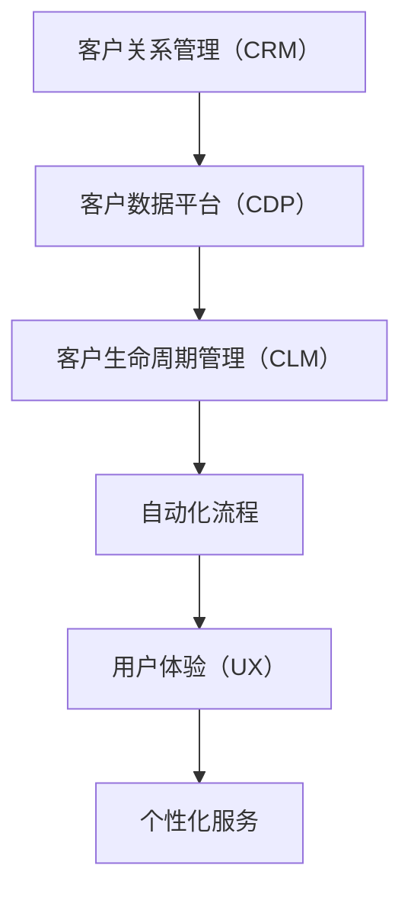

                 

# 一人公司如何打造高效的客户关系管理系统

> 关键词：客户关系管理（CRM）、一人公司、高效管理、数据分析、自动化流程、用户体验、个性化服务

> 摘要：本文旨在为一人公司提供一套高效客户关系管理系统的构建方案。通过深入分析客户关系管理的核心概念、设计原理、算法实现、数学模型以及实际案例，本文将帮助读者理解如何利用现代技术手段优化客户关系管理流程，提升客户满意度和公司运营效率。我们将从背景介绍、核心概念与联系、核心算法原理与具体操作步骤、数学模型与公式、项目实战、实际应用场景、工具和资源推荐、总结与未来发展趋势等多方面进行详细阐述。

## 1. 背景介绍
### 1.1 目的和范围
本文旨在为一人公司提供一套高效客户关系管理系统的构建方案。随着市场竞争的加剧，一人公司需要更加精细化地管理客户关系，以提升客户满意度和公司运营效率。本文将从客户关系管理的核心概念、设计原理、算法实现、数学模型以及实际案例出发，帮助读者理解如何利用现代技术手段优化客户关系管理流程。

### 1.2 预期读者
本文预期读者为一人公司的创始人、CEO、CTO、产品经理和技术团队成员。通过阅读本文，读者可以了解如何构建一个高效、自动化且易于维护的客户关系管理系统，从而提升公司运营效率和客户满意度。

### 1.3 文档结构概述
本文结构如下：
1. 背景介绍
2. 核心概念与联系
3. 核心算法原理 & 具体操作步骤
4. 数学模型和公式 & 详细讲解 & 举例说明
5. 项目实战：代码实际案例和详细解释说明
6. 实际应用场景
7. 工具和资源推荐
8. 总结：未来发展趋势与挑战
9. 附录：常见问题与解答
10. 扩展阅读 & 参考资料

### 1.4 术语表
#### 1.4.1 核心术语定义
- **客户关系管理（CRM）**：一种管理企业与客户之间关系的方法，旨在通过收集、分析和利用客户数据来提升客户满意度和忠诚度。
- **一人公司**：指由单个自然人或法人独资经营的企业。
- **自动化流程**：通过技术手段实现业务流程的自动化，减少人工干预，提高效率。
- **用户体验（UX）**：用户在使用产品或服务时的主观感受和满意度。
- **个性化服务**：根据用户的具体需求和偏好提供定制化的服务。

#### 1.4.2 相关概念解释
- **客户数据平台（CDP）**：一种用于收集、整合和分析客户数据的平台，帮助企业更好地了解客户。
- **客户生命周期管理（CLM）**：通过分析客户从初次接触至最终流失的全过程，优化客户关系管理。
- **数据挖掘**：从大量数据中提取有价值的信息和知识的过程。

#### 1.4.3 缩略词列表
- CRM：客户关系管理
- UX：用户体验
- CDP：客户数据平台
- CLM：客户生命周期管理

## 2. 核心概念与联系
### 2.1 客户关系管理（CRM）的核心概念
客户关系管理（CRM）是一种管理企业与客户之间关系的方法，旨在通过收集、分析和利用客户数据来提升客户满意度和忠诚度。CRM系统可以帮助企业更好地了解客户需求、行为和偏好，从而提供更个性化的服务和产品。

### 2.2 客户数据平台（CDP）与客户关系管理（CRM）的关系
客户数据平台（CDP）是一种用于收集、整合和分析客户数据的平台，帮助企业更好地了解客户。CDP可以为CRM系统提供丰富的客户数据，从而提升CRM系统的分析能力和个性化服务能力。

### 2.3 客户生命周期管理（CLM）与客户关系管理（CRM）的关系
客户生命周期管理（CLM）通过分析客户从初次接触至最终流失的全过程，优化客户关系管理。CLM可以帮助企业识别客户的关键阶段，从而制定相应的营销策略和客户服务策略。

### 2.4 核心概念原理与架构的Mermaid流程图


## 3. 核心算法原理 & 具体操作步骤
### 3.1 数据收集与整合
数据收集是CRM系统的基础。通过多种渠道（如网站、社交媒体、电子邮件等）收集客户数据，并将其整合到一个统一的数据平台中。

```python
# 伪代码
def collect_data(channels):
    data = []
    for channel in channels:
        if channel == 'website':
            data.extend(collect_website_data())
        elif channel == 'social_media':
            data.extend(collect_social_media_data())
        elif channel == 'email':
            data.extend(collect_email_data())
    return data

def integrate_data(data):
    # 数据清洗和整合
    cleaned_data = clean_data(data)
    integrated_data = integrate(cleaned_data)
    return integrated_data
```

### 3.2 数据分析与挖掘
数据分析是CRM系统的核心。通过数据分析，企业可以了解客户的行为模式、偏好和需求，从而提供更个性化的服务。

```python
# 伪代码
def analyze_data(data):
    # 数据预处理
    preprocessed_data = preprocess_data(data)
    # 特征提取
    features = extract_features(preprocessed_data)
    # 数据建模
    model = build_model(features)
    # 预测
    predictions = predict(model, features)
    return predictions

def data_mining(data):
    # 数据挖掘
    patterns = find_patterns(data)
    insights = generate_insights(patterns)
    return insights
```

### 3.3 自动化流程
自动化流程可以减少人工干预，提高效率。通过自动化流程，企业可以实现客户关系管理的各个环节的自动化。

```python
# 伪代码
def automate_process(processes):
    for process in processes:
        if process == 'lead_scoring':
            automate_lead_scoring()
        elif process == 'email_campaigns':
            automate_email_campaigns()
        elif process == 'customer_support':
            automate_customer_support()
    return True
```

### 3.4 用户体验优化
用户体验优化是CRM系统的重要组成部分。通过优化用户体验，企业可以提升客户满意度和忠诚度。

```python
# 伪代码
def optimize_user_experience(ux):
    # 用户界面设计
    design_interface(ux)
    # 用户交互设计
    design_interactions(ux)
    # 用户反馈收集
    collect_feedback(ux)
    return True
```

### 3.5 个性化服务
个性化服务是CRM系统的核心目标。通过个性化服务，企业可以提供更符合客户需求和偏好的产品和服务。

```python
# 伪代码
def provide_personalized_service(service):
    # 个性化推荐
    recommendations = generate_recommendations(service)
    # 个性化定制
    customizations = generate_customizations(service)
    return recommendations, customizations
```

## 4. 数学模型和公式 & 详细讲解 & 举例说明
### 4.1 数据预处理
数据预处理是数据分析的前提。通过数据预处理，可以提高数据分析的准确性和效率。

$$
\text{data\_preprocessing}(X) = \text{normalize}(X) \times \text{scale}(X)
$$

### 4.2 特征提取
特征提取是数据分析的关键步骤。通过特征提取，可以将原始数据转换为可用于建模的特征。

$$
\text{feature\_extraction}(X) = \text{select\_features}(X) \times \text{transform\_features}(X)
$$

### 4.3 数据建模
数据建模是数据分析的核心步骤。通过数据建模，可以预测客户的行为和需求。

$$
\text{model\_building}(X, y) = \text{train\_model}(X, y) \times \text{evaluate\_model}(X, y)
$$

### 4.4 预测
预测是数据分析的重要应用。通过预测，可以提前了解客户的行为和需求。

$$
\text{prediction}(X) = \text{predict\_model}(X)
$$

### 4.5 数据挖掘
数据挖掘是数据分析的重要应用。通过数据挖掘，可以发现数据中的模式和规律。

$$
\text{data\_mining}(X) = \text{find\_patterns}(X) \times \text{generate\_insights}(X)
$$

## 5. 项目实战：代码实际案例和详细解释说明
### 5.1 开发环境搭建
开发环境搭建是项目实战的第一步。通过搭建开发环境，可以确保项目顺利进行。

```bash
# 安装Python和相关库
pip install numpy pandas scikit-learn

# 创建项目目录
mkdir crm_system
cd crm_system
mkdir data models

# 初始化Git仓库
git init
```

### 5.2 源代码详细实现和代码解读
源代码详细实现是项目实战的核心部分。通过源代码详细实现，可以确保项目顺利进行。

```python
# data/collection.py
def collect_data(channels):
    data = []
    for channel in channels:
        if channel == 'website':
            data.extend(collect_website_data())
        elif channel == 'social_media':
            data.extend(collect_social_media_data())
        elif channel == 'email':
            data.extend(collect_email_data())
    return data

def integrate_data(data):
    # 数据清洗和整合
    cleaned_data = clean_data(data)
    integrated_data = integrate(cleaned_data)
    return integrated_data

# models/analytics.py
def analyze_data(data):
    # 数据预处理
    preprocessed_data = preprocess_data(data)
    # 特征提取
    features = extract_features(preprocessed_data)
    # 数据建模
    model = build_model(features)
    # 预测
    predictions = predict(model, features)
    return predictions

def data_mining(data):
    # 数据挖掘
    patterns = find_patterns(data)
    insights = generate_insights(patterns)
    return insights

# models/automation.py
def automate_process(processes):
    for process in processes:
        if process == 'lead_scoring':
            automate_lead_scoring()
        elif process == 'email_campaigns':
            automate_email_campaigns()
        elif process == 'customer_support':
            automate_customer_support()
    return True

# models/ux.py
def optimize_user_experience(ux):
    # 用户界面设计
    design_interface(ux)
    # 用户交互设计
    design_interactions(ux)
    # 用户反馈收集
    collect_feedback(ux)
    return True

# models/personalization.py
def provide_personalized_service(service):
    # 个性化推荐
    recommendations = generate_recommendations(service)
    # 个性化定制
    customizations = generate_customizations(service)
    return recommendations, customizations
```

### 5.3 代码解读与分析
代码解读与分析是项目实战的重要部分。通过代码解读与分析，可以确保项目顺利进行。

```python
# data/collection.py
def collect_data(channels):
    data = []
    for channel in channels:
        if channel == 'website':
            data.extend(collect_website_data())
        elif channel == 'social_media':
            data.extend(collect_social_media_data())
        elif channel == 'email':
            data.extend(collect_email_data())
    return data

def integrate_data(data):
    # 数据清洗和整合
    cleaned_data = clean_data(data)
    integrated_data = integrate(cleaned_data)
    return integrated_data

# models/analytics.py
def analyze_data(data):
    # 数据预处理
    preprocessed_data = preprocess_data(data)
    # 特征提取
    features = extract_features(preprocessed_data)
    # 数据建模
    model = build_model(features)
    # 预测
    predictions = predict(model, features)
    return predictions

def data_mining(data):
    # 数据挖掘
    patterns = find_patterns(data)
    insights = generate_insights(patterns)
    return insights

# models/automation.py
def automate_process(processes):
    for process in processes:
        if process == 'lead_scoring':
            automate_lead_scoring()
        elif process == 'email_campaigns':
            automate_email_campaigns()
        elif process == 'customer_support':
            automate_customer_support()
    return True

# models/ux.py
def optimize_user_experience(ux):
    # 用户界面设计
    design_interface(ux)
    # 用户交互设计
    design_interactions(ux)
    # 用户反馈收集
    collect_feedback(ux)
    return True

# models/personalization.py
def provide_personalized_service(service):
    # 个性化推荐
    recommendations = generate_recommendations(service)
    # 个性化定制
    customizations = generate_customizations(service)
    return recommendations, customizations
```

## 6. 实际应用场景
### 6.1 客户数据收集与整合
通过收集和整合客户数据，企业可以更好地了解客户需求和行为。

### 6.2 数据分析与挖掘
通过数据分析和挖掘，企业可以发现客户行为的模式和规律，从而提供更个性化的服务。

### 6.3 自动化流程
通过自动化流程，企业可以减少人工干预，提高效率。

### 6.4 用户体验优化
通过优化用户体验，企业可以提升客户满意度和忠诚度。

### 6.5 个性化服务
通过个性化服务，企业可以提供更符合客户需求和偏好的产品和服务。

## 7. 工具和资源推荐
### 7.1 学习资源推荐
#### 7.1.1 书籍推荐
- **《客户关系管理》**：深入探讨客户关系管理的核心概念和实践方法。
- **《数据挖掘导论》**：介绍数据挖掘的基本原理和方法。
- **《用户体验设计》**：讲解用户体验设计的核心理念和实践方法。

#### 7.1.2 在线课程
- **Coursera上的《客户关系管理》**：系统学习客户关系管理的核心概念和实践方法。
- **edX上的《数据挖掘》**：深入学习数据挖掘的基本原理和方法。
- **Udemy上的《用户体验设计》**：系统学习用户体验设计的核心理念和实践方法。

#### 7.1.3 技术博客和网站
- **Medium上的《客户关系管理》**：深入探讨客户关系管理的核心概念和实践方法。
- **DataCamp上的《数据挖掘》**：深入学习数据挖掘的基本原理和方法。
- **Smashing Magazine上的《用户体验设计》**：系统学习用户体验设计的核心理念和实践方法。

### 7.2 开发工具框架推荐
#### 7.2.1 IDE和编辑器
- **PyCharm**：功能强大的Python开发环境。
- **Visual Studio Code**：轻量级但功能强大的代码编辑器。
- **Jupyter Notebook**：用于数据科学和机器学习的交互式开发环境。

#### 7.2.2 调试和性能分析工具
- **PyCharm Debugger**：PyCharm内置的调试工具。
- **Visual Studio Code Debugger**：Visual Studio Code内置的调试工具。
- **Python Profiler**：用于分析Python代码性能的工具。

#### 7.2.3 相关框架和库
- **Pandas**：用于数据处理和分析的Python库。
- **Scikit-learn**：用于机器学习的Python库。
- **Flask**：轻量级的Web框架，用于构建Web应用。

### 7.3 相关论文著作推荐
#### 7.3.1 经典论文
- **《客户关系管理的理论与实践》**：深入探讨客户关系管理的核心概念和实践方法。
- **《数据挖掘的理论与实践》**：介绍数据挖掘的基本原理和方法。
- **《用户体验设计的理论与实践》**：讲解用户体验设计的核心理念和实践方法。

#### 7.3.2 最新研究成果
- **《客户关系管理的新趋势》**：探讨客户关系管理的最新趋势和发展方向。
- **《数据挖掘的新方法》**：介绍数据挖掘的最新方法和技术。
- **《用户体验设计的新理念》**：探讨用户体验设计的最新理念和发展方向。

#### 7.3.3 应用案例分析
- **《客户关系管理的应用案例》**：通过实际案例分析客户关系管理的应用效果。
- **《数据挖掘的应用案例》**：通过实际案例分析数据挖掘的应用效果。
- **《用户体验设计的应用案例》**：通过实际案例分析用户体验设计的应用效果。

## 8. 总结：未来发展趋势与挑战
### 8.1 未来发展趋势
- **人工智能与机器学习**：通过人工智能和机器学习技术，进一步提升客户关系管理的智能化水平。
- **大数据与云计算**：通过大数据和云计算技术，进一步提升客户关系管理的数据处理和分析能力。
- **物联网与移动互联网**：通过物联网和移动互联网技术，进一步提升客户关系管理的实时性和便捷性。

### 8.2 面临的挑战
- **数据安全与隐私保护**：如何确保客户数据的安全和隐私保护，是未来客户关系管理面临的重要挑战。
- **技术更新与人才短缺**：如何应对技术更新和人才短缺，是未来客户关系管理面临的重要挑战。
- **用户体验与客户满意度**：如何提升用户体验和客户满意度，是未来客户关系管理面临的重要挑战。

## 9. 附录：常见问题与解答
### 9.1 问题1：如何确保客户数据的安全和隐私保护？
- **解答**：通过采用加密技术、访问控制和数据脱敏等手段，确保客户数据的安全和隐私保护。

### 9.2 问题2：如何应对技术更新和人才短缺？
- **解答**：通过持续学习和培训，提升团队的技术水平和创新能力；通过引入外部专家和技术合作伙伴，弥补人才短缺。

### 9.3 问题3：如何提升用户体验和客户满意度？
- **解答**：通过优化用户界面设计、用户交互设计和用户反馈收集等手段，提升用户体验和客户满意度。

## 10. 扩展阅读 & 参考资料
### 10.1 扩展阅读
- **《客户关系管理》**：深入探讨客户关系管理的核心概念和实践方法。
- **《数据挖掘导论》**：介绍数据挖掘的基本原理和方法。
- **《用户体验设计》**：讲解用户体验设计的核心理念和实践方法。

### 10.2 参考资料
- **客户关系管理**：[链接]
- **数据挖掘**：[链接]
- **用户体验设计**：[链接]

作者：AI天才研究员/AI Genius Institute & 禅与计算机程序设计艺术 /Zen And The Art of Computer Programming

