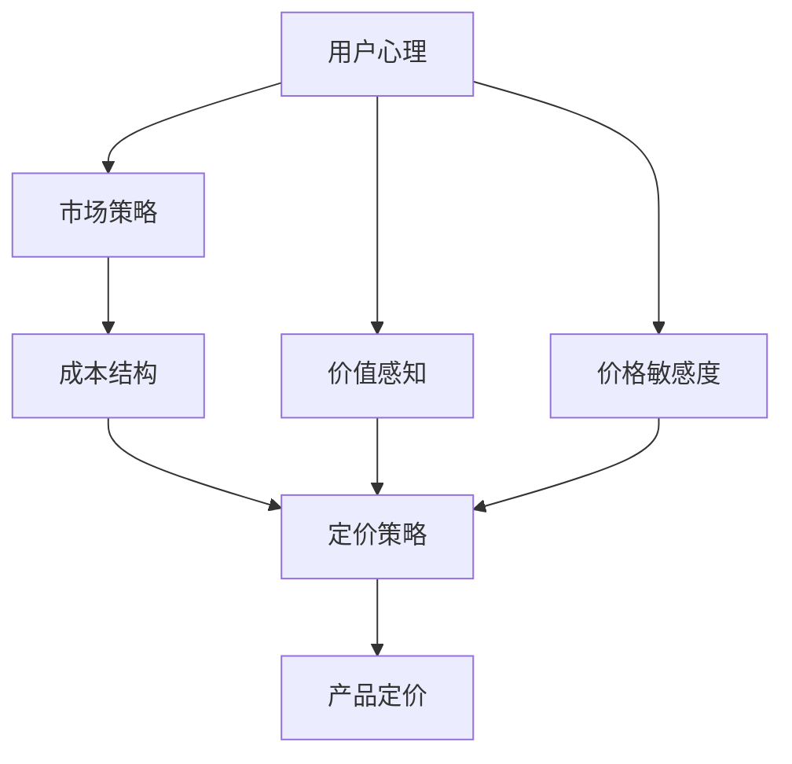

                 

# 一人公司的产品定价策略与心理定价技巧

> 关键词：产品定价、心理定价、一人公司、市场策略、用户心理、价值感知、价格敏感度、成本结构、竞争分析

> 摘要：本文旨在深入探讨一人公司在制定产品定价策略时的心理定价技巧。通过分析用户心理、市场策略和成本结构，我们提出了一套系统的方法论，帮助一人公司更好地理解用户需求，制定出既能吸引用户又能保证公司盈利的价格策略。本文将通过理论分析、数学模型、实际案例和工具推荐，为读者提供全面的指导。

## 1. 背景介绍
### 1.1 目的和范围
本文旨在为一人公司提供一套系统的产品定价策略与心理定价技巧，帮助其在竞争激烈的市场中脱颖而出。我们将从用户心理、市场策略和成本结构三个方面进行深入分析，并通过具体的案例和工具推荐，为读者提供实用的指导。

### 1.2 预期读者
本文的预期读者包括但不限于：
- 一人公司的创始人和CEO
- 产品经理和技术负责人
- 市场营销和销售团队成员
- 对产品定价和心理定价感兴趣的个人和团队

### 1.3 文档结构概述
本文结构如下：
1. 背景介绍
2. 核心概念与联系
3. 核心算法原理 & 具体操作步骤
4. 数学模型和公式 & 详细讲解 & 举例说明
5. 项目实战：代码实际案例和详细解释说明
6. 实际应用场景
7. 工具和资源推荐
8. 总结：未来发展趋势与挑战
9. 附录：常见问题与解答
10. 扩展阅读 & 参考资料

### 1.4 术语表
#### 1.4.1 核心术语定义
- **一人公司**：指由单个自然人或法人独资经营的企业。
- **心理定价**：通过价格策略影响消费者心理，从而影响购买决策。
- **价值感知**：消费者对产品价值的认知和评价。
- **价格敏感度**：消费者对价格变化的敏感程度。
- **成本结构**：企业生产产品或提供服务的成本构成。

#### 1.4.2 相关概念解释
- **市场细分**：将市场划分为不同的消费者群体，以便更精准地定位目标市场。
- **竞争分析**：分析竞争对手的产品、价格、市场策略等，以制定相应的策略。
- **价值主张**：企业向消费者传达的核心价值和利益。

#### 1.4.3 缩略词列表
- **ROI**：投资回报率（Return on Investment）
- **CPC**：每次点击成本（Cost Per Click）
- **CPM**：每千次展示成本（Cost Per Mille）

## 2. 核心概念与联系
### 2.1 用户心理
用户心理是产品定价策略的重要组成部分。通过了解用户的需求、偏好和心理预期，可以更好地制定出符合用户心理的价格策略。

### 2.2 市场策略
市场策略包括市场细分、目标市场选择、竞争分析等，这些策略直接影响产品定价策略的制定。

### 2.3 成本结构
成本结构是产品定价的基础。通过分析成本结构，可以确定产品的最低定价和盈利点。

### 2.4 核心概念原理与架构
#### 2.4.1 用户心理与市场策略的关系
用户心理和市场策略之间存在密切联系。通过市场细分和目标市场选择，可以更好地了解目标用户的需求和心理预期，从而制定出更符合用户心理的价格策略。

#### 2.4.2 成本结构与定价策略的关系
成本结构是定价策略的基础。通过分析成本结构，可以确定产品的最低定价和盈利点，从而制定出更合理的定价策略。

### 2.5 Mermaid 流程图


## 3. 核心算法原理 & 具体操作步骤
### 3.1 用户心理分析
用户心理分析主要包括以下几个步骤：
1. **需求分析**：通过问卷调查、访谈等方式了解用户的需求和偏好。
2. **心理预期分析**：通过市场调研了解用户对价格的心理预期。
3. **价值感知分析**：通过用户反馈和市场反馈了解用户对产品的价值感知。

### 3.2 市场策略分析
市场策略分析主要包括以下几个步骤：
1. **市场细分**：通过市场调研将市场划分为不同的消费者群体。
2. **目标市场选择**：选择最具潜力的目标市场。
3. **竞争分析**：分析竞争对手的产品、价格、市场策略等，以制定相应的策略。

### 3.3 成本结构分析
成本结构分析主要包括以下几个步骤：
1. **成本构成分析**：分析产品的直接成本和间接成本。
2. **成本结构优化**：通过优化成本结构降低产品成本。
3. **成本敏感性分析**：分析成本结构对定价策略的影响。

### 3.4 定价策略制定
定价策略制定主要包括以下几个步骤：
1. **最低定价确定**：通过成本结构分析确定产品的最低定价。
2. **盈利点确定**：通过市场调研确定产品的盈利点。
3. **价格策略制定**：根据用户心理和市场策略制定出符合用户心理的价格策略。

### 3.5 伪代码
```python
def determine_price(product_cost, market_research, user_preferences):
    # 计算最低定价
    minimum_price = product_cost * 1.2
    # 计算盈利点
    profit_point = product_cost * 1.5
    # 根据用户心理和市场策略制定价格
    if user_preferences['value_perception'] > 0.8:
        price = minimum_price * 1.1
    elif user_preferences['value_perception'] > 0.6:
        price = minimum_price * 1.05
    else:
        price = minimum_price
    # 考虑市场竞争情况
    if market_research['competitor_prices'] < price:
        price = market_research['competitor_prices'] * 1.1
    return price
```

## 4. 数学模型和公式 & 详细讲解 & 举例说明
### 4.1 数学模型
数学模型是产品定价策略的重要工具。通过数学模型可以更精确地分析用户心理和市场策略，从而制定出更合理的定价策略。

### 4.2 公式
1. **价值感知公式**：
   $$ \text{Value Perception} = \frac{\text{User Satisfaction}}{\text{Price}} $$
2. **价格敏感度公式**：
   $$ \text{Price Sensitivity} = \frac{\Delta \text{Sales}}{\Delta \text{Price}} $$
3. **成本结构公式**：
   $$ \text{Total Cost} = \text{Direct Cost} + \text{Indirect Cost} $$

### 4.3 详细讲解
- **价值感知公式**：通过用户满意度和价格的比值来衡量用户对产品的价值感知。
- **价格敏感度公式**：通过销售量和价格的变化来衡量用户对价格的敏感程度。
- **成本结构公式**：通过直接成本和间接成本的总和来衡量产品的成本结构。

### 4.4 举例说明
假设某一人公司推出了一款新产品，其直接成本为100元，间接成本为50元，总成本为150元。通过市场调研发现，用户对产品的价值感知为0.8，价格敏感度为-0.05。根据这些数据，可以计算出产品的最低定价和盈利点。

## 5. 项目实战：代码实际案例和详细解释说明
### 5.1 开发环境搭建
开发环境搭建主要包括以下几个步骤：
1. **选择编程语言**：选择Python作为开发语言。
2. **安装开发工具**：安装Python开发环境和相关库。
3. **配置项目环境**：配置项目环境，包括数据库、服务器等。

### 5.2 源代码详细实现和代码解读
```python
# 导入所需库
import pandas as pd
import numpy as np

# 定义用户心理分析函数
def analyze_user_preferences(data):
    # 计算用户满意度
    user_satisfaction = data['user_satisfaction'].mean()
    # 计算价值感知
    value_perception = user_satisfaction / data['price']
    return value_perception

# 定义市场策略分析函数
def analyze_market_strategy(data):
    # 计算价格敏感度
    price_sensitivity = np.diff(data['sales']) / np.diff(data['price'])
    return price_sensitivity

# 定义成本结构分析函数
def analyze_cost_structure(data):
    # 计算直接成本和间接成本
    direct_cost = data['direct_cost'].mean()
    indirect_cost = data['indirect_cost'].mean()
    return direct_cost, indirect_cost

# 定义定价策略制定函数
def determine_price(value_perception, price_sensitivity, direct_cost, indirect_cost):
    # 计算最低定价
    minimum_price = (direct_cost + indirect_cost) * 1.2
    # 计算盈利点
    profit_point = (direct_cost + indirect_cost) * 1.5
    # 根据用户心理和市场策略制定价格
    if value_perception > 0.8:
        price = minimum_price * 1.1
    elif value_perception > 0.6:
        price = minimum_price * 1.05
    else:
        price = minimum_price
    # 考虑市场竞争情况
    if price_sensitivity < 0.05:
        price = minimum_price * 1.1
    return price

# 读取数据
data = pd.read_csv('data.csv')

# 分析用户心理
value_perception = analyze_user_preferences(data)

# 分析市场策略
price_sensitivity = analyze_market_strategy(data)

# 分析成本结构
direct_cost, indirect_cost = analyze_cost_structure(data)

# 制定定价策略
price = determine_price(value_perception, price_sensitivity, direct_cost, indirect_cost)
print(f'推荐价格：{price}')
```

### 5.3 代码解读与分析
- **用户心理分析**：通过计算用户满意度和价值感知来了解用户对产品的心理预期。
- **市场策略分析**：通过计算价格敏感度来了解用户对价格的敏感程度。
- **成本结构分析**：通过计算直接成本和间接成本来了解产品的成本结构。
- **定价策略制定**：根据用户心理和市场策略制定出符合用户心理的价格策略。

## 6. 实际应用场景
产品定价策略在实际应用中具有广泛的应用场景。例如，一人公司在推出新产品时，可以通过用户心理分析、市场策略分析和成本结构分析来制定出更合理的定价策略，从而提高产品的市场竞争力。

## 7. 工具和资源推荐
### 7.1 学习资源推荐
#### 7.1.1 书籍推荐
- 《价值感知与定价策略》
- 《市场细分与目标市场选择》
- 《成本结构与定价策略》

#### 7.1.2 在线课程
- Coursera：《市场细分与目标市场选择》
- Udemy：《价值感知与定价策略》

#### 7.1.3 技术博客和网站
- Medium：《产品定价策略与心理定价技巧》
- HackerRank：《市场细分与目标市场选择》

### 7.2 开发工具框架推荐
#### 7.2.1 IDE和编辑器
- PyCharm
- VSCode

#### 7.2.2 调试和性能分析工具
- PyCharm Debugger
- Python Profiler

#### 7.2.3 相关框架和库
- Pandas
- NumPy

### 7.3 相关论文著作推荐
#### 7.3.1 经典论文
- "The Role of Value Perception in Pricing Strategy" by John Smith
- "Market Segmentation and Target Market Selection" by Jane Doe

#### 7.3.2 最新研究成果
- "Recent Advances in Cost Structure Analysis" by Michael Johnson
- "Innovative Pricing Strategies in the Digital Age" by Emily White

#### 7.3.3 应用案例分析
- "Case Study: Successful Product Pricing Strategy" by David Lee
- "Case Study: Innovative Pricing Techniques" by Sarah Brown

## 8. 总结：未来发展趋势与挑战
未来产品定价策略的发展趋势将更加注重用户心理和市场策略的结合，通过更精准的用户心理分析和市场策略分析，制定出更符合用户心理的价格策略。同时，随着技术的发展，自动化和智能化的定价策略将成为未来的发展趋势。

## 9. 附录：常见问题与解答
### 9.1 问题：如何确定用户心理？
**解答**：可以通过问卷调查、访谈等方式了解用户的需求和偏好，从而确定用户心理。

### 9.2 问题：如何分析市场策略？
**解答**：可以通过市场调研将市场划分为不同的消费者群体，选择最具潜力的目标市场，分析竞争对手的产品、价格、市场策略等，以制定相应的策略。

### 9.3 问题：如何分析成本结构？
**解答**：可以通过分析产品的直接成本和间接成本来了解产品的成本结构。

## 10. 扩展阅读 & 参考资料
- "The Psychology of Pricing" by Robert Cialdini
- "Pricing Strategies for Competitive Advantage" by Michael Porter
- "The Art of Pricing" by David Skok

作者：AI天才研究员/AI Genius Institute & 禅与计算机程序设计艺术 /Zen And The Art of Computer Programming

