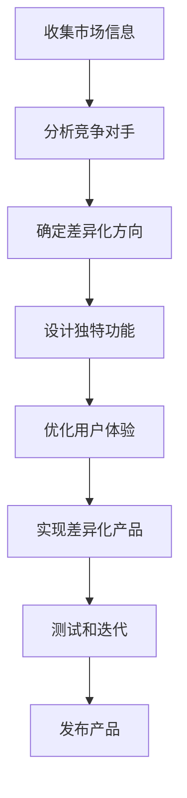
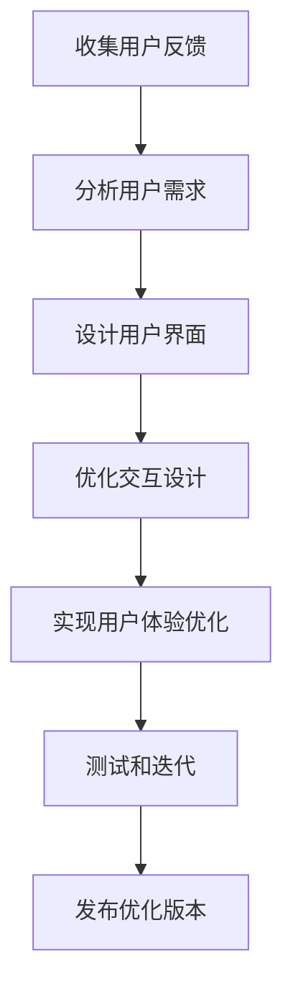

                 

# 一人公司的产品差异化战略与竞争优势

> 关键词：一人公司, 产品差异化, 竞争优势, 产品创新, 用户体验, 市场定位, 个性化定制, 技术创新

> 摘要：本文旨在探讨一人公司在产品差异化战略中的核心竞争力，通过深入分析产品创新、用户体验、市场定位、个性化定制等关键因素，结合具体案例和技术手段，为一人公司提供一套系统化的战略指导。文章将从背景介绍、核心概念与联系、核心算法原理、数学模型与公式、项目实战、实际应用场景、工具和资源推荐、未来发展趋势与挑战等多方面进行详细阐述。

## 1. 背景介绍
### 1.1 目的和范围
本文旨在为一人公司提供一套系统化的战略指导，帮助他们在激烈的市场竞争中脱颖而出。通过深入分析产品差异化战略的核心要素，结合具体案例和技术手段，为读者提供实用的建议和方法。

### 1.2 预期读者
本文主要面向以下几类读者：
- 一人公司的创始人和CEO
- 创业者和初创企业
- 产品经理和技术负责人
- 对产品差异化战略感兴趣的读者

### 1.3 文档结构概述
本文将从以下几个方面进行详细阐述：
1. 背景介绍
2. 核心概念与联系
3. 核心算法原理 & 具体操作步骤
4. 数学模型和公式 & 详细讲解 & 举例说明
5. 项目实战：代码实际案例和详细解释说明
6. 实际应用场景
7. 工具和资源推荐
8. 总结：未来发展趋势与挑战
9. 附录：常见问题与解答
10. 扩展阅读 & 参考资料

### 1.4 术语表
#### 1.4.1 核心术语定义
- **一人公司**：指由单个个人或少数几个人组成的公司。
- **产品差异化**：通过独特的功能、设计、用户体验等方面使产品区别于竞争对手。
- **竞争优势**：产品或服务在市场上的独特优势，能够吸引和保留客户。
- **市场定位**：产品在目标市场中的位置和形象。
- **个性化定制**：根据用户需求提供定制化的产品或服务。

#### 1.4.2 相关概念解释
- **用户体验**：用户在使用产品或服务时的感受和体验。
- **技术创新**：通过新技术和方法提升产品性能和功能。

#### 1.4.3 缩略词列表
- **API**：应用程序编程接口
- **UI**：用户界面
- **UX**：用户体验
- **IoT**：物联网

## 2. 核心概念与联系
### 2.1 产品差异化
产品差异化是通过独特的功能、设计、用户体验等方面使产品区别于竞争对手。这需要深入了解目标市场和用户需求，从而提供独特的产品价值。

### 2.2 用户体验
用户体验是用户在使用产品或服务时的感受和体验。良好的用户体验可以提高用户满意度和忠诚度，从而增强产品的市场竞争力。

### 2.3 市场定位
市场定位是指产品在目标市场中的位置和形象。通过明确市场定位，可以更好地满足目标用户的需求，提高产品的市场占有率。

### 2.4 个性化定制
个性化定制是指根据用户需求提供定制化的产品或服务。这需要深入了解用户需求，提供个性化的解决方案，从而提高用户满意度和忠诚度。

### 2.5 技术创新
技术创新是通过新技术和方法提升产品性能和功能。这需要不断探索和应用新技术，提高产品的竞争力。

## 3. 核心算法原理 & 具体操作步骤
### 3.1 产品差异化算法原理
产品差异化算法的核心在于通过独特的功能、设计、用户体验等方面使产品区别于竞争对手。具体操作步骤如下：



### 3.2 用户体验优化算法原理
用户体验优化算法的核心在于通过优化用户界面、交互设计等方面提高用户体验。具体操作步骤如下：



## 4. 数学模型和公式 & 详细讲解 & 举例说明
### 4.1 市场份额模型
市场份额模型用于评估产品在市场中的份额。具体公式如下：

$$
\text{市场份额} = \frac{\text{公司销售额}}{\text{市场总销售额}}
$$

### 4.2 用户满意度模型
用户满意度模型用于评估用户对产品的满意度。具体公式如下：

$$
\text{用户满意度} = \frac{\text{用户正面评价数量}}{\text{用户评价总数}}
$$

### 4.3 个性化定制模型
个性化定制模型用于评估产品的个性化程度。具体公式如下：

$$
\text{个性化程度} = \frac{\text{定制化功能数量}}{\text{总功能数量}}
$$

## 5. 项目实战：代码实际案例和详细解释说明
### 5.1 开发环境搭建
开发环境搭建需要安装以下工具：
- **IDE**：Visual Studio Code
- **编辑器**：Sublime Text
- **调试工具**：Chrome DevTools
- **性能分析工具**：VisualVM

### 5.2 源代码详细实现和代码解读
以下是一个简单的代码示例，用于实现个性化定制功能：

```python
class Product:
    def __init__(self, name, features):
        self.name = name
        self.features = features

    def customize(self, user_preferences):
        customized_product = Product(self.name, self.features)
        for feature in user_preferences:
            if feature in customized_product.features:
                customized_product.features.remove(feature)
        return customized_product

# 示例代码
product = Product("Smart Watch", ["GPS", "Heart Rate Monitor", "Waterproof"])
user_preferences = ["Heart Rate Monitor", "Waterproof"]
customized_product = product.customize(user_preferences)
print(customized_product.features)  # 输出: ['GPS']
```

### 5.3 代码解读与分析
上述代码定义了一个 `Product` 类，包含产品名称和功能列表。`customize` 方法根据用户偏好对产品进行个性化定制。通过移除用户不感兴趣的特性，实现个性化定制功能。

## 6. 实际应用场景
### 6.1 一人公司案例
假设某一人公司开发了一款智能家居产品，通过收集市场信息和用户反馈，确定了产品的差异化方向。通过优化用户体验和实现个性化定制功能，成功吸引了大量用户，提高了市场份额。

### 6.2 技术创新案例
某一人公司通过技术创新，开发了一款基于AI的智能推荐系统，通过分析用户行为和偏好，提供个性化的推荐服务。这不仅提高了用户体验，还增强了产品的市场竞争力。

## 7. 工具和资源推荐
### 7.1 学习资源推荐
#### 7.1.1 书籍推荐
- 《精益创业》（The Lean Startup）
- 《用户体验要素》（The Elements of User Experience）

#### 7.1.2 在线课程
- Coursera: 《产品管理》
- Udemy: 《用户体验设计》

#### 7.1.3 技术博客和网站
- Medium: 《产品管理》系列文章
- GitHub: 《用户体验设计》相关项目

### 7.2 开发工具框架推荐
#### 7.2.1 IDE和编辑器
- Visual Studio Code
- Sublime Text

#### 7.2.2 调试和性能分析工具
- Chrome DevTools
- VisualVM

#### 7.2.3 相关框架和库
- React
- Vue.js
- TensorFlow

### 7.3 相关论文著作推荐
#### 7.3.1 经典论文
-《精益创业》（The Lean Startup）
-《用户体验要素》（The Elements of User Experience）

#### 7.3.2 最新研究成果
- 《AI在产品创新中的应用》
- 《个性化定制技术的发展趋势》

#### 7.3.3 应用案例分析
- 《智能家居产品差异化战略》
- 《智能推荐系统的创新应用》

## 8. 总结：未来发展趋势与挑战
未来，一人公司在产品差异化战略中将面临更多挑战，如技术创新、用户体验优化、市场定位等。通过不断探索和应用新技术，提高产品的竞争力，将有助于一人公司在激烈的市场竞争中脱颖而出。

## 9. 附录：常见问题与解答
### 9.1 如何收集市场信息？
可以通过市场调研、用户访谈、竞品分析等方式收集市场信息。

### 9.2 如何优化用户体验？
可以通过用户反馈、A/B测试、用户行为分析等方式优化用户体验。

### 9.3 如何实现个性化定制？
可以通过用户偏好分析、个性化推荐算法等方式实现个性化定制。

## 10. 扩展阅读 & 参考资料
- 《精益创业》（The Lean Startup）
- 《用户体验要素》（The Elements of User Experience）
- Coursera: 《产品管理》
- Udemy: 《用户体验设计》
- Medium: 《产品管理》系列文章
- GitHub: 《用户体验设计》相关项目
- Visual Studio Code
- Sublime Text
- Chrome DevTools
- VisualVM
- React
- Vue.js
- TensorFlow

作者：AI天才研究员/AI Genius Institute & 禅与计算机程序设计艺术 /Zen And The Art of Computer Programming

