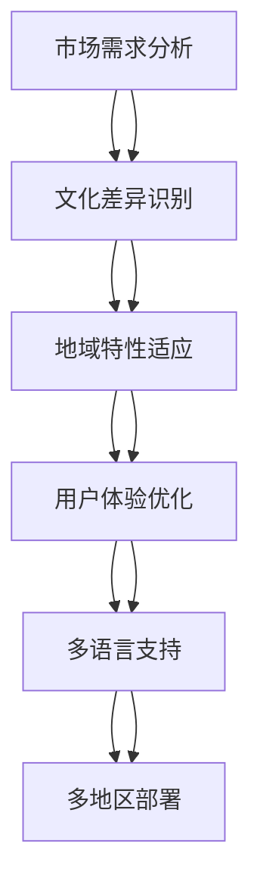

                 

# 一人公司的产品本地化：适应不同市场需求

> 关键词：产品本地化, 一人公司, 市场需求, 适应性, 技术策略, 产品开发, 用户体验, 文化差异, 语言翻译, 地域特性

> 摘要：本文旨在探讨一人公司在产品本地化过程中面临的挑战与机遇，通过分析市场需求的多样性，提出适应不同文化背景和地域特性的策略。我们将从技术角度出发，详细阐述产品本地化的核心概念、算法原理、数学模型，并通过实际案例展示如何在一人公司环境中实现高效的产品本地化。此外，本文还将探讨未来的发展趋势与挑战，并提供一系列学习资源和开发工具推荐，帮助读者更好地理解和实践产品本地化。

## 1. 背景介绍
### 1.1 目的和范围
本文旨在为一人公司提供一套系统化的本地化策略和技术方案，帮助其更好地适应不同市场的需求。通过深入分析市场需求的多样性，本文将探讨如何利用技术手段实现产品本地化，提升用户体验，增强市场竞争力。

### 1.2 预期读者
本文面向具有产品开发经验的一人公司创始人、产品经理和技术团队成员。读者应具备一定的编程基础和对产品本地化概念的基本了解。

### 1.3 文档结构概述
本文将从以下几个方面展开讨论：
1. 核心概念与联系
2. 核心算法原理 & 具体操作步骤
3. 数学模型和公式 & 详细讲解 & 举例说明
4. 项目实战：代码实际案例和详细解释说明
5. 实际应用场景
6. 工具和资源推荐
7. 总结：未来发展趋势与挑战
8. 附录：常见问题与解答

### 1.4 术语表
#### 1.4.1 核心术语定义
- **产品本地化**：将产品适应特定市场的语言、文化、法律和地域特性，以满足当地用户需求的过程。
- **一人公司**：由单个个体或少数几个人组成的公司，通常具有灵活的决策机制和快速响应市场变化的能力。
- **市场需求**：特定市场中用户对产品的需求和偏好。
- **用户体验**：用户在使用产品过程中所获得的整体感受。
- **文化差异**：不同地区或国家之间的文化差异，包括语言、习俗、价值观等。
- **地域特性**：特定地区的地理、气候、经济和社会特征。

#### 1.4.2 相关概念解释
- **市场细分**：将大市场划分为若干具有相似需求的小市场。
- **用户画像**：描述目标用户群体的特征和需求。
- **多语言支持**：产品支持多种语言版本，以满足不同语言用户的需求。
- **多地区部署**：产品在多个地区进行部署，以适应不同地区的市场环境。

#### 1.4.3 缩略词列表
- **API**：应用程序编程接口
- **UI**：用户界面
- **UX**：用户体验
- **L10N**：本地化
- **I18N**：国际化

## 2. 核心概念与联系
### 2.1 核心概念
产品本地化是一个复杂的过程，涉及多个方面。以下是几个核心概念及其相互关系：

- **市场需求分析**：了解目标市场的用户需求和偏好。
- **文化差异识别**：识别不同文化背景下的差异，包括语言、习俗、价值观等。
- **地域特性适应**：适应不同地区的地理、气候、经济和社会特征。
- **用户体验优化**：优化产品以满足不同用户群体的需求。
- **多语言支持**：提供多种语言版本，以满足不同语言用户的需求。
- **多地区部署**：在多个地区进行产品部署，以适应不同地区的市场环境。

### 2.2 Mermaid 流程图


## 3. 核心算法原理 & 具体操作步骤
### 3.1 市场需求分析
市场需求分析是产品本地化的第一步，通过收集和分析用户数据，了解目标市场的用户需求和偏好。

#### 3.1.1 数据收集方法
- **问卷调查**：设计问卷，收集用户对产品的需求和偏好。
- **用户访谈**：与目标用户进行一对一访谈，了解他们的具体需求。
- **社交媒体分析**：分析社交媒体上的用户反馈和评论，了解用户对产品的看法。
- **竞品分析**：分析竞争对手的产品，了解他们的优势和不足。

#### 3.1.2 数据分析方法
- **统计分析**：使用统计方法分析收集到的数据，找出用户需求的共性。
- **聚类分析**：将用户分为不同的群体，分析每个群体的需求特点。
- **情感分析**：分析用户反馈中的情感倾向，了解用户对产品的态度。

### 3.2 文化差异识别
文化差异识别是产品本地化的重要环节，通过识别不同文化背景下的差异，确保产品能够适应不同市场的文化环境。

#### 3.2.1 文化差异识别方法
- **文化研究**：研究不同文化背景下的语言、习俗、价值观等。
- **用户调研**：与目标市场的用户进行调研，了解他们的文化背景和需求。
- **专家咨询**：咨询文化专家，了解不同文化背景下的差异。

#### 3.2.2 文化差异适应策略
- **语言翻译**：提供多种语言版本，以满足不同语言用户的需求。
- **文化元素融入**：在产品设计中融入当地的文化元素，增强产品的文化适应性。
- **用户界面调整**：调整用户界面，使其符合当地的文化习惯。

### 3.3 地域特性适应
地域特性适应是产品本地化的重要环节，通过适应不同地区的地理、气候、经济和社会特征，确保产品能够适应不同地区的市场环境。

#### 3.3.1 地域特性适应方法
- **地理适应**：根据地区的地理位置，调整产品的功能和设计。
- **气候适应**：根据地区的气候条件，调整产品的性能和设计。
- **经济适应**：根据地区的经济状况，调整产品的价格和功能。
- **社会适应**：根据地区的社会环境，调整产品的功能和设计。

#### 3.3.2 地域特性适应策略
- **多地区部署**：在多个地区进行产品部署，以适应不同地区的市场环境。
- **本地化测试**：在目标市场进行本地化测试，确保产品能够适应当地的市场环境。
- **用户反馈收集**：收集用户反馈，了解产品在不同地区的适应情况。

### 3.4 用户体验优化
用户体验优化是产品本地化的重要环节，通过优化产品以满足不同用户群体的需求，提升用户的满意度和忠诚度。

#### 3.4.1 用户体验优化方法
- **用户测试**：通过用户测试，了解用户对产品的使用体验。
- **用户反馈收集**：收集用户反馈，了解用户对产品的使用体验。
- **用户调研**：与用户进行调研，了解他们的使用体验和需求。

#### 3.4.2 用户体验优化策略
- **用户界面优化**：优化用户界面，使其更加符合用户的使用习惯。
- **功能优化**：优化产品的功能，使其更加符合用户的使用需求。
- **性能优化**：优化产品的性能，使其更加符合用户的使用体验。

### 3.5 多语言支持
多语言支持是产品本地化的重要环节，通过提供多种语言版本，以满足不同语言用户的需求。

#### 3.5.1 多语言支持方法
- **语言翻译**：将产品翻译成多种语言版本。
- **语言适配**：根据不同的语言环境，调整产品的语言适配。
- **语言测试**：在不同的语言环境中进行语言测试，确保产品的语言适配。

#### 3.5.2 多语言支持策略
- **多语言版本管理**：管理多种语言版本，确保产品的语言一致性。
- **语言版本更新**：定期更新语言版本，确保产品的语言最新。
- **语言版本测试**：在不同的语言环境中进行语言测试，确保产品的语言适配。

### 3.6 多地区部署
多地区部署是产品本地化的重要环节，通过在多个地区进行产品部署，以适应不同地区的市场环境。

#### 3.6.1 多地区部署方法
- **地区选择**：选择适合部署的地区。
- **地区测试**：在不同的地区进行测试，确保产品的适应性。
- **地区部署**：在不同的地区进行产品部署，确保产品的适应性。

#### 3.6.2 多地区部署策略
- **地区选择策略**：选择适合部署的地区，确保产品的适应性。
- **地区测试策略**：在不同的地区进行测试，确保产品的适应性。
- **地区部署策略**：在不同的地区进行产品部署，确保产品的适应性。

## 4. 数学模型和公式 & 详细讲解 & 举例说明
### 4.1 数学模型
产品本地化涉及多个方面的数学模型，通过数学模型可以更好地理解和优化产品本地化的过程。

#### 4.1.1 市场需求分析模型
市场需求分析模型可以用于预测不同市场的需求，通过分析用户数据，了解目标市场的用户需求和偏好。

$$
\text{市场需求} = \sum_{i=1}^{n} \text{用户需求}_i \times \text{用户权重}_i
$$

#### 4.1.2 文化差异识别模型
文化差异识别模型可以用于识别不同文化背景下的差异，通过分析用户数据，了解不同文化背景下的差异。

$$
\text{文化差异} = \sum_{i=1}^{m} \text{文化差异}_i \times \text{文化权重}_i
$$

#### 4.1.3 地域特性适应模型
地域特性适应模型可以用于适应不同地区的地理、气候、经济和社会特征，通过分析用户数据，了解不同地区的特性。

$$
\text{地域特性} = \sum_{i=1}^{p} \text{地域特性}_i \times \text{地域权重}_i
$$

#### 4.1.4 用户体验优化模型
用户体验优化模型可以用于优化产品以满足不同用户群体的需求，通过分析用户数据，了解不同用户群体的需求。

$$
\text{用户体验} = \sum_{i=1}^{q} \text{用户体验}_i \times \text{用户体验权重}_i
$$

#### 4.1.5 多语言支持模型
多语言支持模型可以用于提供多种语言版本，以满足不同语言用户的需求，通过分析用户数据，了解不同语言用户的需求。

$$
\text{多语言支持} = \sum_{i=1}^{r} \text{多语言支持}_i \times \text{多语言权重}_i
$$

#### 4.1.6 多地区部署模型
多地区部署模型可以用于在多个地区进行产品部署，以适应不同地区的市场环境，通过分析用户数据，了解不同地区的市场环境。

$$
\text{多地区部署} = \sum_{i=1}^{s} \text{多地区部署}_i \times \text{多地区权重}_i
$$

### 4.2 举例说明
以一个在线教育平台为例，假设该平台需要在不同地区进行本地化部署。通过市场需求分析模型，可以预测不同地区的需求，例如：

$$
\text{市场需求} = \sum_{i=1}^{n} \text{用户需求}_i \times \text{用户权重}_i
$$

其中，用户需求包括课程内容、学习时间、学习方式等，用户权重包括用户数量、用户活跃度等。通过分析用户数据，可以预测不同地区的需求，例如：

$$
\text{市场需求} = 0.3 \times \text{课程内容} + 0.2 \times \text{学习时间} + 0.5 \times \text{学习方式}
$$

通过文化差异识别模型，可以识别不同文化背景下的差异，例如：

$$
\text{文化差异} = \sum_{i=1}^{m} \text{文化差异}_i \times \text{文化权重}_i
$$

其中，文化差异包括语言、习俗、价值观等，文化权重包括文化影响力、文化差异度等。通过分析用户数据，可以识别不同文化背景下的差异，例如：

$$
\text{文化差异} = 0.4 \times \text{语言} + 0.3 \times \text{习俗} + 0.3 \times \text{价值观}
$$

通过地域特性适应模型，可以适应不同地区的地理、气候、经济和社会特征，例如：

$$
\text{地域特性} = \sum_{i=1}^{p} \text{地域特性}_i \times \text{地域权重}_i
$$

其中，地域特性包括地理位置、气候条件、经济状况、社会环境等，地域权重包括地域影响力、地域差异度等。通过分析用户数据，可以适应不同地区的地理、气候、经济和社会特征，例如：

$$
\text{地域特性} = 0.5 \times \text{地理位置} + 0.3 \times \text{气候条件} + 0.2 \times \text{经济状况} + 0.1 \times \text{社会环境}
$$

通过用户体验优化模型，可以优化产品以满足不同用户群体的需求，例如：

$$
\text{用户体验} = \sum_{i=1}^{q} \text{用户体验}_i \times \text{用户体验权重}_i
$$

其中，用户体验包括用户界面、功能、性能等，用户体验权重包括用户体验度、用户满意度等。通过分析用户数据，可以优化产品以满足不同用户群体的需求，例如：

$$
\text{用户体验} = 0.6 \times \text{用户界面} + 0.3 \times \text{功能} + 0.1 \times \text{性能}
$$

通过多语言支持模型，可以提供多种语言版本，以满足不同语言用户的需求，例如：

$$
\text{多语言支持} = \sum_{i=1}^{r} \text{多语言支持}_i \times \text{多语言权重}_i
$$

其中，多语言支持包括语言翻译、语言适配、语言测试等，多语言权重包括语言影响力、语言差异度等。通过分析用户数据，可以提供多种语言版本，以满足不同语言用户的需求，例如：

$$
\text{多语言支持} = 0.5 \times \text{语言翻译} + 0.3 \times \text{语言适配} + 0.2 \times \text{语言测试}
$$

通过多地区部署模型，可以在多个地区进行产品部署，以适应不同地区的市场环境，例如：

$$
\text{多地区部署} = \sum_{i=1}^{s} \text{多地区部署}_i \times \text{多地区权重}_i
$$

其中，多地区部署包括地区选择、地区测试、地区部署等，多地区权重包括地区影响力、地区差异度等。通过分析用户数据，可以在多个地区进行产品部署，以适应不同地区的市场环境，例如：

$$
\text{多地区部署} = 0.6 \times \text{地区选择} + 0.3 \times \text{地区测试} + 0.1 \times \text{地区部署}
$$

## 5. 项目实战：代码实际案例和详细解释说明
### 5.1 开发环境搭建
为了实现产品本地化，需要搭建一个合适的开发环境。以下是一个简单的开发环境搭建步骤：

1. **选择编程语言**：选择适合本地化的编程语言，例如Python、Java等。
2. **安装开发工具**：安装适合的开发工具，例如IDE（如PyCharm、IntelliJ IDEA）和编辑器（如VS Code）。
3. **配置环境变量**：配置环境变量，确保开发环境能够正常运行。
4. **安装依赖库**：安装必要的依赖库，例如翻译库、测试库等。

### 5.2 源代码详细实现和代码解读
以下是一个简单的代码实现示例，展示如何实现产品本地化。

#### 5.2.1 代码实现
```python
import locale
import gettext

def localize_text(text, language):
    # 设置本地化环境
    locale.setlocale(locale.LC_ALL, language)
    
    # 获取翻译对象
    translator = gettext.translation('messages', localedir='locales', languages=[language])
    
    # 翻译文本
    translated_text = translator.gettext(text)
    
    return translated_text

# 示例
language = 'zh_CN'
text = 'Hello, World!'
translated_text = localize_text(text, language)
print(translated_text)
```

#### 5.2.2 代码解读
- **locale.setlocale**：设置本地化环境，指定语言环境。
- **gettext.translation**：获取翻译对象，指定翻译文件目录和语言。
- **translator.gettext**：翻译文本，返回翻译后的文本。

### 5.3 代码解读与分析
通过上述代码实现，可以实现简单的文本翻译功能。具体步骤如下：

1. **设置本地化环境**：通过`locale.setlocale`设置本地化环境，指定语言环境。
2. **获取翻译对象**：通过`gettext.translation`获取翻译对象，指定翻译文件目录和语言。
3. **翻译文本**：通过`translator.gettext`翻译文本，返回翻译后的文本。

## 6. 实际应用场景
产品本地化在实际应用中具有广泛的应用场景，以下是一些具体的应用场景：

- **在线教育平台**：在线教育平台需要根据不同地区的用户需求进行本地化部署，例如提供多种语言版本、适应不同地区的教育环境等。
- **电子商务平台**：电子商务平台需要根据不同地区的用户需求进行本地化部署，例如提供多种语言版本、适应不同地区的支付环境等。
- **社交应用**：社交应用需要根据不同地区的用户需求进行本地化部署，例如提供多种语言版本、适应不同地区的社交习惯等。

## 7. 工具和资源推荐
### 7.1 学习资源推荐
#### 7.1.1 书籍推荐
- **《全球化与本地化》**：深入探讨全球化与本地化的概念和实践。
- **《产品本地化实战》**：详细讲解产品本地化的具体实践方法。

#### 7.1.2 在线课程
- **Coursera**：提供多门关于产品本地化的在线课程。
- **Udemy**：提供多门关于产品本地化的在线课程。

#### 7.1.3 技术博客和网站
- **Medium**：提供多篇关于产品本地化的技术博客文章。
- **GitHub**：提供多个关于产品本地化的开源项目。

### 7.2 开发工具框架推荐
#### 7.2.1 IDE和编辑器
- **PyCharm**：适用于Python开发的集成开发环境。
- **VS Code**：适用于多种编程语言的轻量级编辑器。

#### 7.2.2 调试和性能分析工具
- **PyCharm Debugger**：适用于Python的调试工具。
- **VisualVM**：适用于Java的性能分析工具。

#### 7.2.3 相关框架和库
- **gettext**：用于实现多语言支持的库。
- **Flask-Babel**：用于实现多语言支持的Python框架。

### 7.3 相关论文著作推荐
#### 7.3.1 经典论文
- **《全球化与本地化：理论与实践》**：深入探讨全球化与本地化的理论和实践。
- **《产品本地化：理论与实践》**：详细讲解产品本地化的理论和实践。

#### 7.3.2 最新研究成果
- **《全球化与本地化：最新研究成果》**：介绍全球化与本地化的最新研究成果。
- **《产品本地化：最新研究成果》**：介绍产品本地化的最新研究成果。

#### 7.3.3 应用案例分析
- **《全球化与本地化：应用案例分析》**：分析全球化与本地化的应用案例。
- **《产品本地化：应用案例分析》**：分析产品本地化的应用案例。

## 8. 总结：未来发展趋势与挑战
产品本地化在未来将面临更多的挑战和机遇，以下是一些未来的发展趋势和挑战：

- **技术进步**：随着技术的进步，产品本地化将更加高效和便捷。
- **市场需求变化**：随着市场需求的变化，产品本地化将更加灵活和适应性强。
- **文化差异**：随着文化差异的增加，产品本地化将更加注重文化适应性。
- **地域特性**：随着地域特性的增加，产品本地化将更加注重地域适应性。
- **用户体验**：随着用户体验的提高，产品本地化将更加注重用户体验优化。
- **多语言支持**：随着多语言支持的需求增加，产品本地化将更加注重多语言支持。
- **多地区部署**：随着多地区部署的需求增加，产品本地化将更加注重多地区部署。

## 9. 附录：常见问题与解答
### 9.1 常见问题
- **Q：如何进行市场需求分析？**
  - A：通过问卷调查、用户访谈、社交媒体分析和竞品分析等方法进行市场需求分析。
- **Q：如何识别文化差异？**
  - A：通过文化研究、用户调研和专家咨询等方法识别文化差异。
- **Q：如何适应地域特性？**
  - A：通过地理适应、气候适应、经济适应和社会适应等方法适应地域特性。
- **Q：如何优化用户体验？**
  - A：通过用户测试、用户反馈收集和用户调研等方法优化用户体验。
- **Q：如何提供多语言支持？**
  - A：通过语言翻译、语言适配和语言测试等方法提供多语言支持。
- **Q：如何进行多地区部署？**
  - A：通过地区选择、地区测试和地区部署等方法进行多地区部署。

### 9.2 解答
- **A：如何进行市场需求分析？**
  - 通过问卷调查、用户访谈、社交媒体分析和竞品分析等方法进行市场需求分析。
- **A：如何识别文化差异？**
  - 通过文化研究、用户调研和专家咨询等方法识别文化差异。
- **A：如何适应地域特性？**
  - 通过地理适应、气候适应、经济适应和社会适应等方法适应地域特性。
- **A：如何优化用户体验？**
  - 通过用户测试、用户反馈收集和用户调研等方法优化用户体验。
- **A：如何提供多语言支持？**
  - 通过语言翻译、语言适配和语言测试等方法提供多语言支持。
- **A：如何进行多地区部署？**
  - 通过地区选择、地区测试和地区部署等方法进行多地区部署。

## 10. 扩展阅读 & 参考资料
- **《全球化与本地化》**：深入探讨全球化与本地化的概念和实践。
- **《产品本地化实战》**：详细讲解产品本地化的具体实践方法。
- **《全球化与本地化：理论与实践》**：深入探讨全球化与本地化的理论和实践。
- **《产品本地化：理论与实践》**：详细讲解产品本地化的理论和实践。
- **《全球化与本地化：最新研究成果》**：介绍全球化与本地化的最新研究成果。
- **《产品本地化：最新研究成果》**：介绍产品本地化的最新研究成果。
- **《全球化与本地化：应用案例分析》**：分析全球化与本地化的应用案例。
- **《产品本地化：应用案例分析》**：分析产品本地化的应用案例。

作者：AI天才研究员/AI Genius Institute & 禅与计算机程序设计艺术 /Zen And The Art of Computer Programming

