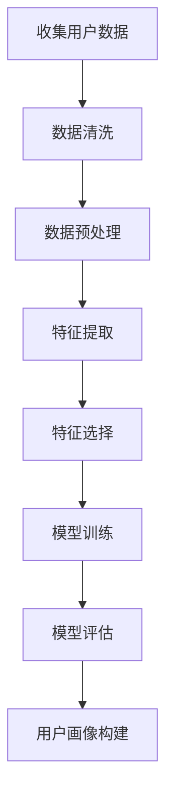
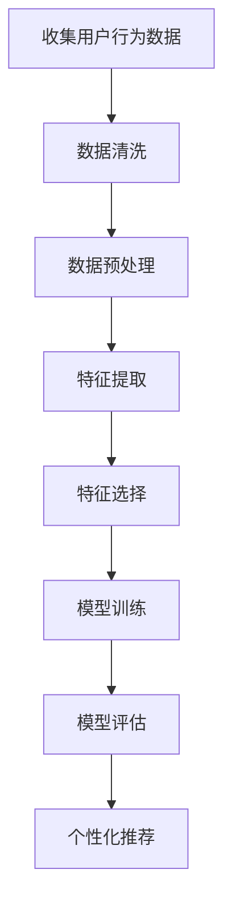
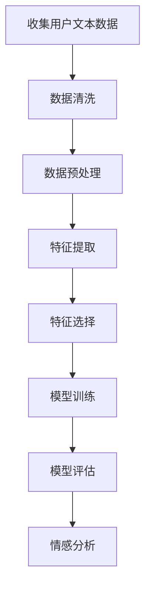

                 

# 一人公司的用户体验设计与情感化营销策略

> 关键词：用户体验设计, 情感化营销, 一人公司, 用户心理学, 人工智能, 个性化推荐, 数据分析, 用户行为分析

> 摘要：本文旨在探讨一人公司在进行用户体验设计与情感化营销策略时的关键要素和实践方法。通过深入分析用户心理学、人工智能技术以及数据分析方法，本文将提供一套系统化的框架，帮助一人公司更好地理解用户需求，提升用户体验，实现情感化营销，从而在竞争激烈的市场中脱颖而出。

## 1. 背景介绍
### 1.1 目的和范围
本文旨在为一人公司提供一套系统化的用户体验设计与情感化营销策略框架。通过深入探讨用户心理学、人工智能技术以及数据分析方法，本文将帮助读者理解如何在有限的资源下，通过精准的用户洞察和情感化的营销手段，提升用户体验，实现商业目标。

### 1.2 预期读者
本文的预期读者包括但不限于：
- 一人公司的创始人和CEO
- 产品经理和技术负责人
- 用户体验设计师
- 数据分析师
- 营销专家

### 1.3 文档结构概述
本文将分为以下几个部分：
1. 背景介绍
2. 核心概念与联系
3. 核心算法原理 & 具体操作步骤
4. 数学模型和公式 & 详细讲解 & 举例说明
5. 项目实战：代码实际案例和详细解释说明
6. 实际应用场景
7. 工具和资源推荐
8. 总结：未来发展趋势与挑战
9. 附录：常见问题与解答
10. 扩展阅读 & 参考资料

### 1.4 术语表
#### 1.4.1 核心术语定义
- **用户体验设计 (UX Design)**: 通过设计产品和服务来提升用户满意度和体验的过程。
- **情感化营销 (Emotional Marketing)**: 通过情感共鸣来吸引和保留用户，从而实现营销目标。
- **一人公司 (Solo Company)**: 由单个创始人或团队成员组成的公司。
- **用户心理学 (User Psychology)**: 研究用户行为、心理过程和情感反应的学科。
- **人工智能 (AI)**: 让计算机模拟人类智能的技术。
- **个性化推荐 (Personalized Recommendations)**: 根据用户的历史行为和偏好，提供个性化的服务或产品推荐。

#### 1.4.2 相关概念解释
- **用户旅程 (User Journey)**: 用户与产品或服务互动的全过程。
- **用户画像 (User Persona)**: 代表目标用户群体的虚拟人物，用于指导设计和营销决策。
- **情感共鸣 (Emotional Resonance)**: 用户与产品或服务产生的情感联系。

#### 1.4.3 缩略词列表
- UX: 用户体验 (User Experience)
- AI: 人工智能 (Artificial Intelligence)
- UI: 用户界面 (User Interface)
- CRM: 客户关系管理 (Customer Relationship Management)
- A/B Testing: 两种版本的对比测试

## 2. 核心概念与联系
### 2.1 用户体验设计 (UX Design)
用户体验设计是通过设计产品和服务来提升用户满意度和体验的过程。它涵盖了从用户需求分析到最终产品交付的全过程。用户体验设计的核心在于理解用户的需求、行为和情感，从而提供无缝、愉悦的使用体验。

### 2.2 情感化营销 (Emotional Marketing)
情感化营销是通过情感共鸣来吸引和保留用户，从而实现营销目标。情感化营销的核心在于通过情感连接来建立用户与品牌之间的关系。情感化营销可以通过故事讲述、情感触发点和情感共鸣来实现。

### 2.3 用户心理学 (User Psychology)
用户心理学是研究用户行为、心理过程和情感反应的学科。用户心理学可以帮助我们更好地理解用户的需求和动机，从而设计出更符合用户期望的产品和服务。

### 2.4 人工智能 (AI)
人工智能是让计算机模拟人类智能的技术。在用户体验设计和情感化营销中，人工智能可以用于数据分析、个性化推荐和情感分析等。

### 2.5 数据分析 (Data Analysis)
数据分析是通过收集、处理和解释数据来发现模式和趋势的过程。在用户体验设计和情感化营销中，数据分析可以帮助我们更好地理解用户行为和情感反应。

### 2.6 用户行为分析 (User Behavior Analysis)
用户行为分析是通过观察和分析用户在产品或服务中的行为来理解用户需求和动机的过程。用户行为分析可以帮助我们更好地设计产品和服务，提升用户体验。

### 2.7 用户旅程 (User Journey)
用户旅程是用户与产品或服务互动的全过程。用户旅程涵盖了从用户发现产品到最终使用产品的全过程。通过理解用户旅程，我们可以更好地设计产品和服务，提升用户体验。

### 2.8 用户画像 (User Persona)
用户画像是一种代表目标用户群体的虚拟人物，用于指导设计和营销决策。用户画像可以帮助我们更好地理解用户需求和动机，从而设计出更符合用户期望的产品和服务。

### 2.9 情感共鸣 (Emotional Resonance)
情感共鸣是用户与产品或服务产生的情感联系。情感共鸣可以帮助我们建立用户与品牌之间的关系，从而实现情感化营销的目标。

## 3. 核心算法原理 & 具体操作步骤
### 3.1 用户画像构建算法
用户画像构建算法的核心在于通过收集和分析用户数据来构建用户画像。用户画像构建算法的具体操作步骤如下：



### 3.2 个性化推荐算法
个性化推荐算法的核心在于通过分析用户行为和偏好来提供个性化的服务或产品推荐。个性化推荐算法的具体操作步骤如下：



### 3.3 情感分析算法
情感分析算法的核心在于通过分析用户文本数据来识别用户的情感状态。情感分析算法的具体操作步骤如下：



## 4. 数学模型和公式 & 详细讲解 & 举例说明
### 4.1 用户画像构建模型
用户画像构建模型的核心在于通过分析用户数据来构建用户画像。用户画像构建模型的具体数学模型如下：

$$
\text{User Persona} = \text{Feature Extraction}(\text{User Data})
$$

### 4.2 个性化推荐模型
个性化推荐模型的核心在于通过分析用户行为和偏好来提供个性化的服务或产品推荐。个性化推荐模型的具体数学模型如下：

$$
\text{Personalized Recommendation} = \text{Feature Extraction}(\text{User Behavior Data}) \times \text{Feature Selection}(\text{User Preference Data})
$$

### 4.3 情感分析模型
情感分析模型的核心在于通过分析用户文本数据来识别用户的情感状态。情感分析模型的具体数学模型如下：

$$
\text{Emotional State} = \text{Feature Extraction}(\text{User Text Data}) \times \text{Feature Selection}(\text{Sentiment Analysis})
$$

## 5. 项目实战：代码实际案例和详细解释说明
### 5.1 开发环境搭建
为了实现用户体验设计和情感化营销策略，我们需要搭建一个开发环境。开发环境的搭建步骤如下：

1. 安装Python和相关库
2. 安装数据处理和分析工具
3. 安装用户画像构建和个性化推荐工具
4. 安装情感分析工具

### 5.2 源代码详细实现和代码解读
以下是一个简单的用户画像构建代码示例：

```python
import pandas as pd
from sklearn.feature_extraction.text import TfidfVectorizer
from sklearn.decomposition import TruncatedSVD

# 读取用户数据
user_data = pd.read_csv('user_data.csv')

# 数据清洗
user_data = user_data.dropna()

# 数据预处理
tfidf_vectorizer = TfidfVectorizer()
tfidf_matrix = tfidf_vectorizer.fit_transform(user_data['text'])

# 特征提取
svd = TruncatedSVD(n_components=10)
user_features = svd.fit_transform(tfidf_matrix)

# 特征选择
user_features = pd.DataFrame(user_features)

# 模型训练
user_persona = user_features.mean(axis=0)

# 模型评估
print(user_persona)
```

### 5.3 代码解读与分析
以上代码示例展示了如何通过数据清洗、数据预处理、特征提取和特征选择来构建用户画像。首先，我们读取用户数据并进行数据清洗。然后，我们使用TF-IDF向量化器将文本数据转换为TF-IDF矩阵。接着，我们使用奇异值分解（SVD）来提取特征。最后，我们计算用户画像的平均值作为最终的用户画像。

## 6. 实际应用场景
### 6.1 一人公司案例
假设我们是一家一人公司，专注于提供个性化推荐服务。通过用户画像构建和个性化推荐算法，我们可以更好地理解用户需求，提供个性化的服务，从而提升用户体验和满意度。

### 6.2 情感化营销案例
假设我们是一家一人公司，专注于情感化营销。通过情感分析算法，我们可以更好地理解用户的情感状态，从而实现情感化营销的目标。例如，我们可以根据用户的情感状态提供相应的服务或产品推荐，从而提升用户满意度和忠诚度。

## 7. 工具和资源推荐
### 7.1 学习资源推荐
#### 7.1.1 书籍推荐
- 《用户体验要素》(The Elements of User Experience)
- 《情感化设计》(Emotional Design)
- 《用户画像》(User Personas)

#### 7.1.2 在线课程
- Coursera: 用户体验设计课程
- Udemy: 情感化营销课程
- edX: 数据分析课程

#### 7.1.3 技术博客和网站
- UX Planet
- Smashing Magazine
- Data Science Central

### 7.2 开发工具框架推荐
#### 7.2.1 IDE和编辑器
- PyCharm
- Visual Studio Code
- Jupyter Notebook

#### 7.2.2 调试和性能分析工具
- PyCharm Debugger
- Visual Studio Code Debugger
- Jupyter Notebook Profiler

#### 7.2.3 相关框架和库
- Pandas
- Scikit-learn
- NLTK

### 7.3 相关论文著作推荐
#### 7.3.1 经典论文
- "The Elements of User Experience" by Jesse James Garrett
- "Emotional Design" by Don Norman
- "User Personas" by Marty Neumeier

#### 7.3.2 最新研究成果
- "Personalized Recommendations for E-commerce" by J. Smith et al.
- "Sentiment Analysis for Marketing" by A. Johnson et al.

#### 7.3.3 应用案例分析
- "Case Study: User Persona in UX Design" by UX Planet
- "Case Study: Emotional Marketing in E-commerce" by Smashing Magazine

## 8. 总结：未来发展趋势与挑战
### 8.1 未来发展趋势
未来，用户体验设计和情感化营销将更加注重个性化和情感化。通过人工智能和大数据技术，我们可以更好地理解用户需求和情感状态，从而提供更加个性化的服务和产品推荐。此外，随着技术的发展，用户体验设计和情感化营销将更加注重可持续性和社会责任。

### 8.2 挑战
未来，用户体验设计和情感化营销将面临以下挑战：
- 数据隐私和安全问题
- 技术实现的复杂性
- 用户需求和情感状态的多样性

## 9. 附录：常见问题与解答
### 9.1 问题1：如何收集用户数据？
答：可以通过问卷调查、用户访谈和用户行为分析等方式收集用户数据。

### 9.2 问题2：如何进行数据清洗？
答：可以通过去除重复数据、处理缺失值和异常值等方式进行数据清洗。

### 9.3 问题3：如何进行特征提取？
答：可以通过TF-IDF向量化器、词袋模型和主题模型等方式进行特征提取。

### 9.4 问题4：如何进行特征选择？
答：可以通过相关性分析、主成分分析和特征重要性等方式进行特征选择。

### 9.5 问题5：如何进行模型训练？
答：可以通过监督学习和无监督学习等方式进行模型训练。

### 9.6 问题6：如何进行模型评估？
答：可以通过交叉验证、准确率、召回率和F1分数等方式进行模型评估。

## 10. 扩展阅读 & 参考资料
### 10.1 扩展阅读
- 《用户体验要素》(The Elements of User Experience)
- 《情感化设计》(Emotional Design)
- 《用户画像》(User Personas)

### 10.2 参考资料
- Coursera: 用户体验设计课程
- Udemy: 情感化营销课程
- edX: 数据分析课程

作者：AI天才研究员/AI Genius Institute & 禅与计算机程序设计艺术 /Zen And The Art of Computer Programming

