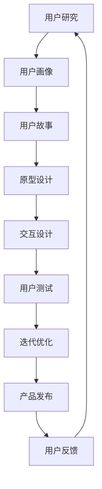
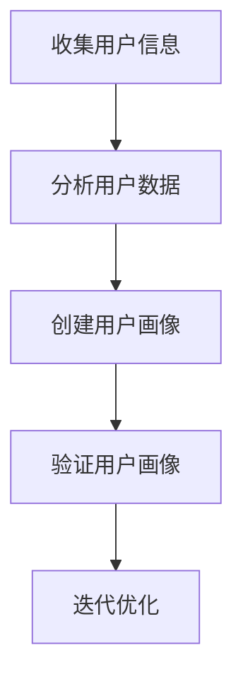
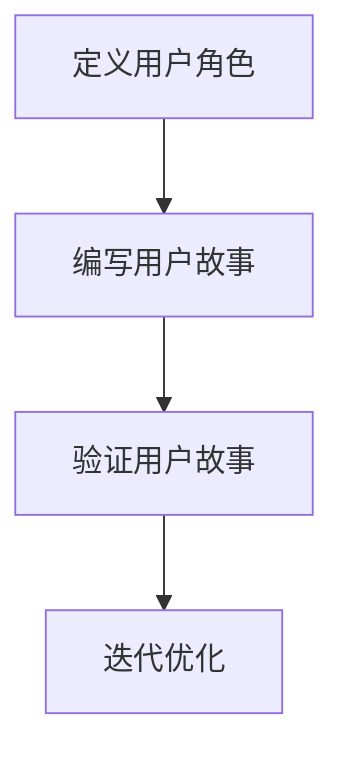
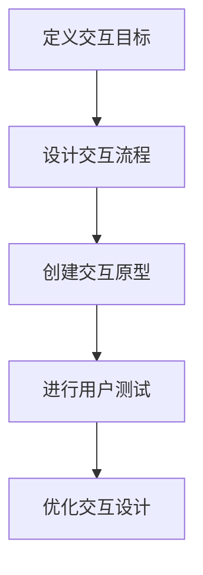

                 

# 一人公司的用户体验设计：从概念到实践

> 关键词：用户体验设计, 一人公司, 产品开发, 用户研究, 交互设计, 产品迭代, 用户反馈

> 摘要：本文旨在为一人公司提供一套从概念到实践的用户体验设计方法论。通过系统化的步骤和工具，帮助开发者从用户需求出发，设计出符合用户期望的产品。文章将详细阐述用户体验设计的核心概念、算法原理、数学模型、实战案例，并探讨未来的发展趋势与挑战。

## 1. 背景介绍
### 1.1 目的和范围
本文旨在为一人公司提供一套系统化的用户体验设计方法论，帮助开发者从用户需求出发，设计出符合用户期望的产品。本文将涵盖用户体验设计的核心概念、算法原理、数学模型、实战案例，并探讨未来的发展趋势与挑战。

### 1.2 预期读者
本文预期读者为一人公司的创始人、产品经理、设计师、开发者以及对用户体验设计感兴趣的个人。无论您是刚刚起步的创业者，还是有经验的产品经理，本文都将为您提供有价值的指导和建议。

### 1.3 文档结构概述
本文结构如下：
1. 背景介绍
2. 核心概念与联系
3. 核心算法原理 & 具体操作步骤
4. 数学模型和公式 & 详细讲解 & 举例说明
5. 项目实战：代码实际案例和详细解释说明
6. 实际应用场景
7. 工具和资源推荐
8. 总结：未来发展趋势与挑战
9. 附录：常见问题与解答
10. 扩展阅读 & 参考资料

### 1.4 术语表
#### 1.4.1 核心术语定义
- **用户体验设计 (UX Design)**: 通过研究用户需求、行为和偏好，设计出能够满足用户需求的产品。
- **用户研究 (User Research)**: 通过各种方法收集用户需求、行为和偏好信息。
- **交互设计 (Interaction Design)**: 设计用户与产品之间的交互方式。
- **原型设计 (Prototype Design)**: 通过原型展示产品设计，以便进行测试和反馈。
- **用户反馈 (User Feedback)**: 用户对产品设计和功能的反馈意见。

#### 1.4.2 相关概念解释
- **用户旅程 (User Journey)**: 描述用户从开始使用产品到结束的整个过程。
- **用户画像 (User Persona)**: 基于用户研究创建的虚拟用户角色，用于代表目标用户群体。
- **用户故事 (User Story)**: 描述用户需求的简短叙述，通常以“作为...，我想要...，以便...”的形式表达。

#### 1.4.3 缩略词列表
- UX: 用户体验
- UI: 用户界面
- MVP: 最小可行产品
- A/B 测试: 通过对比测试两种不同的设计方案，以确定哪种方案更优

## 2. 核心概念与联系
### 用户体验设计流程


### 用户研究方法
- **定量研究**: 通过问卷调查、数据分析等方法收集用户行为数据。
- **定性研究**: 通过访谈、观察等方法深入了解用户需求和偏好。
- **用户测试**: 通过原型测试收集用户反馈，评估设计方案的有效性。

## 3. 核心算法原理 & 具体操作步骤
### 用户画像创建


### 用户故事编写


### 交互设计流程


## 4. 数学模型和公式 & 详细讲解 & 举例说明
### 用户满意度模型
$$
Satisfaction = \frac{E - D}{E}
$$
- **Satisfaction**: 用户满意度
- **E**: 用户期望
- **D**: 用户实际体验

### 用户留存率模型
$$
Retention = \frac{N_t - N_{t-1}}{N_{t-1}}
$$
- **Retention**: 用户留存率
- **N_t**: 当前周期内活跃用户数
- **N_{t-1}**: 上一周期内活跃用户数

## 5. 项目实战：代码实际案例和详细解释说明
### 5.1 开发环境搭建
- **操作系统**: macOS
- **编程语言**: JavaScript
- **开发工具**: Visual Studio Code
- **版本控制**: Git

### 5.2 源代码详细实现和代码解读
```javascript
// 用户画像创建
function createUserPersona(data) {
    const persona = {
        name: "张三",
        age: 28,
        occupation: "软件工程师",
        interests: ["编程", "阅读", "旅行"]
    };
    return persona;
}

// 用户故事编写
function createUserStory(persona) {
    const story = {
        title: "作为张三，我想要一个简洁的登录界面，以便快速登录。",
        description: "张三希望登录界面简洁明了，能够快速完成登录操作。"
    };
    return story;
}

// 交互设计
function createInteractionPrototype(story) {
    const prototype = {
        title: "登录界面",
        description: "设计一个简洁的登录界面，包括用户名和密码输入框。",
        elements: [
            { type: "input", label: "用户名" },
            { type: "input", label: "密码" },
            { type: "button", label: "登录" }
        ]
    };
    return prototype;
}
```

### 5.3 代码解读与分析
- **createUserPersona**: 根据用户数据创建用户画像。
- **createUserStory**: 根据用户画像编写用户故事。
- **createInteractionPrototype**: 根据用户故事创建交互原型。

## 6. 实际应用场景
### 用户体验设计在产品开发中的应用
- **产品原型设计**: 通过原型设计工具创建产品原型，以便进行用户测试。
- **用户测试**: 通过用户测试收集反馈，优化产品设计。
- **产品迭代**: 根据用户反馈不断迭代优化产品。

## 7. 工具和资源推荐
### 7.1 学习资源推荐
#### 7.1.1 书籍推荐
- 《设计心理学》(Don Norman)
- 《用户体验要素》(Jesse James Garrett)
- 《精益创业》(Eric Ries)

#### 7.1.2 在线课程
- Coursera: 《用户体验设计》
- Udemy: 《交互设计基础》

#### 7.1.3 技术博客和网站
- Smashing Magazine
- UX Planet
- Nielsen Norman Group

### 7.2 开发工具框架推荐
#### 7.2.1 IDE和编辑器
- Visual Studio Code
- Sublime Text

#### 7.2.2 调试和性能分析工具
- Chrome DevTools
- Firefox Developer Tools

#### 7.2.3 相关框架和库
- React
- Vue.js
- Angular

### 7.3 相关论文著作推荐
#### 7.3.1 经典论文
- "The Design of Everyday Things" by Don Norman
- "The Elements of User Experience" by Jesse James Garrett

#### 7.3.2 最新研究成果
- "User Experience Design in the Age of AI" by John Maeda
- "Designing for the Digital Age" by Kim Goodwin

#### 7.3.3 应用案例分析
- "Designing for the Web" by Luke Wroblewski
- "The Design of Future User Interfaces" by Ben Shneiderman

## 8. 总结：未来发展趋势与挑战
### 未来发展趋势
- **人工智能**: 通过AI技术提升用户体验设计的智能化水平。
- **个性化设计**: 根据用户偏好提供个性化的产品设计。
- **跨平台设计**: 适应不同平台和设备的用户体验设计。

### 面临的挑战
- **数据隐私**: 如何在收集用户数据的同时保护用户隐私。
- **技术限制**: 如何在有限的技术条件下实现高质量的用户体验设计。
- **用户需求变化**: 如何快速响应用户需求的变化，提供持续优化的产品。

## 9. 附录：常见问题与解答
### 常见问题
- **Q: 用户研究的方法有哪些？**
  - A: 用户研究的方法包括定量研究（问卷调查、数据分析等）和定性研究（访谈、观察等）。
- **Q: 如何创建用户画像？**
  - A: 通过收集用户数据，分析用户行为和偏好，创建用户画像。
- **Q: 用户故事和用户旅程有什么区别？**
  - A: 用户故事描述用户需求，用户旅程描述用户从开始到结束的整个过程。

## 10. 扩展阅读 & 参考资料
- 《用户体验要素》(Jesse James Garrett)
- 《设计心理学》(Don Norman)
- 《精益创业》(Eric Ries)
- Smashing Magazine
- Nielsen Norman Group

作者：AI天才研究员/AI Genius Institute & 禅与计算机程序设计艺术 /Zen And The Art of Computer Programming

