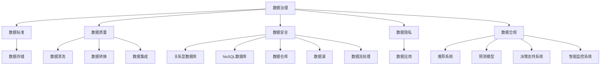

                 

# 人工智能创业数据管理的优化策略

> 关键词：数据管理、人工智能、创业、优化策略、数据治理、机器学习、数据仓库、数据湖、数据流处理

> 摘要：在人工智能创业领域，数据管理是成功的关键之一。本文将深入探讨数据管理的核心概念、优化策略、数学模型、实战案例，并分析实际应用场景。通过系统化的分析和推理，帮助创业者构建高效的数据管理系统，从而推动人工智能项目的成功落地。

## 1. 背景介绍

在当今数字化时代，数据已成为企业最重要的资产之一。对于人工智能创业公司而言，数据管理不仅关系到项目的成败，更是决定其能否在竞争激烈的市场中脱颖而出的关键因素。数据管理涉及数据的收集、存储、处理、分析和应用等多个环节，涵盖了从数据治理到数据科学的全过程。本文将从以下几个方面进行详细探讨：

- **数据治理**：确保数据的质量、安全性和合规性。
- **数据存储**：选择合适的数据存储方案，满足不同场景的需求。
- **数据处理**：高效地处理大规模数据，支持实时和批处理。
- **数据分析**：利用机器学习和数据挖掘技术，从数据中提取有价值的信息。
- **数据应用**：将分析结果应用于实际业务场景，实现价值最大化。

## 2. 核心概念与联系

### 2.1 数据治理

数据治理是指确保数据质量、安全性和合规性的过程。它包括数据标准、数据质量、数据安全、数据隐私和数据合规等方面。数据治理的核心目标是确保数据的准确性和一致性，从而支持业务决策。

### 2.2 数据存储

数据存储是数据管理的重要组成部分，涉及到数据的物理存储和逻辑组织。常见的数据存储方案包括关系型数据库、NoSQL数据库、数据仓库、数据湖和数据流处理系统。

### 2.3 数据处理

数据处理包括数据清洗、数据转换、数据集成和数据流处理。数据清洗是去除数据中的噪声和错误，确保数据质量；数据转换是将数据从一种格式转换为另一种格式；数据集成是将来自不同来源的数据合并到一个统一的数据集中；数据流处理是实时处理不断生成的数据流。

### 2.4 数据分析

数据分析是利用统计学、机器学习和数据挖掘技术从数据中提取有价值的信息。常见的数据分析方法包括描述性分析、诊断性分析、预测性分析和规范性分析。

### 2.5 数据应用

数据应用是将数据分析结果应用于实际业务场景，实现价值最大化。常见的数据应用包括推荐系统、预测模型、决策支持系统和智能监控系统。

### 2.6 Mermaid 流程图



## 3. 核心算法原理 & 具体操作步骤

### 3.1 数据清洗

数据清洗是确保数据质量的关键步骤。常见的数据清洗方法包括：

- **缺失值处理**：删除缺失值或使用插值方法填充缺失值。
- **异常值处理**：识别和处理异常值，如使用Z-score方法。
- **重复值处理**：删除重复记录。
- **格式化处理**：统一数据格式，如日期格式、数值格式等。

### 3.2 数据转换

数据转换是将数据从一种格式转换为另一种格式。常见的数据转换方法包括：

- **数据类型转换**：将数据从一种数据类型转换为另一种数据类型。
- **数据编码转换**：将分类数据转换为数值数据，如独热编码。
- **数据归一化**：将数据缩放到一个特定的范围，如0-1范围。

### 3.3 数据集成

数据集成是将来自不同来源的数据合并到一个统一的数据集中。常见的数据集成方法包括：

- **数据合并**：将多个数据集合并为一个数据集。
- **数据连接**：通过共同的键将数据集连接起来。
- **数据映射**：将不同数据集中的相同实体映射到同一个实体。

### 3.4 数据流处理

数据流处理是实时处理不断生成的数据流。常见的数据流处理方法包括：

- **流式计算**：实时处理数据流，如Apache Flink、Spark Streaming。
- **事件驱动架构**：通过事件驱动的方式处理数据流，如Kafka、Pulsar。
- **状态管理**：维护数据流处理过程中的状态信息，如Apache Storm。

## 4. 数学模型和公式 & 详细讲解 & 举例说明

### 4.1 数据清洗

数据清洗中的缺失值处理可以使用插值方法。常见的插值方法包括：

- **线性插值**：通过相邻的两个已知点进行线性插值。
- **多项式插值**：通过多项式函数进行插值。
- **最近邻插值**：使用最近的已知点进行插值。

### 4.2 数据转换

数据转换中的数据类型转换可以使用以下公式：

$$
\text{新值} = \text{旧值} \times \frac{\text{新范围上限} - \text{新范围下限}}{\text{旧范围上限} - \text{旧范围下限}} + \text{新范围下限}
$$

### 4.3 数据集成

数据集成中的数据合并可以使用以下公式：

$$
\text{合并后的数据集} = \text{数据集1} \cup \text{数据集2}
$$

### 4.4 数据流处理

数据流处理中的流式计算可以使用以下公式：

$$
\text{结果} = \text{流式数据} \rightarrow \text{处理逻辑} \rightarrow \text{输出结果}
$$

## 5. 项目实战：代码实际案例和详细解释说明

### 5.1 开发环境搭建

#### 5.1.1 环境准备

- **操作系统**：Ubuntu 20.04
- **编程语言**：Python 3.8
- **开发工具**：PyCharm 2021.2

#### 5.1.2 安装依赖

```bash
pip install pandas numpy scikit-learn
```

### 5.2 源代码详细实现和代码解读

#### 5.2.1 数据清洗

```python
import pandas as pd

# 读取数据
data = pd.read_csv('data.csv')

# 处理缺失值
data.fillna(method='ffill', inplace=True)

# 处理异常值
data = data[(data['value'] > -100) & (data['value'] < 100)]

# 处理重复值
data.drop_duplicates(inplace=True)

# 数据类型转换
data['date'] = pd.to_datetime(data['date'])
```

#### 5.2.2 数据转换

```python
# 数据归一化
data['value'] = (data['value'] - data['value'].min()) / (data['value'].max() - data['value'].min())

# 数据编码转换
data['category'] = data['category'].map({'A': 1, 'B': 2, 'C': 3})
```

#### 5.2.3 数据集成

```python
# 数据合并
data1 = pd.read_csv('data1.csv')
data2 = pd.read_csv('data2.csv')
merged_data = pd.merge(data1, data2, on='id')
```

#### 5.2.4 数据流处理

```python
from pyspark.sql import SparkSession

# 初始化SparkSession
spark = SparkSession.builder.appName('data_streaming').getOrCreate()

# 读取数据流
stream_df = spark.readStream.format('socket').option('host', 'localhost').option('port', 9999).load()

# 处理数据流
result_df = stream_df.selectExpr('value', 'category')

# 输出结果
query = result_df.writeStream.outputMode('append').format('console').start()
query.awaitTermination()
```

### 5.3 代码解读与分析

#### 5.3.1 数据清洗

- **缺失值处理**：使用前向填充方法处理缺失值。
- **异常值处理**：通过范围限制处理异常值。
- **重复值处理**：删除重复记录。
- **数据类型转换**：将日期字段转换为日期类型。

#### 5.3.2 数据转换

- **数据归一化**：将数值字段归一化到0-1范围内。
- **数据编码转换**：将分类字段转换为数值编码。

#### 5.3.3 数据集成

- **数据合并**：将两个数据集合并为一个数据集。

#### 5.3.4 数据流处理

- **数据流读取**：通过Socket读取数据流。
- **数据处理**：对数据流进行简单的选择操作。
- **数据输出**：将处理结果输出到控制台。

## 6. 实际应用场景

### 6.1 金融风控

在金融风控领域，数据管理可以用于实时监测和预警潜在的金融风险。通过数据清洗、数据转换和数据流处理，可以实时处理大量的交易数据，识别异常交易行为，从而及时采取措施。

### 6.2 医疗健康

在医疗健康领域，数据管理可以用于患者数据的管理和分析。通过数据清洗、数据转换和数据集成，可以将来自不同来源的患者数据合并为一个统一的数据集，从而支持医疗决策和个性化治疗方案。

### 6.3 智能物流

在智能物流领域，数据管理可以用于实时监控和优化物流过程。通过数据流处理，可以实时处理大量的物流数据，优化物流路径和调度，提高物流效率。

## 7. 工具和资源推荐

### 7.1 学习资源推荐

- **书籍**：《数据科学实战》、《Python数据科学手册》
- **论文**：《数据治理的最佳实践》、《数据流处理技术综述》
- **博客**：Data Science Central、Kaggle Blog
- **网站**：DataCamp、Coursera

### 7.2 开发工具框架推荐

- **数据治理工具**：Dataiku、Alteryx
- **数据存储工具**：MySQL、MongoDB
- **数据处理工具**：Apache Spark、Apache Flink
- **数据分析工具**：Python、R

### 7.3 相关论文著作推荐

- **论文**：《数据流处理技术综述》、《数据治理的最佳实践》
- **著作**：《数据科学实战》、《Python数据科学手册》

## 8. 总结：未来发展趋势与挑战

### 8.1 未来发展趋势

- **数据治理**：数据治理将成为企业的重要战略之一，确保数据的质量、安全性和合规性。
- **数据存储**：数据存储技术将不断发展，支持更大规模和更复杂的数据处理需求。
- **数据处理**：数据处理技术将更加高效和实时，支持大规模数据的实时处理。
- **数据分析**：数据分析技术将更加智能化和自动化，支持更复杂的数据分析需求。
- **数据应用**：数据应用将更加广泛和深入，支持更多的业务场景和应用领域。

### 8.2 挑战

- **数据安全**：数据安全将成为数据管理的重要挑战，需要加强数据加密和访问控制。
- **数据隐私**：数据隐私将成为数据管理的重要挑战，需要加强数据保护和隐私保护。
- **数据合规**：数据合规将成为数据管理的重要挑战，需要加强数据治理和合规管理。
- **数据质量**：数据质量将成为数据管理的重要挑战，需要加强数据清洗和数据质量控制。

## 9. 附录：常见问题与解答

### 9.1 问题1：如何处理大规模数据？

**解答**：可以使用分布式计算框架如Apache Spark或Apache Flink来处理大规模数据。

### 9.2 问题2：如何保证数据的安全性和隐私性？

**解答**：可以使用数据加密和访问控制技术来保证数据的安全性和隐私性。

### 9.3 问题3：如何保证数据的质量？

**解答**：可以使用数据清洗和数据质量控制技术来保证数据的质量。

## 10. 扩展阅读 & 参考资料

- **书籍**：《数据科学实战》、《Python数据科学手册》
- **论文**：《数据治理的最佳实践》、《数据流处理技术综述》
- **博客**：Data Science Central、Kaggle Blog
- **网站**：DataCamp、Coursera

---

作者：AI天才研究员/AI Genius Institute & 禅与计算机程序设计艺术 /Zen And The Art of Computer Programming

