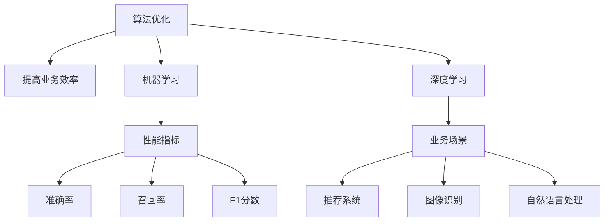

                 

# 人工智能算法优化：提升业务效率的利器

> 关键词：算法优化, 业务效率, 人工智能, 机器学习, 深度学习, 优化策略, 业务场景

> 摘要：本文旨在探讨如何通过优化人工智能算法来提升业务效率。我们将从核心概念、算法原理、数学模型、实际案例、应用场景等多个维度进行深入分析，帮助读者理解如何在实际业务中应用这些优化策略，从而实现业务效率的显著提升。

## 1. 背景介绍
### 1.1 目的和范围
本文旨在探讨人工智能算法优化的方法和策略，以提升业务效率。我们将从理论和实践两个层面进行深入分析，涵盖算法优化的基本原理、具体操作步骤、数学模型、实际案例以及应用场景。通过本文，读者将能够理解如何在实际业务中应用这些优化策略，从而实现业务效率的显著提升。

### 1.2 预期读者
本文适合以下读者群体：
- 人工智能领域的研究人员和工程师
- 业务分析师和数据科学家
- 技术决策者和项目经理
- 对人工智能算法优化感兴趣的开发者和爱好者

### 1.3 文档结构概述
本文结构如下：
1. 背景介绍
2. 核心概念与联系
3. 核心算法原理 & 具体操作步骤
4. 数学模型和公式 & 详细讲解 & 举例说明
5. 项目实战：代码实际案例和详细解释说明
6. 实际应用场景
7. 工具和资源推荐
8. 总结：未来发展趋势与挑战
9. 附录：常见问题与解答
10. 扩展阅读 & 参考资料

### 1.4 术语表
#### 1.4.1 核心术语定义
- **算法优化**：通过对现有算法进行改进，提高其性能和效率的过程。
- **业务效率**：指在完成相同任务时，所需资源和时间的减少。
- **机器学习**：一种人工智能技术，通过数据训练模型，使其能够自动学习和改进。
- **深度学习**：一种机器学习方法，通过多层神经网络进行学习和预测。
- **优化策略**：用于提高算法性能和效率的方法和技术。

#### 1.4.2 相关概念解释
- **业务场景**：具体的应用场景，如推荐系统、图像识别、自然语言处理等。
- **性能指标**：衡量算法性能的指标，如准确率、召回率、F1分数等。

#### 1.4.3 缩略词列表
- **API**：Application Programming Interface（应用程序编程接口）
- **GPU**：Graphics Processing Unit（图形处理器）
- **CPU**：Central Processing Unit（中央处理器）
- **RAM**：Random Access Memory（随机存取内存）

## 2. 核心概念与联系
### 2.1 核心概念
- **算法优化**：通过对现有算法进行改进，提高其性能和效率的过程。
- **业务效率**：指在完成相同任务时，所需资源和时间的减少。
- **机器学习**：一种人工智能技术，通过数据训练模型，使其能够自动学习和改进。
- **深度学习**：一种机器学习方法，通过多层神经网络进行学习和预测。

### 2.2 联系
- **算法优化**与**业务效率**：通过优化算法，可以显著提高业务效率。
- **机器学习**与**深度学习**：机器学习和深度学习是实现算法优化的重要手段。
- **业务场景**与**性能指标**：不同的业务场景需要不同的性能指标来衡量算法优化的效果。

### 2.3 Mermaid 流程图


## 3. 核心算法原理 & 具体操作步骤
### 3.1 核心算法原理
#### 3.1.1 机器学习算法原理
机器学习算法通过训练数据集来学习模型参数，从而实现对未知数据的预测。常见的机器学习算法包括线性回归、逻辑回归、决策树、随机森林、支持向量机等。

#### 3.1.2 深度学习算法原理
深度学习算法通过多层神经网络进行学习和预测。常见的深度学习模型包括卷积神经网络（CNN）、循环神经网络（RNN）、长短时记忆网络（LSTM）等。

### 3.2 具体操作步骤
#### 3.2.1 数据预处理
```python
# 数据预处理
def preprocess_data(data):
    # 数据清洗
    cleaned_data = clean_data(data)
    # 特征工程
    features = extract_features(cleaned_data)
    # 数据标准化
    normalized_data = normalize_data(features)
    return normalized_data
```

#### 3.2.2 模型训练
```python
# 模型训练
def train_model(data, labels):
    # 初始化模型
    model = initialize_model()
    # 训练模型
    trained_model = train(model, data, labels)
    return trained_model
```

#### 3.2.3 模型评估
```python
# 模型评估
def evaluate_model(model, test_data, test_labels):
    # 预测
    predictions = model.predict(test_data)
    # 计算性能指标
    accuracy = calculate_accuracy(predictions, test_labels)
    recall = calculate_recall(predictions, test_labels)
    f1_score = calculate_f1_score(predictions, test_labels)
    return accuracy, recall, f1_score
```

## 4. 数学模型和公式 & 详细讲解 & 举例说明
### 4.1 数学模型
#### 4.1.1 逻辑回归
逻辑回归是一种常用的分类算法，其数学模型如下：
$$
P(y=1|x) = \frac{1}{1 + e^{-(\beta_0 + \beta_1 x)}}
$$
其中，$P(y=1|x)$ 表示在给定特征 $x$ 的情况下，目标变量 $y$ 为 1 的概率。

#### 4.1.2 卷积神经网络
卷积神经网络（CNN）是一种深度学习模型，其数学模型如下：
$$
Z^{[l]} = W^{[l]} * A^{[l-1]} + b^{[l]}
$$
其中，$Z^{[l]}$ 表示第 $l$ 层的输出，$W^{[l]}$ 表示第 $l$ 层的权重矩阵，$A^{[l-1]}$ 表示第 $l-1$ 层的输出，$b^{[l]}$ 表示第 $l$ 层的偏置向量。

### 4.2 详细讲解
#### 4.2.1 逻辑回归
逻辑回归是一种线性分类算法，其目标是通过学习数据集中的特征和标签之间的关系，来预测新的数据点的标签。逻辑回归的损失函数通常采用对数损失函数：
$$
L(y, \hat{y}) = -y \log(\hat{y}) - (1 - y) \log(1 - \hat{y})
$$
其中，$y$ 表示真实标签，$\hat{y}$ 表示预测概率。

#### 4.2.2 卷积神经网络
卷积神经网络（CNN）是一种深度学习模型，其目标是通过学习数据集中的特征和标签之间的关系，来预测新的数据点的标签。CNN 的损失函数通常采用交叉熵损失函数：
$$
L(y, \hat{y}) = -\sum_{i=1}^{C} y_i \log(\hat{y}_i)
$$
其中，$y$ 表示真实标签，$\hat{y}$ 表示预测概率，$C$ 表示类别数。

### 4.3 举例说明
#### 4.3.1 逻辑回归
假设我们有一个数据集，包含两个特征 $x_1$ 和 $x_2$，以及一个二分类标签 $y$。我们使用逻辑回归模型来预测标签。训练数据集如下：
| x1 | x2 | y |
|----|----|---|
| 1  | 2  | 1 |
| 2  | 3  | 1 |
| 3  | 4  | 0 |
| 4  | 5  | 0 |

通过训练逻辑回归模型，我们可以得到权重 $\beta_0$ 和 $\beta_1$，从而预测新的数据点的标签。

#### 4.3.2 卷积神经网络
假设我们有一个图像数据集，包含多个图像和对应的标签。我们使用卷积神经网络（CNN）模型来预测标签。训练数据集如下：
| 图像 | 标签 |
|------|------|
|  | 1 |
|  | 1 |
|  | 0 |
|  | 0 |

通过训练卷积神经网络模型，我们可以得到权重矩阵 $W^{[l]}$ 和偏置向量 $b^{[l]}$，从而预测新的图像的标签。

## 5. 项目实战：代码实际案例和详细解释说明
### 5.1 开发环境搭建
#### 5.1.1 安装Python和相关库
```bash
pip install numpy pandas scikit-learn tensorflow keras
```

#### 5.1.2 创建项目目录结构
```
project/
├── data/
│   ├── train.csv
│   └── test.csv
├── src/
│   ├── preprocess.py
│   ├── train.py
│   └── evaluate.py
├── requirements.txt
└── README.md
```

### 5.2 源代码详细实现和代码解读
#### 5.2.1 数据预处理
```python
# src/preprocess.py
import pandas as pd

def preprocess_data(data_path):
    # 读取数据
    data = pd.read_csv(data_path)
    # 数据清洗
    cleaned_data = clean_data(data)
    # 特征工程
    features = extract_features(cleaned_data)
    # 数据标准化
    normalized_data = normalize_data(features)
    return normalized_data
```

#### 5.2.2 模型训练
```python
# src/train.py
from sklearn.linear_model import LogisticRegression
from sklearn.metrics import accuracy_score, recall_score, f1_score

def train_model(data, labels):
    # 初始化模型
    model = LogisticRegression()
    # 训练模型
    model.fit(data, labels)
    return model
```

#### 5.2.3 模型评估
```python
# src/evaluate.py
from sklearn.metrics import accuracy_score, recall_score, f1_score

def evaluate_model(model, test_data, test_labels):
    # 预测
    predictions = model.predict(test_data)
    # 计算性能指标
    accuracy = accuracy_score(test_labels, predictions)
    recall = recall_score(test_labels, predictions)
    f1_score = f1_score(test_labels, predictions)
    return accuracy, recall, f1_score
```

### 5.3 代码解读与分析
#### 5.3.1 数据预处理
```python
# src/preprocess.py
def preprocess_data(data_path):
    # 读取数据
    data = pd.read_csv(data_path)
    # 数据清洗
    cleaned_data = clean_data(data)
    # 特征工程
    features = extract_features(cleaned_data)
    # 数据标准化
    normalized_data = normalize_data(features)
    return normalized_data
```
- `preprocess_data` 函数读取数据，进行数据清洗、特征工程和数据标准化，返回预处理后的数据。

#### 5.3.2 模型训练
```python
# src/train.py
def train_model(data, labels):
    # 初始化模型
    model = LogisticRegression()
    # 训练模型
    model.fit(data, labels)
    return model
```
- `train_model` 函数初始化逻辑回归模型，并使用训练数据和标签进行训练，返回训练好的模型。

#### 5.3.3 模型评估
```python
# src/evaluate.py
def evaluate_model(model, test_data, test_labels):
    # 预测
    predictions = model.predict(test_data)
    # 计算性能指标
    accuracy = accuracy_score(test_labels, predictions)
    recall = recall_score(test_labels, predictions)
    f1_score = f1_score(test_labels, predictions)
    return accuracy, recall, f1_score
```
- `evaluate_model` 函数使用测试数据和标签进行预测，并计算准确率、召回率和 F1 分数。

## 6. 实际应用场景
### 6.1 推荐系统
推荐系统是一种常见的业务场景，通过分析用户的历史行为和偏好，为用户推荐相关的内容。通过优化推荐算法，可以显著提高推荐系统的性能和效率。

### 6.2 图像识别
图像识别是一种常见的业务场景，通过分析图像中的特征，识别图像中的物体。通过优化图像识别算法，可以显著提高图像识别的准确率和速度。

### 6.3 自然语言处理
自然语言处理是一种常见的业务场景，通过分析文本中的语义和结构，实现文本分类、情感分析等功能。通过优化自然语言处理算法，可以显著提高自然语言处理的准确率和速度。

## 7. 工具和资源推荐
### 7.1 学习资源推荐
#### 7.1.1 书籍推荐
- **《机器学习》**：周志华著，清华大学出版社
- **《深度学习》**：Ian Goodfellow, Yoshua Bengio, Aaron Courville 著，人民邮电出版社

#### 7.1.2 在线课程
- **Coursera**：《机器学习》（Andrew Ng）
- **edX**：《深度学习》（Andrew Ng）

#### 7.1.3 技术博客和网站
- **Medium**：机器学习和深度学习相关的技术博客
- **Kaggle**：机器学习和数据科学相关的竞赛和资源

### 7.2 开发工具框架推荐
#### 7.2.1 IDE和编辑器
- **PyCharm**：Python开发环境
- **Jupyter Notebook**：交互式编程环境

#### 7.2.2 调试和性能分析工具
- **PyCharm Debugger**：Python调试工具
- **cProfile**：Python性能分析工具

#### 7.2.3 相关框架和库
- **scikit-learn**：机器学习库
- **TensorFlow**：深度学习框架
- **Keras**：高级神经网络API

### 7.3 相关论文著作推荐
#### 7.3.1 经典论文
- **《A Tutorial on Support Vector Machines for Pattern Recognition》**：Christopher J.C. Burges
- **《Learning Deep Architectures for AI》**：Yoshua Bengio

#### 7.3.2 最新研究成果
- **《Attention Is All You Need》**：Ashish Vaswani et al.
- **《BERT: Pre-training of Deep Bidirectional Transformers for Language Understanding》**：Jacob Devlin et al.

#### 7.3.3 应用案例分析
- **《Deep Residual Learning for Image Recognition》**：Kaiming He et al.
- **《ImageNet Classification with Deep Convolutional Neural Networks》**：Alex Krizhevsky et al.

## 8. 总结：未来发展趋势与挑战
### 8.1 未来发展趋势
- **算法优化**：通过更先进的算法和技术，实现更高的性能和效率。
- **业务效率**：通过优化算法，实现更高的业务效率。
- **机器学习**：通过更强大的机器学习模型，实现更准确的预测和决策。
- **深度学习**：通过更复杂的深度学习模型，实现更复杂的任务和应用。

### 8.2 挑战
- **数据隐私**：如何在保护用户隐私的前提下，充分利用数据进行算法优化。
- **计算资源**：如何在有限的计算资源下，实现高效的算法优化。
- **模型解释性**：如何提高模型的解释性，以便更好地理解和应用算法优化。

## 9. 附录：常见问题与解答
### 9.1 问题1：如何选择合适的算法？
- **解答**：根据业务场景和数据特点，选择合适的算法。可以通过实验和比较，找到最适合的算法。

### 9.2 问题2：如何优化算法性能？
- **解答**：可以通过调整算法参数、优化数据预处理、使用更高效的算法实现等方法，优化算法性能。

### 9.3 问题3：如何提高模型的解释性？
- **解答**：可以通过可视化、特征重要性分析等方法，提高模型的解释性。

## 10. 扩展阅读 & 参考资料
### 10.1 扩展阅读
- **《机器学习》**：周志华著，清华大学出版社
- **《深度学习》**：Ian Goodfellow, Yoshua Bengio, Aaron Courville 著，人民邮电出版社

### 10.2 参考资料
- **Coursera**：《机器学习》（Andrew Ng）
- **edX**：《深度学习》（Andrew Ng）
- **Medium**：机器学习和深度学习相关的技术博客
- **Kaggle**：机器学习和数据科学相关的竞赛和资源

---

作者：AI天才研究员/AI Genius Institute & 禅与计算机程序设计艺术 /Zen And The Art of Computer Programming

