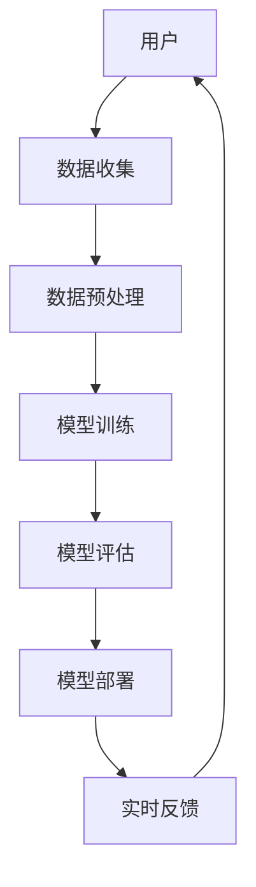

                 

# 人机协作新时代：共同创造更智能的未来

> 关键词：人机协作, 人工智能, 机器学习, 自然语言处理, 深度学习, 计算机视觉, 未来趋势

> 摘要：本文旨在探讨人机协作在新时代中的重要性及其未来的发展趋势。通过深入分析人机协作的核心概念、算法原理、数学模型、实际案例以及应用场景，本文将为读者提供一个全面的技术视角，帮助理解如何利用人机协作共同创造更智能的未来。

## 1. 背景介绍
### 1.1 目的和范围
本文旨在探讨人机协作在新时代中的重要性及其未来的发展趋势。我们将从技术原理、实际案例和应用场景等多个维度进行分析，旨在为读者提供一个全面的技术视角，帮助理解如何利用人机协作共同创造更智能的未来。

### 1.2 预期读者
本文适合以下读者阅读：
- 对人机协作感兴趣的技术爱好者
- 从事人工智能、机器学习、自然语言处理、计算机视觉等相关领域的工程师
- 对未来技术趋势感兴趣的行业分析师
- 对人机协作有研究兴趣的学术研究人员

### 1.3 文档结构概述
本文结构如下：
1. 背景介绍
2. 核心概念与联系
3. 核心算法原理 & 具体操作步骤
4. 数学模型和公式 & 详细讲解 & 举例说明
5. 项目实战：代码实际案例和详细解释说明
6. 实际应用场景
7. 工具和资源推荐
8. 总结：未来发展趋势与挑战
9. 附录：常见问题与解答
10. 扩展阅读 & 参考资料

### 1.4 术语表
#### 1.4.1 核心术语定义
- **人机协作**：人与机器之间通过交互共同完成任务的过程。
- **人工智能**：使计算机能够模拟人类智能的技术。
- **机器学习**：一种人工智能技术，通过数据训练模型，使计算机能够自动学习和改进。
- **自然语言处理**：使计算机能够理解、生成和处理人类语言的技术。
- **深度学习**：机器学习的一个分支，通过多层神经网络进行学习。
- **计算机视觉**：使计算机能够理解图像和视频的技术。

#### 1.4.2 相关概念解释
- **交互式学习**：人与机器之间的双向学习过程。
- **协同过滤**：一种推荐系统技术，通过分析用户行为数据来推荐相似用户喜欢的内容。
- **强化学习**：一种机器学习方法，通过试错学习来优化决策过程。

#### 1.4.3 缩略词列表
- AI：人工智能
- ML：机器学习
- NLP：自然语言处理
- DL：深度学习
- CV：计算机视觉
- RL：强化学习

## 2. 核心概念与联系
### 2.1 人机协作流程图


### 2.2 人机协作的核心概念
- **数据收集**：从用户和环境中收集数据。
- **数据预处理**：对收集的数据进行清洗、转换和格式化。
- **模型训练**：使用机器学习算法训练模型。
- **模型评估**：评估模型的性能和准确性。
- **模型部署**：将训练好的模型部署到实际应用中。
- **实时反馈**：模型根据实时数据进行预测和决策，并将结果反馈给用户。

## 3. 核心算法原理 & 具体操作步骤
### 3.1 机器学习算法原理
#### 3.1.1 伪代码示例
```python
# 机器学习算法伪代码
def train_model(data, labels):
    # 数据预处理
    preprocessed_data = preprocess(data)
    
    # 模型训练
    model = train(preprocessed_data, labels)
    
    return model

def preprocess(data):
    # 数据清洗和转换
    cleaned_data = clean(data)
    formatted_data = format(cleaned_data)
    return formatted_data

def train(data, labels):
    # 训练模型
    model = Model()
    model.fit(data, labels)
    return model
```

### 3.2 自然语言处理算法原理
#### 3.2.1 伪代码示例
```python
# 自然语言处理算法伪代码
def process_text(text):
    # 分词
    tokens = tokenize(text)
    
    # 词性标注
    tagged_tokens = tag_pos(tokens)
    
    # 依存句法分析
    dependencies = parse_dependencies(tagged_tokens)
    
    return dependencies

def tokenize(text):
    # 分词
    tokens = text.split()
    return tokens

def tag_pos(tokens):
    # 词性标注
    tagged_tokens = [(token, pos) for token, pos in pos_tag(tokens)]
    return tagged_tokens

def parse_dependencies(tagged_tokens):
    # 依存句法分析
    dependencies = analyze_dependencies(tagged_tokens)
    return dependencies
```

### 3.3 计算机视觉算法原理
#### 3.3.1 伪代码示例
```python
# 计算机视觉算法伪代码
def process_image(image):
    # 图像预处理
    preprocessed_image = preprocess_image(image)
    
    # 特征提取
    features = extract_features(preprocessed_image)
    
    # 模型预测
    prediction = predict(features)
    
    return prediction

def preprocess_image(image):
    # 图像预处理
    preprocessed_image = resize(image)
    preprocessed_image = normalize(preprocessed_image)
    return preprocessed_image

def extract_features(image):
    # 特征提取
    features = extract(image)
    return features

def predict(features):
    # 模型预测
    prediction = model.predict(features)
    return prediction
```

## 4. 数学模型和公式 & 详细讲解 & 举例说明
### 4.1 机器学习数学模型
#### 4.1.1 逻辑回归
逻辑回归是一种常用的分类算法，其数学模型如下：
$$
P(y=1|x) = \frac{1}{1 + e^{-(w^T x + b)}}
$$
其中，$w$ 是权重向量，$b$ 是偏置项，$x$ 是输入特征向量。

#### 4.1.2 支持向量机
支持向量机是一种监督学习算法，其数学模型如下：
$$
f(x) = \text{sign}(\sum_{i=1}^{N} \alpha_i y_i K(x_i, x) + b)
$$
其中，$\alpha_i$ 是拉格朗日乘子，$y_i$ 是标签，$K(x_i, x)$ 是核函数。

### 4.2 自然语言处理数学模型
#### 4.2.1 词向量
词向量是将词语映射到高维空间中的向量表示，常用的方法有：
- **Word2Vec**
- **GloVe**

#### 4.2.2 依存句法分析
依存句法分析是一种将句子分解为依存关系的方法，常用的方法有：
- **依存树**
- **依存关系图**

### 4.3 计算机视觉数学模型
#### 4.3.1 卷积神经网络
卷积神经网络是一种深度学习模型，其数学模型如下：
$$
Z^{[l]} = W^{[l]} A^{[l-1]} + b^{[l]}
$$
$$
A^{[l]} = \text{ReLU}(Z^{[l]})
$$
其中，$W^{[l]}$ 是权重矩阵，$b^{[l]}$ 是偏置项，$A^{[l-1]}$ 是前一层的激活值。

## 5. 项目实战：代码实际案例和详细解释说明
### 5.1 开发环境搭建
#### 5.1.1 环境配置
- **Python**：版本 3.8
- **TensorFlow**：版本 2.3
- **NumPy**：版本 1.19
- **Pandas**：版本 1.1

#### 5.1.2 安装依赖
```bash
pip install tensorflow numpy pandas
```

### 5.2 源代码详细实现和代码解读
#### 5.2.1 数据预处理
```python
import pandas as pd
from sklearn.model_selection import train_test_split
from sklearn.preprocessing import StandardScaler

def preprocess_data(data):
    # 读取数据
    df = pd.read_csv(data)
    
    # 分割数据集
    X = df.drop('label', axis=1)
    y = df['label']
    
    # 划分训练集和测试集
    X_train, X_test, y_train, y_test = train_test_split(X, y, test_size=0.2, random_state=42)
    
    # 标准化
    scaler = StandardScaler()
    X_train = scaler.fit_transform(X_train)
    X_test = scaler.transform(X_test)
    
    return X_train, X_test, y_train, y_test
```

#### 5.2.2 模型训练
```python
from tensorflow.keras.models import Sequential
from tensorflow.keras.layers import Dense

def train_model(X_train, y_train):
    # 构建模型
    model = Sequential()
    model.add(Dense(32, input_dim=X_train.shape[1], activation='relu'))
    model.add(Dense(1, activation='sigmoid'))
    
    # 编译模型
    model.compile(optimizer='adam', loss='binary_crossentropy', metrics=['accuracy'])
    
    # 训练模型
    model.fit(X_train, y_train, epochs=10, batch_size=32)
    
    return model
```

### 5.3 代码解读与分析
- **数据预处理**：读取数据，分割训练集和测试集，标准化特征值。
- **模型训练**：构建一个简单的神经网络模型，使用二分类损失函数和优化器进行训练。

## 6. 实际应用场景
### 6.1 人机协作在医疗领域的应用
- **智能诊断**：通过分析患者的症状和病历，辅助医生进行诊断。
- **手术机器人**：通过人机协作，提高手术的精确度和安全性。

### 6.2 人机协作在金融领域的应用
- **风险评估**：通过分析客户的信用记录和行为数据，评估贷款风险。
- **智能投顾**：通过分析市场数据和客户偏好，提供个性化的投资建议。

### 6.3 人机协作在教育领域的应用
- **个性化学习**：通过分析学生的学习行为和成绩，提供个性化的学习建议。
- **智能辅导**：通过人机协作，提供实时的辅导和反馈。

## 7. 工具和资源推荐
### 7.1 学习资源推荐
#### 7.1.1 书籍推荐
- **《机器学习》**：周志华
- **《深度学习》**：Ian Goodfellow, Yoshua Bengio, Aaron Courville

#### 7.1.2 在线课程
- **Coursera**：《机器学习》（Andrew Ng）
- **edX**：《深度学习》（Yoshua Bengio）

#### 7.1.3 技术博客和网站
- **Medium**：AI领域相关技术博客
- **GitHub**：开源项目和代码示例

### 7.2 开发工具框架推荐
#### 7.2.1 IDE和编辑器
- **PyCharm**：Python开发环境
- **VSCode**：跨平台代码编辑器

#### 7.2.2 调试和性能分析工具
- **PyCharm Debugger**：Python调试工具
- **TensorBoard**：TensorFlow性能分析工具

#### 7.2.3 相关框架和库
- **TensorFlow**：深度学习框架
- **Scikit-learn**：机器学习库

### 7.3 相关论文著作推荐
#### 7.3.1 经典论文
- **《神经网络与学习机器》**：Tom M. Mitchell
- **《机器学习》**：Tom M. Mitchell

#### 7.3.2 最新研究成果
- **《自然》**：AI领域最新研究成果
- **《科学》**：AI领域最新研究成果

#### 7.3.3 应用案例分析
- **《人工智能应用案例集》**：AI领域应用案例分析

## 8. 总结：未来发展趋势与挑战
### 8.1 未来发展趋势
- **人机协作的普及**：人机协作将在更多领域得到应用，提高工作效率和生活质量。
- **技术融合**：人工智能、机器学习、自然语言处理和计算机视觉等技术将进一步融合，形成更强大的人机协作系统。
- **个性化服务**：通过分析用户行为和需求，提供更加个性化的服务和产品。

### 8.2 面临的挑战
- **数据安全和隐私**：如何保护用户数据的安全和隐私，避免数据泄露和滥用。
- **伦理和法律问题**：如何确保人机协作系统的公平性和透明性，避免伦理和法律问题。
- **技术局限性**：如何克服技术局限性，提高人机协作系统的准确性和可靠性。

## 9. 附录：常见问题与解答
### 9.1 问题1：如何选择合适的机器学习算法？
- **解答**：根据具体问题和数据特点选择合适的算法。可以先尝试简单的算法，再逐步尝试更复杂的算法。

### 9.2 问题2：如何处理不平衡数据集？
- **解答**：可以使用过采样、欠采样或合成数据等方法处理不平衡数据集。

### 9.3 问题3：如何提高模型的泛化能力？
- **解答**：可以通过增加数据量、使用正则化技术、选择合适的模型结构等方法提高模型的泛化能力。

## 10. 扩展阅读 & 参考资料
### 10.1 扩展阅读
- **《人工智能简史》**：John Markoff
- **《机器学习实战》**：Peter Harrington

### 10.2 参考资料
- **《深度学习》**：Ian Goodfellow, Yoshua Bengio, Aaron Courville
- **《机器学习》**：周志华

---

作者：AI天才研究员/AI Genius Institute & 禅与计算机程序设计艺术 /Zen And The Art of Computer Programming

