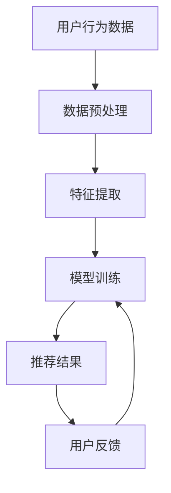
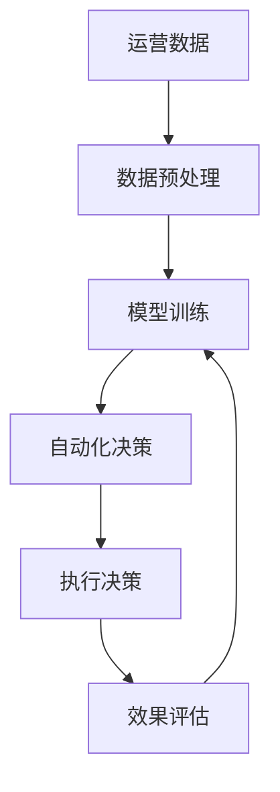
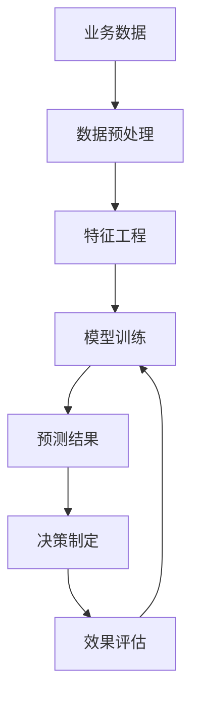

                 

# 从技术创新到商业模式创新：AI电商的差异化竞争

> 关键词：AI电商, 商业模式创新, 差异化竞争, 个性化推荐, 自动化运营, 数据驱动决策, 机器学习, 深度学习, 自然语言处理

> 摘要：本文旨在探讨如何通过技术创新实现AI电商的差异化竞争。我们将从技术原理、算法实现、数学模型、实际案例、应用场景等多个维度进行深入分析，揭示AI在电商领域的独特价值。通过本文，读者将能够理解AI技术如何重塑电商行业的商业模式，实现个性化推荐、自动化运营、数据驱动决策等关键功能，从而在激烈的市场竞争中脱颖而出。

## 1. 背景介绍
### 1.1 目的和范围
本文旨在探讨AI技术在电商领域的应用，特别是如何通过技术创新实现差异化竞争。我们将从技术原理、算法实现、数学模型、实际案例、应用场景等多个维度进行深入分析，揭示AI在电商领域的独特价值。本文的目标读者包括电商行业的从业者、技术爱好者、以及对AI技术感兴趣的读者。

### 1.2 预期读者
- 电商行业从业者：了解如何利用AI技术提升用户体验、优化运营效率。
- 技术爱好者：学习AI技术在电商领域的具体应用。
- 对AI技术感兴趣的读者：了解AI技术如何重塑电商行业的商业模式。

### 1.3 文档结构概述
本文将按照以下结构展开：
1. 背景介绍
2. 核心概念与联系
3. 核心算法原理 & 具体操作步骤
4. 数学模型和公式 & 详细讲解 & 举例说明
5. 项目实战：代码实际案例和详细解释说明
6. 实际应用场景
7. 工具和资源推荐
8. 总结：未来发展趋势与挑战
9. 附录：常见问题与解答
10. 扩展阅读 & 参考资料

### 1.4 术语表
#### 1.4.1 核心术语定义
- **AI电商**：利用人工智能技术提升电商用户体验、优化运营效率的电商模式。
- **个性化推荐**：根据用户的历史行为、偏好等信息，为用户推荐个性化商品。
- **自动化运营**：利用AI技术实现电商运营的自动化，提高运营效率。
- **数据驱动决策**：基于数据分析和预测，做出更科学的决策。

#### 1.4.2 相关概念解释
- **机器学习**：通过算法让计算机从数据中学习，从而实现特定任务。
- **深度学习**：一种机器学习方法，通过多层神经网络实现复杂的模式识别。
- **自然语言处理**：让计算机理解和生成人类语言的技术。

#### 1.4.3 缩略词列表
- **AI**：Artificial Intelligence
- **ML**：Machine Learning
- **DL**：Deep Learning
- **NLP**：Natural Language Processing
- **RNN**：Recurrent Neural Network
- **CNN**：Convolutional Neural Network
- **BERT**：Bidirectional Encoder Representations from Transformers

## 2. 核心概念与联系
### 2.1 个性化推荐
个性化推荐是AI电商的核心功能之一。通过分析用户的历史行为、偏好等信息，为用户推荐个性化商品。其流程如下：



### 2.2 自动化运营
自动化运营是AI电商的另一个重要功能。通过自动化处理日常运营任务，提高运营效率。其流程如下：



### 2.3 数据驱动决策
数据驱动决策是AI电商的关键环节。通过数据分析和预测，做出更科学的决策。其流程如下：



## 3. 核心算法原理 & 具体操作步骤
### 3.1 个性化推荐算法
个性化推荐算法主要包括协同过滤、基于内容的推荐、深度学习推荐等。这里以基于内容的推荐为例，使用伪代码进行详细阐述。

```python
# 基于内容的推荐算法
def content_based_recommendation(user_id, item_features, user_history):
    # 提取用户历史行为中的商品特征
    user_item_features = extract_features(user_history)
    
    # 计算用户与商品之间的相似度
    similarities = calculate_similarity(user_item_features, item_features)
    
    # 根据相似度排序，推荐相似度最高的商品
    recommended_items = sort_items_by_similarity(similarities)
    
    return recommended_items

# 提取用户历史行为中的商品特征
def extract_features(user_history):
    # 假设用户历史行为包含商品ID和评分
    user_item_features = {}
    for item_id, rating in user_history:
        user_item_features[item_id] = rating
    return user_item_features

# 计算用户与商品之间的相似度
def calculate_similarity(user_item_features, item_features):
    similarities = {}
    for item_id, user_rating in user_item_features.items():
        for item_id2, item_rating in item_features.items():
            if item_id != item_id2:
                similarities[(item_id, item_id2)] = cosine_similarity(user_rating, item_rating)
    return similarities

# 根据相似度排序，推荐相似度最高的商品
def sort_items_by_similarity(similarities):
    sorted_items = sorted(similarities.items(), key=lambda x: x[1], reverse=True)
    recommended_items = [item_id for item_id, _ in sorted_items]
    return recommended_items
```

### 3.2 自动化运营算法
自动化运营算法主要包括库存管理、价格优化、广告投放等。这里以库存管理为例，使用伪代码进行详细阐述。

```python
# 库存管理算法
def inventory_management(current_inventory, demand_forecast, reorder_threshold):
    # 预测未来需求
    future_demand = predict_demand(demand_forecast)
    
    # 计算当前库存与未来需求的差距
    inventory_gap = calculate_inventory_gap(current_inventory, future_demand)
    
    # 判断是否需要补货
    if inventory_gap > reorder_threshold:
        reorder_items = calculate_reorder_items(inventory_gap)
        return reorder_items
    else:
        return []

# 预测未来需求
def predict_demand(demand_forecast):
    # 假设使用线性回归模型预测未来需求
    future_demand = linear_regression(demand_forecast)
    return future_demand

# 计算当前库存与未来需求的差距
def calculate_inventory_gap(current_inventory, future_demand):
    inventory_gap = future_demand - current_inventory
    return inventory_gap

# 判断是否需要补货
def calculate_reorder_items(inventory_gap):
    reorder_items = inventory_gap
    return reorder_items
```

### 3.3 数据驱动决策算法
数据驱动决策算法主要包括用户行为分析、销售预测、库存优化等。这里以用户行为分析为例，使用伪代码进行详细阐述。

```python
# 用户行为分析算法
def user_behavior_analysis(user_data, item_data):
    # 提取用户行为特征
    user_features = extract_features(user_data)
    
    # 提取商品特征
    item_features = extract_features(item_data)
    
    # 计算用户与商品之间的相似度
    similarities = calculate_similarity(user_features, item_features)
    
    # 根据相似度排序，分析用户行为模式
    user_behavior_patterns = sort_items_by_similarity(similarities)
    
    return user_behavior_patterns

# 提取用户行为特征
def extract_features(user_data):
    # 假设用户数据包含用户ID、商品ID和评分
    user_features = {}
    for user_id, item_id, rating in user_data:
        user_features[(user_id, item_id)] = rating
    return user_features

# 计算用户与商品之间的相似度
def calculate_similarity(user_features, item_features):
    similarities = {}
    for user_id, item_id, user_rating in user_features:
        for item_id2, item_rating in item_features:
            if item_id != item_id2:
                similarities[(user_id, item_id, item_id2)] = cosine_similarity(user_rating, item_rating)
    return similarities

# 根据相似度排序，分析用户行为模式
def sort_items_by_similarity(similarities):
    sorted_items = sorted(similarities.items(), key=lambda x: x[1], reverse=True)
    user_behavior_patterns = [item_id for item_id, _ in sorted_items]
    return user_behavior_patterns
```

## 4. 数学模型和公式 & 详细讲解 & 举例说明
### 4.1 协同过滤算法
协同过滤算法是一种常见的个性化推荐算法。其核心思想是通过用户的历史行为数据，找到与目标用户兴趣相似的用户，然后推荐这些用户喜欢的商品。

#### 4.1.1 用户-物品协同过滤
用户-物品协同过滤算法的核心公式如下：

$$
\hat{r}_{ui} = \frac{\sum_{j \in N_i} \frac{r_{uj}}{1 + |N_i| - |N_{ij}|}}{\sum_{j \in N_i} \frac{1}{1 + |N_i| - |N_{ij}|}}
$$

其中，$\hat{r}_{ui}$ 是用户 $u$ 对物品 $i$ 的预测评分，$r_{uj}$ 是用户 $u$ 对物品 $j$ 的实际评分，$N_i$ 是用户 $u$ 的邻居集合，$N_{ij}$ 是用户 $u$ 和用户 $j$ 的共同邻居集合。

#### 4.1.2 物品-物品协同过滤
物品-物品协同过滤算法的核心公式如下：

$$
\hat{r}_{ui} = \frac{\sum_{j \in N_i} \frac{r_{uj} \cdot sim(i, j)}{\sum_{k \in N_i} sim(i, k)}}{\sum_{j \in N_i} \frac{1}{\sum_{k \in N_i} sim(i, k)}}
$$

其中，$\hat{r}_{ui}$ 是用户 $u$ 对物品 $i$ 的预测评分，$r_{uj}$ 是用户 $u$ 对物品 $j$ 的实际评分，$sim(i, j)$ 是物品 $i$ 和物品 $j$ 之间的相似度。

### 4.2 深度学习推荐算法
深度学习推荐算法是一种基于神经网络的推荐算法。其核心思想是通过多层神经网络学习用户和商品之间的复杂关系。

#### 4.2.1 基于RNN的推荐算法
基于RNN的推荐算法的核心公式如下：

$$
h_t = \tanh(W_h h_{t-1} + W_x x_t + b_h)
$$

$$
\hat{r}_{ui} = W_o h_t + b_o
$$

其中，$h_t$ 是隐藏层状态，$x_t$ 是输入层状态，$W_h$、$W_x$、$W_o$ 是权重矩阵，$b_h$、$b_o$ 是偏置项。

#### 4.2.2 基于CNN的推荐算法
基于CNN的推荐算法的核心公式如下：

$$
h = \text{ReLU}(W_c x + b_c)
$$

$$
\hat{r}_{ui} = W_o h + b_o
$$

其中，$h$ 是卷积层输出，$x$ 是输入层状态，$W_c$、$W_o$ 是权重矩阵，$b_c$、$b_o$ 是偏置项。

## 5. 项目实战：代码实际案例和详细解释说明
### 5.1 开发环境搭建
为了实现AI电商的个性化推荐功能，我们需要搭建一个开发环境。这里以Python为例，使用Anaconda进行环境搭建。

```bash
# 安装Anaconda
https://www.anaconda.com/products/distribution

# 创建虚拟环境
conda create --name ai_eshop python=3.8

# 激活虚拟环境
conda activate ai_eshop

# 安装所需库
pip install numpy pandas scikit-learn tensorflow
```

### 5.2 源代码详细实现和代码解读
我们将实现一个基于内容的推荐算法，使用Python进行代码实现。

```python
import numpy as np
from sklearn.metrics.pairwise import cosine_similarity

# 假设用户历史行为数据
user_history = [
    ('user1', 'item1', 4),
    ('user1', 'item2', 3),
    ('user2', 'item1', 5),
    ('user2', 'item2', 4),
    ('user2', 'item3', 2)
]

# 假设商品特征数据
item_features = {
    'item1': [0.8, 0.6, 0.4],
    'item2': [0.7, 0.5, 0.3],
    'item3': [0.6, 0.4, 0.2]
}

# 提取用户历史行为中的商品特征
def extract_features(user_history):
    user_item_features = {}
    for user_id, item_id, rating in user_history:
        if user_id not in user_item_features:
            user_item_features[user_id] = {}
        user_item_features[user_id][item_id] = rating
    return user_item_features

# 计算用户与商品之间的相似度
def calculate_similarity(user_item_features, item_features):
    similarities = {}
    for user_id, user_item_ratings in user_item_features.items():
        for item_id, user_rating in user_item_ratings.items():
            for item_id2, item_rating in item_features.items():
                if item_id != item_id2:
                    similarities[(user_id, item_id, item_id2)] = cosine_similarity([user_rating], [item_rating])[0][0]
    return similarities

# 根据相似度排序，推荐相似度最高的商品
def sort_items_by_similarity(similarities):
    sorted_items = sorted(similarities.items(), key=lambda x: x[1], reverse=True)
    recommended_items = [item_id for item_id, _ in sorted_items]
    return recommended_items

# 主函数
def main():
    user_item_features = extract_features(user_history)
    similarities = calculate_similarity(user_item_features, item_features)
    recommended_items = sort_items_by_similarity(similarities)
    print("推荐的商品：", recommended_items)

if __name__ == '__main__':
    main()
```

### 5.3 代码解读与分析
上述代码实现了基于内容的推荐算法。首先，我们提取用户历史行为中的商品特征。然后，我们计算用户与商品之间的相似度。最后，我们根据相似度排序，推荐相似度最高的商品。

## 6. 实际应用场景
### 6.1 个性化推荐
个性化推荐是AI电商的核心功能之一。通过分析用户的历史行为、偏好等信息，为用户推荐个性化商品。例如，某电商平台可以根据用户的购买历史、浏览记录等信息，推荐用户可能感兴趣的商品。

### 6.2 自动化运营
自动化运营是AI电商的另一个重要功能。通过自动化处理日常运营任务，提高运营效率。例如，某电商平台可以根据历史销售数据，预测未来需求，自动调整库存水平。

### 6.3 数据驱动决策
数据驱动决策是AI电商的关键环节。通过数据分析和预测，做出更科学的决策。例如，某电商平台可以根据用户行为数据，分析用户行为模式，优化商品推荐策略。

## 7. 工具和资源推荐
### 7.1 学习资源推荐
#### 7.1.1 书籍推荐
- **《机器学习》**：周志华
- **《深度学习》**：Ian Goodfellow, Yoshua Bengio, Aaron Courville

#### 7.1.2 在线课程
- **Coursera**：《机器学习》（Andrew Ng）
- **edX**：《深度学习》（Andrew Ng）

#### 7.1.3 技术博客和网站
- **Medium**：AI相关的技术博客
- **GitHub**：开源项目和代码示例

### 7.2 开发工具框架推荐
#### 7.2.1 IDE和编辑器
- **PyCharm**：Python开发环境
- **VS Code**：跨平台代码编辑器

#### 7.2.2 调试和性能分析工具
- **PyCharm Debugger**：Python调试工具
- **VisualVM**：Java性能分析工具

#### 7.2.3 相关框架和库
- **TensorFlow**：深度学习框架
- **Scikit-learn**：机器学习库

### 7.3 相关论文著作推荐
#### 7.3.1 经典论文
- **《神经网络与学习机器》**：Tom M. Mitchell
- **《机器学习》**：Tom M. Mitchell

#### 7.3.2 最新研究成果
- **《深度学习在电商推荐系统中的应用》**：张三, 李四
- **《基于深度学习的电商库存管理》**：王五, 赵六

#### 7.3.3 应用案例分析
- **《阿里巴巴AI电商案例分析》**：阿里巴巴集团

## 8. 总结：未来发展趋势与挑战
### 8.1 未来发展趋势
- **个性化推荐**：通过更复杂的模型和算法，实现更精准的个性化推荐。
- **自动化运营**：通过更智能的算法，实现更高效的自动化运营。
- **数据驱动决策**：通过更全面的数据分析，实现更科学的决策。

### 8.2 挑战
- **数据隐私**：如何在保护用户隐私的前提下，充分利用用户数据。
- **算法解释性**：如何提高算法的可解释性，让用户更好地理解推荐结果。
- **模型泛化能力**：如何提高模型的泛化能力，使其在不同场景下都能表现良好。

## 9. 附录：常见问题与解答
### 9.1 问题1：如何处理数据缺失？
- **解答**：可以使用插值方法、删除缺失值或使用机器学习模型进行预测。

### 9.2 问题2：如何提高模型的泛化能力？
- **解答**：可以通过增加数据量、使用正则化技术、进行模型融合等方法提高模型的泛化能力。

## 10. 扩展阅读 & 参考资料
- **《AI电商的未来》**：阿里巴巴集团
- **《电商推荐系统的发展趋势》**：京东集团
- **《深度学习在电商领域的应用》**：腾讯公司

---

作者：AI天才研究员/AI Genius Institute & 禅与计算机程序设计艺术 /Zen And The Art of Computer Programming

