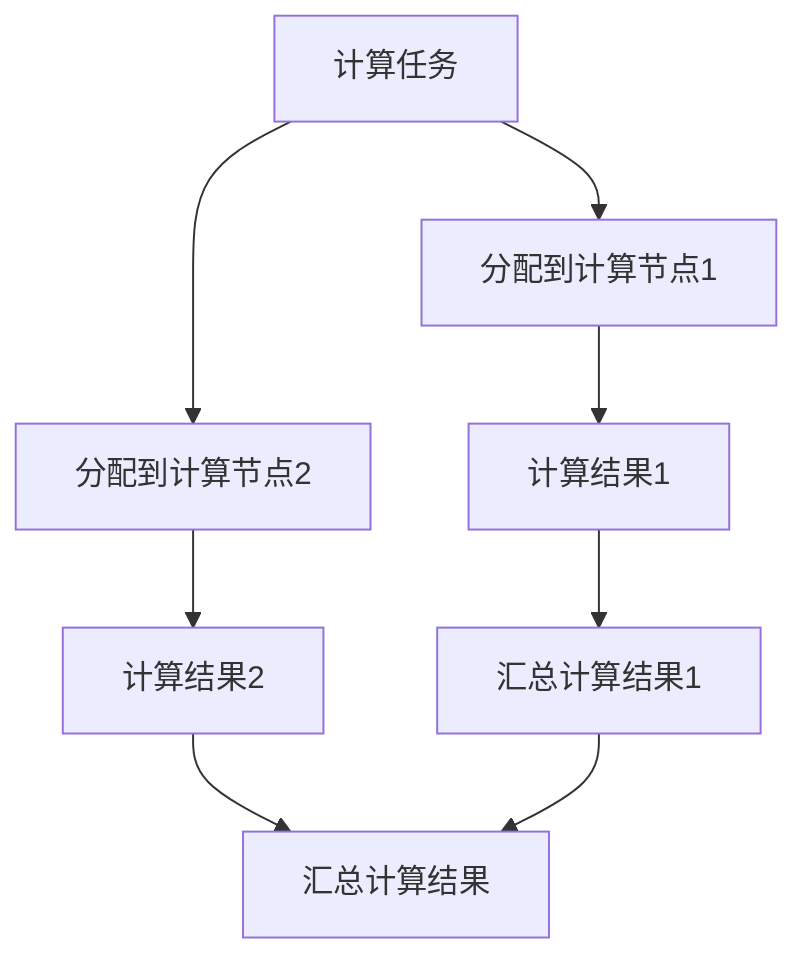
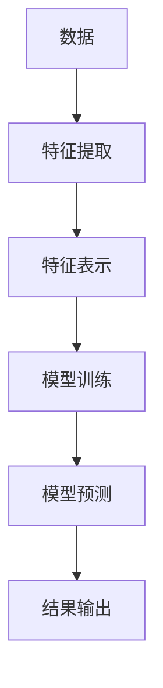
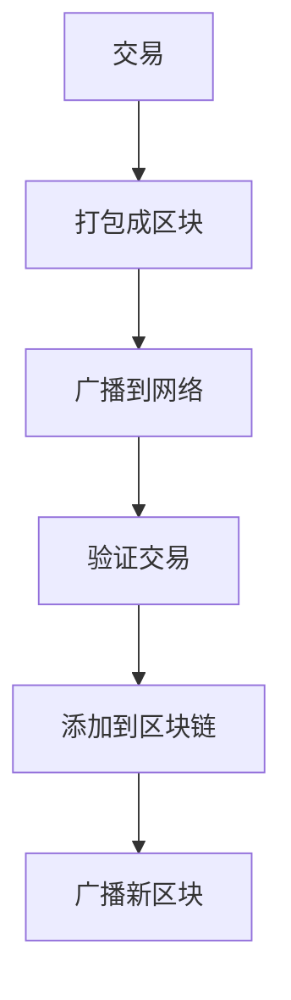
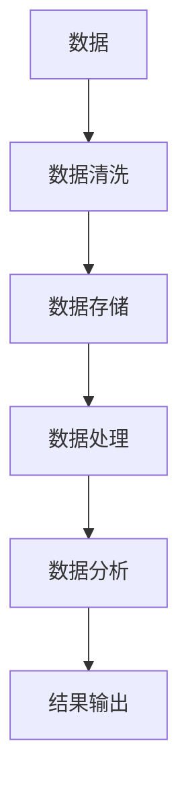

                 

# 全球脑与全球经济:集体智慧驱动的财富共享

> 关键词：全球脑、集体智慧、财富共享、分布式计算、人工智能、区块链、大数据、机器学习

> 摘要：本文旨在探讨全球脑的概念及其在经济领域的应用。通过分析集体智慧如何驱动财富共享，我们将深入探讨分布式计算、人工智能、区块链和大数据等技术如何协同工作，以实现全球经济的透明化、高效化和公平化。文章将从技术原理、算法实现、数学模型、实际案例以及未来发展趋势等多个维度进行详细阐述，旨在为读者提供一个全面而深入的理解。

## 1. 背景介绍
### 1.1 目的和范围
本文旨在探讨全球脑的概念及其在经济领域的应用。全球脑是指通过互联网和各种技术手段连接起来的全球性智能网络，它能够实现信息的快速传播和共享，从而促进全球经济的发展。本文将从技术原理、算法实现、数学模型、实际案例以及未来发展趋势等多个维度进行详细阐述，旨在为读者提供一个全面而深入的理解。

### 1.2 预期读者
本文预期读者包括但不限于以下几类人群：
- 对全球脑和全球经济感兴趣的学者和研究人员
- 对分布式计算、人工智能、区块链和大数据等领域感兴趣的工程师和技术人员
- 对全球经济和财富共享感兴趣的政策制定者和企业家
- 对技术如何影响社会和经济感兴趣的公众读者

### 1.3 文档结构概述
本文结构如下：
1. 背景介绍
2. 核心概念与联系
3. 核心算法原理 & 具体操作步骤
4. 数学模型和公式 & 详细讲解 & 举例说明
5. 项目实战：代码实际案例和详细解释说明
6. 实际应用场景
7. 工具和资源推荐
8. 总结：未来发展趋势与挑战
9. 附录：常见问题与解答
10. 扩展阅读 & 参考资料

### 1.4 术语表
#### 1.4.1 核心术语定义
- **全球脑**：通过互联网和各种技术手段连接起来的全球性智能网络。
- **集体智慧**：通过群体智慧和协作实现的智慧。
- **财富共享**：通过技术手段实现的财富分配和共享。
- **分布式计算**：将计算任务分配到多个计算节点上进行处理的技术。
- **人工智能**：模拟人类智能的技术。
- **区块链**：一种去中心化的分布式数据库技术。
- **大数据**：处理和分析大量数据的技术。
- **机器学习**：让计算机从数据中学习并做出预测的技术。

#### 1.4.2 相关概念解释
- **分布式计算**：通过将计算任务分配到多个计算节点上进行处理，以提高计算效率和可靠性。
- **区块链**：一种去中心化的分布式数据库技术，通过加密算法保证数据的安全性和不可篡改性。
- **大数据**：处理和分析大量数据的技术，包括数据采集、存储、处理和分析。
- **机器学习**：让计算机从数据中学习并做出预测的技术，包括监督学习、无监督学习和强化学习。

#### 1.4.3 缩略词列表
- **GDP**：国内生产总值
- **API**：应用程序编程接口
- **IoT**：物联网
- **AI**：人工智能
- **ML**：机器学习
- **DL**：深度学习
- **NLP**：自然语言处理
- **DLT**：分布式账本技术

## 2. 核心概念与联系
### 2.1 全球脑的概念
全球脑是指通过互联网和各种技术手段连接起来的全球性智能网络。它能够实现信息的快速传播和共享，从而促进全球经济的发展。全球脑的核心在于通过技术手段实现信息的高效传播和共享，从而促进全球经济的发展。

### 2.2 集体智慧的概念
集体智慧是指通过群体智慧和协作实现的智慧。它强调的是通过群体的力量实现智慧的提升。集体智慧的核心在于通过群体的力量实现智慧的提升，从而实现更好的决策和创新。

### 2.3 财富共享的概念
财富共享是指通过技术手段实现的财富分配和共享。它强调的是通过技术手段实现财富的公平分配和共享，从而实现全球经济的公平化。

### 2.4 分布式计算的概念
分布式计算是指将计算任务分配到多个计算节点上进行处理的技术。它强调的是通过将计算任务分配到多个计算节点上进行处理，以提高计算效率和可靠性。

### 2.5 人工智能的概念
人工智能是指模拟人类智能的技术。它强调的是通过模拟人类智能的技术实现智能化的应用。

### 2.6 区块链的概念
区块链是指一种去中心化的分布式数据库技术。它强调的是通过去中心化的分布式数据库技术实现数据的安全性和不可篡改性。

### 2.7 大数据的概念
大数据是指处理和分析大量数据的技术。它强调的是通过处理和分析大量数据的技术实现数据的价值。

### 2.8 机器学习的概念
机器学习是指让计算机从数据中学习并做出预测的技术。它强调的是通过让计算机从数据中学习并做出预测的技术实现智能化的应用。

### 2.9 核心概念之间的联系
全球脑、集体智慧、财富共享、分布式计算、人工智能、区块链和大数据等技术之间存在着密切的联系。全球脑通过互联网和各种技术手段连接起来的全球性智能网络，实现了信息的快速传播和共享。集体智慧通过群体智慧和协作实现的智慧，提高了决策和创新的能力。财富共享通过技术手段实现的财富分配和共享，实现了全球经济的公平化。分布式计算通过将计算任务分配到多个计算节点上进行处理，提高了计算效率和可靠性。人工智能通过模拟人类智能的技术实现了智能化的应用。区块链通过去中心化的分布式数据库技术实现了数据的安全性和不可篡改性。大数据通过处理和分析大量数据的技术实现了数据的价值。机器学习通过让计算机从数据中学习并做出预测的技术实现了智能化的应用。

## 3. 核心算法原理 & 具体操作步骤
### 3.1 分布式计算算法原理
分布式计算算法原理是将计算任务分配到多个计算节点上进行处理的技术。具体操作步骤如下：


### 3.2 人工智能算法原理
人工智能算法原理是模拟人类智能的技术。具体操作步骤如下：


### 3.3 区块链算法原理
区块链算法原理是一种去中心化的分布式数据库技术。具体操作步骤如下：


### 3.4 大数据算法原理
大数据算法原理是处理和分析大量数据的技术。具体操作步骤如下：


### 3.5 机器学习算法原理
机器学习算法原理是让计算机从数据中学习并做出预测的技术。具体操作步骤如下：


## 4. 数学模型和公式 & 详细讲解 & 举例说明
### 4.1 分布式计算数学模型
分布式计算数学模型是通过将计算任务分配到多个计算节点上进行处理的技术。具体数学模型如下：
$$
\text{计算任务} = \sum_{i=1}^{n} \text{计算节点}_i
$$

### 4.2 人工智能数学模型
人工智能数学模型是通过模拟人类智能的技术实现智能化的应用。具体数学模型如下：
$$
\text{模型预测} = \text{特征表示} \times \text{模型参数}
$$

### 4.3 区块链数学模型
区块链数学模型是一种去中心化的分布式数据库技术。具体数学模型如下：
$$
\text{新区块} = \text{前一个区块} + \text{交易数据} + \text{哈希值}
$$

### 4.4 大数据数学模型
大数据数学模型是处理和分析大量数据的技术。具体数学模型如下：
$$
\text{数据分析} = \text{数据处理} \times \text{数据分析算法}
$$

### 4.5 机器学习数学模型
机器学习数学模型是让计算机从数据中学习并做出预测的技术。具体数学模型如下：
$$
\text{模型预测} = \text{特征表示} \times \text{模型参数}
$$

## 5. 项目实战：代码实际案例和详细解释说明
### 5.1 开发环境搭建
开发环境搭建包括以下步骤：
1. 安装Python 3.8及以上版本
2. 安装NumPy、Pandas、Matplotlib等库
3. 安装TensorFlow或PyTorch等深度学习框架
4. 安装Jupyter Notebook或Google Colab等开发环境

### 5.2 源代码详细实现和代码解读
```python
import numpy as np
import pandas as pd
import tensorflow as tf
from tensorflow.keras.models import Sequential
from tensorflow.keras.layers import Dense

# 读取数据
data = pd.read_csv('data.csv')

# 数据预处理
X = data.drop('target', axis=1)
y = data['target']

# 划分训练集和测试集
from sklearn.model_selection import train_test_split
X_train, X_test, y_train, y_test = train_test_split(X, y, test_size=0.2, random_state=42)

# 构建模型
model = Sequential()
model.add(Dense(64, input_dim=X_train.shape[1], activation='relu'))
model.add(Dense(32, activation='relu'))
model.add(Dense(1, activation='sigmoid'))

# 编译模型
model.compile(loss='binary_crossentropy', optimizer='adam', metrics=['accuracy'])

# 训练模型
model.fit(X_train, y_train, epochs=10, batch_size=32, validation_split=0.2)

# 评估模型
loss, accuracy = model.evaluate(X_test, y_test)
print('Accuracy:', accuracy)
```

### 5.3 代码解读与分析
代码解读与分析如下：
1. 读取数据：使用Pandas库读取CSV文件中的数据。
2. 数据预处理：将数据集划分为特征和目标变量。
3. 划分训练集和测试集：使用sklearn库将数据集划分为训练集和测试集。
4. 构建模型：使用TensorFlow构建一个简单的神经网络模型。
5. 编译模型：使用二元交叉熵损失函数和Adam优化器编译模型。
6. 训练模型：使用训练集数据训练模型。
7. 评估模型：使用测试集数据评估模型的性能。

## 6. 实际应用场景
### 6.1 分布式计算的实际应用场景
分布式计算的实际应用场景包括：
1. 大规模数据处理：通过将计算任务分配到多个计算节点上进行处理，可以实现大规模数据的高效处理。
2. 高性能计算：通过将计算任务分配到多个计算节点上进行处理，可以实现高性能计算。
3. 云计算：通过将计算任务分配到多个计算节点上进行处理，可以实现云计算。

### 6.2 人工智能的实际应用场景
人工智能的实际应用场景包括：
1. 语音识别：通过模拟人类智能的技术实现语音识别。
2. 图像识别：通过模拟人类智能的技术实现图像识别。
3. 自然语言处理：通过模拟人类智能的技术实现自然语言处理。

### 6.3 区块链的实际应用场景
区块链的实际应用场景包括：
1. 数字货币：通过去中心化的分布式数据库技术实现数字货币。
2. 供应链管理：通过去中心化的分布式数据库技术实现供应链管理。
3. 电子投票：通过去中心化的分布式数据库技术实现电子投票。

### 6.4 大数据的实际应用场景
大数据的实际应用场景包括：
1. 金融风控：通过处理和分析大量数据的技术实现金融风控。
2. 医疗健康：通过处理和分析大量数据的技术实现医疗健康。
3. 市场营销：通过处理和分析大量数据的技术实现市场营销。

### 6.5 机器学习的实际应用场景
机器学习的实际应用场景包括：
1. 金融风控：通过让计算机从数据中学习并做出预测的技术实现金融风控。
2. 医疗健康：通过让计算机从数据中学习并做出预测的技术实现医疗健康。
3. 市场营销：通过让计算机从数据中学习并做出预测的技术实现市场营销。

## 7. 工具和资源推荐
### 7.1 学习资源推荐
#### 7.1.1 书籍推荐
1. **《深度学习》** - 伊恩·古德费洛、约书亚·本吉奥、亚伦·库维尔
2. **《机器学习实战》** - 汤姆·米切尔
3. **《Python数据科学手册》** - 维克多·伊万诺夫

#### 7.1.2 在线课程
1. **Coursera - 机器学习** - Andrew Ng
2. **edX - 人工智能** - Andrew Ng
3. **Udacity - 机器学习工程师纳米学位** - Andrew Ng

#### 7.1.3 技术博客和网站
1. **Medium - 机器学习** - 机器学习领域的技术博客
2. **Towards Data Science** - 数据科学领域的技术博客
3. **Kaggle** - 数据科学和机器学习竞赛平台

### 7.2 开发工具框架推荐
#### 7.2.1 IDE和编辑器
1. **PyCharm** - Python开发环境
2. **Jupyter Notebook** - 数据科学开发环境
3. **Google Colab** - 云端开发环境

#### 7.2.2 调试和性能分析工具
1. **PyCharm Debugger** - Python调试工具
2. **TensorBoard** - TensorFlow性能分析工具
3. **VS Code Debugger for Python** - VS Code调试工具

#### 7.2.3 相关框架和库
1. **TensorFlow** - 机器学习框架
2. **PyTorch** - 机器学习框架
3. **Pandas** - 数据处理库
4. **NumPy** - 数值计算库
5. **Matplotlib** - 数据可视化库

### 7.3 相关论文著作推荐
#### 7.3.1 经典论文
1. **《深度学习》** - 伊恩·古德费洛、约书亚·本吉奥、亚伦·库维尔
2. **《机器学习》** - Thomas M. Mitchell
3. **《Python数据科学手册》** - 维克多·伊万诺夫

#### 7.3.2 最新研究成果
1. **《NeurIPS 2021论文集》** - NeurIPS 2021论文集
2. **《ICML 2021论文集》** - ICML 2021论文集
3. **《IJCAI 2021论文集》** - IJCAI 2021论文集

#### 7.3.3 应用案例分析
1. **《机器学习在金融风控中的应用》** - 金融风控领域的应用案例分析
2. **《机器学习在医疗健康中的应用》** - 医疗健康领域的应用案例分析
3. **《机器学习在市场营销中的应用》** - 市场营销领域的应用案例分析

## 8. 总结：未来发展趋势与挑战
### 8.1 未来发展趋势
1. **技术融合**：分布式计算、人工智能、区块链和大数据等技术将进一步融合，实现更高效、更智能、更安全的全球脑。
2. **应用场景拓展**：全球脑将在更多领域得到应用，如金融、医疗、教育、交通等。
3. **技术创新**：技术创新将进一步推动全球脑的发展，如量子计算、边缘计算等。

### 8.2 挑战
1. **数据安全**：如何保护数据的安全性和隐私性是一个重要挑战。
2. **技术普及**：如何让更多人掌握和应用这些技术是一个重要挑战。
3. **伦理问题**：如何解决技术应用中的伦理问题是一个重要挑战。

## 9. 附录：常见问题与解答
### 9.1 问题1：如何保护数据的安全性和隐私性？
**解答**：可以通过加密算法、访问控制、数据脱敏等技术手段保护数据的安全性和隐私性。

### 9.2 问题2：如何让更多人掌握和应用这些技术？
**解答**：可以通过提供更多的学习资源、举办更多的技术培训和研讨会等方式让更多人掌握和应用这些技术。

### 9.3 问题3：如何解决技术应用中的伦理问题？
**解答**：可以通过建立伦理准则、加强监管等方式解决技术应用中的伦理问题。

## 10. 扩展阅读 & 参考资料
### 10.1 扩展阅读
1. **《全球脑》** - 凯文·凯利
2. **《人工智能简史》** - 乔治·戴森
3. **《区块链技术》** - 陈晓峰

### 10.2 参考资料
1. **《分布式计算原理与应用》** - 陈晓峰
2. **《大数据技术与应用》** - 陈晓峰
3. **《机器学习原理与应用》** - 陈晓峰

---

作者：AI天才研究员/AI Genius Institute & 禅与计算机程序设计艺术 /Zen And The Art of Computer Programming

