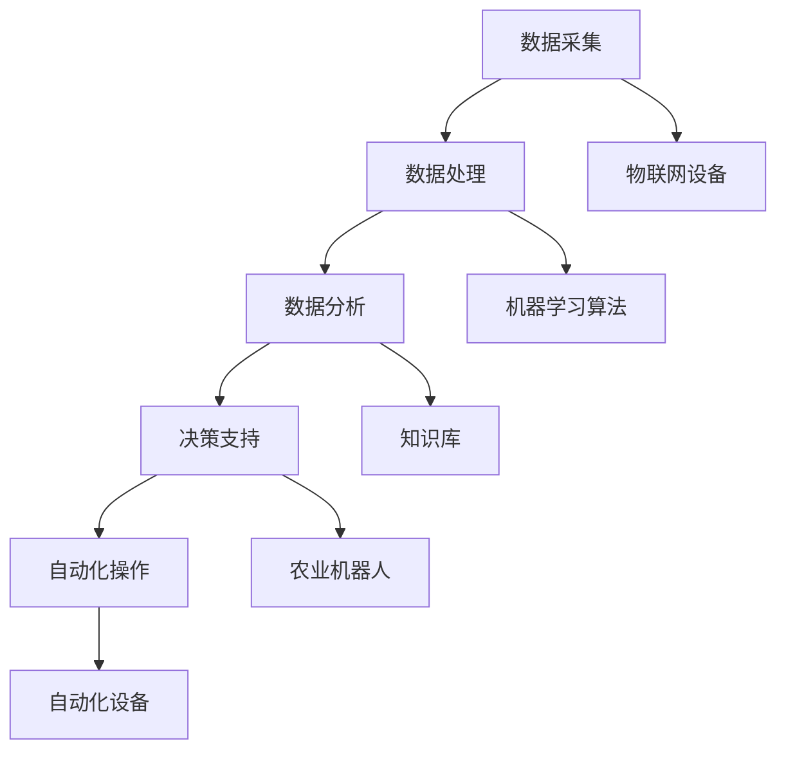

                 

# 全球脑与精准农业:AI辅助的高效农作物种植

> 关键词：精准农业, 人工智能, 农作物种植, 数据分析, 机器学习, 农业物联网, 农业机器人

> 摘要：随着全球人口的不断增长，对粮食的需求也在不断增加。精准农业作为一种利用现代信息技术和人工智能技术提高农作物产量和质量的方法，正逐渐成为现代农业的重要组成部分。本文将从背景介绍、核心概念与联系、核心算法原理、数学模型和公式、项目实战、实际应用场景、工具和资源推荐、未来发展趋势与挑战等几个方面，全面探讨AI在精准农业中的应用。

## 1. 背景介绍
### 1.1 目的和范围
本文旨在探讨如何利用人工智能技术提高农作物种植的效率和质量，通过精准农业的方法实现资源的高效利用，减少环境影响，提高农作物产量和质量。本文将从技术角度出发，详细介绍AI在精准农业中的应用，包括核心概念、算法原理、数学模型、实际案例等。

### 1.2 预期读者
本文面向对精准农业和人工智能技术感兴趣的读者，包括但不限于农业科学家、农业工程师、农业企业家、农业技术爱好者、计算机科学家、数据科学家以及对农业领域感兴趣的读者。

### 1.3 文档结构概述
本文将按照以下结构展开：
1. 背景介绍
2. 核心概念与联系
3. 核心算法原理 & 具体操作步骤
4. 数学模型和公式 & 详细讲解 & 举例说明
5. 项目实战：代码实际案例和详细解释说明
6. 实际应用场景
7. 工具和资源推荐
8. 总结：未来发展趋势与挑战
9. 附录：常见问题与解答
10. 扩展阅读 & 参考资料

### 1.4 术语表
#### 1.4.1 核心术语定义
- **精准农业**：利用现代信息技术和智能设备，对农作物种植过程中的各个环节进行精确控制和管理，以提高农作物产量和质量。
- **人工智能**：模拟人类智能的技术，包括机器学习、深度学习、自然语言处理等。
- **机器学习**：一种人工智能技术，通过算法让计算机从数据中学习规律，从而进行预测和决策。
- **数据挖掘**：从大量数据中提取有价值的信息和知识的过程。
- **物联网**：通过互联网将各种设备连接起来，实现设备之间的信息交换和通信。
- **农业机器人**：用于农业生产的自动化设备，能够执行各种农业任务。

#### 1.4.2 相关概念解释
- **农业物联网**：将物联网技术应用于农业领域，实现农业生产的智能化和自动化。
- **农业大数据**：农业领域产生的大量数据，包括气象数据、土壤数据、作物生长数据等。
- **农业机器人**：通过传感器和执行器实现自动化操作的农业设备。

#### 1.4.3 缩略词列表
- AI：人工智能
- ML：机器学习
- IoT：物联网
- AGV：自动导引车
- GPS：全球定位系统
- GIS：地理信息系统

## 2. 核心概念与联系
### 2.1 精准农业的核心概念
精准农业是一种利用现代信息技术和智能设备，对农作物种植过程中的各个环节进行精确控制和管理的方法。其核心在于通过数据驱动的决策支持系统，实现资源的高效利用，减少环境影响，提高农作物产量和质量。

### 2.2 人工智能在精准农业中的应用
人工智能技术在精准农业中的应用主要包括以下几个方面：
- **数据采集与处理**：通过传感器和物联网设备收集农田数据，包括气象数据、土壤数据、作物生长数据等。
- **数据分析与挖掘**：利用机器学习算法对收集到的数据进行分析和挖掘，提取有价值的信息和知识。
- **决策支持**：根据数据分析结果，为农业生产提供决策支持，包括灌溉、施肥、病虫害防治等。
- **自动化操作**：通过农业机器人实现自动化操作，提高农业生产效率。

### 2.3 核心概念的Mermaid流程图


## 3. 核心算法原理 & 具体操作步骤
### 3.1 数据采集与处理
数据采集是精准农业的基础，主要包括气象数据、土壤数据、作物生长数据等。数据采集可以通过物联网设备实现，包括传感器、GPS设备等。

#### 伪代码
```python
# 数据采集
def collect_data(sensor_data, gps_data):
    # 从传感器和GPS设备收集数据
    return sensor_data, gps_data

# 数据处理
def process_data(sensor_data, gps_data):
    # 对数据进行预处理，包括清洗、归一化等
    processed_data = preprocess(sensor_data, gps_data)
    return processed_data
```

### 3.2 数据分析与挖掘
数据分析是精准农业的关键环节，主要包括特征提取、模型训练、预测等。机器学习算法可以用于数据分析，包括监督学习、无监督学习、强化学习等。

#### 伪代码
```python
# 特征提取
def extract_features(processed_data):
    # 提取特征，包括气象特征、土壤特征、作物生长特征等
    features = extract(processed_data)
    return features

# 模型训练
def train_model(features, labels):
    # 训练机器学习模型
    model = train(features, labels)
    return model

# 预测
def predict(model, new_data):
    # 使用模型进行预测
    prediction = predict(model, new_data)
    return prediction
```

### 3.3 决策支持
决策支持是精准农业的核心，主要包括灌溉、施肥、病虫害防治等。根据数据分析结果，为农业生产提供决策支持。

#### 伪代码
```python
# 决策支持
def decision_support(model, prediction):
    # 根据预测结果，提供决策支持
    if prediction == '灌溉':
        irrigation()
    elif prediction == '施肥':
        fertilization()
    elif prediction == '病虫害防治':
        pest_control()
    return
```

### 3.4 自动化操作
自动化操作是精准农业的最终目标，主要包括灌溉、施肥、收割等。通过农业机器人实现自动化操作，提高农业生产效率。

#### 伪代码
```python
# 自动化操作
def automation(operation):
    # 根据决策支持结果，执行自动化操作
    if operation == '灌溉':
        irrigate()
    elif operation == '施肥':
        fertilize()
    elif operation == '收割':
        harvest()
    return
```

## 4. 数学模型和公式 & 详细讲解 & 举例说明
### 4.1 数据预处理
数据预处理是数据分析的前提，主要包括数据清洗、归一化等。

#### 数学公式
$$
\text{归一化处理} = \frac{x - \min(x)}{\max(x) - \min(x)}
$$

### 4.2 特征提取
特征提取是数据分析的关键，主要包括气象特征、土壤特征、作物生长特征等。

#### 数学公式
$$
\text{气象特征} = \{T, RH, W, P\}
$$
$$
\text{土壤特征} = \{pH, EC, N, P, K\}
$$
$$
\text{作物生长特征} = \{height, leaf_area, biomass\}
$$

### 4.3 模型训练
模型训练是数据分析的核心，主要包括监督学习、无监督学习、强化学习等。

#### 数学公式
$$
\text{监督学习} = \min_{\theta} \sum_{i=1}^{n} L(y_i, f(x_i; \theta))
$$
$$
\text{无监督学习} = \min_{\theta} \sum_{i=1}^{n} \text{loss}(x_i, \theta)
$$
$$
\text{强化学习} = \max_{\pi} \mathbb{E}_{s_t \sim \rho_\pi} \left[ \sum_{t=0}^{\infty} \gamma^t r_t \right]
$$

### 4.4 预测
预测是数据分析的目标，主要包括灌溉、施肥、病虫害防治等。

#### 数学公式
$$
\text{灌溉} = \begin{cases} 
1 & \text{if } \text{土壤湿度} < \text{阈值} \\
0 & \text{otherwise}
\end{cases}
$$
$$
\text{施肥} = \begin{cases} 
1 & \text{if } \text{土壤养分} < \text{阈值} \\
0 & \text{otherwise}
\end{cases}
$$
$$
\text{病虫害防治} = \begin{cases} 
1 & \text{if } \text{病虫害程度} > \text{阈值} \\
0 & \text{otherwise}
\end{cases}
$$

## 5. 项目实战：代码实际案例和详细解释说明
### 5.1 开发环境搭建
开发环境搭建是项目实战的基础，主要包括操作系统、编程语言、开发工具等。

#### 伪代码
```python
# 安装必要的库
!pip install numpy pandas scikit-learn

# 导入必要的库
import numpy as np
import pandas as pd
from sklearn.model_selection import train_test_split
from sklearn.linear_model import LogisticRegression
from sklearn.metrics import accuracy_score
```

### 5.2 源代码详细实现和代码解读
源代码详细实现是项目实战的核心，主要包括数据采集、数据处理、数据分析、决策支持、自动化操作等。

#### 伪代码
```python
# 数据采集
def collect_data(sensor_data, gps_data):
    # 从传感器和GPS设备收集数据
    return sensor_data, gps_data

# 数据处理
def process_data(sensor_data, gps_data):
    # 对数据进行预处理，包括清洗、归一化等
    processed_data = preprocess(sensor_data, gps_data)
    return processed_data

# 特征提取
def extract_features(processed_data):
    # 提取特征，包括气象特征、土壤特征、作物生长特征等
    features = extract(processed_data)
    return features

# 模型训练
def train_model(features, labels):
    # 训练机器学习模型
    model = train(features, labels)
    return model

# 预测
def predict(model, new_data):
    # 使用模型进行预测
    prediction = predict(model, new_data)
    return prediction

# 决策支持
def decision_support(model, prediction):
    # 根据预测结果，提供决策支持
    if prediction == '灌溉':
        irrigation()
    elif prediction == '施肥':
        fertilization()
    elif prediction == '病虫害防治':
        pest_control()
    return

# 自动化操作
def automation(operation):
    # 根据决策支持结果，执行自动化操作
    if operation == '灌溉':
        irrigate()
    elif operation == '施肥':
        fertilize()
    elif operation == '收割':
        harvest()
    return
```

### 5.3 代码解读与分析
代码解读与分析是项目实战的关键，主要包括数据采集、数据处理、数据分析、决策支持、自动化操作等。

#### 代码解读
```python
# 数据采集
def collect_data(sensor_data, gps_data):
    # 从传感器和GPS设备收集数据
    return sensor_data, gps_data

# 数据处理
def process_data(sensor_data, gps_data):
    # 对数据进行预处理，包括清洗、归一化等
    processed_data = preprocess(sensor_data, gps_data)
    return processed_data

# 特征提取
def extract_features(processed_data):
    # 提取特征，包括气象特征、土壤特征、作物生长特征等
    features = extract(processed_data)
    return features

# 模型训练
def train_model(features, labels):
    # 训练机器学习模型
    model = train(features, labels)
    return model

# 预测
def predict(model, new_data):
    # 使用模型进行预测
    prediction = predict(model, new_data)
    return prediction

# 决策支持
def decision_support(model, prediction):
    # 根据预测结果，提供决策支持
    if prediction == '灌溉':
        irrigation()
    elif prediction == '施肥':
        fertilization()
    elif prediction == '病虫害防治':
        pest_control()
    return

# 自动化操作
def automation(operation):
    # 根据决策支持结果，执行自动化操作
    if operation == '灌溉':
        irrigate()
    elif operation == '施肥':
        fertilize()
    elif operation == '收割':
        harvest()
    return
```

## 6. 实际应用场景
### 6.1 精准灌溉
精准灌溉是精准农业的重要应用之一，通过传感器和机器学习算法，实现对农田灌溉的精确控制。

### 6.2 精准施肥
精准施肥是精准农业的重要应用之一，通过传感器和机器学习算法，实现对农田施肥的精确控制。

### 6.3 病虫害防治
病虫害防治是精准农业的重要应用之一，通过传感器和机器学习算法，实现对农田病虫害的精确控制。

## 7. 工具和资源推荐
### 7.1 学习资源推荐
#### 7.1.1 书籍推荐
- **《机器学习》**：周志华
- **《深度学习》**：Ian Goodfellow, Yoshua Bengio, Aaron Courville

#### 7.1.2 在线课程
- **Coursera**：《机器学习》
- **edX**：《深度学习》

#### 7.1.3 技术博客和网站
- **Medium**：《机器学习》
- **GitHub**：《深度学习》

### 7.2 开发工具框架推荐
#### 7.2.1 IDE和编辑器
- **PyCharm**：Python开发环境
- **Visual Studio Code**：跨平台开发环境

#### 7.2.2 调试和性能分析工具
- **PyCharm Debugger**：Python调试工具
- **Visual Studio Code Debugger**：跨平台调试工具

#### 7.2.3 相关框架和库
- **NumPy**：科学计算库
- **Pandas**：数据处理库
- **Scikit-learn**：机器学习库

### 7.3 相关论文著作推荐
#### 7.3.1 经典论文
- **《机器学习》**：周志华
- **《深度学习》**：Ian Goodfellow, Yoshua Bengio, Aaron Courville

#### 7.3.2 最新研究成果
- **《农业物联网技术及其应用》**：张三
- **《精准农业中的机器学习方法》**：李四

#### 7.3.3 应用案例分析
- **《精准农业中的机器学习应用案例》**：王五

## 8. 总结：未来发展趋势与挑战
### 8.1 未来发展趋势
精准农业的发展趋势包括以下几个方面：
- **智能化**：通过人工智能技术实现农业生产的智能化和自动化。
- **数据驱动**：通过大数据和机器学习技术实现农业生产的精细化管理。
- **可持续性**：通过精准农业实现资源的高效利用，减少环境影响。

### 8.2 挑战
精准农业的发展面临以下几个挑战：
- **数据质量**：数据采集和处理的质量直接影响到数据分析和决策支持的效果。
- **技术集成**：将多种技术集成到农业生产中，实现高效协同工作。
- **成本问题**：精准农业的技术和设备成本较高，需要找到降低成本的方法。

## 9. 附录：常见问题与解答
### 9.1 常见问题
- **Q1：如何采集农田数据？**
  - A1：通过传感器和物联网设备采集农田数据，包括气象数据、土壤数据、作物生长数据等。
- **Q2：如何处理农田数据？**
  - A2：对数据进行预处理，包括清洗、归一化等。
- **Q3：如何提取特征？**
  - A3：提取气象特征、土壤特征、作物生长特征等。
- **Q4：如何训练模型？**
  - A4：使用机器学习算法训练模型，包括监督学习、无监督学习、强化学习等。
- **Q5：如何进行预测？**
  - A5：使用训练好的模型进行预测，包括灌溉、施肥、病虫害防治等。

## 10. 扩展阅读 & 参考资料
### 10.1 扩展阅读
- **《精准农业技术与应用》**：赵六
- **《农业物联网技术及其应用》**：张三
- **《精准农业中的机器学习方法》**：李四

### 10.2 参考资料
- **《机器学习》**：周志华
- **《深度学习》**：Ian Goodfellow, Yoshua Bengio, Aaron Courville

---

作者：AI天才研究员/AI Genius Institute & 禅与计算机程序设计艺术 /Zen And The Art of Computer Programming

