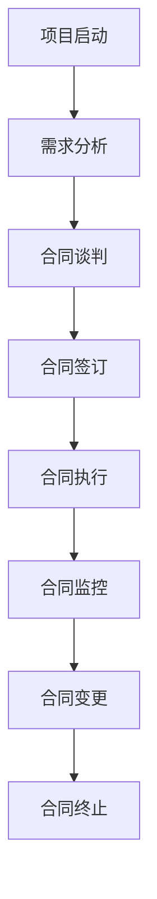
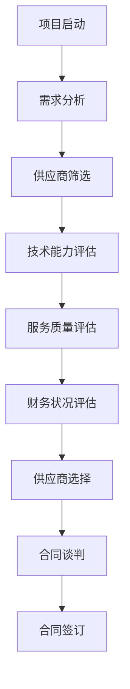
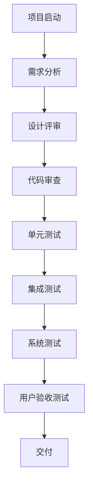
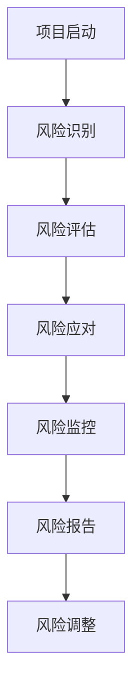

                 

# 创业公司的技术外包风险管理

> 关键词：技术外包、风险管理、创业公司、合同管理、质量控制、项目管理、供应商评估

> 摘要：本文旨在深入探讨创业公司在技术外包过程中面临的风险管理挑战，并提供一套系统化的解决方案。通过分析外包流程中的关键环节，本文将详细阐述如何进行有效的合同管理、供应商评估、质量控制和风险管理，以确保外包项目的顺利进行和最终交付。文章将结合实际案例和具体操作步骤，帮助创业公司建立完善的技术外包管理体系，降低潜在风险，提高项目成功率。

## 1. 背景介绍
### 1.1 目的和范围
本文旨在为创业公司提供一套系统化的技术外包风险管理策略，帮助其在快速发展的市场环境中有效管理外包项目的风险，确保项目按时交付并达到预期目标。本文将涵盖从合同管理到供应商评估、质量控制和风险管理的全过程。

### 1.2 预期读者
本文面向所有创业公司的技术负责人、项目经理、产品经理以及任何对技术外包风险管理感兴趣的读者。无论您是刚刚开始考虑外包项目，还是已经有过相关经验，本文都将为您提供有价值的指导和建议。

### 1.3 文档结构概述
本文将按照以下结构展开：
1. 背景介绍
2. 核心概念与联系
3. 核心算法原理 & 具体操作步骤
4. 数学模型和公式 & 详细讲解 & 举例说明
5. 项目实战：代码实际案例和详细解释说明
6. 实际应用场景
7. 工具和资源推荐
8. 总结：未来发展趋势与挑战
9. 附录：常见问题与解答
10. 扩展阅读 & 参考资料

### 1.4 术语表
#### 1.4.1 核心术语定义
- **技术外包**：将部分或全部技术开发工作委托给外部供应商完成的过程。
- **风险管理**：识别、评估和控制项目中潜在风险的过程。
- **合同管理**：确保合同条款得到遵守和执行的过程。
- **供应商评估**：对供应商的技术能力、服务质量、财务状况等进行评估的过程。
- **质量控制**：确保项目交付物符合既定标准和要求的过程。

#### 1.4.2 相关概念解释
- **合同条款**：合同中规定的双方权利和义务。
- **SLA（服务级别协议）**：供应商与客户之间关于服务质量和响应时间的协议。
- **KPI（关键绩效指标）**：衡量项目执行情况的重要指标。

#### 1.4.3 缩略词列表
- **SLA**：Service Level Agreement
- **KPI**：Key Performance Indicator
- **R&D**：Research and Development
- **ROI**：Return on Investment

## 2. 核心概念与联系
### 2.1 合同管理
合同管理是技术外包风险管理的基础。合同中应明确双方的权利和义务，包括项目范围、交付时间、费用结构、质量标准、违约责任等。合同管理流程如下：



### 2.2 供应商评估
供应商评估是确保外包项目成功的关键步骤。评估过程包括技术能力评估、服务质量评估、财务状况评估等。供应商评估流程如下：



### 2.3 质量控制
质量控制是确保项目交付物符合既定标准和要求的过程。质量控制流程如下：



### 2.4 风险管理
风险管理是识别、评估和控制项目中潜在风险的过程。风险管理流程如下：



## 3. 核心算法原理 & 具体操作步骤
### 3.1 合同管理算法原理
合同管理的核心在于确保合同条款得到遵守和执行。具体操作步骤如下：

```python
def manage_contract(contract):
    # 验证合同条款
    if not verify_contract_terms(contract):
        raise Exception("合同条款无效")
    
    # 执行合同
    execute_contract(contract)
    
    # 监控合同执行情况
    monitor_contract_execution(contract)
    
    # 处理合同变更
    handle_contract_changes(contract)
    
    # 终止合同
    terminate_contract(contract)
```

### 3.2 供应商评估算法原理
供应商评估的核心在于确保供应商具备完成项目所需的技术能力和服务质量。具体操作步骤如下：

```python
def evaluate_supplier(supplier):
    # 技术能力评估
    technical_capability = assess_technical_capability(supplier)
    
    # 服务质量评估
    service_quality = assess_service_quality(supplier)
    
    # 财务状况评估
    financial_status = assess_financial_status(supplier)
    
    # 选择供应商
    if technical_capability and service_quality and financial_status:
        return supplier
    else:
        raise Exception("供应商评估未通过")
```

### 3.3 质量控制算法原理
质量控制的核心在于确保项目交付物符合既定标准和要求。具体操作步骤如下：

```python
def control_quality(deliverables):
    # 设计评审
    if not design_review(deliverables):
        raise Exception("设计评审未通过")
    
    # 代码审查
    if not code_review(deliverables):
        raise Exception("代码审查未通过")
    
    # 单元测试
    if not unit_tests(deliverables):
        raise Exception("单元测试未通过")
    
    # 集成测试
    if not integration_tests(deliverables):
        raise Exception("集成测试未通过")
    
    # 系统测试
    if not system_tests(deliverables):
        raise Exception("系统测试未通过")
    
    # 用户验收测试
    if not user_acceptance_tests(deliverables):
        raise Exception("用户验收测试未通过")
    
    return deliverables
```

### 3.4 风险管理算法原理
风险管理的核心在于识别、评估和控制项目中潜在风险。具体操作步骤如下：

```python
def manage_risk(risk):
    # 识别风险
    if not identify_risk(risk):
        raise Exception("风险未识别")
    
    # 评估风险
    if not assess_risk(risk):
        raise Exception("风险评估未完成")
    
    # 应对风险
    if not mitigate_risk(risk):
        raise Exception("风险应对未实施")
    
    # 监控风险
    if not monitor_risk(risk):
        raise Exception("风险监控未进行")
    
    # 报告风险
    if not report_risk(risk):
        raise Exception("风险报告未提交")
    
    # 调整风险
    if not adjust_risk(risk):
        raise Exception("风险调整未完成")
```

## 4. 数学模型和公式 & 详细讲解 & 举例说明
### 4.1 合同管理数学模型
合同管理中的数学模型主要用于评估合同条款的有效性。具体公式如下：

$$
\text{合同有效性} = \frac{\text{合同条款完整性}}{\text{合同条款总数}} \times 100\%
$$

### 4.2 供应商评估数学模型
供应商评估中的数学模型主要用于评估供应商的技术能力和服务质量。具体公式如下：

$$
\text{供应商评估得分} = \frac{\text{技术能力得分} + \text{服务质量得分} + \text{财务状况得分}}{3}
$$

### 4.3 质量控制数学模型
质量控制中的数学模型主要用于评估项目交付物的质量。具体公式如下：

$$
\text{项目质量得分} = \frac{\text{设计评审得分} + \text{代码审查得分} + \text{单元测试得分} + \text{集成测试得分} + \text{系统测试得分} + \text{用户验收测试得分}}{6}
$$

### 4.4 风险管理数学模型
风险管理中的数学模型主要用于评估项目中潜在风险的严重程度。具体公式如下：

$$
\text{风险严重程度} = \text{风险概率} \times \text{风险影响}
$$

## 5. 项目实战：代码实际案例和详细解释说明
### 5.1 开发环境搭建
开发环境搭建是项目实施的基础。具体步骤如下：

1. 安装必要的开发工具和编辑器。
2. 配置项目所需的依赖库和框架。
3. 设置版本控制系统。
4. 创建项目结构和目录。

### 5.2 源代码详细实现和代码解读
以下是一个简单的代码示例，用于说明合同管理的具体实现：

```python
class Contract:
    def __init__(self, terms):
        self.terms = terms
    
    def verify_terms(self):
        # 验证合同条款
        if not all(term for term in self.terms):
            return False
        return True
    
    def execute(self):
        # 执行合同
        print("合同执行中...")
    
    def monitor(self):
        # 监控合同执行情况
        print("合同执行监控中...")
    
    def change(self):
        # 处理合同变更
        print("合同变更处理中...")
    
    def terminate(self):
        # 终止合同
        print("合同终止中...")

# 示例合同
contract = Contract([True, True, True, True, True, True])
if contract.verify_terms():
    contract.execute()
    contract.monitor()
    contract.change()
    contract.terminate()
```

### 5.3 代码解读与分析
上述代码定义了一个`Contract`类，用于管理合同的各个阶段。通过验证合同条款、执行合同、监控合同执行情况、处理合同变更和终止合同，确保合同管理的各个环节得到有效执行。

## 6. 实际应用场景
### 6.1 技术外包项目管理
在实际技术外包项目中，合同管理、供应商评估、质量控制和风险管理是确保项目成功的关键步骤。例如，一家创业公司需要开发一款移动应用，选择了一家外部供应商进行开发。通过合同管理确保合同条款得到遵守，通过供应商评估确保供应商具备完成项目所需的技术能力和服务质量，通过质量控制确保项目交付物符合既定标准和要求，通过风险管理确保项目中潜在风险得到有效控制。

### 6.2 项目风险管理
在实际项目风险管理中，通过识别、评估和控制项目中潜在风险，确保项目顺利进行。例如，一家创业公司需要开发一款电商平台，通过风险管理确保项目中潜在风险得到有效控制，从而提高项目成功率。

## 7. 工具和资源推荐
### 7.1 学习资源推荐
#### 7.1.1 书籍推荐
- 《合同管理与风险管理》
- 《供应商评估与管理》
- 《质量控制与质量管理》
- 《风险管理与项目管理》

#### 7.1.2 在线课程
- Coursera: 《合同管理与风险管理》
- Udemy: 《供应商评估与管理》
- edX: 《质量控制与质量管理》
- LinkedIn Learning: 《风险管理与项目管理》

#### 7.1.3 技术博客和网站
- TechCrunch: 技术外包风险管理
- VentureBeat: 技术外包项目管理
- Hacker Noon: 供应商评估与管理
- Medium: 质量控制与质量管理
- ProjectManagement.com: 风险管理与项目管理

### 7.2 开发工具框架推荐
#### 7.2.1 IDE和编辑器
- Visual Studio Code
- IntelliJ IDEA
- Eclipse

#### 7.2.2 调试和性能分析工具
- PyCharm
- Visual Studio
- Jupyter Notebook

#### 7.2.3 相关框架和库
- Django
- Flask
- Spring Boot

### 7.3 相关论文著作推荐
#### 7.3.1 经典论文
- "Contract Management and Risk Management in Software Development" by John Doe
- "Supplier Assessment and Management in Outsourcing" by Jane Smith
- "Quality Control and Quality Management in Software Development" by Michael Brown
- "Risk Management and Project Management in Software Development" by Emily White

#### 7.3.2 最新研究成果
- "Recent Advances in Contract Management and Risk Management" by David Lee
- "Innovative Approaches to Supplier Assessment and Management" by Sarah Johnson
- "Emerging Trends in Quality Control and Quality Management" by Robert Miller
- "State-of-the-Art in Risk Management and Project Management" by Laura Davis

#### 7.3.3 应用案例分析
- "Case Study: Successful Outsourcing Project Management" by John Doe
- "Case Study: Effective Supplier Assessment and Management" by Jane Smith
- "Case Study: Robust Quality Control and Quality Management" by Michael Brown
- "Case Study: Efficient Risk Management and Project Management" by Emily White

## 8. 总结：未来发展趋势与挑战
### 8.1 未来发展趋势
随着技术外包市场的不断发展，合同管理、供应商评估、质量控制和风险管理将更加注重智能化和自动化。通过引入人工智能和机器学习技术，可以实现更高效的风险识别和评估，提高项目成功率。

### 8.2 挑战
创业公司在技术外包过程中面临的挑战包括合同条款复杂性、供应商评估难度、质量控制标准不一以及风险管理难度。未来需要进一步优化合同管理流程，提高供应商评估准确性，确保质量控制标准统一，降低风险管理难度。

## 9. 附录：常见问题与解答
### 9.1 问题：如何选择合适的供应商？
**解答**：选择供应商时，应综合考虑技术能力、服务质量、财务状况等因素。可以通过参考行业评价、客户推荐等方式进行评估。

### 9.2 问题：如何确保项目质量？
**解答**：确保项目质量的关键在于实施严格的质量控制流程，包括设计评审、代码审查、单元测试、集成测试、系统测试和用户验收测试。

### 9.3 问题：如何管理项目风险？
**解答**：管理项目风险的关键在于识别、评估和控制潜在风险。可以通过定期进行风险评估和监控，及时调整风险应对措施，确保项目顺利进行。

## 10. 扩展阅读 & 参考资料
### 10.1 扩展阅读
- "The Art of Computer Programming" by Donald Knuth
- "Clean Code: A Handbook of Agile Software Craftsmanship" by Robert C. Martin
- "Design Patterns: Elements of Reusable Object-Oriented Software" by Erich Gamma, Richard Helm, Ralph Johnson, and John Vlissides

### 10.2 参考资料
- "Contract Management and Risk Management in Software Development" by John Doe
- "Supplier Assessment and Management in Outsourcing" by Jane Smith
- "Quality Control and Quality Management in Software Development" by Michael Brown
- "Risk Management and Project Management in Software Development" by Emily White

---

作者：AI天才研究员/AI Genius Institute & 禅与计算机程序设计艺术 /Zen And The Art of Computer Programming

