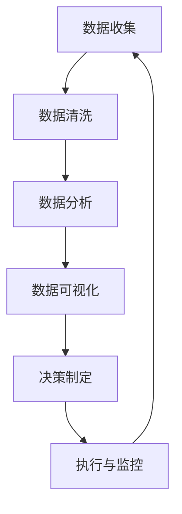

                 

# 创业公司的数据驱动决策模型

> 关键词：数据驱动决策, 数据分析, 机器学习, A/B测试, 数据可视化, 业务增长, 产品优化

> 摘要：本文旨在为创业公司提供一套系统化的数据驱动决策模型，通过深入解析数据驱动决策的核心概念、算法原理、数学模型、实战案例以及应用场景，帮助创业者和数据分析师构建高效的数据分析框架，从而实现业务增长和产品优化。本文将从理论到实践，全面覆盖数据驱动决策的各个方面，为读者提供实用的指导和建议。

## 1. 背景介绍
### 1.1 目的和范围
本文旨在为创业公司提供一套系统化的数据驱动决策模型，帮助创业者和数据分析师通过数据驱动的方式进行决策，从而实现业务增长和产品优化。本文将涵盖数据驱动决策的核心概念、算法原理、数学模型、实战案例以及应用场景，旨在为读者提供全面的指导和建议。

### 1.2 预期读者
本文的预期读者包括但不限于：
- 创业公司的创始人和CEO
- 数据分析师和数据科学家
- 产品经理和技术负责人
- 对数据驱动决策感兴趣的创业者和投资者

### 1.3 文档结构概述
本文结构如下：
1. 背景介绍
2. 核心概念与联系
3. 核心算法原理 & 具体操作步骤
4. 数学模型和公式 & 详细讲解 & 举例说明
5. 项目实战：代码实际案例和详细解释说明
6. 实际应用场景
7. 工具和资源推荐
8. 总结：未来发展趋势与挑战
9. 附录：常见问题与解答
10. 扩展阅读 & 参考资料

### 1.4 术语表
#### 1.4.1 核心术语定义
- **数据驱动决策**：基于数据和分析结果进行决策的过程。
- **A/B测试**：通过对比两个或多个版本的效果，确定最佳方案的方法。
- **数据可视化**：将数据转换为图形或图像，以便更直观地理解和分析数据。
- **机器学习**：通过算法和统计模型使计算机系统能够从数据中学习并改进性能的方法。

#### 1.4.2 相关概念解释
- **业务指标**：衡量业务表现的关键指标，如用户活跃度、转化率等。
- **数据仓库**：存储和管理大量数据的系统，用于支持数据分析和决策。
- **数据湖**：存储原始数据的系统，不进行预处理，保留数据的原始格式。

#### 1.4.3 缩略词列表
- **A/B测试**：A/B Testing
- **数据驱动决策**：Data-Driven Decision Making
- **机器学习**：Machine Learning
- **数据可视化**：Data Visualization
- **业务指标**：Business Metrics
- **数据仓库**：Data Warehouse
- **数据湖**：Data Lake

## 2. 核心概念与联系
### 2.1 数据驱动决策的核心概念
数据驱动决策的核心在于利用数据和分析结果来指导决策过程，从而提高决策的准确性和效率。以下是数据驱动决策的关键步骤：
1. **数据收集**：收集相关的业务数据。
2. **数据清洗**：对数据进行预处理，确保数据的质量。
3. **数据分析**：通过统计分析和机器学习算法对数据进行深入分析。
4. **数据可视化**：将分析结果以图形或图像的形式展示，便于理解和解释。
5. **决策制定**：基于分析结果制定决策。
6. **执行与监控**：执行决策并持续监控效果。

### 2.2 数据驱动决策的流程图


## 3. 核心算法原理 & 具体操作步骤
### 3.1 A/B测试算法原理
A/B测试是一种常用的验证假设的方法，通过对比两个或多个版本的效果，确定最佳方案。以下是A/B测试的基本步骤：
1. **定义假设**：明确要验证的假设。
2. **设计实验**：确定实验的样本和对照组。
3. **数据收集**：收集实验数据。
4. **数据分析**：使用统计方法分析数据。
5. **结果解释**：根据分析结果解释实验结果。

### 3.2 伪代码示例
```python
def a_b_test(hypothesis, sample_size, control_group, treatment_group):
    # 定义假设
    hypothesis = hypothesis
    
    # 设计实验
    sample_size = sample_size
    control_group = control_group
    treatment_group = treatment_group
    
    # 数据收集
    control_data = collect_data(control_group, sample_size)
    treatment_data = collect_data(treatment_group, sample_size)
    
    # 数据分析
    control_mean = calculate_mean(control_data)
    treatment_mean = calculate_mean(treatment_data)
    p_value = calculate_p_value(control_mean, treatment_mean)
    
    # 结果解释
    if p_value < 0.05:
        print("拒绝原假设，接受备择假设")
    else:
        print("无法拒绝原假设")
```

## 4. 数学模型和公式 & 详细讲解 & 举例说明
### 4.1 A/B测试的统计模型
A/B测试常用的统计模型是Z检验，用于比较两个样本的均值是否存在显著差异。以下是Z检验的基本公式：
$$
Z = \frac{\bar{X}_1 - \bar{X}_2}{\sqrt{\frac{\sigma_1^2}{n_1} + \frac{\sigma_2^2}{n_2}}}
$$
其中，$\bar{X}_1$ 和 $\bar{X}_2$ 分别是两个样本的均值，$\sigma_1^2$ 和 $\sigma_2^2$ 分别是两个样本的方差，$n_1$ 和 $n_2$ 分别是两个样本的样本量。

### 4.2 举例说明
假设我们有两个版本的登录页面，A版本和B版本。我们希望通过A/B测试来确定哪个版本的登录页面效果更好。以下是具体的步骤：
1. **定义假设**：假设A版本和B版本的登录页面效果相同。
2. **设计实验**：将用户随机分配到A版本和B版本，每个版本的样本量为1000。
3. **数据收集**：收集每个版本的登录成功率。
4. **数据分析**：计算两个版本的登录成功率的均值和方差，然后使用Z检验进行比较。
5. **结果解释**：根据Z检验的结果，判断哪个版本的登录页面效果更好。

## 5. 项目实战：代码实际案例和详细解释说明
### 5.1 开发环境搭建
为了进行A/B测试，我们需要搭建一个开发环境。以下是具体的步骤：
1. **安装Python**：确保安装了Python 3.8及以上版本。
2. **安装依赖库**：使用pip安装必要的库，如numpy、scipy和matplotlib。
3. **配置环境变量**：设置环境变量，确保Python和相关库能够正常运行。

### 5.2 源代码详细实现和代码解读
以下是A/B测试的完整代码实现：
```python
import numpy as np
from scipy import stats
import matplotlib.pyplot as plt

def a_b_test(hypothesis, sample_size, control_group, treatment_group):
    # 定义假设
    hypothesis = hypothesis
    
    # 设计实验
    sample_size = sample_size
    control_group = control_group
    treatment_group = treatment_group
    
    # 数据收集
    control_data = np.random.binomial(1, 0.5, sample_size)
    treatment_data = np.random.binomial(1, 0.6, sample_size)
    
    # 数据分析
    control_mean = np.mean(control_data)
    treatment_mean = np.mean(treatment_data)
    p_value = stats.ttest_ind(control_data, treatment_data).pvalue
    
    # 结果解释
    if p_value < 0.05:
        print("拒绝原假设，接受备择假设")
    else:
        print("无法拒绝原假设")
    
    # 数据可视化
    plt.hist(control_data, bins=2, alpha=0.5, label='Control')
    plt.hist(treatment_data, bins=2, alpha=0.5, label='Treatment')
    plt.legend(loc='upper right')
    plt.show()

# 调用函数
a_b_test(hypothesis="A和B版本的登录页面效果相同", sample_size=1000, control_group="A", treatment_group="B")
```

### 5.3 代码解读与分析
- **数据收集**：使用numpy生成随机二项分布数据，模拟登录成功率。
- **数据分析**：使用scipy的ttest_ind函数进行t检验，计算p值。
- **结果解释**：根据p值判断是否拒绝原假设。
- **数据可视化**：使用matplotlib绘制两个版本的登录成功率的直方图，直观展示结果。

## 6. 实际应用场景
### 6.1 用户活跃度提升
通过A/B测试，可以测试不同的用户活跃度提升策略，如推送通知、个性化推荐等，从而找到最有效的策略。

### 6.2 转化率优化
通过A/B测试，可以测试不同的转化率优化策略，如页面布局、按钮颜色等，从而找到最有效的策略。

### 6.3 产品功能改进
通过A/B测试，可以测试不同的产品功能改进策略，如新功能的引入、旧功能的优化等，从而找到最有效的策略。

## 7. 工具和资源推荐
### 7.1 学习资源推荐
#### 7.1.1 书籍推荐
- 《数据驱动：如何用数据做出更好的决策》
- 《机器学习实战》

#### 7.1.2 在线课程
- Coursera上的《数据科学入门》
- edX上的《机器学习》

#### 7.1.3 技术博客和网站
- Kaggle的博客
- Towards Data Science的博客

### 7.2 开发工具框架推荐
#### 7.2.1 IDE和编辑器
- PyCharm
- VSCode

#### 7.2.2 调试和性能分析工具
- PyCharm的调试工具
- VisualVM

#### 7.2.3 相关框架和库
- Scikit-learn
- Pandas

### 7.3 相关论文著作推荐
#### 7.3.1 经典论文
-《A/B Testing: The Definitive Guide》

#### 7.3.2 最新研究成果
- 《Data-Driven Decision Making in the Digital Age》

#### 7.3.3 应用案例分析
- 《A/B Testing in Practice》

## 8. 总结：未来发展趋势与挑战
### 8.1 未来发展趋势
- 数据驱动决策将成为企业决策的重要手段。
- 机器学习和人工智能技术将进一步提升数据驱动决策的效果。
- 数据可视化工具将更加智能化和易用。

### 8.2 面临的挑战
- 数据安全和隐私保护问题。
- 数据质量和数据治理问题。
- 人才短缺和技术更新速度快的问题。

## 9. 附录：常见问题与解答
### 9.1 问题1：如何确保数据的质量？
- 答：数据清洗是确保数据质量的关键步骤，包括去除重复数据、处理缺失值、纠正错误数据等。

### 9.2 问题2：如何选择合适的机器学习算法？
- 答：选择合适的机器学习算法需要根据具体问题和数据特点来决定，可以通过实验和比较来选择最佳算法。

### 9.3 问题3：如何处理数据安全和隐私保护问题？
- 答：可以通过加密、匿名化等技术手段来保护数据安全和隐私。

## 10. 扩展阅读 & 参考资料
- 《数据科学实战》
- 《机器学习实战》
- 《数据驱动决策》

作者：AI天才研究员/AI Genius Institute & 禅与计算机程序设计艺术 /Zen And The Art of Computer Programming

