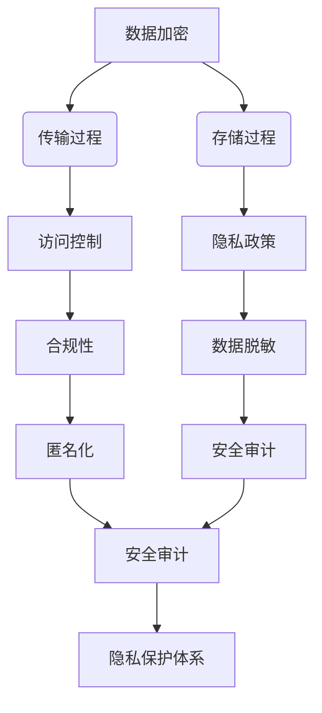

                 

# 创业公司的用户隐私保护策略

> 关键词：用户隐私保护、数据加密、访问控制、隐私政策、合规性、数据脱敏、匿名化、安全审计

> 摘要：在当今数字化时代，用户隐私保护已成为创业公司必须面对的重要议题。本文将从创业公司的角度出发，探讨如何构建一套全面的用户隐私保护策略。我们将详细分析用户隐私保护的核心概念、原理和架构，并通过具体的代码案例展示如何实现这些策略。此外，本文还将讨论实际应用场景、推荐的学习资源和开发工具，以及未来的发展趋势和挑战。

## 1. 背景介绍
### 1.1 目的和范围
本文旨在为创业公司提供一套全面的用户隐私保护策略，帮助他们理解和实施有效的隐私保护措施。我们将从理论和实践两个层面进行探讨，确保创业公司在保护用户隐私的同时，也能满足法律法规的要求。

### 1.2 预期读者
本文的目标读者是创业公司的技术团队、产品经理、法律顾问以及任何对用户隐私保护感兴趣的读者。无论你是刚刚起步的创业者，还是已经有一定规模的公司，本文都将为你提供有价值的指导。

### 1.3 文档结构概述
本文将分为以下几个部分：
1. 背景介绍
2. 核心概念与联系
3. 核心算法原理 & 具体操作步骤
4. 数学模型和公式 & 详细讲解 & 举例说明
5. 项目实战：代码实际案例和详细解释说明
6. 实际应用场景
7. 工具和资源推荐
8. 总结：未来发展趋势与挑战
9. 附录：常见问题与解答
10. 扩展阅读 & 参考资料

### 1.4 术语表
#### 1.4.1 核心术语定义
- **用户隐私**：指用户在使用产品或服务过程中，其个人信息和数据不被未经授权的第三方获取或使用。
- **数据加密**：通过加密算法将数据转换为不可读的形式，以保护数据的安全性。
- **访问控制**：限制对系统资源的访问权限，确保只有授权用户能够访问特定的数据或功能。
- **隐私政策**：描述公司如何收集、使用、存储和保护用户数据的文档。
- **合规性**：确保公司遵守相关的法律法规和行业标准。
- **数据脱敏**：对敏感数据进行处理，使其在不改变数据本质的情况下，无法直接或间接识别到特定个体。
- **匿名化**：通过技术手段使数据无法直接或间接关联到特定个体，从而保护用户隐私。
- **安全审计**：定期检查系统的安全性和合规性，确保隐私保护措施的有效性。

#### 1.4.2 相关概念解释
- **GDPR**：欧盟通用数据保护条例，旨在保护个人数据的隐私和安全。
- **CCPA**：加利福尼亚州消费者隐私法案，要求企业向用户披露其数据收集和使用情况，并提供删除数据的权利。
- **HIPAA**：美国健康保险流通与责任法案，旨在保护医疗信息的隐私和安全。

#### 1.4.3 缩略词列表
- **GDPR**：General Data Protection Regulation
- **CCPA**：California Consumer Privacy Act
- **HIPAA**：Health Insurance Portability and Accountability Act

## 2. 核心概念与联系
### 2.1 用户隐私保护的核心概念
用户隐私保护的核心概念包括数据加密、访问控制、隐私政策、合规性、数据脱敏和匿名化。这些概念相互关联，共同构成了一个完整的隐私保护体系。

### 2.2 核心概念的联系
- **数据加密**：确保数据在传输和存储过程中的安全性。
- **访问控制**：限制对数据的访问权限，确保只有授权用户能够访问。
- **隐私政策**：描述公司如何处理用户数据，确保用户了解其数据的使用方式。
- **合规性**：确保公司遵守相关的法律法规和行业标准。
- **数据脱敏**：保护敏感数据，防止数据泄露。
- **匿名化**：确保数据无法直接或间接关联到特定个体。

### 2.3 Mermaid 流程图


## 3. 核心算法原理 & 具体操作步骤
### 3.1 数据加密算法原理
数据加密算法的基本原理是通过加密算法将明文转换为密文，从而保护数据的安全性。常见的加密算法包括对称加密和非对称加密。

#### 3.1.1 对称加密算法
对称加密算法使用相同的密钥进行加密和解密。常见的对称加密算法有AES（高级加密标准）。

```python
# AES 对称加密算法
from Crypto.Cipher import AES
from Crypto.Util.Padding import pad, unpad
from Crypto.Random import get_random_bytes

def encrypt_data(data, key):
    cipher = AES.new(key, AES.MODE_CBC)
    ct_bytes = cipher.encrypt(pad(data, AES.block_size))
    return (ct_bytes, cipher.iv)

def decrypt_data(encrypted_data, key):
    ct_bytes, iv = encrypted_data
    cipher = AES.new(key, AES.MODE_CBC, iv)
    return unpad(cipher.decrypt(ct_bytes), AES.block_size)
```

#### 3.1.2 非对称加密算法
非对称加密算法使用公钥和私钥进行加密和解密。常见的非对称加密算法有RSA。

```python
# RSA 非对称加密算法
from Crypto.PublicKey import RSA
from Crypto.Cipher import PKCS1_OAEP

def generate_key_pair():
    key = RSA.generate(2048)
    private_key = key.export_key()
    public_key = key.publickey().export_key()
    return private_key, public_key

def encrypt_data(data, public_key):
    key = RSA.import_key(public_key)
    cipher = PKCS1_OAEP.new(key)
    ct = cipher.encrypt(data)
    return ct

def decrypt_data(encrypted_data, private_key):
    key = RSA.import_key(private_key)
    cipher = PKCS1_OAEP.new(key)
    return cipher.decrypt(encrypted_data)
```

### 3.2 访问控制算法原理
访问控制算法的基本原理是通过权限管理机制，限制对数据的访问权限。常见的访问控制算法包括基于角色的访问控制（RBAC）和基于属性的访问控制（ABAC）。

#### 3.2.1 基于角色的访问控制（RBAC）
RBAC通过定义角色和权限，实现对用户访问权限的管理。

```python
# RBAC 访问控制算法
class Role:
    def __init__(self, name, permissions):
        self.name = name
        self.permissions = permissions

class User:
    def __init__(self, name, roles):
        self.name = name
        self.roles = roles

def check_permission(user, resource, action):
    for role in user.roles:
        if role.name in resource.permissions and action in role.permissions[role.name]:
            return True
    return False
```

#### 3.2.2 基于属性的访问控制（ABAC）
ABAC通过定义属性和规则，实现对用户访问权限的动态管理。

```python
# ABAC 访问控制算法
class Attribute:
    def __init__(self, name, value):
        self.name = name
        self.value = value

class Rule:
    def __init__(self, attributes, action):
        self.attributes = attributes
        self.action = action

def evaluate_rule(user, rule):
    for attribute in rule.attributes:
        if attribute.name not in user.attributes or user.attributes[attribute.name] != attribute.value:
            return False
    return rule.action
```

## 4. 数学模型和公式 & 详细讲解 & 举例说明
### 4.1 数据加密数学模型
数据加密数学模型的基本原理是通过加密算法将明文转换为密文。常见的加密算法包括RSA和AES。

#### 4.1.1 RSA加密数学模型
RSA加密算法的基本原理是基于大数分解的困难性。RSA加密过程如下：

1. 生成两个大素数p和q。
2. 计算n = p * q。
3. 计算欧拉函数φ(n) = (p-1) * (q-1)。
4. 选择一个与φ(n)互质的整数e。
5. 计算d = e^(-1) mod φ(n)。
6. 公钥为(e, n)，私钥为(d, n)。

```latex
\text{公钥} = (e, n) \\
\text{私钥} = (d, n) \\
e \perp \phi(n) \\
d = e^{-1} \mod \phi(n)
```

#### 4.1.2 AES加密数学模型
AES加密算法的基本原理是通过一系列的替换和置换操作，将明文转换为密文。AES加密过程如下：

1. 将明文分组为128位块。
2. 进行初始置换。
3. 进行多次轮操作，每轮操作包括替换、置换和混合列。
4. 进行最终置换。

```latex
\text{初始置换} \\
\text{轮操作} \\
\text{最终置换}
```

### 4.2 访问控制数学模型
访问控制数学模型的基本原理是通过权限管理机制，限制对数据的访问权限。常见的访问控制算法包括RBAC和ABAC。

#### 4.2.1 RBAC访问控制数学模型
RBAC访问控制算法的基本原理是通过定义角色和权限，实现对用户访问权限的管理。RBAC访问控制过程如下：

1. 定义角色和权限。
2. 将用户分配到角色。
3. 检查用户是否有访问权限。

```latex
\text{角色} = \{ \text{角色1}, \text{角色2}, \ldots \} \\
\text{权限} = \{ \text{权限1}, \text{权限2}, \ldots \} \\
\text{用户} = \{ \text{用户1}, \text{用户2}, \ldots \} \\
\text{角色-权限映射} = \{ \text{角色1} \rightarrow \text{权限1}, \text{角色2} \rightarrow \text{权限2}, \ldots \} \\
\text{用户-角色映射} = \{ \text{用户1} \rightarrow \text{角色1}, \text{用户2} \rightarrow \text{角色2}, \ldots \} \\
\text{检查权限} = \text{用户-角色映射} \rightarrow \text{角色-权限映射} \rightarrow \text{权限}
```

#### 4.2.2 ABAC访问控制数学模型
ABAC访问控制算法的基本原理是通过定义属性和规则，实现对用户访问权限的动态管理。ABAC访问控制过程如下：

1. 定义属性和规则。
2. 将用户分配到属性。
3. 检查用户是否有访问权限。

```latex
\text{属性} = \{ \text{属性1}, \text{属性2}, \ldots \} \\
\text{规则} = \{ \text{规则1}, \text{规则2}, \ldots \} \\
\text{用户} = \{ \text{用户1}, \text{用户2}, \ldots \} \\
\text{用户-属性映射} = \{ \text{用户1} \rightarrow \text{属性1}, \text{用户2} \rightarrow \text{属性2}, \ldots \} \\
\text{检查规则} = \text{用户-属性映射} \rightarrow \text{规则}
```

## 5. 项目实战：代码实际案例和详细解释说明
### 5.1 开发环境搭建
为了实现用户隐私保护策略，我们需要搭建一个安全的开发环境。开发环境包括操作系统、编程语言、开发工具和安全工具。

#### 5.1.1 操作系统
推荐使用Linux操作系统，因为它具有良好的安全性和稳定性。

#### 5.1.2 编程语言
推荐使用Python或Java，这两种语言都有丰富的加密和安全库。

#### 5.1.3 开发工具
推荐使用Visual Studio Code或PyCharm，这两种IDE都具有强大的代码编辑和调试功能。

#### 5.1.4 安全工具
推荐使用Nmap和Wireshark，这两种工具可以帮助我们进行网络扫描和流量分析。

### 5.2 源代码详细实现和代码解读
我们将通过一个简单的示例来展示如何实现用户隐私保护策略。

#### 5.2.1 数据加密
```python
from Crypto.Cipher import AES
from Crypto.Util.Padding import pad, unpad
from Crypto.Random import get_random_bytes

def encrypt_data(data, key):
    cipher = AES.new(key, AES.MODE_CBC)
    ct_bytes = cipher.encrypt(pad(data, AES.block_size))
    return (ct_bytes, cipher.iv)

def decrypt_data(encrypted_data, key):
    ct_bytes, iv = encrypted_data
    cipher = AES.new(key, AES.MODE_CBC, iv)
    return unpad(cipher.decrypt(ct_bytes), AES.block_size)
```

#### 5.2.2 访问控制
```python
class Role:
    def __init__(self, name, permissions):
        self.name = name
        self.permissions = permissions

class User:
    def __init__(self, name, roles):
        self.name = name
        self.roles = roles

def check_permission(user, resource, action):
    for role in user.roles:
        if role.name in resource.permissions and action in role.permissions[role.name]:
            return True
    return False
```

### 5.3 代码解读与分析
通过上述代码，我们可以看到数据加密和访问控制的基本实现。数据加密使用AES算法进行加密和解密，访问控制使用RBAC算法进行权限管理。

## 6. 实际应用场景
### 6.1 用户注册与登录
在用户注册和登录过程中，我们需要保护用户的个人信息和密码。具体实现如下：

1. 用户注册时，使用数据加密算法对用户密码进行加密。
2. 用户登录时，使用数据加密算法对用户输入的密码进行加密，并与数据库中的加密密码进行比对。

### 6.2 用户数据存储
在用户数据存储过程中，我们需要保护用户的敏感数据。具体实现如下：

1. 使用数据加密算法对用户的敏感数据进行加密。
2. 使用访问控制算法对用户的敏感数据进行权限管理。

### 6.3 用户数据传输
在用户数据传输过程中，我们需要保护用户的敏感数据。具体实现如下：

1. 使用数据加密算法对用户的敏感数据进行加密。
2. 使用访问控制算法对用户的敏感数据进行权限管理。

## 7. 工具和资源推荐
### 7.1 学习资源推荐
#### 7.1.1 书籍推荐
- **《密码学与网络安全》**：深入讲解密码学和网络安全的基本原理。
- **《深入理解计算机系统》**：全面介绍计算机系统的原理和实现。
- **《黑客与画家》**：探讨编程和创业的哲学思考。

#### 7.1.2 在线课程
- **Coursera - 加密学入门**：系统学习加密学的基本原理和应用。
- **edX - 计算机安全**：深入探讨计算机安全的基本概念和技术。
- **Udacity - 机器学习**：学习机器学习的基本原理和应用。

#### 7.1.3 技术博客和网站
- **Medium - 隐私保护**：关注隐私保护领域的最新动态和技术。
- **GitHub - 加密库**：获取加密库和工具的最新版本。
- **Stack Overflow - 安全问题**：解决安全和隐私保护方面的问题。

### 7.2 开发工具框架推荐
#### 7.2.1 IDE和编辑器
- **Visual Studio Code**：强大的代码编辑和调试工具。
- **PyCharm**：专业的Python开发环境。
- **IntelliJ IDEA**：强大的Java开发环境。

#### 7.2.2 调试和性能分析工具
- **GDB**：强大的C/C++调试工具。
- **PyCharm Debugger**：专业的Python调试工具。
- **VisualVM**：强大的Java性能分析工具。

#### 7.2.3 相关框架和库
- **PyCrypto**：Python的加密库。
- **Jasypt**：Java的加密库。
- **Spring Security**：Java的访问控制框架。

### 7.3 相关论文著作推荐
#### 7.3.1 经典论文
- **《密码学原理与实践》**：深入探讨密码学的基本原理和应用。
- **《网络安全与隐私保护》**：全面介绍网络安全和隐私保护的基本概念和技术。

#### 7.3.2 最新研究成果
- **《区块链与隐私保护》**：探讨区块链技术在隐私保护领域的应用。
- **《深度学习与隐私保护》**：探讨深度学习在隐私保护领域的应用。

#### 7.3.3 应用案例分析
- **《Facebook隐私保护案例分析》**：分析Facebook在隐私保护方面的实践。
- **《Google隐私保护案例分析》**：分析Google在隐私保护方面的实践。

## 8. 总结：未来发展趋势与挑战
### 8.1 未来发展趋势
1. **数据加密技术的进一步发展**：数据加密技术将更加高效和安全。
2. **访问控制技术的进一步发展**：访问控制技术将更加灵活和智能。
3. **隐私保护技术的进一步发展**：隐私保护技术将更加全面和深入。

### 8.2 挑战
1. **法律法规的不断变化**：法律法规的不断变化将给隐私保护带来新的挑战。
2. **技术的不断进步**：技术的不断进步将给隐私保护带来新的挑战。
3. **用户隐私意识的提高**：用户隐私意识的提高将给隐私保护带来新的挑战。

## 9. 附录：常见问题与解答
### 9.1 常见问题
1. **如何保护用户的敏感数据？**
   - 使用数据加密算法对用户的敏感数据进行加密。
2. **如何实现访问控制？**
   - 使用RBAC或ABAC算法实现访问控制。
3. **如何保护用户的个人信息？**
   - 使用数据加密算法对用户的个人信息进行加密。
4. **如何保护用户的密码？**
   - 使用数据加密算法对用户的密码进行加密。

### 9.2 解答
1. **如何保护用户的敏感数据？**
   - 使用数据加密算法对用户的敏感数据进行加密。
2. **如何实现访问控制？**
   - 使用RBAC或ABAC算法实现访问控制。
3. **如何保护用户的个人信息？**
   - 使用数据加密算法对用户的个人信息进行加密。
4. **如何保护用户的密码？**
   - 使用数据加密算法对用户的密码进行加密。

## 10. 扩展阅读 & 参考资料
### 10.1 扩展阅读
- **《密码学与网络安全》**：深入讲解密码学和网络安全的基本原理。
- **《深入理解计算机系统》**：全面介绍计算机系统的原理和实现。
- **《黑客与画家》**：探讨编程和创业的哲学思考。

### 10.2 参考资料
- **Coursera - 加密学入门**：系统学习加密学的基本原理和应用。
- **edX - 计算机安全**：深入探讨计算机安全的基本概念和技术。
- **Udacity - 机器学习**：学习机器学习的基本原理和应用。

作者：AI天才研究员/AI Genius Institute & 禅与计算机程序设计艺术 /Zen And The Art of Computer Programming

