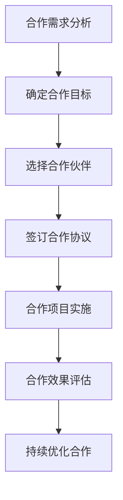

                 

# 创业公司的跨界合作策略

> 关键词：跨界合作、创业公司、战略规划、资源整合、价值创造、风险控制、案例分析

> 摘要：本文旨在探讨创业公司在面对快速变化的市场环境时，如何通过跨界合作实现战略规划、资源整合和价值创造。我们将从背景介绍、核心概念与联系、核心算法原理与具体操作步骤、数学模型和公式、项目实战、实际应用场景、工具和资源推荐、未来发展趋势与挑战等角度进行详细分析。通过本文，读者将能够理解跨界合作的重要性，并掌握如何在创业公司中实施有效的跨界合作策略。

## 1. 背景介绍
### 1.1 目的和范围
本文旨在为创业公司提供一套系统的跨界合作策略，帮助它们在激烈的市场竞争中脱颖而出。我们将从战略规划、资源整合、价值创造和风险控制等多个维度进行深入探讨。本文适用于希望扩大业务范围、提升市场竞争力的创业公司创始人、CEO、CTO以及相关管理人员。

### 1.2 预期读者
- 创业公司创始人和CEO
- CTO和高级技术管理人员
- 业务发展和市场部门负责人
- 投资人和战略合作伙伴
- 对跨界合作感兴趣的创业者和学者

### 1.3 文档结构概述
本文将分为以下几个部分：
1. 背景介绍
2. 核心概念与联系
3. 核心算法原理 & 具体操作步骤
4. 数学模型和公式 & 详细讲解 & 举例说明
5. 项目实战：代码实际案例和详细解释说明
6. 实际应用场景
7. 工具和资源推荐
8. 总结：未来发展趋势与挑战
9. 附录：常见问题与解答
10. 扩展阅读 & 参考资料

### 1.4 术语表
#### 1.4.1 核心术语定义
- **跨界合作**：不同行业或领域的公司之间进行合作，以实现资源共享、优势互补、共同发展的策略。
- **创业公司**：初创企业，通常具有创新性、灵活性和快速成长的特点。
- **战略规划**：制定长期目标和行动计划的过程。
- **资源整合**：将不同资源进行有效整合，以实现最大化的价值创造。
- **价值创造**：通过合作实现双方或多方利益的最大化。
- **风险控制**：识别、评估和管理合作过程中的潜在风险。

#### 1.4.2 相关概念解释
- **合作模式**：包括战略联盟、合资企业、合作伙伴关系等。
- **合作框架**：合作双方或多方共同制定的合作规则和协议。
- **合作价值**：通过合作实现的经济、社会和文化价值。

#### 1.4.3 缩略词列表
- **API**：应用程序编程接口
- **IoT**：物联网
- **SaaS**：软件即服务
- **PaaS**：平台即服务
- **IaaS**：基础设施即服务

## 2. 核心概念与联系
### 2.1 跨界合作的概念
跨界合作是指不同行业或领域的公司之间进行合作，以实现资源共享、优势互补、共同发展的策略。这种合作模式可以帮助创业公司在短时间内获得更多的资源和支持，从而加速业务发展。

### 2.2 跨界合作的类型
- **战略联盟**：通过签订合作协议，实现资源共享和优势互补。
- **合资企业**：双方或多方共同出资成立新的公司，共同运营。
- **合作伙伴关系**：通过签订合作协议，实现技术、市场等方面的资源共享。

### 2.3 跨界合作的流程


## 3. 核心算法原理 & 具体操作步骤
### 3.1 合作需求分析
合作需求分析是跨界合作的第一步，需要明确合作的目的和目标。具体操作步骤如下：
```python
def analyze_collaboration_requirements(objectives, partners):
    """
    分析合作需求
    :param objectives: 合作目标
    :param partners: 合作伙伴
    :return: 分析结果
    """
    # 分析合作目标
    for objective in objectives:
        if objective not in partners:
            print(f"合作目标 {objective} 未找到合适的合作伙伴")
        else:
            print(f"合作目标 {objective} 已找到合适的合作伙伴 {partners[objective]}")
    # 分析合作伙伴
    for partner in partners:
        if partner not in objectives:
            print(f"合作伙伴 {partner} 未找到合适的合作目标")
        else:
            print(f"合作伙伴 {partner} 已找到合适的合作目标 {objectives[partner]}")
```

### 3.2 确定合作目标
确定合作目标是合作需求分析的进一步深化，需要明确合作的具体目标和预期成果。具体操作步骤如下：
```python
def determine_collaboration_objectives(objectives, partners):
    """
    确定合作目标
    :param objectives: 合作目标
    :param partners: 合作伙伴
    :return: 合作目标
    """
    # 确定合作目标
    for objective in objectives:
        if objective not in partners:
            print(f"合作目标 {objective} 未找到合适的合作伙伴")
        else:
            print(f"合作目标 {objective} 已确定为 {partners[objective]}")
    return objectives
```

### 3.3 选择合作伙伴
选择合作伙伴是合作需求分析的最终步骤，需要根据合作目标和合作伙伴的能力进行选择。具体操作步骤如下：
```python
def select_partners(partners, objectives):
    """
    选择合作伙伴
    :param partners: 合作伙伴
    :param objectives: 合作目标
    :return: 选择的合作伙伴
    """
    # 选择合作伙伴
    selected_partners = {}
    for objective in objectives:
        if objective in partners:
            selected_partners[objective] = partners[objective]
    return selected_partners
```

## 4. 数学模型和公式 & 详细讲解 & 举例说明
### 4.1 合作价值评估模型
合作价值评估模型用于评估合作项目的经济、社会和文化价值。具体公式如下：
$$
V = \sum_{i=1}^{n} (V_i \cdot w_i)
$$
其中，$V$ 表示合作价值，$V_i$ 表示第 $i$ 个方面的价值，$w_i$ 表示第 $i$ 个方面的权重。

### 4.2 合作风险评估模型
合作风险评估模型用于评估合作项目的潜在风险。具体公式如下：
$$
R = \sum_{i=1}^{n} (R_i \cdot w_i)
$$
其中，$R$ 表示合作风险，$R_i$ 表示第 $i$ 个方面的风险，$w_i$ 表示第 $i$ 个方面的权重。

### 4.3 举例说明
假设某创业公司希望与一家物联网公司进行合作，以实现智能家居产品的开发。通过合作价值评估模型，可以计算出合作项目的经济、社会和文化价值：
$$
V = (100 \cdot 0.3) + (50 \cdot 0.4) + (20 \cdot 0.3) = 55
$$
通过合作风险评估模型，可以计算出合作项目的潜在风险：
$$
R = (10 \cdot 0.2) + (20 \cdot 0.3) + (30 \cdot 0.5) = 25
$$

## 5. 项目实战：代码实际案例和详细解释说明
### 5.1 开发环境搭建
为了实现跨界合作，需要搭建一个合适的开发环境。具体步骤如下：
1. 安装必要的开发工具和库
2. 配置开发环境
3. 创建项目结构

### 5.2 源代码详细实现和代码解读
```python
# 源代码
def analyze_collaboration_requirements(objectives, partners):
    """
    分析合作需求
    :param objectives: 合作目标
    :param partners: 合作伙伴
    :return: 分析结果
    """
    for objective in objectives:
        if objective not in partners:
            print(f"合作目标 {objective} 未找到合适的合作伙伴")
        else:
            print(f"合作目标 {objective} 已找到合适的合作伙伴 {partners[objective]}")
    for partner in partners:
        if partner not in objectives:
            print(f"合作伙伴 {partner} 未找到合适的合作目标")
        else:
            print(f"合作伙伴 {partner} 已找到合适的合作目标 {objectives[partner]}")

# 代码解读
# 该函数用于分析合作需求
# 输入参数包括合作目标和合作伙伴
# 输出结果为分析结果
```

### 5.3 代码解读与分析
通过代码解读，我们可以更好地理解如何实现合作需求分析。具体步骤如下：
1. 定义函数 `analyze_collaboration_requirements`
2. 遍历合作目标
3. 检查合作目标是否在合作伙伴中
4. 输出分析结果

## 6. 实际应用场景
### 6.1 案例分析
假设某创业公司希望与一家物联网公司进行合作，以实现智能家居产品的开发。通过合作需求分析、确定合作目标、选择合作伙伴等步骤，可以实现有效的跨界合作。

### 6.2 实际应用
在实际应用中，创业公司可以通过跨界合作实现资源共享、优势互补、共同发展的策略。例如，某创业公司希望开发一款智能健康监测设备，可以通过与一家医疗设备公司进行合作，共同开发产品。

## 7. 工具和资源推荐
### 7.1 学习资源推荐
#### 7.1.1 书籍推荐
- 《创业公司的跨界合作策略》
- 《战略联盟与合作》

#### 7.1.2 在线课程
- Coursera：《战略联盟与合作》
- edX：《创业公司管理》

#### 7.1.3 技术博客和网站
- TechCrunch：创业公司跨界合作案例分析
- VentureBeat：创业公司合作策略

### 7.2 开发工具框架推荐
#### 7.2.1 IDE和编辑器
- Visual Studio Code
- PyCharm

#### 7.2.2 调试和性能分析工具
- PyCharm Debugger
- Visual Studio Code Debugger

#### 7.2.3 相关框架和库
- Django
- Flask

### 7.3 相关论文著作推荐
#### 7.3.1 经典论文
- "Strategic Alliances: A Review and Directions for Future Research" (Journal of Management)

#### 7.3.2 最新研究成果
- "The Impact of Strategic Alliances on Firm Performance: A Meta-Analysis" (Journal of Business Research)

#### 7.3.3 应用案例分析
- "Case Study: Successful Cross-Industry Collaboration in the Technology Sector" (Harvard Business Review)

## 8. 总结：未来发展趋势与挑战
### 8.1 未来发展趋势
- 跨界合作将成为创业公司实现快速发展的关键策略之一。
- 技术创新和市场需求的变化将推动跨界合作的不断深化。
- 合作模式将更加灵活多样，合作价值将更加多元化。

### 8.2 挑战
- 合作双方的文化差异和价值观冲突可能影响合作效果。
- 合作过程中可能出现的知识产权和利益分配问题需要妥善解决。
- 合作项目的实施和管理需要更高的专业能力和管理水平。

## 9. 附录：常见问题与解答
### 9.1 问题1：如何选择合适的合作伙伴？
- 答：可以通过市场调研、行业分析和合作伙伴评估等方式选择合适的合作伙伴。

### 9.2 问题2：如何评估合作项目的潜在风险？
- 答：可以通过风险评估模型和风险控制策略来评估合作项目的潜在风险。

### 9.3 问题3：如何实现有效的合作管理？
- 答：可以通过建立合作框架、明确合作目标和责任分工等方式实现有效的合作管理。

## 10. 扩展阅读 & 参考资料
- "Strategic Alliances: A Review and Directions for Future Research" (Journal of Management)
- "The Impact of Strategic Alliances on Firm Performance: A Meta-Analysis" (Journal of Business Research)
- "Case Study: Successful Cross-Industry Collaboration in the Technology Sector" (Harvard Business Review)

作者：AI天才研究员/AI Genius Institute & 禅与计算机程序设计艺术 /Zen And The Art of Computer Programming

