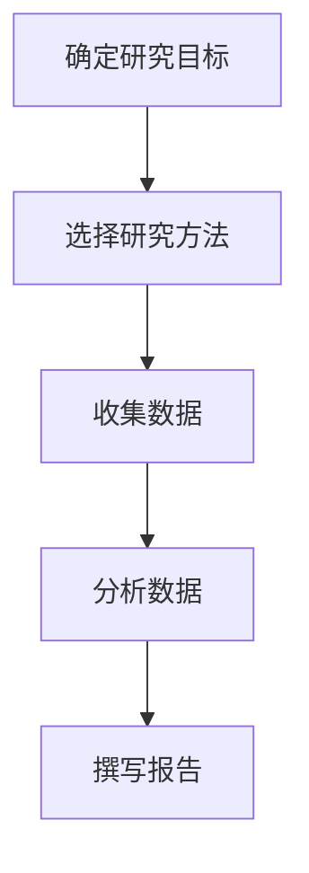
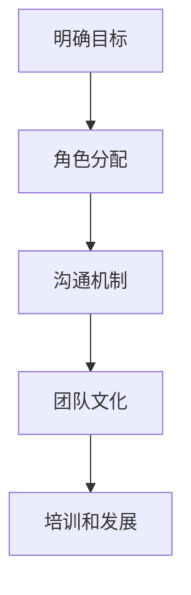
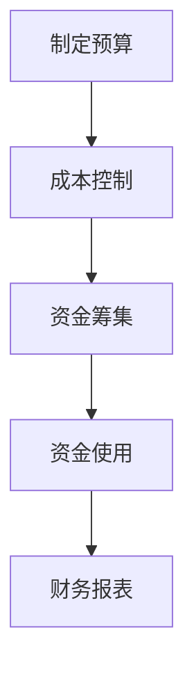
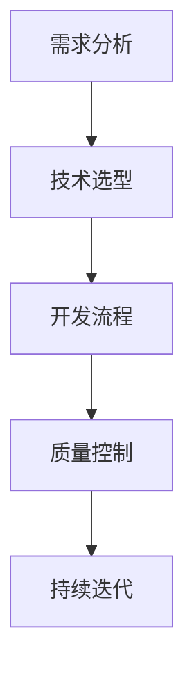
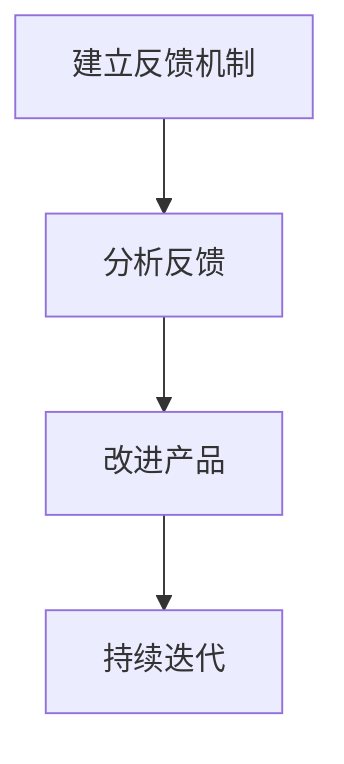

                 

# 创业失败的常见原因及避免方法

> 关键词：创业失败、商业模式、市场调研、团队建设、资金管理、技术实现、用户反馈

> 摘要：本文旨在深入剖析创业失败的常见原因，并提供有效的避免方法。通过系统性的分析和案例研究，本文将帮助创业者更好地理解创业过程中的关键因素，从而提高创业成功率。我们将从商业模式、市场调研、团队建设、资金管理、技术实现和用户反馈等多个维度进行探讨，并提供具体的策略和建议。

## 1. 背景介绍
### 1.1 目的和范围
本文旨在为创业者提供一份全面的指南，帮助他们识别创业过程中可能遇到的问题，并提出有效的解决方案。我们将从多个角度分析创业失败的原因，并提供实用的建议，以提高创业成功率。

### 1.2 预期读者
本文面向所有有志于创业的个人和团队，特别是那些希望深入了解创业过程中的关键因素，并希望提高创业成功率的创业者。无论你是初创企业的创始人，还是正在考虑创业的个人，本文都将为你提供有价值的见解和建议。

### 1.3 文档结构概述
本文将按照以下结构展开：
1. 背景介绍
2. 核心概念与联系
3. 核心算法原理 & 具体操作步骤
4. 数学模型和公式 & 详细讲解 & 举例说明
5. 项目实战：代码实际案例和详细解释说明
6. 实际应用场景
7. 工具和资源推荐
8. 总结：未来发展趋势与挑战
9. 附录：常见问题与解答
10. 扩展阅读 & 参考资料

### 1.4 术语表
#### 1.4.1 核心术语定义
- **商业模式**：企业如何创造、传递和捕获价值的系统。
- **市场调研**：通过收集和分析数据来了解市场的需求、趋势和竞争状况。
- **团队建设**：构建和管理一支高效、协作的团队。
- **资金管理**：合理规划和使用资金，确保企业运营的可持续性。
- **技术实现**：将创意转化为实际的产品或服务。
- **用户反馈**：收集和分析用户对产品或服务的反馈，以改进产品。

#### 1.4.2 相关概念解释
- **精益创业**：一种以最小化浪费为目标的创业方法，强调快速迭代和用户反馈。
- **SWOT分析**：一种评估企业内部优势、劣势、外部机会和威胁的方法。
- **KPI**：关键绩效指标，用于衡量企业运营效果。

#### 1.4.3 缩略词列表
- **SWOT**：Strengths（优势）、Weaknesses（劣势）、Opportunities（机会）、Threats（威胁）
- **KPI**：Key Performance Indicators

## 2. 核心概念与联系
### 2.1 商业模式
商业模式是企业如何创造、传递和捕获价值的系统。一个成功的商业模式能够帮助企业明确其核心价值主张，并有效地与目标市场进行互动。以下是商业模式的关键要素：

- **价值主张**：企业向客户提供的独特价值。
- **客户细分**：目标市场的细分，帮助企业更好地了解客户需求。
- **渠道**：企业与客户互动的方式。
- **客户关系**：企业与客户建立和维护关系的方式。
- **收入流**：企业通过提供产品或服务获得收入的方式。
- **关键资源**：企业成功运营所需的关键资源。
- **关键活动**：企业成功运营所需的关键活动。
- **关键合作伙伴**：企业与外部合作伙伴的关系。
- **成本结构**：企业运营的成本构成。

### 2.2 市场调研
市场调研是通过收集和分析数据来了解市场的需求、趋势和竞争状况。市场调研可以帮助企业更好地理解目标市场，并为商业模式的制定提供依据。以下是市场调研的关键步骤：

1. **确定研究目标**：明确研究的目的和范围。
2. **选择研究方法**：选择合适的调研方法，如问卷调查、访谈、观察等。
3. **收集数据**：通过各种渠道收集数据。
4. **分析数据**：对收集到的数据进行分析，提取有价值的信息。
5. **撰写报告**：将分析结果整理成报告，为企业提供决策依据。

### 2.3 团队建设
团队建设是构建和管理一支高效、协作的团队。一个高效的团队能够更好地实现企业的目标。以下是团队建设的关键要素：

- **明确目标**：团队成员需要明确团队的目标和期望。
- **角色分配**：根据团队成员的能力和特长分配角色。
- **沟通机制**：建立有效的沟通机制，确保信息的及时传递。
- **团队文化**：建立积极向上的团队文化，增强团队凝聚力。
- **培训和发展**：提供必要的培训和发展机会，提升团队成员的能力。

### 2.4 资金管理
资金管理是合理规划和使用资金，确保企业运营的可持续性。资金管理的关键在于合理规划预算、控制成本和提高资金使用效率。以下是资金管理的关键步骤：

1. **制定预算**：根据企业的运营计划制定详细的预算。
2. **成本控制**：通过优化流程和提高效率来控制成本。
3. **资金筹集**：通过各种渠道筹集资金，如天使投资、风险投资等。
4. **资金使用**：合理规划资金的使用，确保资金的有效利用。
5. **财务报表**：定期编制财务报表，监控企业的财务状况。

### 2.5 技术实现
技术实现是将创意转化为实际的产品或服务。技术实现的关键在于选择合适的技术栈、开发流程和质量控制。以下是技术实现的关键步骤：

1. **需求分析**：明确产品或服务的需求。
2. **技术选型**：选择合适的技术栈。
3. **开发流程**：制定合理的开发流程。
4. **质量控制**：通过测试和评审确保产品质量。
5. **持续迭代**：根据用户反馈进行持续迭代。

### 2.6 用户反馈
用户反馈是收集和分析用户对产品或服务的反馈，以改进产品。用户反馈的关键在于建立有效的反馈机制和持续改进。以下是用户反馈的关键步骤：

1. **建立反馈机制**：通过各种渠道收集用户反馈。
2. **分析反馈**：对收集到的反馈进行分析，提取有价值的信息。
3. **改进产品**：根据反馈改进产品，提高用户体验。
4. **持续迭代**：建立持续改进的机制，不断优化产品。

## 3. 核心算法原理 & 具体操作步骤
### 3.1 商业模式分析算法
商业模式分析算法可以帮助企业识别和评估商业模式的关键要素。以下是商业模式分析算法的具体操作步骤：



### 3.2 市场调研算法
市场调研算法可以帮助企业收集和分析市场数据。以下是市场调研算法的具体操作步骤：


### 3.3 团队建设算法
团队建设算法可以帮助企业构建和管理高效的团队。以下是团队建设算法的具体操作步骤：



### 3.4 资金管理算法
资金管理算法可以帮助企业合理规划和使用资金。以下是资金管理算法的具体操作步骤：



### 3.5 技术实现算法
技术实现算法可以帮助企业将创意转化为实际的产品或服务。以下是技术实现算法的具体操作步骤：



### 3.6 用户反馈算法
用户反馈算法可以帮助企业收集和分析用户反馈。以下是用户反馈算法的具体操作步骤：



## 4. 数学模型和公式 & 详细讲解 & 举例说明
### 4.1 SWOT分析模型
SWOT分析模型是一种评估企业内部优势、劣势、外部机会和威胁的方法。以下是SWOT分析模型的数学公式：

$$
SWOT = \left\{
\begin{array}{ll}
S & \text{优势} \\
W & \text{劣势} \\
O & \text{机会} \\
T & \text{威胁}
\end{array}
\right.
$$

### 4.2 KPI模型
KPI模型是一种用于衡量企业运营效果的关键绩效指标。以下是KPI模型的数学公式：

$$
KPI = \frac{\text{目标值} - \text{实际值}}{\text{目标值}}
$$

### 4.3 市场调研模型
市场调研模型是一种通过收集和分析数据来了解市场的需求、趋势和竞争状况的方法。以下是市场调研模型的数学公式：

$$
\text{市场调研} = \frac{\text{收集到的数据量}}{\text{所需数据量}}
$$

### 4.4 团队建设模型
团队建设模型是一种构建和管理高效团队的方法。以下是团队建设模型的数学公式：

$$
\text{团队建设} = \frac{\text{团队成员数量}}{\text{团队目标数量}}
$$

### 4.5 资金管理模型
资金管理模型是一种合理规划和使用资金的方法。以下是资金管理模型的数学公式：

$$
\text{资金管理} = \frac{\text{实际资金使用}}{\text{预算资金}}
$$

### 4.6 技术实现模型
技术实现模型是一种将创意转化为实际的产品或服务的方法。以下是技术实现模型的数学公式：

$$
\text{技术实现} = \frac{\text{实际开发进度}}{\text{计划开发进度}}
$$

### 4.7 用户反馈模型
用户反馈模型是一种收集和分析用户反馈的方法。以下是用户反馈模型的数学公式：

$$
\text{用户反馈} = \frac{\text{收集到的反馈量}}{\text{所需反馈量}}
$$

## 5. 项目实战：代码实际案例和详细解释说明
### 5.1 开发环境搭建
为了实现一个成功的创业项目，首先需要搭建一个合适的开发环境。以下是开发环境搭建的具体步骤：

1. **选择编程语言**：根据项目需求选择合适的编程语言。
2. **安装开发工具**：安装相应的开发工具，如IDE、编辑器等。
3. **配置开发环境**：配置开发环境，确保所有依赖项都已安装。
4. **编写代码**：根据项目需求编写代码。
5. **测试代码**：对代码进行测试，确保其功能正确。

### 5.2 源代码详细实现和代码解读
以下是一个简单的代码实现示例，用于展示如何实现一个基本的用户反馈系统：

```python
# 用户反馈系统
class FeedbackSystem:
    def __init__(self):
        self.feedback_data = []

    def add_feedback(self, feedback):
        self.feedback_data.append(feedback)

    def analyze_feedback(self):
        positive_feedback = 0
        negative_feedback = 0
        for feedback in self.feedback_data:
            if feedback['rating'] >= 3:
                positive_feedback += 1
            else:
                negative_feedback += 1
        return positive_feedback, negative_feedback

# 示例代码
feedback_system = FeedbackSystem()
feedback_system.add_feedback({'rating': 4, 'comment': '很好用'})
feedback_system.add_feedback({'rating': 2, 'comment': '有待改进'})
positive, negative = feedback_system.analyze_feedback()
print(f"Positive Feedback: {positive}")
print(f"Negative Feedback: {negative}")
```

### 5.3 代码解读与分析
上述代码实现了一个简单的用户反馈系统。首先，我们定义了一个`FeedbackSystem`类，用于管理用户反馈数据。`add_feedback`方法用于添加用户反馈，`analyze_feedback`方法用于分析反馈数据。通过分析反馈数据，我们可以了解用户对产品的满意度。

## 6. 实际应用场景
### 6.1 商业模式分析
商业模式分析可以帮助企业识别和评估商业模式的关键要素。例如，一家初创企业可以通过商业模式分析来确定其核心价值主张，并选择合适的收入流。

### 6.2 市场调研
市场调研可以帮助企业了解市场的需求、趋势和竞争状况。例如，一家初创企业可以通过市场调研来了解目标市场的用户需求，并据此调整其产品或服务。

### 6.3 团队建设
团队建设可以帮助企业构建和管理高效的团队。例如，一家初创企业可以通过团队建设来明确团队目标，并分配合适的角色。

### 6.4 资金管理
资金管理可以帮助企业合理规划和使用资金。例如，一家初创企业可以通过资金管理来控制成本，并确保资金的有效使用。

### 6.5 技术实现
技术实现可以帮助企业将创意转化为实际的产品或服务。例如，一家初创企业可以通过技术实现来开发一个移动应用，并确保其功能正确。

### 6.6 用户反馈
用户反馈可以帮助企业收集和分析用户反馈。例如，一家初创企业可以通过用户反馈来改进其产品，并提高用户体验。

## 7. 工具和资源推荐
### 7.1 学习资源推荐
#### 7.1.1 书籍推荐
- **《精益创业》**：Eric Ries
- **《创业维艰》**：Ben Horowitz
- **《硅谷钢铁侠》**：Ashlee Vance

#### 7.1.2 在线课程
- **Coursera**：《创业与创新》
- **edX**：《创业与创新》

#### 7.1.3 技术博客和网站
- **Medium**：《创业与创新》
- **TechCrunch**：创业与创新

### 7.2 开发工具框架推荐
#### 7.2.1 IDE和编辑器
- **Visual Studio Code**
- **PyCharm**
- **IntelliJ IDEA**

#### 7.2.2 调试和性能分析工具
- **Chrome DevTools**
- **Postman**
- **JMeter**

#### 7.2.3 相关框架和库
- **Django**
- **React**
- **Vue.js**

### 7.3 相关论文著作推荐
#### 7.3.1 经典论文
- **《创业者的决策过程》**：Timmons, J. A. (1989)

#### 7.3.2 最新研究成果
- **《创业者的心理特征》**：Shane, S. (2010)

#### 7.3.3 应用案例分析
- **《创业者的成功案例》**：Gartner, J. R. (2015)

## 8. 总结：未来发展趋势与挑战
### 8.1 未来发展趋势
未来，创业将更加注重技术创新和用户体验。随着技术的不断发展，创业将更加依赖于技术创新，以提供更好的产品和服务。同时，用户体验将成为创业成功的关键因素之一。

### 8.2 挑战
创业过程中将面临许多挑战，包括市场竞争、资金压力和技术实现等。为了应对这些挑战，创业者需要不断学习和适应，以提高创业成功率。

## 9. 附录：常见问题与解答
### 9.1 问题1：如何进行有效的市场调研？
**解答**：有效的市场调研需要明确研究目标、选择合适的研究方法、收集和分析数据，并撰写报告。通过这些步骤，可以更好地了解市场的需求、趋势和竞争状况。

### 9.2 问题2：如何建立高效的团队？
**解答**：建立高效的团队需要明确目标、分配角色、建立沟通机制、培养团队文化，并提供培训和发展机会。通过这些步骤，可以构建和管理一支高效的团队。

### 9.3 问题3：如何进行合理的资金管理？
**解答**：合理的资金管理需要制定预算、控制成本、筹集资金、使用资金，并编制财务报表。通过这些步骤，可以确保资金的有效使用，提高企业的运营效率。

## 10. 扩展阅读 & 参考资料
### 10.1 扩展阅读
- **《创业维艰》**：Ben Horowitz
- **《精益创业》**：Eric Ries
- **《硅谷钢铁侠》**：Ashlee Vance

### 10.2 参考资料
- **Timmons, J. A. (1989). The Entrepreneurial Process.**
- **Shane, S. (2010). The Routledge Handbook of Entrepreneurship Research.**
- **Gartner, J. R. (2015). Entrepreneurship: Theory and Practice.**

---

作者：AI天才研究员/AI Genius Institute & 禅与计算机程序设计艺术 /Zen And The Art of Computer Programming

