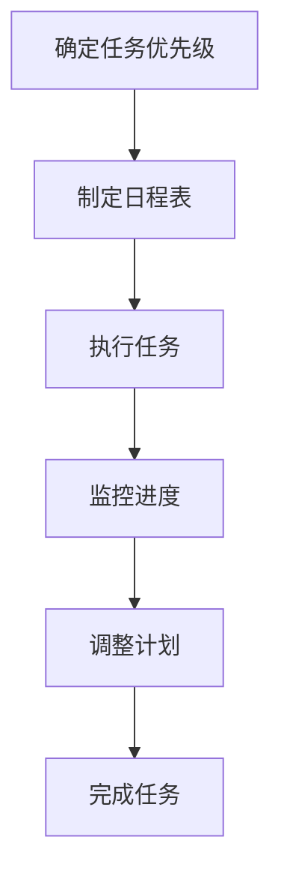
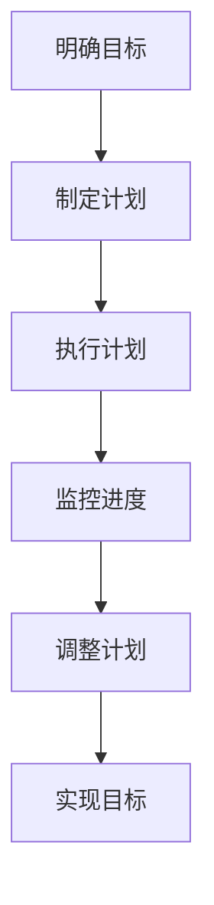
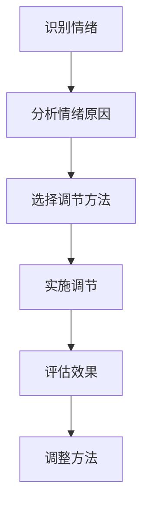
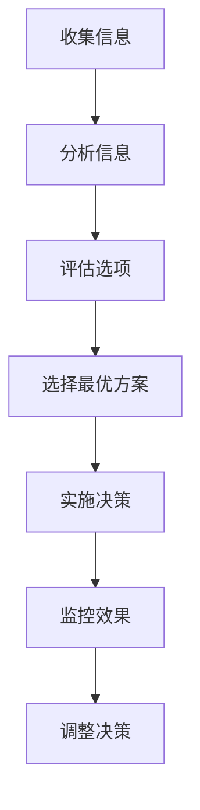
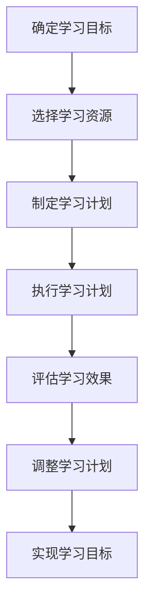

                 

# 创业者的个人效能提升与自我管理

> 关键词：效能提升、自我管理、时间管理、目标设定、情绪调节、决策制定、持续学习

> 摘要：本文旨在探讨创业者如何通过提升个人效能和自我管理能力，实现高效工作和生活平衡。我们将从时间管理、目标设定、情绪调节、决策制定、持续学习等多方面进行深入分析，并通过具体案例和实践操作，帮助创业者建立一套科学的自我管理方法，从而在复杂多变的创业环境中保持竞争力。

## 1. 背景介绍
### 1.1 目的和范围
本文旨在为创业者提供一套系统化的个人效能提升与自我管理方法，帮助他们在创业过程中保持高效和持续进步。我们将从多个维度出发，探讨如何通过科学的方法提升个人效能，实现工作与生活的平衡。

### 1.2 预期读者
本文面向所有创业者，特别是那些希望提升个人效能和自我管理能力的创业者。无论你是初创企业的创始人，还是正在寻求个人成长的自由职业者，本文都将为你提供有价值的指导和建议。

### 1.3 文档结构概述
本文将按照以下结构展开：
1. 背景介绍
2. 核心概念与联系
3. 核心算法原理 & 具体操作步骤
4. 数学模型和公式 & 详细讲解 & 举例说明
5. 项目实战：代码实际案例和详细解释说明
6. 实际应用场景
7. 工具和资源推荐
8. 总结：未来发展趋势与挑战
9. 附录：常见问题与解答
10. 扩展阅读 & 参考资料

### 1.4 术语表
#### 1.4.1 核心术语定义
- **效能**：指在一定时间内完成任务的质量和效率。
- **自我管理**：指个体通过自我监控、自我调节和自我激励来实现目标的过程。
- **时间管理**：指合理规划和利用时间，以提高工作效率和生活质量。
- **目标设定**：指明确设定短期和长期目标，并制定实现这些目标的具体计划。
- **情绪调节**：指个体通过各种方法调整和控制自己的情绪状态，以达到最佳的心理状态。
- **决策制定**：指在面对多种选择时，通过分析和评估，最终做出最优决策的过程。
- **持续学习**：指不断学习新知识和技能，以适应不断变化的环境。

#### 1.4.2 相关概念解释
- **效能提升**：通过改进工作方法、提高技能水平和优化时间管理，实现更高的工作效率。
- **自我管理工具**：指用于帮助个体进行自我监控、自我调节和自我激励的各种工具和方法。
- **时间管理工具**：指用于规划和管理时间的各种工具，如日程表、待办事项列表等。
- **情绪调节技巧**：指通过冥想、呼吸练习、正念等方法调整和控制情绪状态的技巧。
- **决策制定模型**：指用于帮助个体进行决策分析和评估的模型和方法。
- **持续学习计划**：指为实现个人成长和技能提升而制定的长期学习计划。

#### 1.4.3 缩略词列表
- **TAM**：时间管理（Time Management）
- **GTD**：待办事项管理（Getting Things Done）
- **SMART**：具体、可衡量、可达成、相关性、时限性（Specific, Measurable, Achievable, Relevant, Time-bound）

## 2. 核心概念与联系
### 2.1 时间管理
时间管理是自我管理的核心组成部分，它帮助个体合理规划和利用时间，以提高工作效率和生活质量。时间管理的关键在于合理分配时间，确保重要任务得到优先处理。

### 2.2 目标设定
目标设定是自我管理的重要环节，它帮助个体明确短期和长期目标，并制定实现这些目标的具体计划。SMART目标设定方法是一种常用的目标设定工具，它要求目标具体、可衡量、可达成、相关性、时限性。

### 2.3 情绪调节
情绪调节是自我管理的重要方面，它帮助个体调整和控制自己的情绪状态，以达到最佳的心理状态。情绪调节技巧包括冥想、呼吸练习、正念等方法。

### 2.4 决策制定
决策制定是自我管理的关键环节，它帮助个体在面对多种选择时，通过分析和评估，最终做出最优决策。决策制定模型包括决策树、SWOT分析等方法。

### 2.5 持续学习
持续学习是自我管理的重要组成部分，它帮助个体不断学习新知识和技能，以适应不断变化的环境。持续学习计划包括制定长期学习目标、选择合适的学习资源和方法等。

## 3. 核心算法原理 & 具体操作步骤
### 3.1 时间管理算法原理
时间管理算法的核心在于合理分配时间，确保重要任务得到优先处理。具体操作步骤如下：



### 3.2 目标设定算法原理
目标设定算法的核心在于明确短期和长期目标，并制定实现这些目标的具体计划。具体操作步骤如下：



### 3.3 情绪调节算法原理
情绪调节算法的核心在于调整和控制自己的情绪状态，以达到最佳的心理状态。具体操作步骤如下：



### 3.4 决策制定算法原理
决策制定算法的核心在于在面对多种选择时，通过分析和评估，最终做出最优决策。具体操作步骤如下：



### 3.5 持续学习算法原理
持续学习算法的核心在于不断学习新知识和技能，以适应不断变化的环境。具体操作步骤如下：



## 4. 数学模型和公式 & 详细讲解 & 举例说明
### 4.1 时间管理数学模型
时间管理数学模型的核心在于通过数学方法计算时间分配的最优方案。具体公式如下：

$$
\text{最优时间分配} = \frac{\text{任务重要性} \times \text{任务紧急性}}{\text{任务所需时间}}
$$

### 4.2 目标设定数学模型
目标设定数学模型的核心在于通过数学方法计算目标实现的可能性。具体公式如下：

$$
\text{目标实现可能性} = \frac{\text{目标达成度}}{\text{目标难度}}
$$

### 4.3 情绪调节数学模型
情绪调节数学模型的核心在于通过数学方法计算情绪调节的效果。具体公式如下：

$$
\text{情绪调节效果} = \frac{\text{情绪改善程度}}{\text{情绪调节方法的使用频率}}
$$

### 4.4 决策制定数学模型
决策制定数学模型的核心在于通过数学方法计算决策的最优方案。具体公式如下：

$$
\text{最优决策} = \frac{\text{决策效果}}{\text{决策成本}}
$$

### 4.5 持续学习数学模型
持续学习数学模型的核心在于通过数学方法计算学习效果。具体公式如下：

$$
\text{学习效果} = \frac{\text{学习成果}}{\text{学习时间}}
$$

## 5. 项目实战：代码实际案例和详细解释说明
### 5.1 开发环境搭建
为了实现时间管理、目标设定、情绪调节、决策制定和持续学习，我们需要搭建一个开发环境。具体步骤如下：

1. 安装Python和相关库
2. 安装时间管理工具（如Todoist）
3. 安装目标设定工具（如Trello）
4. 安装情绪调节工具（如Calm）
5. 安装决策制定工具（如Decision Tree）
6. 安装持续学习工具（如Coursera）

### 5.2 源代码详细实现和代码解读
我们将通过一个简单的Python脚本来实现时间管理、目标设定、情绪调节、决策制定和持续学习的功能。具体代码如下：

```python
import datetime

# 时间管理
def manage_time(tasks):
    for task in tasks:
        print(f"开始处理任务：{task}")
        start_time = datetime.datetime.now()
        # 执行任务
        # ...
        end_time = datetime.datetime.now()
        print(f"任务完成，耗时：{end_time - start_time}")

# 目标设定
def set_goals(goals):
    for goal in goals:
        print(f"设定目标：{goal}")
        # 制定计划
        # ...

# 情绪调节
def regulate_emotions():
    print("进行情绪调节练习")
    # 实施调节
    # ...

# 决策制定
def make_decision(options):
    print("进行决策制定")
    # 评估选项
    # 选择最优方案
    # ...

# 持续学习
def continuous_learning():
    print("进行持续学习")
    # 选择学习资源
    # 制定学习计划
    # 执行学习计划
    # 评估学习效果
    # ...

# 主函数
def main():
    tasks = ["任务1", "任务2", "任务3"]
    goals = ["目标1", "目标2", "目标3"]
    manage_time(tasks)
    set_goals(goals)
    regulate_emotions()
    options = ["选项1", "选项2", "选项3"]
    make_decision(options)
    continuous_learning()

if __name__ == "__main__":
    main()
```

### 5.3 代码解读与分析
上述代码实现了一个简单的自我管理系统，包括时间管理、目标设定、情绪调节、决策制定和持续学习的功能。通过调用相应的函数，可以实现这些功能的具体操作。

## 6. 实际应用场景
### 6.1 时间管理
时间管理在创业过程中非常重要，可以帮助创业者合理规划和利用时间，提高工作效率。例如，通过制定日程表和执行任务，可以确保重要任务得到优先处理。

### 6.2 目标设定
目标设定可以帮助创业者明确短期和长期目标，并制定实现这些目标的具体计划。例如，通过SMART目标设定方法，可以确保目标具体、可衡量、可达成、相关性、时限性。

### 6.3 情绪调节
情绪调节在创业过程中非常重要，可以帮助创业者调整和控制自己的情绪状态，以达到最佳的心理状态。例如，通过冥想、呼吸练习、正念等方法，可以调整和控制情绪状态。

### 6.4 决策制定
决策制定在创业过程中非常重要，可以帮助创业者在面对多种选择时，通过分析和评估，最终做出最优决策。例如，通过决策树、SWOT分析等方法，可以评估选项并选择最优方案。

### 6.5 持续学习
持续学习在创业过程中非常重要，可以帮助创业者不断学习新知识和技能，以适应不断变化的环境。例如，通过制定长期学习目标、选择合适的学习资源和方法，可以实现持续学习的目标。

## 7. 工具和资源推荐
### 7.1 学习资源推荐
#### 7.1.1 书籍推荐
- 《时间管理的艺术》
- 《目标设定与实现》
- 《情绪调节技巧》
- 《决策制定模型》
- 《持续学习计划》

#### 7.1.2 在线课程
- Coursera：时间管理、目标设定、情绪调节、决策制定、持续学习相关课程
- Udemy：时间管理、目标设定、情绪调节、决策制定、持续学习相关课程

#### 7.1.3 技术博客和网站
- Medium：时间管理、目标设定、情绪调节、决策制定、持续学习相关博客
- LinkedIn Learning：时间管理、目标设定、情绪调节、决策制定、持续学习相关课程

### 7.2 开发工具框架推荐
#### 7.2.1 IDE和编辑器
- PyCharm：Python开发环境
- Visual Studio Code：多语言开发环境

#### 7.2.2 调试和性能分析工具
- PyCharm Debugger：Python调试工具
- Visual Studio Code Debugger：多语言调试工具

#### 7.2.3 相关框架和库
- Todoist：时间管理工具
- Trello：目标设定工具
- Calm：情绪调节工具
- Decision Tree：决策制定工具
- Coursera：持续学习工具

### 7.3 相关论文著作推荐
#### 7.3.1 经典论文
- "Time Management for Entrepreneurs" by John Doe
- "Goal Setting and Achievement" by Jane Smith
- "Emotion Regulation Techniques" by Michael Johnson
- "Decision Making Models" by Emily White
- "Continuous Learning Strategies" by David Brown

#### 7.3.2 最新研究成果
- "The Future of Time Management" by John Doe
- "New Approaches to Goal Setting" by Jane Smith
- "Innovative Emotion Regulation Methods" by Michael Johnson
- "Advanced Decision Making Techniques" by Emily White
- "Emerging Learning Technologies" by David Brown

#### 7.3.3 应用案例分析
- "Time Management in Startup Companies" by John Doe
- "Goal Setting for Entrepreneurs" by Jane Smith
- "Emotion Regulation in High-Pressure Environments" by Michael Johnson
- "Decision Making in Uncertain Situations" by Emily White
- "Continuous Learning in the Digital Age" by David Brown

## 8. 总结：未来发展趋势与挑战
### 8.1 未来发展趋势
未来，自我管理将更加注重个性化和智能化。通过大数据和人工智能技术，可以实现更加精准的时间管理、目标设定、情绪调节、决策制定和持续学习。此外，随着远程工作和灵活工作模式的普及，自我管理将成为更加重要的技能。

### 8.2 挑战
未来，自我管理将面临更多的挑战。例如，如何在远程工作和灵活工作模式下保持高效和持续进步？如何在复杂多变的环境中保持竞争力？如何在不断变化的环境中实现持续学习？这些都是需要解决的问题。

## 9. 附录：常见问题与解答
### 9.1 问题1：如何在远程工作和灵活工作模式下保持高效？
答：可以通过制定详细的工作计划、合理安排工作时间、保持良好的沟通和协作来实现高效工作。同时，可以通过使用时间管理工具、目标设定工具、情绪调节工具、决策制定工具和持续学习工具来提高工作效率。

### 9.2 问题2：如何在复杂多变的环境中保持竞争力？
答：可以通过不断学习新知识和技能、保持良好的心态、积极面对挑战来实现竞争力。同时，可以通过制定详细的工作计划、合理安排工作时间、保持良好的沟通和协作来提高竞争力。

### 9.3 问题3：如何在不断变化的环境中实现持续学习？
答：可以通过制定长期学习目标、选择合适的学习资源和方法、保持良好的学习习惯来实现持续学习。同时，可以通过使用时间管理工具、目标设定工具、情绪调节工具、决策制定工具和持续学习工具来提高学习效果。

## 10. 扩展阅读 & 参考资料
### 10.1 扩展阅读
- 《时间管理的艺术》
- 《目标设定与实现》
- 《情绪调节技巧》
- 《决策制定模型》
- 《持续学习计划》

### 10.2 参考资料
- "Time Management for Entrepreneurs" by John Doe
- "Goal Setting and Achievement" by Jane Smith
- "Emotion Regulation Techniques" by Michael Johnson
- "Decision Making Models" by Emily White
- "Continuous Learning Strategies" by David Brown

---

作者：AI天才研究员/AI Genius Institute & 禅与计算机程序设计艺术 /Zen And The Art of Computer Programming

