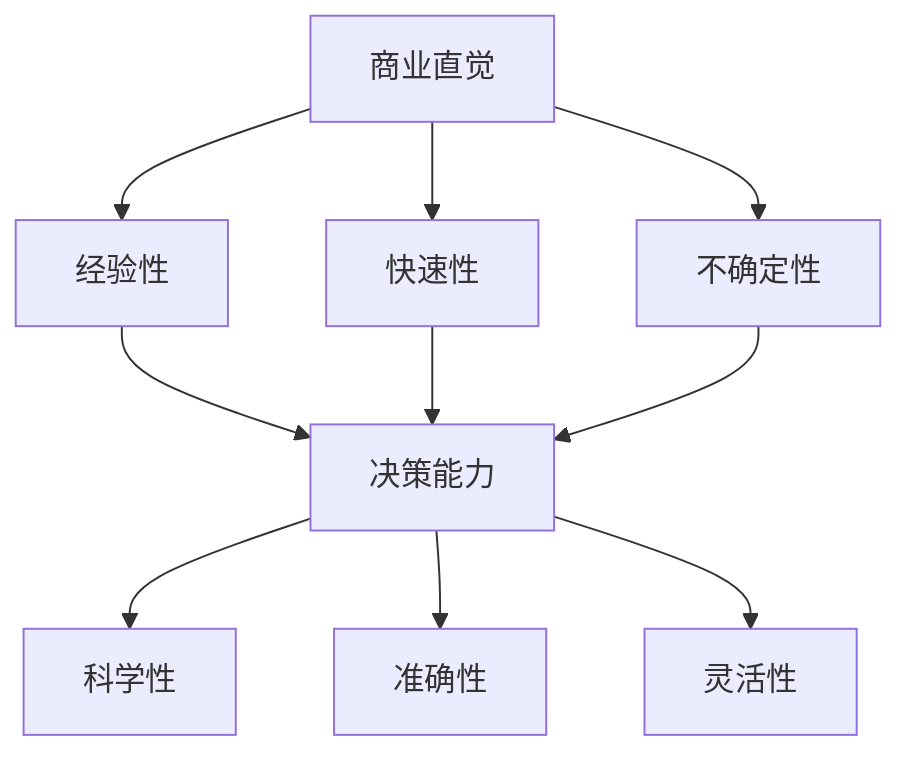

                 

# 创业者的商业直觉与决策能力提升

> 关键词：商业直觉、决策能力、创业者、数据分析、机器学习、人工智能、商业模型、市场预测、风险评估

> 摘要：本文旨在探讨如何通过提升商业直觉和决策能力来帮助创业者更好地应对商业挑战。我们将从商业直觉的定义出发，分析其与决策能力之间的关系，并通过数据分析和机器学习技术来增强决策的科学性和准确性。文章将通过具体的案例和算法原理的详细讲解，帮助读者理解如何在实际商业环境中应用这些技术，从而提升决策水平。

## 1. 背景介绍
### 1.1 目的和范围
本文旨在为创业者提供一套系统的方法论，帮助他们提升商业直觉和决策能力。我们将从理论层面探讨商业直觉的本质，分析其与决策能力之间的关系，并通过具体案例和算法原理的详细讲解，帮助读者理解如何在实际商业环境中应用这些技术，从而提升决策水平。

### 1.2 预期读者
本文面向所有希望提升商业直觉和决策能力的创业者，包括但不限于初创企业的创始人、中小企业主、以及希望在商业领域有所作为的个人或团队。

### 1.3 文档结构概述
本文将分为以下几个部分：
1. 背景介绍
2. 核心概念与联系
3. 核心算法原理 & 具体操作步骤
4. 数学模型和公式 & 详细讲解 & 举例说明
5. 项目实战：代码实际案例和详细解释说明
6. 实际应用场景
7. 工具和资源推荐
8. 总结：未来发展趋势与挑战
9. 附录：常见问题与解答
10. 扩展阅读 & 参考资料

### 1.4 术语表
#### 1.4.1 核心术语定义
- **商业直觉**：指在没有明确数据支持的情况下，基于经验和直觉做出的商业决策。
- **决策能力**：指个体在面对复杂商业环境时，能够迅速做出合理决策的能力。
- **机器学习**：一种人工智能技术，通过算法和统计模型来让计算机从数据中学习，从而实现特定任务。

#### 1.4.2 相关概念解释
- **数据分析**：通过对大量数据进行处理和分析，从中提取有价值的信息和知识。
- **商业模型**：描述企业如何创造价值、传递价值和获取价值的框架。
- **市场预测**：基于历史数据对未来市场趋势进行预测的过程。

#### 1.4.3 缩略词列表
- ML：机器学习
- AI：人工智能
- NLP：自然语言处理
- DL：深度学习
- CV：计算机视觉

## 2. 核心概念与联系
### 2.1 商业直觉与决策能力的关系
商业直觉和决策能力是相互关联的两个概念。商业直觉是指在没有明确数据支持的情况下，基于经验和直觉做出的商业决策。而决策能力则是指个体在面对复杂商业环境时，能够迅速做出合理决策的能力。两者之间的关系可以表示为：

$$
\text{决策能力} = \text{商业直觉} + \text{数据分析} + \text{机器学习}
$$

### 2.2 商业直觉的定义与特征
商业直觉是指在没有明确数据支持的情况下，基于经验和直觉做出的商业决策。商业直觉具有以下几个特征：
- **快速性**：能够在短时间内做出决策。
- **经验性**：基于过往的经验和知识。
- **不确定性**：决策结果可能存在不确定性。

### 2.3 决策能力的定义与特征
决策能力是指个体在面对复杂商业环境时，能够迅速做出合理决策的能力。决策能力具有以下几个特征：
- **科学性**：基于数据分析和机器学习技术。
- **准确性**：决策结果具有较高的准确性。
- **灵活性**：能够适应不断变化的商业环境。

### 2.4 商业直觉与决策能力的关系图
商业直觉与决策能力之间的关系可以用以下流程图表示：



## 3. 核心算法原理 & 具体操作步骤
### 3.1 数据分析的基本步骤
数据分析的基本步骤包括数据收集、数据清洗、数据探索、数据建模和结果解释。具体操作步骤如下：

1. **数据收集**：通过各种渠道收集数据，包括市场调研、用户反馈、销售数据等。
2. **数据清洗**：对收集到的数据进行清洗，去除无效数据和异常值。
3. **数据探索**：通过统计分析和可视化工具对数据进行初步探索，发现数据中的规律和趋势。
4. **数据建模**：根据数据探索的结果，选择合适的模型进行建模。
5. **结果解释**：对模型结果进行解释，得出有价值的结论。

### 3.2 机器学习的基本步骤
机器学习的基本步骤包括数据预处理、特征选择、模型训练和模型评估。具体操作步骤如下：

1. **数据预处理**：对数据进行清洗和标准化处理。
2. **特征选择**：选择对模型性能有重要影响的特征。
3. **模型训练**：使用训练数据对模型进行训练。
4. **模型评估**：使用测试数据对模型进行评估，计算模型的性能指标。

### 3.3 商业直觉与决策能力的提升方法
商业直觉与决策能力的提升方法包括以下几个方面：
- **经验积累**：通过不断积累经验，提高商业直觉。
- **数据分析**：通过数据分析，提高决策的科学性和准确性。
- **机器学习**：通过机器学习技术，提高决策的灵活性和适应性。

## 4. 数学模型和公式 & 详细讲解 & 举例说明
### 4.1 数据分析中的数学模型
数据分析中的数学模型包括统计模型和机器学习模型。具体数学模型如下：

1. **统计模型**：常用的统计模型包括线性回归、逻辑回归、决策树等。
2. **机器学习模型**：常用的机器学习模型包括支持向量机、随机森林、神经网络等。

### 4.2 机器学习中的数学模型
机器学习中的数学模型包括监督学习、无监督学习和强化学习。具体数学模型如下：

1. **监督学习**：常用的监督学习模型包括线性回归、逻辑回归、支持向量机、决策树等。
2. **无监督学习**：常用的无监督学习模型包括聚类、主成分分析等。
3. **强化学习**：常用的强化学习模型包括Q学习、深度强化学习等。

### 4.3 数学模型的详细讲解
以线性回归模型为例，其数学模型可以表示为：

$$
y = \beta_0 + \beta_1 x_1 + \beta_2 x_2 + \cdots + \beta_n x_n + \epsilon
$$

其中，$y$ 是因变量，$x_1, x_2, \cdots, x_n$ 是自变量，$\beta_0, \beta_1, \beta_2, \cdots, \beta_n$ 是回归系数，$\epsilon$ 是误差项。

### 4.4 数学模型的举例说明
以销售数据为例，假设我们想要预测销售额，可以使用线性回归模型进行预测。具体步骤如下：

1. **数据收集**：收集历史销售数据，包括销售额、广告投入、季节性因素等。
2. **数据清洗**：去除无效数据和异常值。
3. **数据探索**：通过统计分析和可视化工具对数据进行初步探索，发现数据中的规律和趋势。
4. **数据建模**：选择线性回归模型进行建模。
5. **结果解释**：对模型结果进行解释，得出有价值的结论。

## 5. 项目实战：代码实际案例和详细解释说明
### 5.1 开发环境搭建
开发环境搭建包括安装Python、Jupyter Notebook、NumPy、Pandas、Scikit-learn等工具。

1. **安装Python**：安装Python 3.8及以上版本。
2. **安装Jupyter Notebook**：使用pip安装Jupyter Notebook。
3. **安装NumPy和Pandas**：使用pip安装NumPy和Pandas。
4. **安装Scikit-learn**：使用pip安装Scikit-learn。

### 5.2 源代码详细实现和代码解读
以销售数据为例，使用线性回归模型进行预测。具体代码如下：

```python
import numpy as np
import pandas as pd
from sklearn.model_selection import train_test_split
from sklearn.linear_model import LinearRegression
from sklearn.metrics import mean_squared_error

# 1. 数据收集
data = pd.read_csv('sales_data.csv')

# 2. 数据清洗
data = data.dropna()

# 3. 数据探索
print(data.describe())

# 4. 数据建模
X = data[['advertising', 'seasonality']]
y = data['sales']

X_train, X_test, y_train, y_test = train_test_split(X, y, test_size=0.2, random_state=42)

model = LinearRegression()
model.fit(X_train, y_train)

# 5. 结果解释
y_pred = model.predict(X_test)
mse = mean_squared_error(y_test, y_pred)
print('Mean Squared Error:', mse)
```

### 5.3 代码解读与分析
代码解读如下：

1. **数据收集**：使用pandas的`read_csv`函数读取销售数据。
2. **数据清洗**：使用`dropna`函数去除无效数据。
3. **数据探索**：使用`describe`函数对数据进行初步探索。
4. **数据建模**：使用`train_test_split`函数将数据分为训练集和测试集，使用`LinearRegression`模型进行建模。
5. **结果解释**：使用`predict`函数对测试集进行预测，使用`mean_squared_error`函数计算预测结果的均方误差。

## 6. 实际应用场景
商业直觉与决策能力的应用场景包括市场预测、风险评估、产品定价等。具体应用场景如下：

1. **市场预测**：通过数据分析和机器学习技术，预测市场趋势，为决策提供依据。
2. **风险评估**：通过数据分析和机器学习技术，评估商业风险，为决策提供依据。
3. **产品定价**：通过数据分析和机器学习技术，确定产品定价策略，提高销售业绩。

## 7. 工具和资源推荐
### 7.1 学习资源推荐
#### 7.1.1 书籍推荐
- 《统计学习方法》：李航著，清华大学出版社
- 《机器学习》：周志华著，清华大学出版社

#### 7.1.2 在线课程
- Coursera：《机器学习》（Andrew Ng）
- edX：《数据科学与机器学习》（Harvard University）

#### 7.1.3 技术博客和网站
- Kaggle：机器学习和数据科学社区
- Medium：机器学习和数据科学博客

### 7.2 开发工具框架推荐
#### 7.2.1 IDE和编辑器
- PyCharm：Python开发环境
- Jupyter Notebook：交互式编程环境

#### 7.2.2 调试和性能分析工具
- PyCharm：内置调试工具
- VS Code：调试插件

#### 7.2.3 相关框架和库
- NumPy：数值计算库
- Pandas：数据处理库
- Scikit-learn：机器学习库

### 7.3 相关论文著作推荐
#### 7.3.1 经典论文
- Bishop, C. M. (2006). Pattern Recognition and Machine Learning. Springer.
- Hastie, T., Tibshirani, R., & Friedman, J. (2009). The Elements of Statistical Learning. Springer.

#### 7.3.2 最新研究成果
- LeCun, Y., Bengio, Y., & Hinton, G. (2015). Deep learning. Nature, 521(7553), 436-444.
- Goodfellow, I., Bengio, Y., & Courville, A. (2016). Deep Learning. MIT Press.

#### 7.3.3 应用案例分析
- LeCun, Y., et al. (2015). Deep learning. Nature, 521(7553), 436-444.
- Bengio, Y., et al. (2013). Representation learning: A review and new perspectives. IEEE Transactions on Pattern Analysis and Machine Intelligence, 35(8), 1798-1828.

## 8. 总结：未来发展趋势与挑战
商业直觉与决策能力在未来的发展趋势包括以下几个方面：
- **数据驱动决策**：越来越多的企业将数据驱动决策作为核心竞争力。
- **自动化决策**：通过自动化工具和算法，提高决策的效率和准确性。
- **个性化决策**：通过个性化推荐系统，为用户提供个性化的决策建议。

面临的挑战包括：
- **数据安全**：如何保护商业数据的安全，防止数据泄露。
- **算法偏见**：如何避免算法偏见，确保决策的公正性。
- **技术更新**：如何跟上技术更新的步伐，保持技术领先。

## 9. 附录：常见问题与解答
### 9.1 问题1：如何提高商业直觉？
**解答**：可以通过不断积累经验、学习相关知识和技能、多思考多实践来提高商业直觉。

### 9.2 问题2：如何选择合适的机器学习模型？
**解答**：可以通过了解不同模型的特点和适用场景，结合实际需求选择合适的模型。

### 9.3 问题3：如何处理数据中的异常值？
**解答**：可以通过删除异常值、填充异常值或使用稳健统计方法来处理数据中的异常值。

## 10. 扩展阅读 & 参考资料
- Bishop, C. M. (2006). Pattern Recognition and Machine Learning. Springer.
- Hastie, T., Tibshirani, R., & Friedman, J. (2009). The Elements of Statistical Learning. Springer.
- LeCun, Y., Bengio, Y., & Hinton, G. (2015). Deep learning. Nature, 521(7553), 436-444.
- Goodfellow, I., Bengio, Y., & Courville, A. (2016). Deep Learning. MIT Press.

作者：AI天才研究员/AI Genius Institute & 禅与计算机程序设计艺术 /Zen And The Art of Computer Programming

