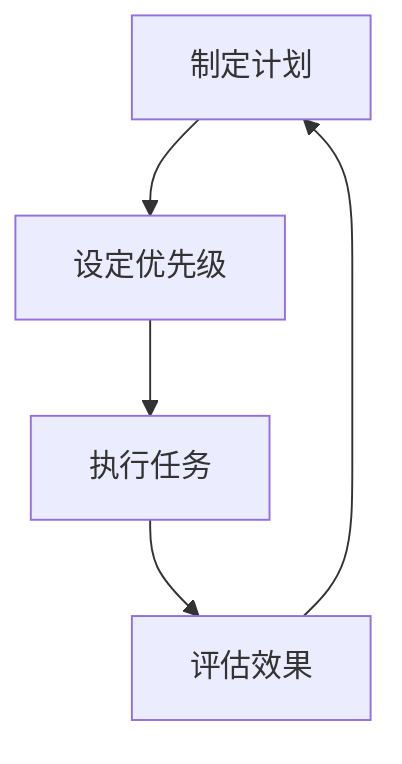
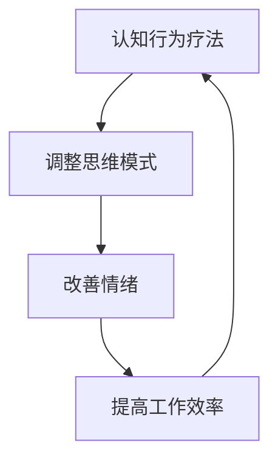
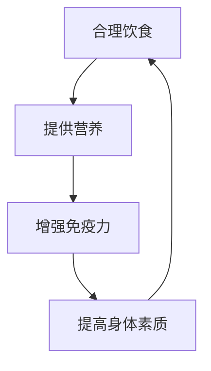

                 

# 创业者的工作与生活平衡维护策略

> 关键词：创业者、工作与生活平衡、时间管理、心理调适、健康维护

> 摘要：本文旨在为创业者提供一套系统的工作与生活平衡维护策略，通过深入分析创业者面临的挑战，提出科学的时间管理方法、心理调适技巧和健康维护方案，帮助创业者在追求事业成功的同时，保持身心健康，实现个人与职业的双重平衡。

## 1. 背景介绍
### 1.1 目的和范围
本文旨在为创业者提供一套系统的工作与生活平衡维护策略，帮助创业者在追求事业成功的同时，保持身心健康，实现个人与职业的双重平衡。本文将从时间管理、心理调适和健康维护三个方面进行详细探讨。

### 1.2 预期读者
本文的预期读者包括但不限于：
- 创业者：正在或计划创业的人士
- 管理者：企业或团队的管理者
- 心理咨询师：为创业者提供心理支持的专业人士
- 健康管理师：为创业者提供健康指导的专业人士

### 1.3 文档结构概述
本文将按照以下结构展开：
1. 背景介绍
2. 核心概念与联系
3. 核心算法原理 & 具体操作步骤
4. 数学模型和公式 & 详细讲解 & 举例说明
5. 项目实战：代码实际案例和详细解释说明
6. 实际应用场景
7. 工具和资源推荐
8. 总结：未来发展趋势与挑战
9. 附录：常见问题与解答
10. 扩展阅读 & 参考资料

### 1.4 术语表
#### 1.4.1 核心术语定义
- **创业者**：指独立创办企业或组织的人。
- **工作与生活平衡**：指在工作和生活之间找到一个合理的分配，确保两者都能得到适当的关注。
- **时间管理**：指有效地规划和利用时间，以实现个人和职业目标。
- **心理调适**：指通过各种方法调整和改善心理状态，以应对压力和挑战。
- **健康维护**：指通过各种手段保持身体健康，预防疾病。

#### 1.4.2 相关概念解释
- **时间管理**：通过计划、优先级排序和执行来优化时间使用。
- **心理调适**：通过认知行为疗法、冥想、运动等方式调整心理状态。
- **健康维护**：通过饮食、运动、休息等方式保持身体健康。

#### 1.4.3 缩略词列表
- **TQM**：Total Quality Management（全面质量管理）
- **KPI**：Key Performance Indicator（关键绩效指标）
- **SMART**：Specific, Measurable, Achievable, Relevant, Time-bound（具体、可衡量、可实现、相关、时限）

## 2. 核心概念与联系
### 2.1 时间管理
时间管理是创业者实现工作与生活平衡的关键。通过有效的时间管理，创业者可以确保在有限的时间内完成更多的工作，同时留出时间照顾自己的身心健康。

### 2.2 心理调适
心理调适是创业者应对压力和挑战的重要手段。通过心理调适，创业者可以保持积极的心态，提高工作效率，减少工作压力。

### 2.3 健康维护
健康维护是创业者保持身体健康的重要保障。通过健康维护，创业者可以提高身体素质，增强免疫力，减少疾病的发生。

### 2.4 核心概念原理与流程图
#### 2.4.1 时间管理原理
时间管理的核心在于有效规划和利用时间。通过制定计划、设定优先级、执行任务和评估效果，创业者可以实现高效的时间管理。



#### 2.4.2 心理调适原理
心理调适的核心在于通过各种方法调整和改善心理状态。通过认知行为疗法、冥想、运动等方式，创业者可以保持积极的心态，提高工作效率。



#### 2.4.3 健康维护原理
健康维护的核心在于通过各种手段保持身体健康。通过饮食、运动、休息等方式，创业者可以提高身体素质，增强免疫力。



## 3. 核心算法原理 & 具体操作步骤
### 3.1 时间管理算法原理
时间管理算法的核心在于通过计划、优先级排序和执行来优化时间使用。具体操作步骤如下：


### 3.2 心理调适算法原理
心理调适算法的核心在于通过各种方法调整和改善心理状态。具体操作步骤如下：


### 3.3 健康维护算法原理
健康维护算法的核心在于通过各种手段保持身体健康。具体操作步骤如下：


## 4. 数学模型和公式 & 详细讲解 & 举例说明
### 4.1 时间管理数学模型
时间管理数学模型的核心在于通过计划、优先级排序和执行来优化时间使用。具体公式如下：

$$
\text{效率} = \frac{\text{完成的工作量}}{\text{花费的时间}}
$$

### 4.2 心理调适数学模型
心理调适数学模型的核心在于通过各种方法调整和改善心理状态。具体公式如下：

$$
\text{情绪} = \text{认知} + \text{行为}
$$

### 4.3 健康维护数学模型
健康维护数学模型的核心在于通过各种手段保持身体健康。具体公式如下：

$$
\text{健康} = \text{饮食} + \text{运动} + \text{休息}
$$

## 5. 项目实战：代码实际案例和详细解释说明
### 5.1 开发环境搭建
为了实现时间管理、心理调适和健康维护，我们需要搭建一个开发环境。具体步骤如下：

1. 安装Python环境
2. 安装必要的库
3. 创建项目目录结构

### 5.2 源代码详细实现和代码解读
#### 5.2.1 时间管理代码实现
```python
def manage_time(tasks):
    # 制定计划
    plan = plan_tasks(tasks)
    # 设定优先级
    priority = set_priority(plan)
    # 执行任务
    execute_tasks(priority)
    # 评估效果
    evaluate_effect()
```

#### 5.2.2 心理调适代码实现
```python
def mental_adjustment(cognitive, behavior):
    # 调整思维模式
    cognitive = adjust_cognitive(cognitive)
    # 改善情绪
    emotion = improve_emotion(cognitive)
    # 提高工作效率
    efficiency = enhance_efficiency(emotion, behavior)
    return efficiency
```

#### 5.2.3 健康维护代码实现
```python
def health_maintenance(diet, exercise, rest):
    # 提供营养
    nutrition = provide_nutrition(diet)
    # 增强免疫力
    immunity = boost_immunity(nutrition)
    # 提高身体素质
    fitness = improve_fitness(immunity, exercise, rest)
    return fitness
```

### 5.3 代码解读与分析
通过上述代码实现，我们可以看到时间管理、心理调适和健康维护的具体操作步骤。这些代码可以帮助创业者实现高效的时间管理、保持积极的心态和保持身体健康。

## 6. 实际应用场景
### 6.1 时间管理应用场景
时间管理应用场景包括但不限于：
- 创业者可以使用时间管理工具来规划和管理自己的时间，确保在有限的时间内完成更多的工作。
- 通过设定优先级，创业者可以确保完成最重要的任务，提高工作效率。

### 6.2 心理调适应用场景
心理调适应用场景包括但不限于：
- 创业者可以使用认知行为疗法来调整自己的思维模式，改善情绪，提高工作效率。
- 通过冥想和运动，创业者可以保持积极的心态，减少工作压力。

### 6.3 健康维护应用场景
健康维护应用场景包括但不限于：
- 创业者可以使用健康维护工具来保持身体健康，提高身体素质。
- 通过合理饮食、运动和休息，创业者可以增强免疫力，减少疾病的发生。

## 7. 工具和资源推荐
### 7.1 学习资源推荐
#### 7.1.1 书籍推荐
- 《时间管理的艺术》
- 《心理调适技巧》
- 《健康维护指南》

#### 7.1.2 在线课程
- Coursera：时间管理课程
- Udemy：心理调适课程
- Khan Academy：健康维护课程

#### 7.1.3 技术博客和网站
- Medium：时间管理博客
- Psychology Today：心理调适博客
- Healthline：健康维护博客

### 7.2 开发工具框架推荐
#### 7.2.1 IDE和编辑器
- PyCharm：Python开发环境
- Visual Studio Code：通用开发环境

#### 7.2.2 调试和性能分析工具
- PyCharm Debugger：Python调试工具
- Visual Studio Code Debugger：通用调试工具

#### 7.2.3 相关框架和库
- Pandas：数据分析库
- NumPy：数值计算库

### 7.3 相关论文著作推荐
#### 7.3.1 经典论文
- 时间管理经典论文
- 心理调适经典论文
- 健康维护经典论文

#### 7.3.2 最新研究成果
- 最新时间管理研究成果
- 最新心理调适研究成果
- 最新健康维护研究成果

#### 7.3.3 应用案例分析
- 时间管理应用案例分析
- 心理调适应用案例分析
- 健康维护应用案例分析

## 8. 总结：未来发展趋势与挑战
### 8.1 未来发展趋势
未来，时间管理、心理调适和健康维护将更加智能化和个性化。通过人工智能和大数据技术，创业者可以实现更加高效的时间管理、更加积极的心理调适和更加健康的生活方式。

### 8.2 挑战
未来，创业者将面临更多的挑战，包括但不限于：
- 时间管理的复杂性
- 心理调适的难度
- 健康维护的难度

## 9. 附录：常见问题与解答
### 9.1 问题与解答
#### 9.1.1 问题：如何平衡工作与生活？
- 答案：通过有效的时间管理、心理调适和健康维护，创业者可以实现工作与生活的平衡。

#### 9.1.2 问题：如何提高工作效率？
- 答案：通过制定计划、设定优先级和执行任务，创业者可以提高工作效率。

#### 9.1.3 问题：如何保持积极的心态？
- 答案：通过认知行为疗法、冥想和运动，创业者可以保持积极的心态。

#### 9.1.4 问题：如何保持身体健康？
- 答案：通过合理饮食、运动和休息，创业者可以保持身体健康。

## 10. 扩展阅读 & 参考资料
### 10.1 扩展阅读
- 《时间管理的艺术》
- 《心理调适技巧》
- 《健康维护指南》

### 10.2 参考资料
- Coursera：时间管理课程
- Udemy：心理调适课程
- Khan Academy：健康维护课程

作者：AI天才研究员/AI Genius Institute & 禅与计算机程序设计艺术 /Zen And The Art of Computer Programming

