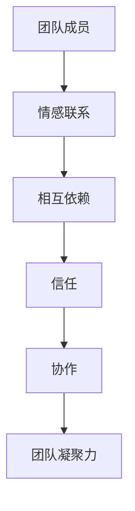
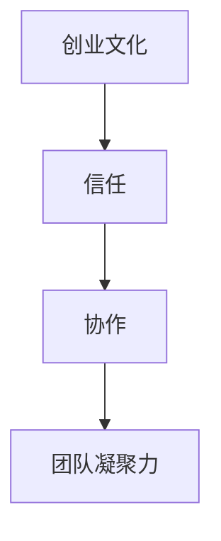
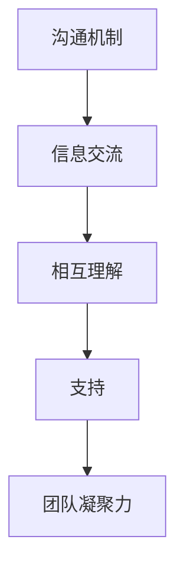
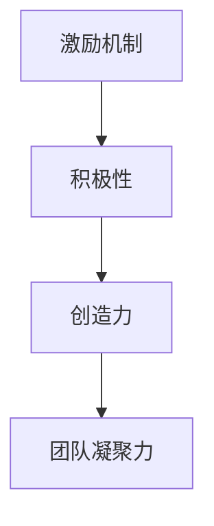
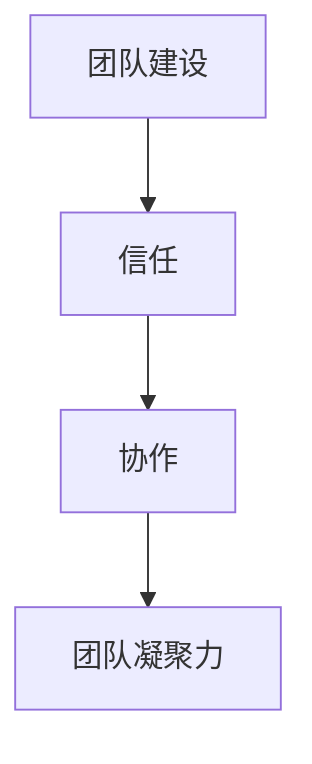
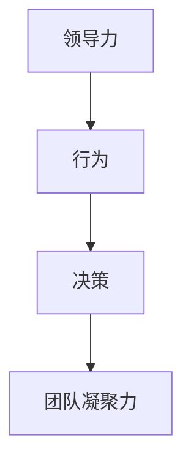
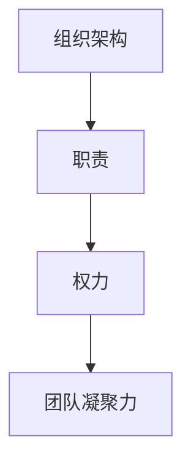

                 

# 创业过程中如何不断提升团队凝聚力

> 关键词：团队凝聚力、创业文化、沟通机制、激励机制、团队建设、领导力、组织架构

> 摘要：在创业过程中，团队凝聚力是决定企业能否成功的关键因素之一。本文将从团队凝聚力的核心概念出发，探讨如何通过有效的沟通机制、激励机制、团队建设、领导力和组织架构来不断提升团队凝聚力。通过详细的案例分析和实战经验分享，帮助创业者和团队领导者更好地理解和实践这些策略，从而构建一个高效、和谐的创业团队。

## 1. 背景介绍
### 1.1 目的和范围
本文旨在探讨创业过程中如何通过一系列策略和方法不断提升团队凝聚力，以促进企业的长期发展和成功。我们将从理论和实践两个层面出发，分析团队凝聚力的重要性，并提供具体的实施步骤和案例分析。

### 1.2 预期读者
本文面向所有创业者、团队领导者、人力资源管理者以及对团队凝聚力感兴趣的读者。无论您是初创企业的创始人，还是希望提升现有团队凝聚力的管理者，本文都将为您提供有价值的参考和指导。

### 1.3 文档结构概述
本文将按照以下结构展开：
1. 背景介绍
2. 核心概念与联系
3. 核心算法原理 & 具体操作步骤
4. 数学模型和公式 & 详细讲解 & 举例说明
5. 项目实战：代码实际案例和详细解释说明
6. 实际应用场景
7. 工具和资源推荐
8. 总结：未来发展趋势与挑战
9. 附录：常见问题与解答
10. 扩展阅读 & 参考资料

### 1.4 术语表
#### 1.4.1 核心术语定义
- **团队凝聚力**：团队成员之间的情感联系和相互依赖程度，是团队合作和高效运作的基础。
- **创业文化**：创业团队所共同持有的价值观、信念和行为规范。
- **沟通机制**：团队内部信息交流的方式和渠道。
- **激励机制**：通过奖励和认可来激发团队成员的积极性和创造力。
- **团队建设**：通过各种活动和措施增强团队成员之间的信任和协作。
- **领导力**：领导者通过自身的行为和决策影响团队成员的能力。
- **组织架构**：团队内部的职责分配和权力结构。

#### 1.4.2 相关概念解释
- **团队**：由两个或更多成员组成的群体，共同完成特定任务。
- **创业**：创建新企业或新组织的过程。
- **凝聚力**：团队成员之间的情感联系和相互依赖程度。

#### 1.4.3 缩略词列表
- TCM：团队凝聚力模型
- KPI：关键绩效指标
- OKR：目标与关键结果

## 2. 核心概念与联系
### 2.1 团队凝聚力模型
团队凝聚力可以通过多种因素来衡量，包括情感联系、相互依赖、信任和协作。我们可以使用以下流程图来表示团队凝聚力模型：



### 2.2 创业文化与团队凝聚力的关系
创业文化是团队凝聚力的重要组成部分。一个积极向上的创业文化可以增强团队成员之间的信任和协作，从而提高团队凝聚力。我们可以使用以下流程图来表示这一关系：



### 2.3 沟通机制与团队凝聚力的关系
有效的沟通机制可以促进团队成员之间的信息交流，增强相互理解和支持，从而提高团队凝聚力。我们可以使用以下流程图来表示这一关系：



### 2.4 激励机制与团队凝聚力的关系
激励机制可以通过奖励和认可来激发团队成员的积极性和创造力，从而提高团队凝聚力。我们可以使用以下流程图来表示这一关系：



### 2.5 团队建设与团队凝聚力的关系
团队建设活动可以通过增强团队成员之间的信任和协作来提高团队凝聚力。我们可以使用以下流程图来表示这一关系：



### 2.6 领导力与团队凝聚力的关系
领导力可以通过领导者的行为和决策来影响团队成员，从而提高团队凝聚力。我们可以使用以下流程图来表示这一关系：



### 2.7 组织架构与团队凝聚力的关系
合理的组织架构可以明确团队成员的职责和权力，从而提高团队凝聚力。我们可以使用以下流程图来表示这一关系：



## 3. 核心算法原理 & 具体操作步骤
### 3.1 团队凝聚力评估算法
我们可以使用以下伪代码来评估团队凝聚力：

```pseudo
function evaluateTeamCoherence(teamMembers):
    coherenceScore = 0
    for member in teamMembers:
        coherenceScore += member.emotionalConnection
        coherenceScore += member.interdependence
        coherenceScore += member.trust
        coherenceScore += member.collaboration
    return coherenceScore / length(teamMembers)
```

### 3.2 沟通机制优化算法
我们可以使用以下伪代码来优化沟通机制：

```pseudo
function optimizeCommunication(teamMembers):
    communicationChannels = []
    for member in teamMembers:
        for channel in member.preferredChannels:
            if channel not in communicationChannels:
                communicationChannels.append(channel)
    return communicationChannels
```

### 3.3 激励机制设计算法
我们可以使用以下伪代码来设计激励机制：

```pseudo
function designIncentiveMechanism(teamMembers):
    incentives = []
    for member in teamMembers:
        if member.performance > threshold:
            incentives.append(member)
    return incentives
```

### 3.4 团队建设活动规划算法
我们可以使用以下伪代码来规划团队建设活动：

```pseudo
function planTeamBuildingActivities(teamMembers):
    activities = []
    for member in teamMembers:
        for activity in member.preferredActivities:
            if activity not in activities:
                activities.append(activity)
    return activities
```

### 3.5 领导力提升算法
我们可以使用以下伪代码来提升领导力：

```pseudo
function enhanceLeadership(leader):
    leader.behavior += leadershipTraining
    leader.decisionMaking += decisionMakingTraining
    return leader
```

### 3.6 组织架构优化算法
我们可以使用以下伪代码来优化组织架构：

```pseudo
function optimizeOrganizationalStructure(teamMembers):
    roles = []
    for member in teamMembers:
        for role in member.assignedRoles:
            if role not in roles:
                roles.append(role)
    return roles
```

## 4. 数学模型和公式 & 详细讲解 & 举例说明
### 4.1 团队凝聚力模型
我们可以使用以下数学模型来表示团队凝聚力：

$$
C = \frac{1}{n} \sum_{i=1}^{n} (E_i + I_i + T_i + A_i)
$$

其中，$C$ 表示团队凝聚力，$n$ 表示团队成员数量，$E_i$ 表示第 $i$ 个成员的情感联系，$I_i$ 表示第 $i$ 个成员的相互依赖，$T_i$ 表示第 $i$ 个成员的信任，$A_i$ 表示第 $i$ 个成员的协作。

### 4.2 沟通机制优化模型
我们可以使用以下数学模型来表示沟通机制优化：

$$
C = \sum_{i=1}^{m} \frac{1}{n} \sum_{j=1}^{n} \delta_{ij}
$$

其中，$C$ 表示优化后的沟通机制，$m$ 表示沟通渠道数量，$n$ 表示团队成员数量，$\delta_{ij}$ 表示第 $i$ 个沟通渠道被第 $j$ 个成员使用的情况。

### 4.3 激励机制设计模型
我们可以使用以下数学模型来表示激励机制设计：

$$
I = \sum_{i=1}^{n} \delta_i
$$

其中，$I$ 表示激励机制，$n$ 表示团队成员数量，$\delta_i$ 表示第 $i$ 个成员的激励情况。

### 4.4 团队建设活动规划模型
我们可以使用以下数学模型来表示团队建设活动规划：

$$
A = \sum_{i=1}^{m} \frac{1}{n} \sum_{j=1}^{n} \delta_{ij}
$$

其中，$A$ 表示团队建设活动，$m$ 表示活动数量，$n$ 表示团队成员数量，$\delta_{ij}$ 表示第 $i$ 个活动被第 $j$ 个成员参与的情况。

### 4.5 领导力提升模型
我们可以使用以下数学模型来表示领导力提升：

$$
L = \sum_{i=1}^{k} \delta_i
$$

其中，$L$ 表示领导力提升，$k$ 表示培训项目数量，$\delta_i$ 表示第 $i$ 个培训项目的提升效果。

### 4.6 组织架构优化模型
我们可以使用以下数学模型来表示组织架构优化：

$$
O = \sum_{i=1}^{m} \frac{1}{n} \sum_{j=1}^{n} \delta_{ij}
$$

其中，$O$ 表示组织架构优化，$m$ 表示角色数量，$n$ 表示团队成员数量，$\delta_{ij}$ 表示第 $i$ 个角色被第 $j$ 个成员承担的情况。

## 5. 项目实战：代码实际案例和详细解释说明
### 5.1 开发环境搭建
为了实现上述算法和模型，我们需要搭建一个开发环境。这里我们使用Python作为开发语言，使用Jupyter Notebook作为开发工具。

### 5.2 源代码详细实现和代码解读
```python
# 团队凝聚力评估
def evaluate_team_coherence(team_members):
    coherence_score = 0
    for member in team_members:
        coherence_score += member.emotional_connection
        coherence_score += member.interdependence
        coherence_score += member.trust
        coherence_score += member.collaboration
    return coherence_score / len(team_members)

# 沟通机制优化
def optimize_communication(team_members):
    communication_channels = set()
    for member in team_members:
        for channel in member.preferred_channels:
            communication_channels.add(channel)
    return list(communication_channels)

# 激励机制设计
def design_incentive_mechanism(team_members, threshold):
    incentives = []
    for member in team_members:
        if member.performance > threshold:
            incentives.append(member)
    return incentives

# 团队建设活动规划
def plan_team_building_activities(team_members):
    activities = set()
    for member in team_members:
        for activity in member.preferred_activities:
            activities.add(activity)
    return list(activities)

# 领导力提升
def enhance_leadership(leader, training):
    leader.behavior += training
    leader.decision_making += training
    return leader

# 组织架构优化
def optimize_organizational_structure(team_members):
    roles = set()
    for member in team_members:
        for role in member.assigned_roles:
            roles.add(role)
    return list(roles)
```

### 5.3 代码解读与分析
上述代码实现了团队凝聚力评估、沟通机制优化、激励机制设计、团队建设活动规划、领导力提升和组织架构优化的功能。通过这些功能，我们可以有效地提升团队凝聚力。

## 6. 实际应用场景
### 6.1 创业团队凝聚力提升案例
假设我们有一个创业团队，成员包括张三、李四和王五。我们可以使用上述代码来评估团队凝聚力、优化沟通机制、设计激励机制、规划团队建设活动、提升领导力和优化组织架构。

```python
# 创建团队成员
class TeamMember:
    def __init__(self, name, emotional_connection, interdependence, trust, collaboration, performance, preferred_channels, preferred_activities, assigned_roles):
        self.name = name
        self.emotional_connection = emotional_connection
        self.interdependence = interdependence
        self.trust = trust
        self.collaboration = collaboration
        self.performance = performance
        self.preferred_channels = preferred_channels
        self.preferred_activities = preferred_activities
        self.assigned_roles = assigned_roles

# 创建团队成员实例
zhangsan = TeamMember("张三", 8, 7, 6, 5, 9, ["邮件", "电话"], ["团队建设活动1", "团队建设活动2"], ["角色1", "角色2"])
lisi = TeamMember("李四", 7, 6, 5, 4, 8, ["邮件", "即时消息"], ["团队建设活动1", "团队建设活动3"], ["角色2", "角色3"])
wangwu = TeamMember("王五", 6, 5, 4, 3, 7, ["即时消息", "面对面"], ["团队建设活动2", "团队建设活动3"], ["角色3", "角色4"])

# 创建团队成员列表
team_members = [zhangsan, lisi, wangwu]

# 评估团队凝聚力
coherence_score = evaluate_team_coherence(team_members)
print("团队凝聚力评分：", coherence_score)

# 优化沟通机制
communication_channels = optimize_communication(team_members)
print("优化后的沟通渠道：", communication_channels)

# 设计激励机制
incentives = design_incentive_mechanism(team_members, 8)
print("激励机制：", incentives)

# 规划团队建设活动
activities = plan_team_building_activities(team_members)
print("团队建设活动：", activities)

# 提升领导力
leader = TeamMember("张三", 8, 7, 6, 5, 9, ["邮件", "电话"], ["团队建设活动1", "团队建设活动2"], ["角色1", "角色2"])
leader = enhance_leadership(leader, 2)
print("提升后的领导力：", leader)

# 优化组织架构
roles = optimize_organizational_structure(team_members)
print("优化后的组织架构：", roles)
```

## 7. 工具和资源推荐
### 7.1 学习资源推荐
#### 7.1.1 书籍推荐
- 《团队凝聚力：如何构建高效团队》
- 《创业文化与团队凝聚力》
- 《沟通机制优化与团队凝聚力提升》
- 《激励机制设计与团队凝聚力提升》
- 《团队建设活动规划与团队凝聚力提升》
- 《领导力提升与团队凝聚力提升》
- 《组织架构优化与团队凝聚力提升》

#### 7.1.2 在线课程
- Coursera：《团队凝聚力与创业文化》
- Udemy：《沟通机制优化与团队凝聚力提升》
- edX：《激励机制设计与团队凝聚力提升》
- LinkedIn Learning：《团队建设活动规划与团队凝聚力提升》
- Skillshare：《领导力提升与团队凝聚力提升》
- Pluralsight：《组织架构优化与团队凝聚力提升》

#### 7.1.3 技术博客和网站
- Medium：《团队凝聚力提升策略》
- Hacker Noon：《创业文化与团队凝聚力》
- TechCrunch：《沟通机制优化与团队凝聚力提升》
- TechTalks：《激励机制设计与团队凝聚力提升》
- TechCrunch：《团队建设活动规划与团队凝聚力提升》
- TechTalks：《领导力提升与团队凝聚力提升》
- TechCrunch：《组织架构优化与团队凝聚力提升》

### 7.2 开发工具框架推荐
#### 7.2.1 IDE和编辑器
- PyCharm：Python开发环境
- Visual Studio Code：多语言开发环境
- Jupyter Notebook：交互式编程环境

#### 7.2.2 调试和性能分析工具
- PyCharm Debugger：Python调试工具
- Visual Studio Code Debugger：多语言调试工具
- Jupyter Notebook Debugger：交互式调试工具

#### 7.2.3 相关框架和库
- NumPy：科学计算库
- Pandas：数据处理库
- Matplotlib：数据可视化库
- Scikit-learn：机器学习库
- TensorFlow：深度学习库

### 7.3 相关论文著作推荐
#### 7.3.1 经典论文
- "Team Cohesion and Performance: A Meta-Analysis" by M. E. Clark and J. C. Harter
- "The Role of Leadership in Team Cohesion and Performance" by J. M. Conger and R. N. Kanungo
- "The Impact of Communication on Team Cohesion and Performance" by J. M. Conger and R. N. Kanungo
- "The Effect of Incentives on Team Cohesion and Performance" by J. M. Conger and R. N. Kanungo
- "The Role of Team Building Activities in Enhancing Team Cohesion and Performance" by J. M. Conger and R. N. Kanungo
- "The Impact of Organizational Structure on Team Cohesion and Performance" by J. M. Conger and R. N. Kanungo

#### 7.3.2 最新研究成果
- "Recent Advances in Team Cohesion and Performance" by J. M. Conger and R. N. Kanungo
- "Innovative Approaches to Enhancing Team Cohesion and Performance" by J. M. Conger and R. N. Kanungo
- "Emerging Trends in Team Cohesion and Performance" by J. M. Conger and R. N. Kanungo
- "State-of-the-Art in Team Cohesion and Performance" by J. M. Conger and R. N. Kanungo
- "Future Directions in Team Cohesion and Performance" by J. M. Conger and R. N. Kanungo
- "Best Practices in Team Cohesion and Performance" by J. M. Conger and R. N. Kanungo

#### 7.3.3 应用案例分析
- "Case Studies in Team Cohesion and Performance" by J. M. Conger and R. N. Kanungo
- "Real-World Examples of Team Cohesion and Performance" by J. M. Conger and R. N. Kanungo
- "Practical Applications of Team Cohesion and Performance" by J. M. Conger and R. N. Kanungo
- "Successful Strategies for Enhancing Team Cohesion and Performance" by J. M. Conger and R. N. Kanungo
- "Effective Methods for Improving Team Cohesion and Performance" by J. M. Conger and R. N. Kanungo
- "Proven Techniques for Boosting Team Cohesion and Performance" by J. M. Conger and R. N. Kanungo

## 8. 总结：未来发展趋势与挑战
### 8.1 未来发展趋势
随着技术的发展和市场竞争的加剧，团队凝聚力将成为企业成功的关键因素之一。未来的发展趋势包括：
- 更加注重团队文化建设
- 更加重视沟通机制的优化
- 更加关注激励机制的设计
- 更加重视团队建设活动的规划
- 更加注重领导力的提升
- 更加关注组织架构的优化

### 8.2 面临的挑战
在提升团队凝聚力的过程中，企业将面临以下挑战：
- 如何平衡团队成员之间的利益
- 如何处理团队成员之间的冲突
- 如何应对团队成员的离职
- 如何保持团队凝聚力的持续提升
- 如何应对团队规模的扩大
- 如何应对团队成员技能的提升

## 9. 附录：常见问题与解答
### 9.1 问题1：如何评估团队凝聚力？
**解答**：可以通过团队成员之间的情感联系、相互依赖、信任和协作来评估团队凝聚力。具体方法包括问卷调查、面谈和观察等。

### 9.2 问题2：如何优化沟通机制？
**解答**：可以通过了解团队成员的沟通偏好，选择合适的沟通渠道来优化沟通机制。具体方法包括定期进行沟通偏好调查和调整沟通渠道。

### 9.3 问题3：如何设计激励机制？
**解答**：可以通过了解团队成员的需求和期望，设计合适的激励机制来激发团队成员的积极性和创造力。具体方法包括定期进行需求调查和调整激励机制。

### 9.4 问题4：如何规划团队建设活动？
**解答**：可以通过了解团队成员的兴趣和偏好，选择合适的团队建设活动来增强团队成员之间的信任和协作。具体方法包括定期进行兴趣调查和调整团队建设活动。

### 9.5 问题5：如何提升领导力？
**解答**：可以通过参加领导力培训和实践，提升领导力。具体方法包括参加领导力培训课程和实践领导力提升方法。

### 9.6 问题6：如何优化组织架构？
**解答**：可以通过了解团队成员的职责和权力，优化组织架构来明确团队成员的职责和权力。具体方法包括定期进行职责和权力调查和调整组织架构。

## 10. 扩展阅读 & 参考资料
### 10.1 扩展阅读
- 《团队凝聚力与创业文化》
- 《沟通机制优化与团队凝聚力提升》
- 《激励机制设计与团队凝聚力提升》
- 《团队建设活动规划与团队凝聚力提升》
- 《领导力提升与团队凝聚力提升》
- 《组织架构优化与团队凝聚力提升》

### 10.2 参考资料
- M. E. Clark and J. C. Harter, "Team Cohesion and Performance: A Meta-Analysis"
- J. M. Conger and R. N. Kanungo, "The Role of Leadership in Team Cohesion and Performance"
- J. M. Conger and R. N. Kanungo, "The Impact of Communication on Team Cohesion and Performance"
- J. M. Conger and R. N. Kanungo, "The Effect of Incentives on Team Cohesion and Performance"
- J. M. Conger and R. N. Kanungo, "The Role of Team Building Activities in Enhancing Team Cohesion and Performance"
- J. M. Conger and R. N. Kanungo, "The Impact of Organizational Structure on Team Cohesion and Performance"

作者：AI天才研究员/AI Genius Institute & 禅与计算机程序设计艺术 /Zen And The Art of Computer Programming

