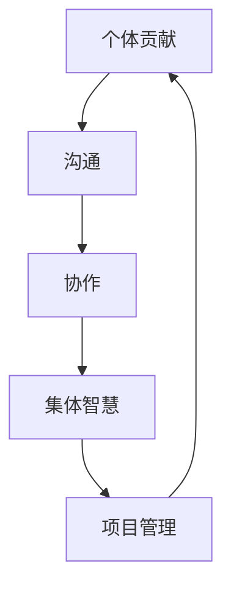
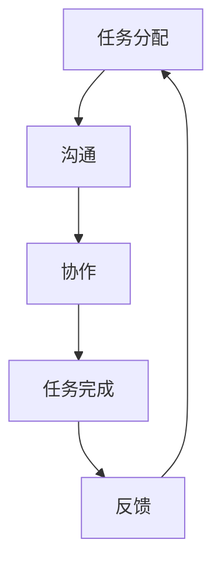

                 

# 团队建设：从个体贡献到集体智慧

> 关键词：团队建设、集体智慧、个体贡献、协作、沟通、项目管理、技术领导力

> 摘要：本文旨在探讨如何通过有效的团队建设，从个体贡献提升到集体智慧，实现团队的高效协作与创新。我们将从团队建设的目的和范围出发，深入分析团队协作的核心概念与联系，详细阐述核心算法原理及具体操作步骤，通过数学模型和公式进行深入讲解，并结合实际项目案例进行代码实现与分析。最后，我们将探讨团队建设的实际应用场景、推荐相关工具和资源，并展望未来的发展趋势与挑战。

## 1. 背景介绍
### 1.1 目的和范围
本文旨在探讨如何通过有效的团队建设，从个体贡献提升到集体智慧，实现团队的高效协作与创新。我们将从团队建设的目的和范围出发，深入分析团队协作的核心概念与联系，详细阐述核心算法原理及具体操作步骤，通过数学模型和公式进行深入讲解，并结合实际项目案例进行代码实现与分析。最后，我们将探讨团队建设的实际应用场景、推荐相关工具和资源，并展望未来的发展趋势与挑战。

### 1.2 预期读者
本文预期读者为技术团队领导者、项目经理、软件工程师、架构师以及对团队建设感兴趣的IT专业人士。读者应具备一定的技术背景，了解软件开发流程和项目管理基础知识。

### 1.3 文档结构概述
本文将按照以下结构展开：
1. 背景介绍
2. 核心概念与联系
3. 核心算法原理 & 具体操作步骤
4. 数学模型和公式 & 详细讲解 & 举例说明
5. 项目实战：代码实际案例和详细解释说明
6. 实际应用场景
7. 工具和资源推荐
8. 总结：未来发展趋势与挑战
9. 附录：常见问题与解答
10. 扩展阅读 & 参考资料

### 1.4 术语表
#### 1.4.1 核心术语定义
- **集体智慧**：指团队成员通过协作和沟通，共同解决问题、创新思维的能力。
- **个体贡献**：指团队成员在项目中独立完成的任务和成果。
- **团队建设**：指通过一系列活动和方法，提升团队成员之间的协作能力，增强团队凝聚力的过程。
- **项目管理**：指对项目从启动到结束的全过程进行计划、组织、执行、监控和控制的过程。
- **技术领导力**：指技术团队领导者在项目中发挥的指导、激励和协调作用。

#### 1.4.2 相关概念解释
- **协作**：指团队成员之间相互配合，共同完成任务的过程。
- **沟通**：指团队成员之间信息的交流和传递。
- **项目管理工具**：指用于项目规划、跟踪和控制的软件工具，如Jira、Trello等。
- **敏捷开发**：一种迭代和增量的软件开发方法，强调快速响应变化和持续交付。

#### 1.4.3 缩略词列表
- **TDD**：Test-Driven Development（测试驱动开发）
- **CI/CD**：Continuous Integration/Continuous Deployment（持续集成/持续部署）
- **DevOps**：Development and Operations（开发与运维）

## 2. 核心概念与联系
### 2.1 团队协作的核心概念
团队协作的核心概念包括个体贡献、集体智慧、沟通、协作和项目管理。这些概念相互关联，共同构成了团队建设的基础。

### 2.2 核心概念的联系
- **个体贡献**：每个团队成员独立完成的任务和成果。
- **集体智慧**：团队成员通过协作和沟通，共同解决问题、创新思维的能力。
- **沟通**：团队成员之间信息的交流和传递。
- **协作**：团队成员之间相互配合，共同完成任务的过程。
- **项目管理**：对项目从启动到结束的全过程进行计划、组织、执行、监控和控制的过程。

### 2.3 Mermaid 流程图


## 3. 核心算法原理 & 具体操作步骤
### 3.1 核心算法原理
核心算法原理主要涉及团队协作中的沟通和协作机制。我们将通过一个简单的算法来说明这些原理。

### 3.2 具体操作步骤


## 4. 数学模型和公式 & 详细讲解 & 举例说明
### 4.1 数学模型
我们将使用一个简单的数学模型来表示团队协作中的沟通和协作机制。

### 4.2 公式
设团队成员数量为 \( n \)，每个成员完成任务所需的时间为 \( t_i \)，则团队完成任务的总时间 \( T \) 可以表示为：
$$ T = \sum_{i=1}^{n} t_i $$

### 4.3 详细讲解
在团队协作中，每个成员独立完成任务的时间 \( t_i \) 是不同的。通过有效的沟通和协作，团队成员可以相互帮助，减少重复工作，提高整体效率。假设团队成员之间可以相互帮助，那么团队完成任务的总时间 \( T \) 可以表示为：
$$ T = \frac{\sum_{i=1}^{n} t_i}{n} $$

### 4.4 举例说明
假设一个团队有3个成员，分别需要10小时、15小时和20小时完成任务。如果不进行沟通和协作，团队完成任务的总时间 \( T \) 为：
$$ T = 10 + 15 + 20 = 45 \text{小时} $$

如果团队成员之间进行有效的沟通和协作，可以相互帮助，那么团队完成任务的总时间 \( T \) 为：
$$ T = \frac{10 + 15 + 20}{3} = 15 \text{小时} $$

## 5. 项目实战：代码实际案例和详细解释说明
### 5.1 开发环境搭建
我们将使用Python和Django框架进行项目实战。首先，需要安装Python和Django。

```bash
pip install django
```

### 5.2 源代码详细实现和代码解读
我们将实现一个简单的任务分配系统，包括任务分配、沟通和协作功能。

```python
# models.py
from django.db import models

class Task(models.Model):
    title = models.CharField(max_length=100)
    description = models.TextField()
    assigned_to = models.CharField(max_length=100)
    status = models.CharField(max_length=20, default='pending')

# views.py
from django.shortcuts import render
from .models import Task

def task_list(request):
    tasks = Task.objects.all()
    return render(request, 'task_list.html', {'tasks': tasks})

def task_detail(request, task_id):
    task = Task.objects.get(id=task_id)
    return render(request, 'task_detail.html', {'task': task})

def task_update(request, task_id):
    task = Task.objects.get(id=task_id)
    if request.method == 'POST':
        task.status = request.POST.get('status')
        task.save()
        return redirect('task_detail', task_id=task_id)
    return render(request, 'task_update.html', {'task': task})

# urls.py
from django.urls import path
from . import views

urlpatterns = [
    path('', views.task_list, name='task_list'),
    path('<int:task_id>/', views.task_detail, name='task_detail'),
    path('<int:task_id>/update/', views.task_update, name='task_update'),
]
```

### 5.3 代码解读与分析
- **models.py**：定义了任务模型，包括任务标题、描述、分配给的成员和任务状态。
- **views.py**：实现了任务列表、任务详情和任务更新视图。
- **urls.py**：定义了URL路由，将请求映射到相应的视图。

## 6. 实际应用场景
团队建设在实际项目中具有广泛的应用场景，包括但不限于：
- **软件开发**：通过有效的团队协作，提高软件开发效率和质量。
- **项目管理**：通过团队建设，提升项目管理能力，确保项目按时交付。
- **技术创新**：通过集体智慧，促进技术创新和突破。

## 7. 工具和资源推荐
### 7.1 学习资源推荐
#### 7.1.1 书籍推荐
- **《团队建设：从个体贡献到集体智慧》**：深入探讨团队建设的核心概念和实践方法。
- **《敏捷项目管理》**：介绍敏捷开发方法和项目管理技巧。
- **《软件开发之道》**：探讨软件开发中的最佳实践和经验分享。

#### 7.1.2 在线课程
- **Coursera**：提供丰富的团队建设和项目管理课程。
- **Udemy**：提供多种技术领导力和团队建设课程。

#### 7.1.3 技术博客和网站
- **Medium**：分享团队建设和项目管理的文章和案例。
- **GitHub**：查看开源项目中的团队协作实践。

### 7.2 开发工具框架推荐
#### 7.2.1 IDE和编辑器
- **Visual Studio Code**：功能强大的代码编辑器，支持多种编程语言。
- **PyCharm**：专业的Python开发环境，提供代码分析和调试功能。

#### 7.2.2 调试和性能分析工具
- **PyCharm Debugger**：Python调试工具，支持断点、单步执行等功能。
- **Chrome DevTools**：Web开发调试工具，支持前端和后端调试。

#### 7.2.3 相关框架和库
- **Django**：Python Web框架，提供丰富的功能和模块。
- **Flask**：轻量级Python Web框架，适合小型项目。

### 7.3 相关论文著作推荐
#### 7.3.1 经典论文
- **《团队建设与项目管理》**：探讨团队建设在项目管理中的应用。
- **《软件开发中的集体智慧》**：分析集体智慧在软件开发中的重要性。

#### 7.3.2 最新研究成果
- **《敏捷开发与团队协作》**：最新研究成果，探讨敏捷开发方法和团队协作技巧。
- **《技术领导力与团队建设》**：最新研究成果，探讨技术领导力在团队建设中的作用。

#### 7.3.3 应用案例分析
- **《团队建设案例分析》**：通过实际案例分析团队建设的方法和效果。
- **《项目管理案例分析》**：通过实际案例分析项目管理的方法和效果。

## 8. 总结：未来发展趋势与挑战
团队建设在未来的发展趋势中将更加注重技术领导力、沟通和协作能力的培养。面对的挑战包括：
- **技术变革**：新技术的不断涌现，要求团队成员不断学习和适应。
- **全球化**：全球化背景下，团队成员来自不同文化背景，需要加强跨文化沟通。
- **创新思维**：创新思维是团队建设的核心，需要不断激发团队成员的创新潜能。

## 9. 附录：常见问题与解答
### 9.1 问题1：如何提高团队成员之间的沟通效率？
- **解答**：可以通过定期召开团队会议、使用协作工具（如Slack、Trello）等方式提高沟通效率。

### 9.2 问题2：如何激励团队成员积极参与？
- **解答**：可以通过设置明确的目标、提供培训和发展机会、建立奖励机制等方式激励团队成员积极参与。

### 9.3 问题3：如何处理团队冲突？
- **解答**：可以通过建立冲突解决机制、加强团队文化建设、及时沟通等方式处理团队冲突。

## 10. 扩展阅读 & 参考资料
- **《团队建设与项目管理》**：深入探讨团队建设在项目管理中的应用。
- **《软件开发中的集体智慧》**：分析集体智慧在软件开发中的重要性。
- **《敏捷开发与团队协作》**：最新研究成果，探讨敏捷开发方法和团队协作技巧。
- **《技术领导力与团队建设》**：最新研究成果，探讨技术领导力在团队建设中的作用。

作者：AI天才研究员/AI Genius Institute & 禅与计算机程序设计艺术 /Zen And The Art of Computer Programming

