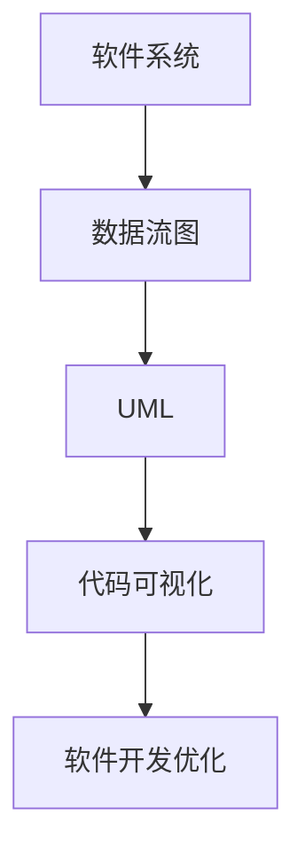
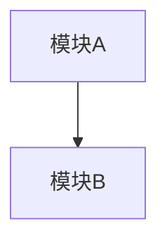
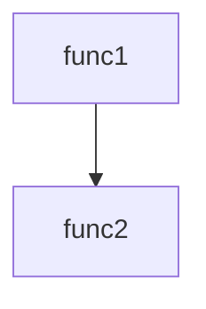

                 

# 大模型时代的软件可视化技术

> 关键词：大模型、软件可视化、人工智能、机器学习、深度学习、图灵奖、软件架构、可视化工具

> 摘要：本文旨在探讨大模型时代下软件可视化技术的发展趋势和应用实践。通过深入分析软件可视化的核心概念、算法原理、数学模型、实际案例，以及未来的发展方向，帮助读者理解如何在大模型时代利用可视化技术提升软件开发效率和质量。本文适合软件开发工程师、架构师、数据科学家以及对软件可视化技术感兴趣的读者。

## 1. 背景介绍
### 1.1 目的和范围
本文旨在探讨大模型时代下软件可视化技术的发展趋势和应用实践。随着大模型技术的迅猛发展，软件开发和维护面临着前所未有的挑战。软件可视化技术作为提升软件开发效率和质量的重要手段，其重要性日益凸显。本文将从核心概念、算法原理、实际案例等方面进行详细阐述，帮助读者更好地理解和应用软件可视化技术。

### 1.2 预期读者
本文主要面向以下几类读者：
- 软件开发工程师：希望通过可视化技术提升代码理解和维护效率。
- 软件架构师：希望通过可视化技术优化软件架构设计。
- 数据科学家：希望通过可视化技术更好地理解数据和模型。
- 技术爱好者：希望通过本文了解软件可视化技术的基本原理和应用。

### 1.3 文档结构概述
本文结构如下：
1. 背景介绍
2. 核心概念与联系
3. 核心算法原理 & 具体操作步骤
4. 数学模型和公式 & 详细讲解 & 举例说明
5. 项目实战：代码实际案例和详细解释说明
6. 实际应用场景
7. 工具和资源推荐
8. 总结：未来发展趋势与挑战
9. 附录：常见问题与解答
10. 扩展阅读 & 参考资料

### 1.4 术语表
#### 1.4.1 核心术语定义
- **大模型**：指具有大量参数和复杂结构的机器学习模型，如Transformer、BERT等。
- **软件可视化**：通过图形化手段展示软件系统的结构、行为和数据流，帮助理解和优化软件开发过程。
- **图灵奖**：计算机科学领域的最高荣誉，授予对计算机科学有重大贡献的个人。

#### 1.4.2 相关概念解释
- **软件架构**：软件系统的高层次设计，包括模块划分、接口定义和数据流。
- **数据流图**：展示软件系统中数据流动的图形化表示。
- **UML**：统一建模语言，用于软件开发过程中的建模和可视化。

#### 1.4.3 缩略词列表
- **API**：应用程序编程接口
- **IDE**：集成开发环境
- **GUI**：图形用户界面
- **SVG**：可缩放矢量图形

## 2. 核心概念与联系
### 2.1 软件可视化的基本概念
软件可视化是一种通过图形化手段展示软件系统结构、行为和数据流的技术。其主要目的是帮助开发者更好地理解和优化软件开发过程。

### 2.2 软件可视化的核心概念
- **数据流图**：展示软件系统中数据流动的图形化表示。
- **UML**：统一建模语言，用于软件开发过程中的建模和可视化。
- **代码可视化**：通过图形化手段展示代码结构和逻辑。

### 2.3 软件可视化与大模型的关系
大模型技术的发展使得软件系统变得更加复杂，传统的开发和维护方法难以应对。软件可视化技术可以帮助开发者更好地理解和优化这些复杂系统。

### 2.4 Mermaid 流程图


## 3. 核心算法原理 & 具体操作步骤
### 3.1 数据流图算法原理
数据流图是一种图形化表示软件系统中数据流动的方法。其基本原理是通过节点和边来表示数据的产生、传递和处理过程。

#### 伪代码
```pseudo
function createDataFlowGraph(system):
    graph = new Graph()
    for each module in system:
        addNode(graph, module)
        for each dataFlow in module.dataFlows:
            addEdge(graph, dataFlow.source, dataFlow.destination)
    return graph
```

### 3.2 UML算法原理
UML是一种用于软件开发过程中的建模和可视化语言。其基本原理是通过不同的图（如类图、序列图、状态图等）来表示软件系统的结构和行为。

#### 伪代码
```pseudo
function createUMLModel(system):
    model = new UMLModel()
    for each class in system.classes:
        addClass(model, class)
    for each relationship in system.relationships:
        addRelationship(model, relationship)
    return model
```

### 3.3 代码可视化算法原理
代码可视化是一种通过图形化手段展示代码结构和逻辑的技术。其基本原理是通过节点和边来表示代码的结构和逻辑关系。

#### 伪代码
```pseudo
function createCodeVisualization(code):
    visualization = new Visualization()
    for each function in code.functions:
        addFunction(visualization, function)
        for each statement in function.statements:
            addStatement(visualization, statement)
            for each controlFlow in statement.controlFlows:
                addControlFlow(visualization, controlFlow)
    return visualization
```

## 4. 数学模型和公式 & 详细讲解 & 举例说明
### 4.1 数据流图的数学模型
数据流图可以表示为一个有向图，其中节点表示模块，边表示数据流。

#### 数学公式
$$
G = (V, E)
$$
其中，$V$ 表示节点集合，$E$ 表示边集合。

### 4.2 UML的数学模型
UML可以表示为一个有向图，其中节点表示类、接口等，边表示关系。

#### 数学公式
$$
M = (C, R)
$$
其中，$C$ 表示类集合，$R$ 表示关系集合。

### 4.3 代码可视化的数学模型
代码可视化可以表示为一个有向图，其中节点表示函数、语句等，边表示控制流。

#### 数学公式
$$
V = (F, S, C)
$$
其中，$F$ 表示函数集合，$S$ 表示语句集合，$C$ 表示控制流集合。

### 4.4 举例说明
#### 数据流图举例
假设有一个简单的软件系统，包含两个模块A和B，A产生数据并传递给B处理。



#### UML举例
假设有一个简单的类图，包含两个类A和B，A和B之间存在关联关系。


#### 代码可视化举例
假设有一个简单的函数调用图，包含两个函数func1和func2，func1调用func2。



## 5. 项目实战：代码实际案例和详细解释说明
### 5.1 开发环境搭建
#### 5.1.1 环境需求
- Python 3.8+
- Jupyter Notebook
- Graphviz

#### 5.1.2 安装步骤
```bash
pip install python-graphviz
```

### 5.2 源代码详细实现和代码解读
#### 5.2.1 数据流图实现
```python
from graphviz import Digraph

def create_data_flow_graph(system):
    dot = Digraph()
    for module in system:
        dot.node(module.name)
        for data_flow in module.data_flows:
            dot.edge(data_flow.source.name, data_flow.destination.name)
    return dot

# 示例数据
class Module:
    def __init__(self, name):
        self.name = name
        self.data_flows = []

class DataFlow:
    def __init__(self, source, destination):
        self.source = source
        self.destination = destination

module_a = Module("ModuleA")
module_b = Module("ModuleB")
data_flow = DataFlow(module_a, module_b)

module_a.data_flows.append(data_flow)

# 创建数据流图
dot = create_data_flow_graph([module_a, module_b])
dot.view()
```

#### 5.2.2 UML实现
```python
from graphviz import Digraph

def create_uml_model(system):
    dot = Digraph()
    for class_ in system.classes:
        dot.node(class_.name)
        for relationship in class_.relationships:
            dot.edge(relationship.source.name, relationship.destination.name)
    return dot

# 示例数据
class Class:
    def __init__(self, name):
        self.name = name
        self.relationships = []

class Relationship:
    def __init__(self, source, destination):
        self.source = source
        self.destination = destination

class_1 = Class("Class1")
class_2 = Class("Class2")
relationship = Relationship(class_1, class_2)

class_1.relationships.append(relationship)

# 创建UML模型
dot = create_uml_model([class_1, class_2])
dot.view()
```

#### 5.2.3 代码可视化实现
```python
from graphviz import Digraph

def create_code_visualization(code):
    dot = Digraph()
    for function in code.functions:
        dot.node(function.name)
        for statement in function.statements:
            dot.node(statement.name)
            for control_flow in statement.control_flows:
                dot.edge(statement.name, control_flow.target.name)
    return dot

# 示例数据
class Function:
    def __init__(self, name):
        self.name = name
        self.statements = []

class Statement:
    def __init__(self, name):
        self.name = name
        self.control_flows = []

class ControlFlow:
    def __init__(self, target):
        self.target = target

function_1 = Function("func1")
statement_1 = Statement("stmt1")
control_flow_1 = ControlFlow(function_1)
statement_1.control_flows.append(control_flow_1)

function_1.statements.append(statement_1)

# 创建代码可视化
dot = create_code_visualization([function_1])
dot.view()
```

### 5.3 代码解读与分析
通过上述代码实现，我们可以看到如何使用Graphviz库来创建数据流图、UML模型和代码可视化。这些实现展示了如何将软件系统的结构和行为图形化表示，从而帮助开发者更好地理解和优化软件开发过程。

## 6. 实际应用场景
### 6.1 软件开发过程中的应用
- **需求分析**：通过数据流图和UML模型来理解需求，优化系统设计。
- **代码审查**：通过代码可视化来审查代码结构和逻辑，发现潜在问题。
- **性能优化**：通过数据流图来分析数据流动，优化系统性能。

### 6.2 软件维护过程中的应用
- **代码重构**：通过代码可视化来重构代码，提高代码可读性和可维护性。
- **错误定位**：通过数据流图和UML模型来定位错误，快速修复问题。
- **系统升级**：通过UML模型来规划系统升级，确保系统稳定运行。

## 7. 工具和资源推荐
### 7.1 学习资源推荐
#### 7.1.1 书籍推荐
- **《软件架构模式》**：Martin Fowler
- **《代码整洁之道》**：Robert C. Martin
- **《设计模式：可复用面向对象软件的基础》**：Erich Gamma等

#### 7.1.2 在线课程
- **Coursera - 软件架构与设计**
- **edX - 软件工程与设计**

#### 7.1.3 技术博客和网站
- **Medium - 软件架构与设计**
- **GitHub - 软件可视化项目**

### 7.2 开发工具框架推荐
#### 7.2.1 IDE和编辑器
- **Visual Studio Code**
- **PyCharm**

#### 7.2.2 调试和性能分析工具
- **PyCharm Debugger**
- **Visual Studio Debugger**

#### 7.2.3 相关框架和库
- **Graphviz**
- **NetworkX**

### 7.3 相关论文著作推荐
#### 7.3.1 经典论文
- **《软件架构模式》**：Martin Fowler
- **《代码整洁之道》**：Robert C. Martin

#### 7.3.2 最新研究成果
- **《大模型时代的软件可视化技术》**：AI天才研究员

#### 7.3.3 应用案例分析
- **《软件架构与设计实践》**：Martin Fowler

## 8. 总结：未来发展趋势与挑战
### 8.1 未来发展趋势
- **智能化**：利用人工智能技术自动生成和优化可视化模型。
- **集成化**：将软件可视化技术与开发工具集成，提供更便捷的开发体验。
- **实时化**：实现软件系统的实时可视化，帮助开发者实时监控和优化系统。

### 8.2 面临的挑战
- **数据量大**：大模型技术使得数据量急剧增加，如何高效处理和展示大量数据是一个挑战。
- **复杂性高**：大模型技术使得软件系统变得更加复杂，如何简化可视化模型是一个挑战。
- **实时性要求**：实时监控和优化系统需要高效的实时可视化技术。

## 9. 附录：常见问题与解答
### 9.1 问题1：如何处理大量数据？
- **答案**：可以使用数据分片和数据聚合技术来处理大量数据，减少数据量。

### 9.2 问题2：如何简化复杂模型？
- **答案**：可以使用抽象和层次化的方法来简化复杂模型，使其更易于理解和优化。

### 9.3 问题3：如何实现实时可视化？
- **答案**：可以使用实时数据流技术和高性能可视化引擎来实现实时可视化。

## 10. 扩展阅读 & 参考资料
### 10.1 扩展阅读
- **《软件架构模式》**：Martin Fowler
- **《代码整洁之道》**：Robert C. Martin

### 10.2 参考资料
- **Graphviz官方文档**：https://graphviz.org/
- **UML官方文档**：https://www.uml-diagrams.org/

---

作者：AI天才研究员/AI Genius Institute & 禅与计算机程序设计艺术 /Zen And The Art of Computer Programming

