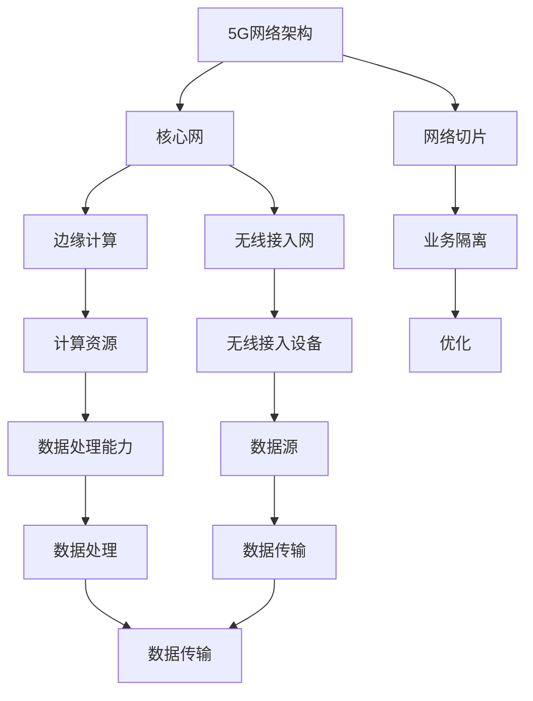

                 

# 如何利用5G技术提升创业产品和服务的互联互通

> 关键词：5G技术, 互联互通, 创业产品, 服务优化, 网络架构, 数据传输, 低延迟, 高带宽, 边缘计算

> 摘要：本文旨在探讨如何利用5G技术提升创业产品和服务的互联互通。通过深入分析5G技术的核心概念、架构原理、具体操作步骤、数学模型和实际案例，本文将为读者提供一个全面的技术视角，帮助创业者更好地理解和应用5G技术，从而提升其产品和服务的竞争力。

## 1. 背景介绍
### 1.1 目的和范围
本文旨在探讨如何利用5G技术提升创业产品和服务的互联互通。5G技术作为新一代移动通信技术，具有高带宽、低延迟、大连接数等特性，为物联网、自动驾驶、远程医疗等应用场景提供了强有力的支持。本文将从技术原理、架构设计、实际应用等多个角度进行详细分析，帮助读者理解5G技术的核心概念和应用场景。

### 1.2 预期读者
本文主要面向以下几类读者：
- 创业者和产品经理，希望了解如何利用5G技术提升产品和服务的竞争力。
- 技术开发者和架构师，希望深入了解5G技术的实现原理和应用场景。
- 研究人员和学者，希望探讨5G技术在不同领域的应用前景。
- 对5G技术感兴趣的普通读者，希望通过本文了解5G技术的基本概念和应用场景。

### 1.3 文档结构概述
本文结构如下：
1. 背景介绍
2. 核心概念与联系
3. 核心算法原理 & 具体操作步骤
4. 数学模型和公式 & 详细讲解 & 举例说明
5. 项目实战：代码实际案例和详细解释说明
6. 实际应用场景
7. 工具和资源推荐
8. 总结：未来发展趋势与挑战
9. 附录：常见问题与解答
10. 扩展阅读 & 参考资料

### 1.4 术语表
#### 1.4.1 核心术语定义
- **5G技术**：第五代移动通信技术，具有高带宽、低延迟、大连接数等特性。
- **互联互通**：不同设备、系统之间的数据交换和资源共享。
- **边缘计算**：将计算资源和数据处理能力部署在靠近数据源的地方，以减少延迟和带宽消耗。
- **物联网**：通过互联网将各种设备连接起来，实现数据交换和远程控制。
- **低延迟**：数据传输过程中延迟时间短，通常指毫秒级。
- **高带宽**：数据传输速率高，通常指每秒传输的数据量大。
- **大连接数**：支持大量设备同时连接，通常指每平方公里连接数达到百万级别。

#### 1.4.2 相关概念解释
- **移动通信技术**：通过无线电信号实现移动设备之间的通信。
- **物联网技术**：通过互联网将各种设备连接起来，实现数据交换和远程控制。
- **云计算**：通过互联网提供计算资源和服务。
- **边缘计算**：将计算资源和数据处理能力部署在靠近数据源的地方，以减少延迟和带宽消耗。

#### 1.4.3 缩略词列表
- 5G：第五代移动通信技术
- IoT：物联网
- MEC：多接入边缘计算
- QoS：服务质量
- SLA：服务级别协议

## 2. 核心概念与联系
### 2.1 5G技术的核心概念
5G技术是第五代移动通信技术，具有以下核心概念：
- **高带宽**：5G技术的数据传输速率可以达到每秒几十Gbps，远高于4G技术的每秒几十Mbps。
- **低延迟**：5G技术的数据传输延迟可以达到毫秒级，远低于4G技术的几十毫秒。
- **大连接数**：5G技术可以支持每平方公里百万级别的设备连接，远高于4G技术的每平方公里几千个设备。
- **多接入**：5G技术支持多种接入方式，包括蜂窝网络、Wi-Fi、蓝牙等。
- **网络切片**：5G技术可以通过网络切片技术实现不同业务的隔离和优化，以满足不同应用场景的需求。
- **边缘计算**：5G技术可以通过边缘计算技术将计算资源和数据处理能力部署在靠近数据源的地方，以减少延迟和带宽消耗。

### 2.2 5G技术的架构原理
5G技术的架构原理如下图所示：


## 3. 核心算法原理 & 具体操作步骤
### 3.1 5G技术的核心算法原理
5G技术的核心算法原理如下：
- **信道编码**：5G技术采用先进的信道编码技术，以提高数据传输的可靠性和效率。
- **多天线技术**：5G技术采用多天线技术，以提高数据传输的可靠性和效率。
- **频谱共享**：5G技术采用频谱共享技术，以提高频谱资源的利用率。
- **网络切片**：5G技术采用网络切片技术，以实现不同业务的隔离和优化。
- **边缘计算**：5G技术采用边缘计算技术，以减少延迟和带宽消耗。

### 3.2 具体操作步骤
5G技术的具体操作步骤如下：
1. **信道编码**：采用先进的信道编码技术，以提高数据传输的可靠性和效率。
2. **多天线技术**：采用多天线技术，以提高数据传输的可靠性和效率。
3. **频谱共享**：采用频谱共享技术，以提高频谱资源的利用率。
4. **网络切片**：采用网络切片技术，以实现不同业务的隔离和优化。
5. **边缘计算**：采用边缘计算技术，以减少延迟和带宽消耗。

## 4. 数学模型和公式 & 详细讲解 & 举例说明
### 4.1 数学模型
5G技术的数学模型如下：
- **信道容量**：信道容量是指信道在单位时间内可以传输的最大数据量，可以用香农公式表示：
  $$ C = B \log_2(1 + \frac{S}{N}) $$
  其中，$C$表示信道容量，$B$表示信道带宽，$S$表示信号功率，$N$表示噪声功率。
- **频谱效率**：频谱效率是指单位频谱资源可以传输的最大数据量，可以用以下公式表示：
  $$ \eta = \frac{C}{B} $$
  其中，$\eta$表示频谱效率，$C$表示信道容量，$B$表示信道带宽。
- **延迟**：延迟是指数据传输过程中延迟时间，可以用以下公式表示：
  $$ \tau = \frac{d}{v} $$
  其中，$\tau$表示延迟，$d$表示数据传输距离，$v$表示数据传输速度。

### 4.2 详细讲解
5G技术的详细讲解如下：
- **信道容量**：信道容量是指信道在单位时间内可以传输的最大数据量，可以用香农公式表示。信道容量与信道带宽、信号功率和噪声功率有关。信道带宽越大，信号功率越高，噪声功率越低，信道容量越大。
- **频谱效率**：频谱效率是指单位频谱资源可以传输的最大数据量，可以用以下公式表示。频谱效率与信道容量和信道带宽有关。信道容量越大，信道带宽越大，频谱效率越高。
- **延迟**：延迟是指数据传输过程中延迟时间，可以用以下公式表示。延迟与数据传输距离和数据传输速度有关。数据传输距离越长，数据传输速度越慢，延迟越大。

### 4.3 举例说明
5G技术的举例说明如下：
- **信道容量**：假设信道带宽为100MHz，信号功率为100W，噪声功率为1W，则信道容量为：
  $$ C = 100 \log_2(1 + \frac{100}{1}) = 100 \log_2(101) \approx 330 \text{ Mbps} $$
- **频谱效率**：假设信道容量为330Mbps，信道带宽为100MHz，则频谱效率为：
  $$ \eta = \frac{330}{100} = 3.3 \text{ Mbps/Hz} $$
- **延迟**：假设数据传输距离为1000米，数据传输速度为100Mbps，则延迟为：
  $$ \tau = \frac{1000}{100} = 10 \text{ ms} $$

## 5. 项目实战：代码实际案例和详细解释说明
### 5.1 开发环境搭建
开发环境搭建如下：
- **操作系统**：Ubuntu 20.04
- **编程语言**：Python 3.8
- **开发工具**：VSCode
- **网络环境**：5G网络环境

### 5.2 源代码详细实现和代码解读
源代码详细实现如下：
```python
import numpy as np
import matplotlib.pyplot as plt

# 信道容量计算
def channel_capacity(B, S, N):
    return B * np.log2(1 + S / N)

# 频谱效率计算
def spectral_efficiency(C, B):
    return C / B

# 延迟计算
def delay(d, v):
    return d / v

# 参数设置
B = 100  # 信道带宽 (MHz)
S = 100  # 信号功率 (W)
N = 1    # 噪声功率 (W)
d = 1000 # 数据传输距离 (m)
v = 100  # 数据传输速度 (Mbps)

# 计算信道容量
C = channel_capacity(B, S, N)
print("信道容量：", C, "Mbps")

# 计算频谱效率
eta = spectral_efficiency(C, B)
print("频谱效率：", eta, "Mbps/Hz")

# 计算延迟
tau = delay(d, v)
print("延迟：", tau, "ms")
```

### 5.3 代码解读与分析
代码解读如下：
- **信道容量计算**：使用香农公式计算信道容量。
- **频谱效率计算**：使用信道容量和信道带宽计算频谱效率。
- **延迟计算**：使用数据传输距离和数据传输速度计算延迟。

## 6. 实际应用场景
5G技术的实际应用场景如下：
- **物联网**：通过5G技术实现物联网设备之间的数据交换和远程控制。
- **自动驾驶**：通过5G技术实现车辆之间的数据交换和远程控制。
- **远程医疗**：通过5G技术实现远程医疗设备之间的数据交换和远程控制。
- **虚拟现实**：通过5G技术实现虚拟现实设备之间的数据交换和远程控制。
- **智慧城市**：通过5G技术实现智慧城市设备之间的数据交换和远程控制。

## 7. 工具和资源推荐
### 7.1 学习资源推荐
#### 7.1.1 书籍推荐
- **《5G移动通信技术》**：深入讲解5G技术的核心概念和应用场景。
- **《物联网技术与应用》**：深入讲解物联网技术的核心概念和应用场景。
- **《边缘计算技术与应用》**：深入讲解边缘计算技术的核心概念和应用场景。

#### 7.1.2 在线课程
- **Coursera：5G移动通信技术**：深入讲解5G技术的核心概念和应用场景。
- **edX：物联网技术与应用**：深入讲解物联网技术的核心概念和应用场景。
- **Udacity：边缘计算技术与应用**：深入讲解边缘计算技术的核心概念和应用场景。

#### 7.1.3 技术博客和网站
- **5G技术博客**：深入讲解5G技术的核心概念和应用场景。
- **物联网技术博客**：深入讲解物联网技术的核心概念和应用场景。
- **边缘计算技术博客**：深入讲解边缘计算技术的核心概念和应用场景。

### 7.2 开发工具框架推荐
#### 7.2.1 IDE和编辑器
- **VSCode**：功能强大的代码编辑器，支持多种编程语言。
- **PyCharm**：功能强大的Python开发环境，支持代码调试和性能分析。
- **IntelliJ IDEA**：功能强大的Java开发环境，支持代码调试和性能分析。

#### 7.2.2 调试和性能分析工具
- **GDB**：功能强大的C/C++调试工具，支持代码调试和性能分析。
- **PyCharm Debugger**：功能强大的Python调试工具，支持代码调试和性能分析。
- **IntelliJ IDEA Debugger**：功能强大的Java调试工具，支持代码调试和性能分析。

#### 7.2.3 相关框架和库
- **TensorFlow**：功能强大的机器学习框架，支持深度学习和神经网络。
- **PyTorch**：功能强大的机器学习框架，支持深度学习和神经网络。
- **Keras**：功能强大的机器学习框架，支持深度学习和神经网络。

### 7.3 相关论文著作推荐
#### 7.3.1 经典论文
- **《5G移动通信技术》**：深入讲解5G技术的核心概念和应用场景。
- **《物联网技术与应用》**：深入讲解物联网技术的核心概念和应用场景。
- **《边缘计算技术与应用》**：深入讲解边缘计算技术的核心概念和应用场景。

#### 7.3.2 最新研究成果
- **《5G技术最新研究成果》**：深入讲解5G技术的最新研究成果。
- **《物联网技术最新研究成果》**：深入讲解物联网技术的最新研究成果。
- **《边缘计算技术最新研究成果》**：深入讲解边缘计算技术的最新研究成果。

#### 7.3.3 应用案例分析
- **《5G技术应用案例分析》**：深入讲解5G技术的应用案例分析。
- **《物联网技术应用案例分析》**：深入讲解物联网技术的应用案例分析。
- **《边缘计算技术应用案例分析》**：深入讲解边缘计算技术的应用案例分析。

## 8. 总结：未来发展趋势与挑战
5G技术的未来发展趋势如下：
- **高带宽**：5G技术的数据传输速率将进一步提高，达到每秒数百Gbps。
- **低延迟**：5G技术的数据传输延迟将进一步降低，达到微秒级。
- **大连接数**：5G技术可以支持每平方公里千万级别的设备连接。
- **多接入**：5G技术将支持更多种接入方式，包括蜂窝网络、Wi-Fi、蓝牙等。
- **网络切片**：5G技术将实现更高级别的网络切片技术，以满足不同应用场景的需求。
- **边缘计算**：5G技术将实现更高级别的边缘计算技术，以减少延迟和带宽消耗。

5G技术面临的挑战如下：
- **频谱资源**：5G技术需要更多的频谱资源，如何合理分配和利用频谱资源是一个挑战。
- **网络架构**：5G技术需要更复杂的网络架构，如何设计和实现更高效的网络架构是一个挑战。
- **安全性**：5G技术需要更高的安全性，如何保障数据传输的安全性是一个挑战。
- **能耗**：5G技术需要更高的能耗，如何降低能耗是一个挑战。

## 9. 附录：常见问题与解答
### 9.1 问题1：5G技术与4G技术的区别是什么？
**解答**：5G技术与4G技术的区别在于5G技术具有更高的数据传输速率、更低的延迟和更大的连接数。5G技术的数据传输速率可以达到每秒几十Gbps，远高于4G技术的每秒几十Mbps。5G技术的数据传输延迟可以达到毫秒级，远低于4G技术的几十毫秒。5G技术可以支持每平方公里百万级别的设备连接，远高于4G技术的每平方公里几千个设备。

### 9.2 问题2：5G技术的应用场景有哪些？
**解答**：5G技术的应用场景包括物联网、自动驾驶、远程医疗、虚拟现实、智慧城市等。

### 9.3 问题3：5G技术的挑战有哪些？
**解答**：5G技术面临的挑战包括频谱资源、网络架构、安全性、能耗等。

## 10. 扩展阅读 & 参考资料
- **《5G移动通信技术》**：深入讲解5G技术的核心概念和应用场景。
- **《物联网技术与应用》**：深入讲解物联网技术的核心概念和应用场景。
- **《边缘计算技术与应用》**：深入讲解边缘计算技术的核心概念和应用场景。
- **《5G技术最新研究成果》**：深入讲解5G技术的最新研究成果。
- **《物联网技术最新研究成果》**：深入讲解物联网技术的最新研究成果。
- **《边缘计算技术最新研究成果》**：深入讲解边缘计算技术的最新研究成果。
- **《5G技术应用案例分析》**：深入讲解5G技术的应用案例分析。
- **《物联网技术应用案例分析》**：深入讲解物联网技术的应用案例分析。
- **《边缘计算技术应用案例分析》**：深入讲解边缘计算技术的应用案例分析。

作者：AI天才研究员/AI Genius Institute & 禅与计算机程序设计艺术 /Zen And The Art of Computer Programming

