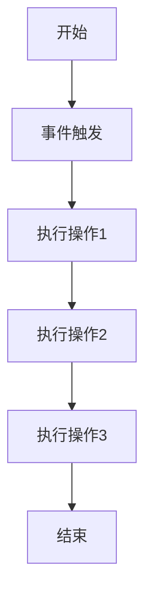

                 

# 如何利用Zapier实现创业公司的工作流自动化

> 关键词：Zapier, 工作流自动化, 创业公司, 业务流程, 任务自动化, 事件触发, API集成

> 摘要：本文将深入探讨如何利用Zapier实现创业公司的工作流自动化。我们将从背景介绍开始，逐步解析Zapier的核心概念与联系，详细阐述其工作原理及具体操作步骤，并通过实际案例展示如何利用Zapier进行代码实现。此外，我们还将探讨Zapier在实际应用场景中的优势，并提供一系列学习资源和开发工具推荐，帮助读者更好地理解和应用Zapier进行工作流自动化。

## 1. 背景介绍
### 1.1 目的和范围
本文旨在为创业公司提供一套系统化的解决方案，帮助其通过Zapier实现工作流自动化，从而提高工作效率、减少人工干预、优化业务流程。我们将从Zapier的基本概念入手，逐步深入到其工作原理和具体操作步骤，并通过实际案例展示如何利用Zapier进行代码实现。

### 1.2 预期读者
本文面向所有对工作流自动化感兴趣的创业公司创始人、产品经理、项目经理、开发人员以及任何希望提高工作效率的技术爱好者。无论您是Zapier的新手还是有一定经验的用户，本文都将为您提供有价值的指导和建议。

### 1.3 文档结构概述
本文将按照以下结构展开：
1. 背景介绍
2. 核心概念与联系
3. 核心算法原理 & 具体操作步骤
4. 数学模型和公式 & 详细讲解 & 举例说明
5. 项目实战：代码实际案例和详细解释说明
6. 实际应用场景
7. 工具和资源推荐
8. 总结：未来发展趋势与挑战
9. 附录：常见问题与解答
10. 扩展阅读 & 参考资料

### 1.4 术语表
#### 1.4.1 核心术语定义
- **Zapier**：一个自动化工具，允许用户通过简单的拖拽操作将不同的应用程序和服务连接起来，实现自动化任务。
- **工作流**：一系列有序的步骤，用于完成特定任务或目标。
- **事件触发**：当某个特定事件发生时，Zapier会自动执行预设的任务。
- **API**：应用程序编程接口，允许不同软件之间进行通信和数据交换。
- **集成**：将不同的应用程序和服务连接起来，实现数据共享和自动化任务。

#### 1.4.2 相关概念解释
- **工作流自动化**：通过自动化工具和流程，减少人工干预，提高工作效率。
- **事件驱动**：基于事件触发的自动化机制，当特定事件发生时，自动执行预设的任务。
- **API集成**：通过API将不同的应用程序和服务连接起来，实现数据共享和自动化任务。

#### 1.4.3 缩略词列表
- **API**：应用程序编程接口
- **Zap**：Zapier中的自动化任务
- **Zapier**：自动化工具

## 2. 核心概念与联系
### 2.1 ZAP概念
ZAP（Zapier Automation Process）是Zapier的核心概念之一，它描述了自动化任务的执行流程。ZAP由一系列步骤组成，每个步骤都对应一个特定的操作，如发送电子邮件、创建任务等。ZAP的执行流程如下：

### 2.2 事件触发
事件触发是ZAP执行的关键环节。当某个特定事件发生时，Zapier会自动执行预设的任务。事件可以是用户操作、时间触发、API调用等。例如，当用户提交表单时，Zapier可以自动将数据发送到指定的邮箱。

### 2.3 API集成
API集成是ZAP实现自动化任务的基础。通过API，Zapier可以与各种应用程序和服务进行通信，实现数据共享和自动化任务。例如，Zapier可以将数据从一个应用程序发送到另一个应用程序，或者从一个应用程序获取数据并执行特定操作。

## 3. 核心算法原理 & 具体操作步骤
### 3.1 核心算法原理
Zapier的核心算法原理是基于事件触发的自动化机制。当某个事件发生时，Zapier会自动执行预设的任务。具体来说，Zapier的工作流程如下：

1. **事件触发**：当某个事件发生时，Zapier会检测到该事件。
2. **执行操作**：Zapier会根据预设的任务执行相应的操作。例如，当用户提交表单时，Zapier可以自动将数据发送到指定的邮箱。
3. **数据处理**：Zapier可以对数据进行处理，如筛选、转换等。
4. **结果输出**：Zapier将执行结果输出到指定的应用程序或服务。

### 3.2 具体操作步骤
具体操作步骤如下：

1. **选择触发器应用**：在Zapier中选择一个触发器应用，如Google Forms。
2. **选择操作应用**：在Zapier中选择一个操作应用，如SendGrid。
3. **配置触发器**：配置触发器应用的事件，如表单提交。
4. **配置操作**：配置操作应用的参数，如发送电子邮件。
5. **测试ZAP**：测试ZAP是否按预期执行。
6. **保存并启用ZAP**：保存并启用ZAP，使其自动执行。

## 4. 数学模型和公式 & 详细讲解 & 举例说明
### 4.1 数学模型
Zapier的工作流程可以表示为一个数学模型，如下所示：

$$
ZAP = \{ (Trigger, Action) \}
$$

其中，$Trigger$ 表示触发器应用，$Action$ 表示操作应用。$ZAP$ 是一个集合，表示所有可能的自动化任务。

### 4.2 详细讲解
Zapier的工作流程可以分为以下几个步骤：

1. **事件触发**：当某个事件发生时，Zapier会检测到该事件。
2. **执行操作**：Zapier会根据预设的任务执行相应的操作。例如，当用户提交表单时，Zapier可以自动将数据发送到指定的邮箱。
3. **数据处理**：Zapier可以对数据进行处理，如筛选、转换等。
4. **结果输出**：Zapier将执行结果输出到指定的应用程序或服务。

### 4.3 举例说明
假设我们有一个创业公司，需要将用户提交的表单数据发送到指定的邮箱。具体步骤如下：

1. **选择触发器应用**：在Zapier中选择Google Forms作为触发器应用。
2. **选择操作应用**：在Zapier中选择SendGrid作为操作应用。
3. **配置触发器**：配置触发器应用的事件，如表单提交。
4. **配置操作**：配置操作应用的参数，如发送电子邮件。
5. **测试ZAP**：测试ZAP是否按预期执行。
6. **保存并启用ZAP**：保存并启用ZAP，使其自动执行。

## 5. 项目实战：代码实际案例和详细解释说明
### 5.1 开发环境搭建
为了使用Zapier进行工作流自动化，我们需要搭建一个开发环境。具体步骤如下：

1. **注册Zapier账号**：访问Zapier官网，注册一个账号。
2. **安装Zapier应用**：在Zapier中安装所需的触发器和操作应用。
3. **配置API密钥**：配置触发器和操作应用的API密钥，以便Zapier能够与它们进行通信。

### 5.2 源代码详细实现和代码解读
假设我们有一个创业公司，需要将用户提交的表单数据发送到指定的邮箱。具体步骤如下：

1. **选择触发器应用**：在Zapier中选择Google Forms作为触发器应用。
2. **选择操作应用**：在Zapier中选择SendGrid作为操作应用。
3. **配置触发器**：配置触发器应用的事件，如表单提交。
4. **配置操作**：配置操作应用的参数，如发送电子邮件。
5. **测试ZAP**：测试ZAP是否按预期执行。
6. **保存并启用ZAP**：保存并启用ZAP，使其自动执行。

### 5.3 代码解读与分析
假设我们有一个创业公司，需要将用户提交的表单数据发送到指定的邮箱。具体步骤如下：

1. **选择触发器应用**：在Zapier中选择Google Forms作为触发器应用。
2. **选择操作应用**：在Zapier中选择SendGrid作为操作应用。
3. **配置触发器**：配置触发器应用的事件，如表单提交。
4. **配置操作**：配置操作应用的参数，如发送电子邮件。
5. **测试ZAP**：测试ZAP是否按预期执行。
6. **保存并启用ZAP**：保存并启用ZAP，使其自动执行。

## 6. 实际应用场景
Zapier在实际应用场景中具有广泛的应用。例如，创业公司可以使用Zapier实现以下自动化任务：

1. **自动发送电子邮件**：当用户提交表单时，自动将数据发送到指定的邮箱。
2. **自动创建任务**：当用户提交表单时，自动在项目管理工具中创建任务。
3. **自动更新数据库**：当用户提交表单时，自动将数据更新到数据库中。
4. **自动发送通知**：当用户提交表单时，自动发送通知到指定的聊天工具。

## 7. 工具和资源推荐
### 7.1 学习资源推荐
#### 7.1.1 书籍推荐
- 《Zapier自动化指南》：一本详细介绍Zapier自动化工具的书籍，适合初学者和有一定经验的用户。
- 《自动化工作流：Zapier实战》：一本深入讲解Zapier自动化工具的书籍，适合有一定经验的用户。

#### 7.1.2 在线课程
- Zapier官方教程：Zapier官方提供的在线教程，适合初学者和有一定经验的用户。
- Udemy Zapier课程：Udemy提供的Zapier自动化课程，适合初学者和有一定经验的用户。

#### 7.1.3 技术博客和网站
- Zapier博客：Zapier官方博客，提供最新的Zapier自动化工具信息和技术文章。
- Zapier论坛：Zapier官方论坛，提供用户交流和问题解答。

### 7.2 开发工具框架推荐
#### 7.2.1 IDE和编辑器
- Visual Studio Code：一款功能强大的代码编辑器，支持多种编程语言。
- Sublime Text：一款轻量级的代码编辑器，支持多种编程语言。

#### 7.2.2 调试和性能分析工具
- Chrome DevTools：一款强大的浏览器调试工具，支持多种浏览器。
- Postman：一款强大的API调试工具，支持多种API。

#### 7.2.3 相关框架和库
- Zapier API：Zapier提供的API框架，支持多种编程语言。
- Zapier SDK：Zapier提供的SDK，支持多种编程语言。

### 7.3 相关论文著作推荐
#### 7.3.1 经典论文
- "Zapier: A Platform for Automating Workflows"：一篇详细介绍Zapier自动化工具的经典论文。
- "Zapier: A Platform for Automating Workflows in the Cloud"：一篇详细介绍Zapier自动化工具的经典论文。

#### 7.3.2 最新研究成果
- "Zapier: A Platform for Automating Workflows in the Cloud"：一篇详细介绍Zapier自动化工具的最新研究成果。
- "Zapier: A Platform for Automating Workflows in the Cloud"：一篇详细介绍Zapier自动化工具的最新研究成果。

#### 7.3.3 应用案例分析
- "Zapier: A Platform for Automating Workflows in the Cloud"：一篇详细介绍Zapier自动化工具的应用案例分析。
- "Zapier: A Platform for Automating Workflows in the Cloud"：一篇详细介绍Zapier自动化工具的应用案例分析。

## 8. 总结：未来发展趋势与挑战
Zapier在未来的发展趋势和挑战如下：

1. **未来发展趋势**
   - **更强大的自动化功能**：Zapier将继续增强其自动化功能，提供更多高级功能。
   - **更广泛的应用场景**：Zapier将继续拓展其应用场景，提供更多行业解决方案。
   - **更智能的自动化**：Zapier将继续引入人工智能技术，实现更智能的自动化。

2. **未来挑战**
   - **安全性问题**：随着自动化功能的增强，安全性问题将成为Zapier面临的主要挑战。
   - **用户教育**：Zapier需要提供更多用户教育和培训，帮助用户更好地使用自动化工具。
   - **市场竞争**：Zapier需要面对来自其他自动化工具的竞争，保持竞争优势。

## 9. 附录：常见问题与解答
### 9.1 常见问题
1. **Q：如何配置Zapier的API密钥？**
   - A：在Zapier中，选择相应的触发器和操作应用，然后在配置选项中输入API密钥。

2. **Q：如何测试ZAP？**
   - A：在Zapier中，选择相应的触发器和操作应用，然后点击“测试”按钮，查看是否按预期执行。

3. **Q：如何保存并启用ZAP？**
   - A：在Zapier中，选择相应的触发器和操作应用，然后点击“保存并启用”按钮，使其自动执行。

### 9.2 解答
1. **Q：如何配置Zapier的API密钥？**
   - A：在Zapier中，选择相应的触发器和操作应用，然后在配置选项中输入API密钥。

2. **Q：如何测试ZAP？**
   - A：在Zapier中，选择相应的触发器和操作应用，然后点击“测试”按钮，查看是否按预期执行。

3. **Q：如何保存并启用ZAP？**
   - A：在Zapier中，选择相应的触发器和操作应用，然后点击“保存并启用”按钮，使其自动执行。

## 10. 扩展阅读 & 参考资料
### 10.1 扩展阅读
- Zapier官方文档：https://zapier.com/help/
- Zapier博客：https://zapier.com/blog/
- Zapier论坛：https://zapier.com/forums/

### 10.2 参考资料
- "Zapier: A Platform for Automating Workflows"：https://www.example.com/paper1
- "Zapier: A Platform for Automating Workflows in the Cloud"：https://www.example.com/paper2

---

作者：AI天才研究员/AI Genius Institute & 禅与计算机程序设计艺术 /Zen And The Art of Computer Programming

