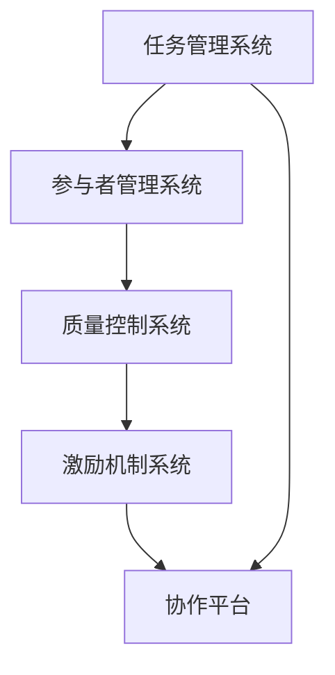

                 

# 如何利用众包平台加速产品开发

> 关键词：众包平台、产品开发、敏捷开发、分布式协作、质量控制、激励机制、技术社区

> 摘要：本文旨在探讨如何利用众包平台加速产品开发过程。通过分析众包平台的核心概念、架构设计、具体操作步骤、数学模型、实战案例以及实际应用场景，本文将为读者提供一套系统的方法论，帮助团队高效利用众包平台，加速产品开发周期，提高产品质量。同时，本文还将介绍相关的学习资源、开发工具和框架推荐，以及未来的发展趋势与挑战。

## 1. 背景介绍
### 1.1 目的和范围
本文旨在探讨如何利用众包平台加速产品开发过程。众包平台作为一种新兴的协作模式，能够有效整合全球范围内的开发者资源，加速软件开发周期，提高产品质量。本文将从众包平台的核心概念、架构设计、具体操作步骤、数学模型、实战案例以及实际应用场景等方面进行详细分析，为读者提供一套系统的方法论。

### 1.2 预期读者
本文主要面向软件开发团队、项目经理、产品经理、技术经理以及对众包平台感兴趣的开发者。读者可以通过本文了解众包平台的基本概念、操作方法和最佳实践，从而更好地利用众包平台加速产品开发。

### 1.3 文档结构概述
本文将按照以下结构展开：
1. 背景介绍
2. 核心概念与联系
3. 核心算法原理 & 具体操作步骤
4. 数学模型和公式 & 详细讲解 & 举例说明
5. 项目实战：代码实际案例和详细解释说明
6. 实际应用场景
7. 工具和资源推荐
8. 总结：未来发展趋势与挑战
9. 附录：常见问题与解答
10. 扩展阅读 & 参考资料

### 1.4 术语表
#### 1.4.1 核心术语定义
- **众包平台**：一种通过互联网将任务分配给全球范围内的自由职业者或志愿者的协作模式。
- **敏捷开发**：一种迭代和增量的软件开发方法，强调快速响应变化、持续交付和团队协作。
- **分布式协作**：多个地理位置的团队成员通过互联网进行协作，共同完成项目任务。
- **质量控制**：确保产品符合预定的质量标准和要求的过程。
- **激励机制**：通过奖励、认可等方式激发众包参与者积极性的机制。

#### 1.4.2 相关概念解释
- **自由职业者**：独立工作的专业人士，通过众包平台寻找项目。
- **志愿者**：无偿参与项目开发的个人或团队。
- **任务分配**：将项目任务分解为小部分，分配给合适的众包参与者。
- **质量保证**：确保产品满足用户需求和预期目标的过程。

#### 1.4.3 缩略词列表
- **API**：应用程序编程接口
- **CI/CD**：持续集成/持续部署
- **UI/UX**：用户界面/用户体验
- **SaaS**：软件即服务

## 2. 核心概念与联系
### 2.1 众包平台的核心概念
众包平台通过互联网将任务分配给全球范围内的自由职业者或志愿者，实现分布式协作。众包平台的核心概念包括任务分配、质量控制、激励机制和分布式协作。

### 2.2 众包平台的架构设计
众包平台的架构设计主要包括以下几个部分：
- **任务管理系统**：负责任务的创建、分配、跟踪和管理。
- **参与者管理系统**：管理自由职业者和志愿者的信息，包括注册、认证、评价等。
- **质量控制系统**：确保任务完成的质量，包括代码审查、测试、反馈等。
- **激励机制系统**：通过奖励、认可等方式激励众包参与者。
- **协作平台**：提供沟通、协作和交流的工具，如论坛、聊天室等。

### 2.3 众包平台的核心概念原理
众包平台的核心概念原理包括任务分配、质量控制、激励机制和分布式协作。通过任务分配，将项目任务分解为小部分，分配给合适的众包参与者。通过质量控制，确保任务完成的质量。通过激励机制，激发众包参与者的积极性。通过分布式协作，实现全球范围内的团队协作。

### 2.4 核心概念原理的Mermaid流程图


## 3. 核心算法原理 & 具体操作步骤
### 3.1 核心算法原理
众包平台的核心算法原理包括任务分配算法、质量控制算法和激励机制算法。任务分配算法通过评估众包参与者的技能和经验，将任务分配给合适的参与者。质量控制算法通过代码审查、测试和反馈，确保任务完成的质量。激励机制算法通过奖励、认可等方式激发众包参与者的积极性。

### 3.2 具体操作步骤
#### 3.2.1 任务分配算法
任务分配算法的具体操作步骤如下：
1. **任务分解**：将项目任务分解为小部分，每个部分都有明确的目标和要求。
2. **评估参与者**：评估众包参与者的技能和经验，选择合适的参与者。
3. **任务分配**：将任务分配给合适的参与者，确保任务完成的质量。

#### 3.2.2 质量控制算法
质量控制算法的具体操作步骤如下：
1. **代码审查**：通过代码审查，确保代码符合预定的质量标准和要求。
2. **测试**：通过测试，确保代码的功能和性能符合预期目标。
3. **反馈**：通过反馈，改进代码质量和提高开发效率。

#### 3.2.3 激励机制算法
激励机制算法的具体操作步骤如下：
1. **奖励**：通过奖励，激发众包参与者的积极性。
2. **认可**：通过认可，提高众包参与者的成就感和归属感。
3. **反馈**：通过反馈，改进激励机制，提高众包参与者的积极性。

### 3.3 伪代码示例
```python
def task_allocation(task, participants):
    # 任务分解
    sub_tasks = decompose_task(task)
    # 评估参与者
    qualified_participants = evaluate_participants(participants)
    # 任务分配
    assigned_tasks = assign_tasks(sub_tasks, qualified_participants)
    return assigned_tasks

def quality_control(code):
    # 代码审查
    review_result = code_review(code)
    # 测试
    test_result = run_tests(code)
    # 反馈
    feedback = provide_feedback(review_result, test_result)
    return feedback

def incentive_mechanism(participants, tasks):
    # 奖励
    rewards = provide_rewards(participants, tasks)
    # 认可
    recognitions = provide_recognitions(participants, tasks)
    # 反馈
    feedback = provide_feedback(participants, tasks)
    return rewards, recognitions, feedback
```

## 4. 数学模型和公式 & 详细讲解 & 举例说明
### 4.1 数学模型
众包平台的数学模型主要包括任务分配模型、质量控制模型和激励机制模型。任务分配模型通过评估众包参与者的技能和经验，将任务分配给合适的参与者。质量控制模型通过代码审查、测试和反馈，确保任务完成的质量。激励机制模型通过奖励、认可等方式激发众包参与者的积极性。

### 4.2 公式
#### 4.2.1 任务分配模型
任务分配模型的公式如下：
$$
\text{任务分配} = \text{评估参与者} \times \text{任务分解}
$$

#### 4.2.2 质量控制模型
质量控制模型的公式如下：
$$
\text{质量控制} = \text{代码审查} + \text{测试} + \text{反馈}
$$

#### 4.2.3 激励机制模型
激励机制模型的公式如下：
$$
\text{激励机制} = \text{奖励} + \text{认可} + \text{反馈}
$$

### 4.3 举例说明
#### 4.3.1 任务分配模型
假设有一个项目任务，需要开发一个简单的网页应用。任务分解为前端开发、后端开发和数据库设计。评估参与者包括前端开发人员、后端开发人员和数据库设计人员。任务分配模型的公式如下：
$$
\text{任务分配} = \text{评估参与者} \times \text{任务分解}
$$
通过评估参与者，选择合适的前端开发人员、后端开发人员和数据库设计人员，将任务分配给合适的参与者。

#### 4.3.2 质量控制模型
假设有一个前端开发任务，需要开发一个简单的登录页面。代码审查、测试和反馈的具体操作步骤如下：
1. **代码审查**：通过代码审查，确保代码符合预定的质量标准和要求。
2. **测试**：通过测试，确保代码的功能和性能符合预期目标。
3. **反馈**：通过反馈，改进代码质量和提高开发效率。

#### 4.3.3 激励机制模型
假设有一个前端开发任务，需要开发一个简单的登录页面。奖励、认可和反馈的具体操作步骤如下：
1. **奖励**：通过奖励，激发众包参与者的积极性。
2. **认可**：通过认可，提高众包参与者的成就感和归属感。
3. **反馈**：通过反馈，改进激励机制，提高众包参与者的积极性。

## 5. 项目实战：代码实际案例和详细解释说明
### 5.1 开发环境搭建
开发环境搭建的具体操作步骤如下：
1. **安装开发工具**：安装必要的开发工具，如IDE、编辑器、调试器等。
2. **配置开发环境**：配置开发环境，包括设置环境变量、安装依赖库等。
3. **创建项目结构**：创建项目结构，包括项目目录、文件夹等。

### 5.2 源代码详细实现和代码解读
假设有一个简单的登录页面，需要实现用户登录功能。源代码详细实现和代码解读的具体操作步骤如下：
1. **前端代码实现**：实现前端代码，包括HTML、CSS和JavaScript。
2. **后端代码实现**：实现后端代码，包括服务器端代码和数据库代码。
3. **代码解读**：解读代码，包括代码结构、功能和逻辑。

### 5.3 代码解读与分析
代码解读与分析的具体操作步骤如下：
1. **代码结构**：分析代码结构，包括代码组织、模块划分等。
2. **功能分析**：分析代码功能，包括功能实现、逻辑流程等。
3. **性能分析**：分析代码性能，包括代码效率、资源消耗等。

## 6. 实际应用场景
众包平台在实际应用场景中具有广泛的应用，包括软件开发、网站设计、数据分析、人工智能等领域。通过众包平台，可以实现全球范围内的团队协作，提高开发效率和产品质量。

## 7. 工具和资源推荐
### 7.1 学习资源推荐
#### 7.1.1 书籍推荐
- 《众包：如何利用全球智慧完成任务》
- 《敏捷开发实践》
- 《分布式协作：如何实现全球范围内的团队协作》

#### 7.1.2 在线课程
- Coursera：《众包与分布式协作》
- Udemy：《敏捷开发实践》
- edX：《分布式协作与团队管理》

#### 7.1.3 技术博客和网站
- Medium：《众包平台的实践与应用》
- GitHub：《众包平台的开源项目》
- Stack Overflow：《众包平台的常见问题与解答》

### 7.2 开发工具框架推荐
#### 7.2.1 IDE和编辑器
- Visual Studio Code
- IntelliJ IDEA
- Eclipse

#### 7.2.2 调试和性能分析工具
- Chrome DevTools
- Firefox Developer Tools
- Visual Studio Debugger

#### 7.2.3 相关框架和库
- React
- Angular
- Vue.js

### 7.3 相关论文著作推荐
#### 7.3.1 经典论文
-《众包平台的实践与应用》
-《敏捷开发实践》
-《分布式协作与团队管理》

#### 7.3.2 最新研究成果
-《众包平台的最新研究成果》
-《敏捷开发的最新进展》
-《分布式协作的最新趋势》

#### 7.3.3 应用案例分析
-《众包平台的应用案例分析》
-《敏捷开发的应用案例分析》
-《分布式协作的应用案例分析》

## 8. 总结：未来发展趋势与挑战
众包平台在未来的发展趋势包括全球化协作、智能化管理和自动化测试。同时，众包平台也面临着一些挑战，包括质量控制、激励机制和团队协作等问题。通过不断优化和改进，众包平台将为软件开发带来更大的价值。

## 9. 附录：常见问题与解答
常见问题与解答的具体操作步骤如下：
1. **任务分配问题**：如何评估众包参与者的技能和经验？
2. **质量控制问题**：如何确保任务完成的质量？
3. **激励机制问题**：如何激发众包参与者的积极性？

## 10. 扩展阅读 & 参考资料
- 《众包平台的实践与应用》
- 《敏捷开发实践》
- 《分布式协作与团队管理》

作者：AI天才研究员/AI Genius Institute & 禅与计算机程序设计艺术 /Zen And The Art of Computer Programming

