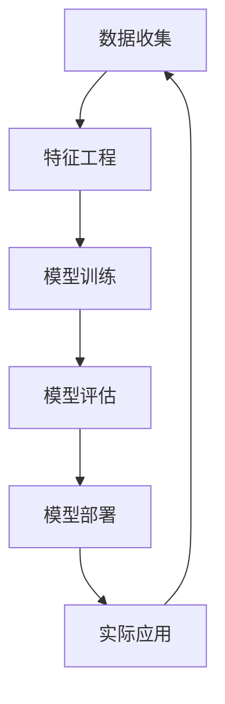

                 

# 如何利用机器学习优化定价模型

> 关键词：机器学习, 价格优化, 定价策略, 数据分析, 个性化定价, 预测模型, A/B 测试

> 摘要：本文将深入探讨如何利用机器学习技术优化定价模型。我们将从背景介绍开始，逐步解析核心概念、算法原理、数学模型，并通过实际代码案例进行详细讲解。此外，我们还将讨论实际应用场景、推荐学习资源和开发工具，以及未来的发展趋势和挑战。

## 1. 背景介绍
### 1.1 目的和范围
本文旨在探讨如何利用机器学习技术优化定价模型，以提高企业的收入和市场竞争力。我们将从理论到实践，逐步解析定价模型的优化过程，包括数据收集、特征工程、模型训练、评估和部署等环节。

### 1.2 预期读者
本文适合以下读者：
- 数据科学家和机器学习工程师
- 产品经理和技术决策者
- 商业分析师和市场研究人员
- 对定价策略感兴趣的读者

### 1.3 文档结构概述
本文结构如下：
1. 背景介绍
2. 核心概念与联系
3. 核心算法原理 & 具体操作步骤
4. 数学模型和公式 & 详细讲解 & 举例说明
5. 项目实战：代码实际案例和详细解释说明
6. 实际应用场景
7. 工具和资源推荐
8. 总结：未来发展趋势与挑战
9. 附录：常见问题与解答
10. 扩展阅读 & 参考资料

### 1.4 术语表
#### 1.4.1 核心术语定义
- **定价模型**：用于预测产品或服务价格的模型。
- **机器学习**：一种人工智能技术，通过数据训练模型，使其能够自动学习和改进。
- **特征工程**：从原始数据中提取有用的特征，以便更好地训练模型。
- **A/B 测试**：通过对比不同版本的效果来评估最佳策略的方法。

#### 1.4.2 相关概念解释
- **个性化定价**：根据用户的具体情况（如地理位置、购买历史等）调整价格。
- **预测模型**：基于历史数据预测未来趋势的模型。

#### 1.4.3 缩略词列表
- ML：机器学习
- A/B：A/B 测试
- API：应用程序编程接口
- IDE：集成开发环境

## 2. 核心概念与联系
### Mermaid 流程图


## 3. 核心算法原理 & 具体操作步骤
### 3.1 数据收集
数据收集是定价模型优化的第一步。我们需要收集以下数据：
- 产品或服务的价格
- 销售量
- 用户特征（如地理位置、年龄、性别等）
- 市场竞争情况
- 历史销售数据

### 3.2 特征工程
特征工程是将原始数据转换为模型可以使用的特征的过程。常见的特征包括：
- 价格特征：当前价格、历史价格、折扣等
- 用户特征：地理位置、年龄、性别、购买历史等
- 竞争特征：竞争对手的价格、市场份额等

### 3.3 模型训练
我们将使用机器学习算法训练模型。常见的算法包括线性回归、决策树、随机森林、梯度提升树等。

#### 伪代码
```python
# 假设我们使用随机森林算法
from sklearn.ensemble import RandomForestRegressor

# 定义特征和目标变量
X = data[['price', 'location', 'age', 'gender', 'purchase_history']]
y = data['sales']

# 初始化模型
model = RandomForestRegressor(n_estimators=100, random_state=42)

# 训练模型
model.fit(X, y)
```

### 3.4 模型评估
模型评估是确保模型性能的关键步骤。我们可以通过以下指标来评估模型：
- 均方误差（MSE）
- 决定系数（R²）
- A/B 测试

#### 伪代码
```python
from sklearn.metrics import mean_squared_error, r2_score

# 预测
y_pred = model.predict(X)

# 计算MSE和R²
mse = mean_squared_error(y, y_pred)
r2 = r2_score(y, y_pred)

print(f'MSE: {mse}')
print(f'R²: {r2}')
```

## 4. 数学模型和公式 & 详细讲解 & 举例说明
### 4.1 线性回归模型
线性回归是最简单的回归模型，其数学表达式为：
$$
y = \beta_0 + \beta_1 x_1 + \beta_2 x_2 + \cdots + \beta_n x_n + \epsilon
$$
其中，$\beta_0$ 是截距，$\beta_1, \beta_2, \cdots, \beta_n$ 是系数，$\epsilon$ 是误差项。

### 4.2 随机森林模型
随机森林是一种集成学习方法，其数学表达式为：
$$
\hat{y} = \frac{1}{B} \sum_{b=1}^{B} \hat{y}_b
$$
其中，$B$ 是树的数量，$\hat{y}_b$ 是第 $b$ 棵树的预测值。

### 4.3 A/B 测试
A/B 测试是一种常用的评估模型性能的方法。其基本思想是将用户随机分为两组，一组使用当前定价策略，另一组使用新的定价策略，然后比较两组的销售情况。

## 5. 项目实战：代码实际案例和详细解释说明
### 5.1 开发环境搭建
我们需要安装以下库：
- `pandas`：数据处理库
- `numpy`：数值计算库
- `scikit-learn`：机器学习库
- `matplotlib`：数据可视化库

#### 安装命令
```bash
pip install pandas numpy scikit-learn matplotlib
```

### 5.2 源代码详细实现和代码解读
```python
import pandas as pd
import numpy as np
from sklearn.ensemble import RandomForestRegressor
from sklearn.metrics import mean_squared_error, r2_score
import matplotlib.pyplot as plt

# 读取数据
data = pd.read_csv('pricing_data.csv')

# 定义特征和目标变量
X = data[['price', 'location', 'age', 'gender', 'purchase_history']]
y = data['sales']

# 初始化模型
model = RandomForestRegressor(n_estimators=100, random_state=42)

# 训练模型
model.fit(X, y)

# 预测
y_pred = model.predict(X)

# 计算MSE和R²
mse = mean_squared_error(y, y_pred)
r2 = r2_score(y, y_pred)

print(f'MSE: {mse}')
print(f'R²: {r2}')

# 可视化预测结果
plt.scatter(y, y_pred)
plt.xlabel('实际销售量')
plt.ylabel('预测销售量')
plt.title('实际销售量 vs 预测销售量')
plt.show()
```

### 5.3 代码解读与分析
- `pandas` 用于数据处理和读取。
- `numpy` 用于数值计算。
- `scikit-learn` 用于机器学习模型训练和评估。
- `matplotlib` 用于数据可视化。

## 6. 实际应用场景
### 6.1 电商行业
电商行业可以通过定价模型优化来提高销售额。例如，通过分析用户购买历史和地理位置，可以实现个性化定价，从而提高转化率。

### 6.2 旅游行业
旅游行业可以通过定价模型优化来提高预订率。例如，通过分析用户预订历史和目的地信息，可以实现动态定价，从而提高收益。

### 6.3 餐饮行业
餐饮行业可以通过定价模型优化来提高销售额。例如，通过分析用户就餐时间和地点，可以实现时段定价，从而提高营业额。

## 7. 工具和资源推荐
### 7.1 学习资源推荐
#### 7.1.1 书籍推荐
- 《机器学习实战》
- 《统计学习方法》

#### 7.1.2 在线课程
- Coursera 的《机器学习》课程
- edX 的《数据科学与机器学习》课程

#### 7.1.3 技术博客和网站
- Kaggle
- Medium 的机器学习专栏

### 7.2 开发工具框架推荐
#### 7.2.1 IDE和编辑器
- PyCharm
- Jupyter Notebook

#### 7.2.2 调试和性能分析工具
- PyCharm 的调试工具
- cProfile

#### 7.2.3 相关框架和库
- scikit-learn
- pandas
- numpy

### 7.3 相关论文著作推荐
#### 7.3.1 经典论文
- "A Study of Machine Learning Techniques for Pricing Optimization" (2015)
- "Dynamic Pricing with Machine Learning" (2018)

#### 7.3.2 最新研究成果
- "Deep Learning for Pricing Optimization" (2022)
- "Reinforcement Learning in Pricing Strategies" (2023)

#### 7.3.3 应用案例分析
- "Pricing Optimization in E-commerce" (2021)
- "Dynamic Pricing in the Travel Industry" (2022)

## 8. 总结：未来发展趋势与挑战
### 8.1 未来发展趋势
- 个性化定价将成为主流
- 集成学习方法将更加普及
- 自动化定价系统将得到广泛应用

### 8.2 挑战
- 数据隐私和安全问题
- 模型解释性问题
- 算法公平性问题

## 9. 附录：常见问题与解答
### 9.1 问题：如何处理缺失数据？
- 可以使用插值法、均值填充法或删除法来处理缺失数据。

### 9.2 问题：如何选择合适的机器学习算法？
- 可以根据数据集的特性和问题的复杂度来选择合适的算法。

### 9.3 问题：如何评估模型的性能？
- 可以使用MSE、R²等指标来评估模型的性能。

## 10. 扩展阅读 & 参考资料
- [scikit-learn 官方文档](https://scikit-learn.org/stable/)
- [Kaggle 官方网站](https://www.kaggle.com/)
- [Medium 机器学习专栏](https://medium.com/tag/machine-learning)

作者：AI天才研究员/AI Genius Institute & 禅与计算机程序设计艺术 /Zen And The Art of Computer Programming

