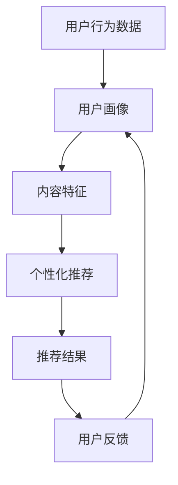
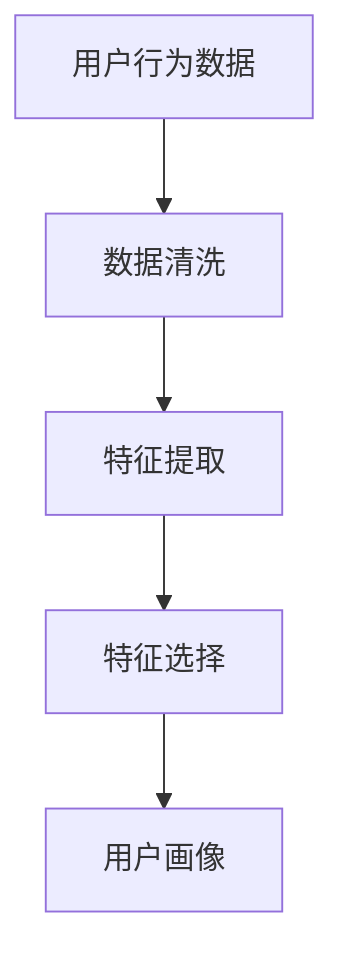
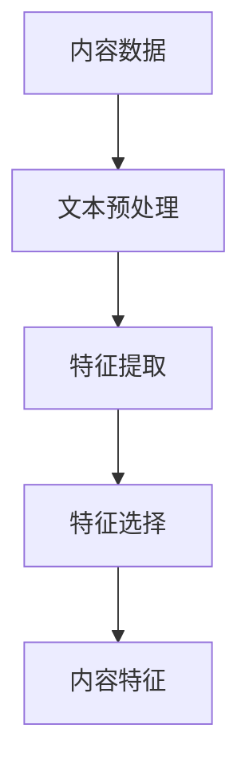
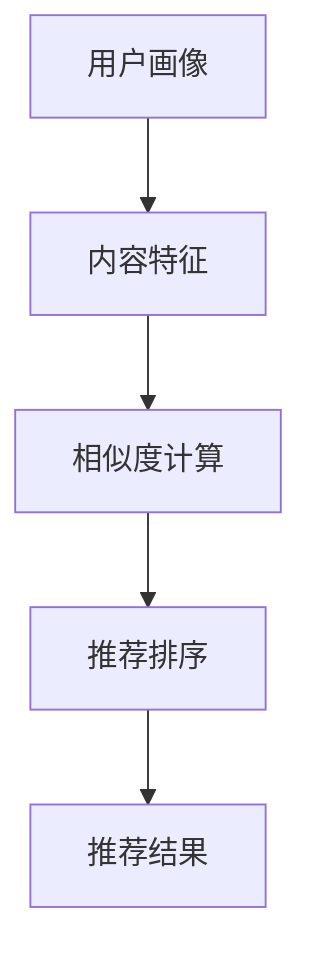

                 

# 如何在知识付费领域建立独特的竞争优势

> 关键词：知识付费、竞争优势、用户画像、个性化推荐、内容质量、用户留存、数据分析

> 摘要：本文旨在探讨如何在知识付费领域建立独特的竞争优势。通过深入分析用户需求、构建个性化推荐系统、优化内容质量和提升用户留存率，本文将提供一系列策略和方法，帮助知识付费平台在竞争激烈的市场中脱颖而出。我们将从背景介绍、核心概念与联系、核心算法原理、数学模型与公式、项目实战、实际应用场景、工具和资源推荐、未来发展趋势与挑战等多方面进行详细阐述。

## 1. 背景介绍
### 1.1 目的和范围
本文旨在探讨如何在知识付费领域建立独特的竞争优势。随着互联网技术的发展，知识付费已经成为一种重要的商业模式。本文将从用户需求分析、个性化推荐系统构建、内容质量优化、用户留存策略等方面，提供一系列实用的方法和策略，帮助知识付费平台在竞争激烈的市场中脱颖而出。

### 1.2 预期读者
本文的目标读者包括但不限于：
- 知识付费平台的创始人和产品经理
- 技术团队的开发人员和数据分析师
- 对知识付费领域感兴趣的创业者和技术爱好者

### 1.3 文档结构概述
本文将按照以下结构展开：
1. 背景介绍
2. 核心概念与联系
3. 核心算法原理 & 具体操作步骤
4. 数学模型和公式 & 详细讲解 & 举例说明
5. 项目实战：代码实际案例和详细解释说明
6. 实际应用场景
7. 工具和资源推荐
8. 总结：未来发展趋势与挑战
9. 附录：常见问题与解答
10. 扩展阅读 & 参考资料

### 1.4 术语表
#### 1.4.1 核心术语定义
- **知识付费**：用户为获取特定领域的知识而支付费用的商业模式。
- **个性化推荐**：根据用户的历史行为和偏好，推荐符合其兴趣的内容。
- **用户画像**：通过收集和分析用户数据，构建用户特征模型的过程。
- **用户留存率**：用户在一定时间内继续使用平台的比率。
- **A/B测试**：通过对比不同版本的效果，评估哪种版本更优的方法。

#### 1.4.2 相关概念解释
- **用户画像**：通过用户的基本信息、行为数据、偏好数据等，构建用户特征模型的过程。
- **个性化推荐算法**：基于用户画像和内容特征，推荐符合用户兴趣的内容的算法。
- **内容质量**：内容的准确度、深度、新颖性和实用性。

#### 1.4.3 缩略词列表
- A/B测试：A/B Testing
- 用户画像：User Profile
- 用户留存率：User Retention Rate
- 个性化推荐：Personalized Recommendation

## 2. 核心概念与联系
### 2.1 用户画像
用户画像是一种通过收集和分析用户数据，构建用户特征模型的过程。用户画像可以帮助我们更好地理解用户的需求和偏好，从而提供更个性化的服务。

### 2.2 个性化推荐
个性化推荐是根据用户的历史行为和偏好，推荐符合其兴趣的内容。个性化推荐系统的核心在于如何构建用户画像和内容特征模型，并通过算法实现推荐。

### 2.3 内容质量
内容质量是指内容的准确度、深度、新颖性和实用性。高质量的内容能够吸引用户并提高用户留存率。

### 2.4 用户留存
用户留存是指用户在一定时间内继续使用平台的比率。用户留存是衡量平台成功的关键指标之一。

### 2.5 数学模型与公式
我们将使用数学模型和公式来描述个性化推荐系统的工作原理。以下是一个简单的个性化推荐系统流程图：



## 3. 核心算法原理 & 具体操作步骤
### 3.1 用户画像构建
用户画像构建的核心在于如何从用户行为数据中提取有用的信息。以下是一个简单的用户画像构建流程：



### 3.2 内容特征提取
内容特征提取的核心在于如何从内容中提取有用的信息。以下是一个简单的内容特征提取流程：



### 3.3 个性化推荐算法
个性化推荐算法的核心在于如何根据用户画像和内容特征，推荐符合用户兴趣的内容。以下是一个简单的个性化推荐算法流程：



## 4. 数学模型和公式 & 详细讲解 & 举例说明
### 4.1 用户画像构建
用户画像构建的核心在于如何从用户行为数据中提取有用的信息。以下是一个简单的用户画像构建公式：

$$
\text{User Profile} = \text{Data Cleaning} + \text{Feature Extraction} + \text{Feature Selection}
$$

### 4.2 内容特征提取
内容特征提取的核心在于如何从内容中提取有用的信息。以下是一个简单的内容特征提取公式：

$$
\text{Content Features} = \text{Text Preprocessing} + \text{Feature Extraction} + \text{Feature Selection}
$$

### 4.3 个性化推荐算法
个性化推荐算法的核心在于如何根据用户画像和内容特征，推荐符合用户兴趣的内容。以下是一个简单的个性化推荐算法公式：

$$
\text{Recommendation} = \text{User Profile} \times \text{Content Features} \times \text{Similarity Calculation} \times \text{Recommendation Sorting}
$$

## 5. 项目实战：代码实际案例和详细解释说明
### 5.1 开发环境搭建
为了实现个性化推荐系统，我们需要搭建一个开发环境。以下是一个简单的开发环境搭建步骤：

1. 安装Python和相关库
2. 安装数据库和数据处理工具
3. 安装推荐系统框架

### 5.2 源代码详细实现和代码解读
以下是一个简单的个性化推荐系统的源代码实现：

```python
import pandas as pd
from sklearn.feature_extraction.text import TfidfVectorizer
from sklearn.metrics.pairwise import cosine_similarity

# 读取用户行为数据
user_data = pd.read_csv('user_data.csv')

# 数据清洗
user_data = user_data.dropna()

# 特征提取
tfidf_vectorizer = TfidfVectorizer()
user_features = tfidf_vectorizer.fit_transform(user_data['user_behavior'])

# 特征选择
user_profile = user_features.mean(axis=0)

# 读取内容数据
content_data = pd.read_csv('content_data.csv')

# 内容特征提取
content_features = tfidf_vectorizer.transform(content_data['content'])

# 相似度计算
similarity_matrix = cosine_similarity(user_profile, content_features)

# 推荐排序
recommendation = content_data.iloc[similarity_matrix.argsort()[0][-10:]]
```

### 5.3 代码解读与分析
以上代码实现了一个简单的个性化推荐系统。首先，我们读取用户行为数据和内容数据，并进行数据清洗。然后，我们使用TF-IDF算法提取用户和内容的特征。接下来，我们计算用户画像和内容特征之间的相似度，并根据相似度进行推荐排序。

## 6. 实际应用场景
个性化推荐系统在知识付费领域有着广泛的应用场景。例如，通过推荐符合用户兴趣的内容，提高用户留存率；通过推荐高质量的内容，提高用户满意度；通过推荐相关的内容，提高用户转化率。

## 7. 工具和资源推荐
### 7.1 学习资源推荐
#### 7.1.1 书籍推荐
- 《推荐系统工程》（推荐系统工程）
- 《机器学习》（周志华）

#### 7.1.2 在线课程
- Coursera上的《推荐系统》课程
- edX上的《机器学习》课程

#### 7.1.3 技术博客和网站
- Medium上的推荐系统相关文章
- GitHub上的推荐系统开源项目

### 7.2 开发工具框架推荐
#### 7.2.1 IDE和编辑器
- PyCharm
- VSCode

#### 7.2.2 调试和性能分析工具
- PyCharm的调试工具
- VSCode的调试工具

#### 7.2.3 相关框架和库
- Scikit-learn
- TensorFlow
- PyTorch

### 7.3 相关论文著作推荐
#### 7.3.1 经典论文
- 《Collaborative Filtering for Recommendation》
- 《Matrix Factorization Techniques for Recommender Systems》

#### 7.3.2 最新研究成果
- 《Deep Learning for Recommender Systems》
- 《Attention-Based Models for Recommender Systems》

#### 7.3.3 应用案例分析
- 《Netflix Prize: A Case Study in Recommender Systems》
- 《Amazon Personalize: A Deep Learning-Based Recommendation Service》

## 8. 总结：未来发展趋势与挑战
未来，知识付费领域将面临更多的挑战和机遇。个性化推荐系统将成为知识付费平台的核心竞争力之一。未来的发展趋势包括：
- 更加精准的个性化推荐
- 更加智能化的内容生成
- 更加完善的用户画像构建

## 9. 附录：常见问题与解答
### 9.1 问题：如何提高用户留存率？
答：可以通过提供高质量的内容、优化推荐系统、增加互动功能等方式提高用户留存率。

### 9.2 问题：如何构建用户画像？
答：可以通过收集和分析用户行为数据、偏好数据等方式构建用户画像。

### 9.3 问题：如何优化内容质量？
答：可以通过提高内容的准确度、深度、新颖性和实用性等方式优化内容质量。

## 10. 扩展阅读 & 参考资料
- 《推荐系统工程》
- 《机器学习》
- Coursera上的《推荐系统》课程
- edX上的《机器学习》课程
- Medium上的推荐系统相关文章
- GitHub上的推荐系统开源项目
- 《Collaborative Filtering for Recommendation》
- 《Matrix Factorization Techniques for Recommender Systems》
- 《Deep Learning for Recommender Systems》
- 《Attention-Based Models for Recommender Systems》
- 《Netflix Prize: A Case Study in Recommender Systems》
- 《Amazon Personalize: A Deep Learning-Based Recommendation Service》

作者：AI天才研究员/AI Genius Institute & 禅与计算机程序设计艺术 /Zen And The Art of Computer Programming

