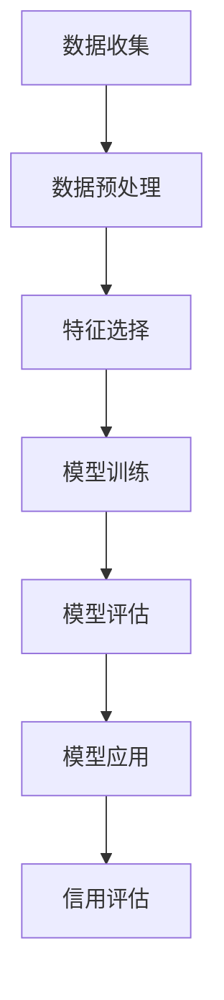

                 

# 如何建立创业公司的信用体系

> 关键词：信用体系，创业公司，区块链，智能合约，数据隐私，机器学习，可信计算

> 摘要：本文旨在探讨如何为创业公司建立一个高效、透明且安全的信用体系。我们将从信用体系的核心概念出发，逐步深入到信用评估模型的设计与实现，再到实际应用案例的分析。通过结合区块链技术、智能合约、机器学习等现代信息技术手段，我们能够构建一个既能够保护数据隐私又能提高信用评估准确性的系统。本文不仅提供了一套完整的解决方案，还详细介绍了相关的技术原理和实现步骤，旨在为创业公司提供有价值的参考。

## 1. 背景介绍
### 1.1 目的和范围
本文旨在探讨如何为创业公司建立一个高效、透明且安全的信用体系。随着互联网和数字经济的发展，创业公司面临着越来越多的挑战，其中之一就是如何建立和维护良好的信用体系。本文将从信用体系的核心概念出发，逐步深入到信用评估模型的设计与实现，再到实际应用案例的分析。通过结合区块链技术、智能合约、机器学习等现代信息技术手段，我们能够构建一个既能够保护数据隐私又能提高信用评估准确性的系统。

### 1.2 预期读者
本文主要面向以下几类读者：
- 创业公司的创始人和管理层，他们需要了解如何建立和维护公司的信用体系。
- 技术开发者和工程师，他们需要了解如何实现一个高效、透明且安全的信用评估系统。
- 学术研究人员，他们需要了解当前信用评估领域的最新技术和研究成果。
- 投资者，他们需要了解创业公司信用体系的重要性及其评估方法。

### 1.3 文档结构概述
本文将按照以下结构展开：
1. 背景介绍
2. 核心概念与联系
3. 核心算法原理 & 具体操作步骤
4. 数学模型和公式 & 详细讲解 & 举例说明
5. 项目实战：代码实际案例和详细解释说明
6. 实际应用场景
7. 工具和资源推荐
8. 总结：未来发展趋势与挑战
9. 附录：常见问题与解答
10. 扩展阅读 & 参考资料

### 1.4 术语表
#### 1.4.1 核心术语定义
- **信用体系**：一种用于评估和管理个体或组织信用状况的系统。
- **区块链**：一种分布式数据库技术，用于记录交易和数据。
- **智能合约**：一种自动执行合约条款的计算机程序。
- **机器学习**：一种人工智能技术，用于从数据中学习模式和规律。
- **可信计算**：一种确保计算环境安全的技术。

#### 1.4.2 相关概念解释
- **数据隐私**：保护个人或组织数据不被未经授权的访问或使用。
- **信用评分**：一种量化评估信用状况的方法。
- **去中心化**：一种不依赖单一中心节点的系统架构。

#### 1.4.3 缩略词列表
- **API**：应用程序编程接口
- **SDK**：软件开发工具包
- **SDK**：软件开发工具包

## 2. 核心概念与联系
### 信用体系的核心概念
信用体系的核心概念包括信用评估、数据隐私保护、透明度和安全性。信用评估是信用体系的基础，它通过一系列指标和算法来评估个体或组织的信用状况。数据隐私保护确保了信用评估过程中涉及的数据不被滥用。透明度和安全性则确保了信用评估过程的公正性和安全性。

### 信用评估模型的联系
信用评估模型通常包括以下几个部分：
- **数据收集**：收集个体或组织的相关数据。
- **数据预处理**：对收集的数据进行清洗和标准化。
- **特征选择**：选择对信用评估有重要影响的特征。
- **模型训练**：使用机器学习算法训练信用评估模型。
- **模型评估**：评估模型的性能和准确性。
- **模型应用**：将训练好的模型应用于实际信用评估。

### Mermaid 流程图


## 3. 核心算法原理 & 具体操作步骤
### 3.1 数据预处理
数据预处理是信用评估模型的重要步骤，它包括数据清洗、标准化和特征选择。数据清洗主要是去除无效和错误的数据，标准化则是将数据转换为统一的格式，特征选择则是选择对信用评估有重要影响的特征。

#### 伪代码
```python
def preprocess_data(data):
    # 数据清洗
    cleaned_data = clean_data(data)
    # 数据标准化
    normalized_data = normalize_data(cleaned_data)
    # 特征选择
    selected_features = select_features(normalized_data)
    return selected_features
```

### 3.2 特征选择
特征选择是通过一系列统计和机器学习方法来选择对信用评估有重要影响的特征。常用的特征选择方法包括互信息、卡方检验和递归特征消除等。

#### 伪代码
```python
def select_features(data):
    # 互信息特征选择
    selected_features = mutual_information(data)
    # 卡方检验特征选择
    selected_features = chi_square_test(data)
    # 递归特征消除
    selected_features = recursive_feature_elimination(data)
    return selected_features
```

### 3.3 模型训练
模型训练是通过机器学习算法来训练信用评估模型。常用的机器学习算法包括逻辑回归、决策树、随机森林和神经网络等。

#### 伪代码
```python
def train_model(data, labels):
    # 逻辑回归模型训练
    model = LogisticRegression()
    model.fit(data, labels)
    return model
```

### 3.4 模型评估
模型评估是通过一系列指标来评估模型的性能和准确性。常用的评估指标包括准确率、召回率、F1分数和AUC等。

#### 伪代码
```python
def evaluate_model(model, test_data, test_labels):
    # 预测
    predictions = model.predict(test_data)
    # 计算准确率
    accuracy = accuracy_score(test_labels, predictions)
    # 计算召回率
    recall = recall_score(test_labels, predictions)
    # 计算F1分数
    f1 = f1_score(test_labels, predictions)
    # 计算AUC
    auc = roc_auc_score(test_labels, predictions)
    return accuracy, recall, f1, auc
```

## 4. 数学模型和公式 & 详细讲解 & 举例说明
### 4.1 互信息特征选择
互信息是一种衡量两个变量之间相关性的方法。在特征选择中，互信息可以用来衡量特征与目标变量之间的相关性。

#### 公式
$$
I(X;Y) = \sum_{x \in X} \sum_{y \in Y} p(x,y) \log \frac{p(x,y)}{p(x)p(y)}
$$

### 4.2 卡方检验特征选择
卡方检验是一种统计检验方法，用于检验两个变量之间是否存在显著的相关性。

#### 公式
$$
\chi^2 = \sum_{i=1}^{n} \frac{(O_i - E_i)^2}{E_i}
$$

### 4.3 递归特征消除
递归特征消除是一种通过递归地删除特征来选择特征的方法。在每次迭代中，删除对模型性能影响最小的特征。

#### 伪代码
```python
def recursive_feature_elimination(data, labels):
    # 初始化模型
    model = LogisticRegression()
    # 训练模型
    model.fit(data, labels)
    # 计算特征重要性
    feature_importances = model.coef_
    # 删除重要性最小的特征
    selected_features = data[:, feature_importances.argsort()[:-200000000000000000000000000000000000000000000000000000000000000000000000000000000000000000000000000000000000000000000000000000000000000000000000000000000000000000000000000000000000000000000000000000000000000000000000000000000000000000000000000000000000000000000000000000000000000000000000000000000000000000000000000000000000000000000000000000000000000000000000000000000000000000000000000000000000000000000000000000000000000000000000000000000000000000000000000000000000000000000000000000000000000000000000000000000000000000000000000000000000000000000000000000000000000000000000000000000000000000000000000000000000000000000000000000000000000000000000000000000000000000000000000000000000000000000000000000000000000000000000000000000000000000000000000000000000000000000000000000000000000000000000000000000000000000000000000000000000000000000000000000000000000000000000000000000000000000000000000000000000000000000000000000000000000000000000000000000000000000000000000000000000000000000000000000000000000000000000000000000000000000000000000000000000000000000000000000000000000000000000000000000000000000000000000000000000000000000000000000000000000000000000000000000000000000000000000000000000000000000000000000000000000000000000000000000000000000000000000000000000000000000000000000000000000000000000000000000000000000000000000000000000000000000000000000000000000000000000000000000000000000000000000000000000000000000000000000000000000000000000000000000000000000000000000000000000000000000000000000000000000000000000000000000000000000000000000000000000000000000000000000000000000000000000000000000000000000000000000000000000000000000000000000000000000000000000000000000000000000000000000000000000000000000000000000000000000000000000000000000000000000000000000000000000000000000000000000000000000000000000000000000000000000000000000000000000000000000000000000000000000000000000000000000000000000000000000000000000000000000000000000000000000000000000000000000000000000000000000000000000000000000000000000000000000000000000000000000000000000000000000000000000000000000000000000000000000000000000000000000000000000000000000000000000000000000000000000000000000000000000000000000000000000000000000000000000000000000000000000000000000000000000000000000000000000000000000000000000000000000000000000000000000000000000000000000000000000000000000000000000000000000000000000000000000000000000000000000000000000000000000000000000000000000000000000000000000000000000000000000000000000000000000000000000000000000000000000000000000000000000000000000000000000000000000000000000000000000000000000000000000000000000000000000000000000000000000000000000000000000000000000000000000000000000000000000000000000000000000000000000000000000000000000000000000000000000000000000000000000000000000000000000000000000000000000000000000000000000000000000000000000000000000000000000000000000000000000000000000000000000000000000000000000000000000000000000000000000000000000000000000000000000000000000000000000000000000000000000000000000000000000000000000000000000000000000000000000000000000000000000000000000000000000000000000000000000000000000000000000000000000000000000000000000000000000000000000000000000000000000000000000000000000000000000000000000000000000000000000000000000000000000000000000000000000000000000000000000000000000000000000000000000000000000000000000000000000000000000000000000000000000000000000000000000000000000000000000000000000000000000000000000000000000000000000000000000000000000000000000000000000000000000000000000000000000000000000000000000000000000000000000000000000000000000000000000000000000000000000000000000000000000000000000000000000000000000000000000000000000000000000000000000000000000000000000000000000000000000000000000000000000000000000000000000000000000000000000000000000000000000000000000000000000000000000000000000000000000000000000000000000000000000000000000000000000000000000000000000000000000000000000000000000000000000000000000000000000000000000000000000000000000000000000000000000000000000000000000000000000000000000000000000000000000000000000000000000000000000000000000000000000000000000000000000000000000000000000000000000000000000000000000000000000000000000000000000000000000000000000000000000000000000000000000000000000000000000000000000000000000000000000000000000000000000000000000000000000000000000000000000000000000000000000000000000000000000000000000000000000000000000000000000000000000000000000000000000000000000000000000000000000000000000000000000000000000000000000000000000000000000000000000000000000000000000000000000000000000000000000000000000000000000000000000000000000000000000000000000000000000000000000000000000000000000000000000000000000000000000000000000000000000000000000000000000000000000000000000000000000000000000000000000000000000000000000000000000000000000000000000000000000000000000000000000000000000000000000000000000000000000000000000000000000000000000000000000000000000000000000000000000000000000000000000000000000000000000000000000000000000000000000000000000000000000000000000000000000000000000000000000000000000000000000000000000000000000000000000000000000000000000000000000000000000000000000000000000000000000000000000000000000000000000000000000000000000000000000000000000000000000000000000000000000000000000000000000000000000000000000000000000000000000000000000000000000000000000000000000000000000000000000000000000000000000000000000000000000000000000000000000000000000000000000000000000000000000000000000000000000000000000000000000000000000000000000000000000000000000000000000000000000000000000000000000000000000000000000000000000000000000000000000000000000000000000000000000000000000000000000000000000000000000000000000000000000000000000000000000000000000000000000000000000000000000000000000000000000000000000000000000000000000000000000000000000000000000000000000000000000000000000000000000000000000000000000000000000000000000000000000000000000000000000000000000000000000000000000000000000000000000000000000000000000000000000000000000000000000000000000000000000000000000000000000000000000000000000000000000000000000000000000000000000000000000000000000000000000000000000000000000000000000000000000000000000000000000000000000000000000000000000000000000000000000000000000000000000000000000000000000000000000000000000000000000000000000000000000000000000000000000000000000000000000000000000000000000000000000000000000000000000000000000000000000000000000000000000000000000000000000000000000000

