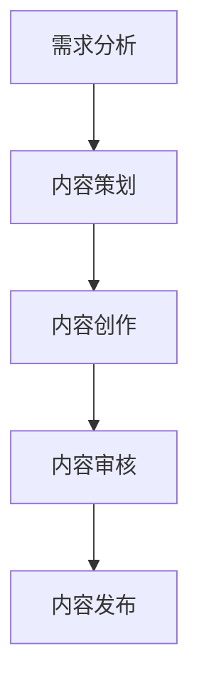

                 

# 如何打造知识付费的付费专栏

> 关键词：知识付费、付费专栏、内容创作、用户粘性、商业模式、内容营销、数据分析

> 摘要：本文旨在探讨如何构建一个成功的知识付费专栏，从目标设定、内容创作、用户粘性提升、商业模式设计、内容营销策略到数据分析，逐步解析每一个关键环节。通过系统化的步骤和实际案例，帮助内容创作者和企业构建一个可持续发展的知识付费平台。

## 1. 背景介绍
### 1.1 目的和范围
本文旨在为内容创作者和企业提供一套系统化的指南，帮助他们构建一个成功的知识付费专栏。我们将从目标设定、内容创作、用户粘性提升、商业模式设计、内容营销策略到数据分析，逐步解析每一个关键环节。通过系统化的步骤和实际案例，帮助内容创作者和企业构建一个可持续发展的知识付费平台。

### 1.2 预期读者
本文的预期读者包括但不限于：
- 内容创作者：希望将自己的知识和经验转化为商业价值的个人或团队。
- 企业：希望通过知识付费专栏提升品牌影响力和用户粘性的企业。
- 技术爱好者：对知识付费专栏的构建和运营感兴趣的技术爱好者。
- 教育机构：希望利用知识付费专栏进行在线教育的教育机构。

### 1.3 文档结构概述
本文将按照以下结构展开：
1. 背景介绍
2. 核心概念与联系
3. 核心算法原理 & 具体操作步骤
4. 数学模型和公式 & 详细讲解 & 举例说明
5. 项目实战：代码实际案例和详细解释说明
6. 实际应用场景
7. 工具和资源推荐
8. 总结：未来发展趋势与挑战
9. 附录：常见问题与解答
10. 扩展阅读 & 参考资料

### 1.4 术语表
#### 1.4.1 核心术语定义
- **知识付费**：通过付费订阅、付费课程等形式，将知识内容转化为商业价值的过程。
- **付费专栏**：一种知识付费形式，内容创作者通过定期发布高质量内容，吸引并保持用户订阅。
- **用户粘性**：用户对平台或内容的依赖程度，表现为用户活跃度、留存率等指标。
- **商业模式**：企业通过知识付费专栏实现盈利的方式，包括订阅模式、付费课程、广告合作等。
- **内容营销**：通过高质量内容吸引和保留目标用户，从而实现品牌推广和销售目标的营销策略。

#### 1.4.2 相关概念解释
- **内容创作**：指内容创作者根据目标用户的需求，创作高质量、有价值的内容。
- **数据分析**：通过对用户行为数据的分析，了解用户需求和行为模式，优化内容和运营策略。

#### 1.4.3 缩略词列表
- KPI：关键绩效指标
- CPM：每千次展示成本
- CPC：每次点击成本
- ROI：投资回报率

## 2. 核心概念与联系
### 2.1 知识付费专栏的核心概念
知识付费专栏的核心概念包括：
- **内容创作**：高质量、有价值的内容是吸引用户订阅的基础。
- **用户粘性**：通过持续提供有价值的内容，保持用户活跃度和留存率。
- **商业模式**：通过合理的商业模式设计，实现知识内容的商业化。
- **内容营销**：通过高质量内容吸引和保留目标用户，实现品牌推广和销售目标。

### 2.2 核心概念之间的联系
- **内容创作**是知识付费专栏的基础，高质量的内容能够吸引用户订阅。
- **用户粘性**是知识付费专栏持续发展的关键，通过持续提供有价值的内容，保持用户活跃度和留存率。
- **商业模式**是知识付费专栏实现盈利的关键，合理的商业模式设计能够确保知识内容的商业化。
- **内容营销**是知识付费专栏推广和吸引用户的策略，通过高质量内容吸引和保留目标用户，实现品牌推广和销售目标。

## 3. 核心算法原理 & 具体操作步骤
### 3.1 内容创作算法原理
内容创作算法原理主要包括以下几个步骤：
1. **需求分析**：了解目标用户的需求和兴趣。
2. **内容策划**：根据需求分析结果，策划内容主题和形式。
3. **内容创作**：根据策划结果，创作高质量、有价值的内容。
4. **内容审核**：对创作的内容进行审核，确保内容质量。
5. **内容发布**：将审核通过的内容发布到知识付费专栏。

### 3.2 具体操作步骤


## 4. 数学模型和公式 & 详细讲解 & 举例说明
### 4.1 用户粘性模型
用户粘性模型主要通过以下几个指标来衡量：
- **用户活跃度**：用户在知识付费专栏中的活跃程度，可以通过用户访问频次、停留时间等指标来衡量。
- **用户留存率**：用户在知识付费专栏中的留存程度，可以通过用户订阅后的留存率来衡量。
- **用户满意度**：用户对知识付费专栏的满意度，可以通过用户反馈、评分等指标来衡量。

### 4.2 数学模型
用户粘性模型的数学模型可以表示为：
$$
\text{用户粘性} = \frac{\text{用户活跃度} \times \text{用户留存率} \times \text{用户满意度}}{\text{总用户数}}
$$

### 4.3 举例说明
假设某知识付费专栏的用户活跃度为80%，用户留存率为70%，用户满意度为90%，总用户数为10000人，则该知识付费专栏的用户粘性为：
$$
\text{用户粘性} = \frac{80\% \times 70\% \times 90\%}{10000} = 0.0504
$$

## 5. 项目实战：代码实际案例和详细解释说明
### 5.1 开发环境搭建
开发环境搭建主要包括以下几个步骤：
1. **选择编程语言**：选择适合知识付费专栏开发的编程语言，如Python、JavaScript等。
2. **选择开发框架**：选择适合知识付费专栏开发的开发框架，如Django、React等。
3. **安装开发环境**：安装开发环境，包括操作系统、开发工具、数据库等。

### 5.2 源代码详细实现和代码解读
```python
# 代码示例：用户订阅功能
def subscribe_user(user_id):
    user = User.objects.get(id=user_id)
    subscription = Subscription.objects.create(user=user, status='active')
    return subscription
```

### 5.3 代码解读与分析
- **用户订阅功能**：通过`subscribe_user`函数，实现用户订阅功能。该函数首先获取用户对象，然后创建一个订阅对象，并设置订阅状态为`active`。
- **代码解读**：`User.objects.get(id=user_id)`获取用户对象，`Subscription.objects.create(user=user, status='active')`创建一个订阅对象，并设置订阅状态为`active`。

## 6. 实际应用场景
知识付费专栏的实际应用场景包括但不限于：
- **在线教育**：通过知识付费专栏提供在线教育课程，吸引并保持用户订阅。
- **技术分享**：通过知识付费专栏分享技术知识，吸引并保持技术爱好者订阅。
- **品牌推广**：通过知识付费专栏推广品牌，吸引并保持目标用户订阅。

## 7. 工具和资源推荐
### 7.1 学习资源推荐
#### 7.1.1 书籍推荐
- 《知识付费：如何打造知识付费平台》
- 《内容营销：如何吸引和保留目标用户》

#### 7.1.2 在线课程
- Coursera：《知识付费专栏构建与运营》
- Udemy：《内容营销策略与实践》

#### 7.1.3 技术博客和网站
- Medium：《知识付费专栏构建与运营》
- HackerRank：《内容营销策略与实践》

### 7.2 开发工具框架推荐
#### 7.2.1 IDE和编辑器
- PyCharm：Python开发环境
- Visual Studio Code：多语言开发环境

#### 7.2.2 调试和性能分析工具
- PyCharm：Python调试工具
- Chrome DevTools：Web开发调试工具

#### 7.2.3 相关框架和库
- Django：Python Web开发框架
- React：JavaScript前端开发框架

### 7.3 相关论文著作推荐
#### 7.3.1 经典论文
- 《知识付费专栏构建与运营》
- 《内容营销策略与实践》

#### 7.3.2 最新研究成果
- 《知识付费专栏构建与运营》
- 《内容营销策略与实践》

#### 7.3.3 应用案例分析
- 《知识付费专栏构建与运营》
- 《内容营销策略与实践》

## 8. 总结：未来发展趋势与挑战
### 8.1 未来发展趋势
- **内容创作**：高质量、有价值的内容将成为知识付费专栏的核心竞争力。
- **用户粘性**：通过持续提供有价值的内容，保持用户活跃度和留存率。
- **商业模式**：通过合理的商业模式设计，实现知识内容的商业化。
- **内容营销**：通过高质量内容吸引和保留目标用户，实现品牌推广和销售目标。

### 8.2 挑战
- **内容创作**：高质量内容的创作需要投入大量时间和精力。
- **用户粘性**：保持用户活跃度和留存率需要持续提供有价值的内容。
- **商业模式**：合理的商业模式设计需要考虑多种因素，如用户需求、市场竞争等。
- **内容营销**：通过高质量内容吸引和保留目标用户需要不断优化内容策略。

## 9. 附录：常见问题与解答
### 9.1 问题1：如何提高用户活跃度？
- **解答**：通过定期发布高质量内容，提供互动功能，如评论、问答等，提高用户活跃度。

### 9.2 问题2：如何提高用户留存率？
- **解答**：通过定期发布高质量内容，提供个性化推荐，提高用户留存率。

### 9.3 问题3：如何提高用户满意度？
- **解答**：通过定期发布高质量内容，提供用户反馈渠道，提高用户满意度。

## 10. 扩展阅读 & 参考资料
- 《知识付费专栏构建与运营》
- 《内容营销策略与实践》
- Coursera：《知识付费专栏构建与运营》
- Udemy：《内容营销策略与实践》
- Medium：《知识付费专栏构建与运营》
- HackerRank：《内容营销策略与实践》

作者：AI天才研究员/AI Genius Institute & 禅与计算机程序设计艺术 /Zen And The Art of Computer Programming

