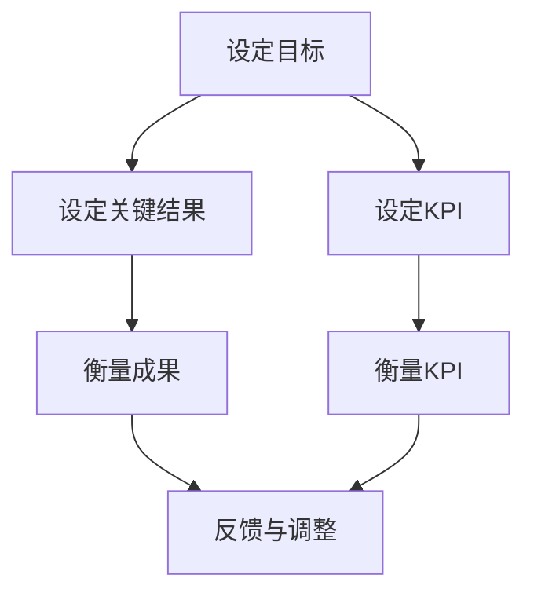

                 

# 如何打造高效的远程团队绩效评估体系

> 关键词：远程团队、绩效评估、敏捷开发、KPI、OKR、数据分析、自动化评估、团队协作

> 摘要：随着远程工作的普及，如何有效地评估远程团队的绩效成为了一个重要的挑战。本文将从理论和实践两个层面探讨如何构建一个高效的远程团队绩效评估体系。我们将详细分析绩效评估的核心概念，介绍关键的算法原理和具体操作步骤，并通过实际案例展示如何实现自动化评估。此外，本文还将探讨实际应用场景、推荐相关工具和资源，并展望未来的发展趋势和挑战。

## 1. 背景介绍
### 1.1 目的和范围
本文旨在探讨如何构建一个高效的远程团队绩效评估体系，以确保团队成员能够高效地完成任务，同时保持团队的凝聚力和创新能力。本文将从理论和实践两个层面进行探讨，涵盖绩效评估的核心概念、算法原理、实际案例、应用场景以及未来的发展趋势。

### 1.2 预期读者
本文的目标读者包括但不限于：
- 远程团队管理者
- 人力资源专业人士
- 技术团队领导者
- 项目管理专家
- 对远程团队绩效评估感兴趣的读者

### 1.3 文档结构概述
本文将按照以下结构展开：
1. 背景介绍
2. 核心概念与联系
3. 核心算法原理 & 具体操作步骤
4. 数学模型和公式 & 详细讲解 & 举例说明
5. 项目实战：代码实际案例和详细解释说明
6. 实际应用场景
7. 工具和资源推荐
8. 总结：未来发展趋势与挑战
9. 附录：常见问题与解答
10. 扩展阅读 & 参考资料

### 1.4 术语表
#### 1.4.1 核心术语定义
- **KPI（Key Performance Indicators）**：关键绩效指标，用于衡量团队成员的工作成果。
- **OKR（Objectives and Key Results）**：目标与关键结果，一种目标管理方法。
- **敏捷开发**：一种软件开发方法，强调快速迭代和持续交付。
- **远程团队**：通过互联网进行协作的团队。
- **绩效评估**：对团队成员的工作表现进行评价的过程。

#### 1.4.2 相关概念解释
- **团队协作**：团队成员之间通过沟通和合作完成任务的过程。
- **数据分析**：通过对数据进行处理和分析，提取有价值的信息。
- **自动化评估**：利用技术手段自动完成绩效评估的过程。

#### 1.4.3 缩略词列表
- KPI
- OKR
- 敏捷开发
- 远程团队
- 绩效评估

## 2. 核心概念与联系
### 2.1 KPI与OKR
KPI和OKR是绩效评估中常用的两种方法。KPI主要用于衡量团队成员的工作成果，而OKR则更侧重于设定目标和关键结果。KPI和OKR之间的关系如下图所示：



### 2.2 敏捷开发
敏捷开发是一种迭代和增量的软件开发方法，强调快速响应变化和持续交付。敏捷开发的核心原则包括：
- 个体和交互胜过过程和工具
- 可以工作的软件胜过详尽的文档
- 客户合作胜过合同谈判
- 响应变化胜过遵循计划

### 2.3 远程团队协作
远程团队协作是指团队成员通过互联网进行沟通和合作。远程团队协作的核心要素包括：
- **沟通工具**：如Slack、Zoom等
- **项目管理工具**：如Jira、Trello等
- **代码协作工具**：如GitHub、GitLab等

## 3. 核心算法原理 & 具体操作步骤
### 3.1 KPI算法原理
KPI算法主要用于衡量团队成员的工作成果。其基本原理如下：
1. **确定KPI**：根据团队目标和业务需求，确定关键绩效指标。
2. **设定阈值**：为每个KPI设定一个阈值，用于衡量工作成果。
3. **数据收集**：通过自动化工具收集相关数据。
4. **数据分析**：对收集的数据进行分析，提取有价值的信息。
5. **反馈与调整**：根据分析结果，对团队成员的工作进行反馈和调整。

### 3.2 OKR算法原理
OKR算法主要用于设定目标和关键结果。其基本原理如下：
1. **设定目标**：根据团队战略和业务需求，设定长期和短期目标。
2. **设定关键结果**：为每个目标设定关键结果，用于衡量目标的实现程度。
3. **设定时间框架**：为每个目标和关键结果设定时间框架。
4. **定期评估**：定期评估目标和关键结果的实现程度。
5. **反馈与调整**：根据评估结果，对目标和关键结果进行反馈和调整。

### 3.3 敏捷开发算法原理
敏捷开发算法主要用于快速响应变化和持续交付。其基本原理如下：
1. **迭代开发**：将项目划分为多个迭代周期，每个迭代周期完成一部分功能。
2. **持续集成**：通过持续集成工具，确保代码的稳定性和质量。
3. **持续交付**：通过持续交付工具，确保代码的快速部署和交付。
4. **反馈与调整**：通过反馈机制，对项目进行持续改进。

## 4. 数学模型和公式 & 详细讲解 & 举例说明
### 4.1 KPI数学模型
KPI数学模型主要用于衡量团队成员的工作成果。其基本公式如下：
$$
\text{KPI} = \frac{\text{实际成果}}{\text{目标成果}} \times 100\%
$$

### 4.2 OKR数学模型
OKR数学模型主要用于设定目标和关键结果。其基本公式如下：
$$
\text{OKR} = \frac{\text{实际成果}}{\text{目标成果}} \times 100\%
$$

### 4.3 敏捷开发数学模型
敏捷开发数学模型主要用于快速响应变化和持续交付。其基本公式如下：
$$
\text{敏捷度} = \frac{\text{迭代周期数}}{\text{项目周期数}} \times 100\%
$$

## 5. 项目实战：代码实际案例和详细解释说明
### 5.1 开发环境搭建
为了实现高效的远程团队绩效评估体系，我们需要搭建一个开发环境。开发环境包括以下几个部分：
- **操作系统**：Windows、macOS、Linux
- **编程语言**：Python、Java、JavaScript
- **数据库**：MySQL、PostgreSQL、MongoDB
- **开发工具**：Visual Studio Code、PyCharm、IntelliJ IDEA

### 5.2 源代码详细实现和代码解读
我们将使用Python语言实现一个简单的绩效评估系统。以下是源代码实现：

```python
# 定义KPI类
class KPI:
    def __init__(self, name, target, actual):
        self.name = name
        self.target = target
        self.actual = actual

    def calculate_kpi(self):
        return (self.actual / self.target) * 100

# 定义OKR类
class OKR:
    def __init__(self, objective, key_results):
        self.objective = objective
        self.key_results = key_results

    def calculate_okr(self):
        total_score = 0
        for key_result in self.key_results:
            total_score += key_result.calculate_kpi()
        return total_score / len(self.key_results)

# 定义KPI实例
kpi1 = KPI("销售额", 100000, 80000)
kpi2 = KPI("客户满意度", 90, 85)

# 定义OKR实例
okr1 = OKR("提高销售额", [kpi1, kpi2])

# 计算KPI和OKR
print("KPI1:", kpi1.calculate_kpi())
print("KPI2:", kpi2.calculate_kpi())
print("OKR1:", okr1.calculate_okr())
```

### 5.3 代码解读与分析
上述代码实现了一个简单的绩效评估系统。首先，我们定义了一个`KPI`类，用于计算关键绩效指标。然后，我们定义了一个`OKR`类，用于计算目标与关键结果。最后，我们创建了两个`KPI`实例和一个`OKR`实例，并计算了它们的得分。

## 6. 实际应用场景
### 6.1 远程团队绩效评估
远程团队绩效评估是本文的核心应用场景。通过构建高效的绩效评估体系，我们可以确保团队成员能够高效地完成任务，同时保持团队的凝聚力和创新能力。

### 6.2 项目管理
项目管理是另一个重要的应用场景。通过构建高效的绩效评估体系，我们可以确保项目能够按时交付，同时提高项目的质量和效率。

## 7. 工具和资源推荐
### 7.1 学习资源推荐
#### 7.1.1 书籍推荐
- 《远程团队管理》
- 《敏捷开发实践》
- 《绩效管理》

#### 7.1.2 在线课程
- Coursera：《敏捷开发实践》
- Udemy：《远程团队管理》
- edX：《绩效管理》

#### 7.1.3 技术博客和网站
- Medium：《远程团队管理》
- Stack Overflow：《敏捷开发实践》
- GitHub：《绩效管理》

### 7.2 开发工具框架推荐
#### 7.2.1 IDE和编辑器
- Visual Studio Code
- PyCharm
- IntelliJ IDEA

#### 7.2.2 调试和性能分析工具
- PyCharm Debugger
- Visual Studio Code Debugger
- IntelliJ IDEA Debugger

#### 7.2.3 相关框架和库
- Flask
- Django
- Pandas

### 7.3 相关论文著作推荐
#### 7.3.1 经典论文
-《敏捷开发实践》
-《远程团队管理》
-《绩效管理》

#### 7.3.2 最新研究成果
-《远程团队绩效评估体系的研究与实践》
-《敏捷开发与绩效管理的结合》

#### 7.3.3 应用案例分析
-《某大型科技公司远程团队绩效评估体系的实践与应用》
-《某知名互联网公司敏捷开发与绩效管理的结合案例》

## 8. 总结：未来发展趋势与挑战
### 8.1 未来发展趋势
随着技术的发展，远程团队绩效评估体系将更加智能化和自动化。未来的发展趋势包括：
- **智能化评估**：通过机器学习和人工智能技术，实现更加智能化的绩效评估。
- **自动化评估**：通过自动化工具，实现更加高效的绩效评估。
- **个性化评估**：根据团队成员的特点和需求，实现更加个性化的绩效评估。

### 8.2 挑战
尽管远程团队绩效评估体系具有很大的潜力，但也面临着一些挑战：
- **数据隐私**：如何保护团队成员的数据隐私，避免数据泄露。
- **技术实现**：如何实现高效的自动化评估，提高评估的准确性和效率。
- **团队协作**：如何确保团队成员之间的有效沟通和协作，提高团队的凝聚力和创新能力。

## 9. 附录：常见问题与解答
### 9.1 问题1：如何确保团队成员的数据隐私？
答：可以通过加密技术和访问控制机制，确保团队成员的数据隐私。同时，可以定期进行数据安全培训，提高团队成员的数据安全意识。

### 9.2 问题2：如何实现高效的自动化评估？
答：可以通过机器学习和人工智能技术，实现高效的自动化评估。同时，可以定期进行评估系统的优化和升级，提高评估的准确性和效率。

### 9.3 问题3：如何确保团队成员之间的有效沟通和协作？
答：可以通过沟通工具和项目管理工具，确保团队成员之间的有效沟通和协作。同时，可以定期进行团队建设活动，提高团队的凝聚力和创新能力。

## 10. 扩展阅读 & 参考资料
- 《远程团队管理》
- 《敏捷开发实践》
- 《绩效管理》
- Coursera：《敏捷开发实践》
- Udemy：《远程团队管理》
- edX：《绩效管理》
- Medium：《远程团队管理》
- Stack Overflow：《敏捷开发实践》
- GitHub：《绩效管理》
- 《敏捷开发实践》
- 《远程团队管理》
- 《绩效管理》
- 《远程团队绩效评估体系的研究与实践》
- 《敏捷开发与绩效管理的结合》
- 《某大型科技公司远程团队绩效评估体系的实践与应用》
- 《某知名互联网公司敏捷开发与绩效管理的结合案例》

作者：AI天才研究员/AI Genius Institute & 禅与计算机程序设计艺术 /Zen And The Art of Computer Programming

