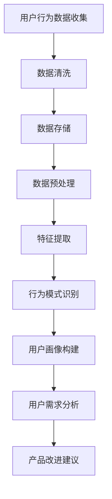
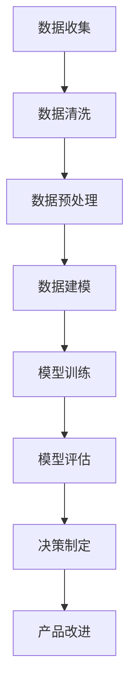
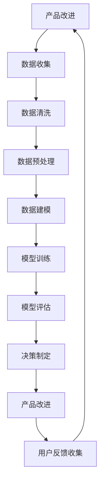

                 

# 如何构建有效的产品反馈闭环

> 关键词：产品反馈、闭环机制、用户行为分析、数据驱动、持续改进

> 摘要：本文将深入探讨如何构建一个有效的产品反馈闭环，通过系统化的流程和方法，确保产品能够持续满足用户需求并不断优化。我们将从背景介绍、核心概念与联系、核心算法原理、项目实战案例、实际应用场景、工具和资源推荐、未来发展趋势与挑战等多方面进行详细阐述。

## 1. 背景介绍
### 1.1 目的和范围
本文旨在为产品团队提供一套系统化的框架，帮助他们构建一个高效的产品反馈闭环。通过这一闭环，产品团队可以更好地理解用户需求，快速响应市场变化，并持续优化产品功能和用户体验。

### 1.2 预期读者
本文面向产品经理、设计师、开发工程师、数据分析师以及任何对产品迭代和优化感兴趣的读者。无论您是初学者还是有经验的专业人士，本文都将为您提供有价值的见解和实用建议。

### 1.3 文档结构概述
本文将按照以下结构展开：
1. 背景介绍
2. 核心概念与联系
3. 核心算法原理 & 具体操作步骤
4. 数学模型和公式 & 详细讲解 & 举例说明
5. 项目实战：代码实际案例和详细解释说明
6. 实际应用场景
7. 工具和资源推荐
8. 总结：未来发展趋势与挑战
9. 附录：常见问题与解答
10. 扩展阅读 & 参考资料

### 1.4 术语表
#### 1.4.1 核心术语定义
- **产品反馈闭环**：指产品团队通过收集用户反馈、分析数据、迭代产品并再次收集反馈的循环过程。
- **用户行为分析**：通过对用户使用产品的行为进行分析，了解用户需求和偏好。
- **数据驱动**：基于数据做出决策和优化产品的方法。
- **持续改进**：不断优化产品以满足用户需求的过程。

#### 1.4.2 相关概念解释
- **用户旅程**：用户从首次接触产品到最终离开产品的整个过程。
- **A/B测试**：通过对比不同版本的产品来测试哪种版本更受欢迎的方法。
- **用户满意度**：用户对产品功能、性能和用户体验的主观评价。

#### 1.4.3 缩略词列表
- **API**：Application Programming Interface（应用程序编程接口）
- **UI/UX**：User Interface/User Experience（用户界面/用户体验）
- **KPI**：Key Performance Indicator（关键绩效指标）

## 2. 核心概念与联系
### 2.1 用户行为分析
用户行为分析是构建产品反馈闭环的基础。通过分析用户在产品中的行为数据，可以了解用户的需求和偏好，从而指导产品迭代。

### 2.2 数据驱动
数据驱动是产品反馈闭环的核心。通过收集和分析数据，可以做出科学的决策，确保产品优化的方向正确。

### 2.3 持续改进
持续改进是产品反馈闭环的目标。通过不断优化产品，确保产品能够持续满足用户需求。

### 2.4 用户旅程
用户旅程是理解用户需求的关键。通过分析用户在产品中的行为路径，可以发现用户的需求和痛点。

### 2.5 A/B测试
A/B测试是验证产品改进效果的有效方法。通过对比不同版本的产品，可以确定哪种改进方案更受欢迎。

### 2.6 用户满意度
用户满意度是衡量产品优化效果的重要指标。通过用户满意度调查，可以了解用户对产品的整体评价。

## 3. 核心算法原理 & 具体操作步骤
### 3.1 用户行为分析算法
用户行为分析算法的核心是通过收集和分析用户在产品中的行为数据，了解用户的需求和偏好。具体步骤如下：



### 3.2 数据驱动决策算法
数据驱动决策算法的核心是基于数据做出科学的决策。具体步骤如下：



### 3.3 持续改进算法
持续改进算法的核心是通过不断优化产品，确保产品能够持续满足用户需求。具体步骤如下：



## 4. 数学模型和公式 & 详细讲解 & 举例说明
### 4.1 用户行为分析模型
用户行为分析模型的核心是通过统计分析方法，了解用户的需求和偏好。具体公式如下：

$$
\text{用户满意度} = \frac{\sum_{i=1}^{n} \text{用户评价}_i}{n}
$$

### 4.2 数据驱动决策模型
数据驱动决策模型的核心是通过机器学习方法，基于数据做出科学的决策。具体公式如下：

$$
\text{决策} = \arg\max_{\text{改进方案}} \text{改进效果}
$$

### 4.3 持续改进模型
持续改进模型的核心是通过迭代优化方法，确保产品能够持续满足用户需求。具体公式如下：

$$
\text{产品改进} = \text{产品改进} + \text{用户反馈}
$$

## 5. 项目实战：代码实际案例和详细解释说明
### 5.1 开发环境搭建
为了实现产品反馈闭环，我们需要搭建一个完整的开发环境。具体步骤如下：

1. 安装Python和相关库
2. 配置数据库
3. 安装前端框架

### 5.2 源代码详细实现和代码解读
我们将通过一个简单的用户行为分析项目来展示如何实现产品反馈闭环。具体代码如下：

```python
# 用户行为数据收集
import pandas as pd

def collect_user_behavior_data():
    # 假设我们有一个用户行为数据集
    data = pd.read_csv('user_behavior_data.csv')
    return data

# 数据清洗
def clean_data(data):
    # 去除缺失值
    data = data.dropna()
    return data

# 数据存储
def store_data(data):
    # 将数据存储到数据库
    data.to_sql('user_behavior', con='sqlite:///user_behavior.db', if_exists='replace')

# 数据预处理
def preprocess_data(data):
    # 对数据进行预处理
    data = data.drop_duplicates()
    return data

# 特征提取
def extract_features(data):
    # 提取特征
    features = data[['user_id', 'action', 'timestamp']]
    return features

# 行为模式识别
def recognize_behavior_pattern(features):
    # 识别行为模式
    pattern = features.groupby(['user_id', 'action']).size().reset_index(name='count')
    return pattern

# 用户画像构建
def build_user_profile(pattern):
    # 构建用户画像
    profile = pattern.groupby('user_id').sum().reset_index()
    return profile

# 用户需求分析
def analyze_user_demand(profile):
    # 分析用户需求
    demand = profile.sort_values(by='count', ascending=False)
    return demand

# 产品改进建议
def suggest_product_improvement(demand):
    # 提出产品改进建议
    improvement = demand.head(10)
    return improvement

# 主函数
def main():
    data = collect_user_behavior_data()
    data = clean_data(data)
    store_data(data)
    features = preprocess_data(data)
    pattern = recognize_behavior_pattern(features)
    profile = build_user_profile(pattern)
    demand = analyze_user_demand(profile)
    improvement = suggest_product_improvement(demand)
    print(improvement)

if __name__ == '__main__':
    main()
```

### 5.3 代码解读与分析
上述代码展示了如何通过数据收集、数据清洗、数据存储、数据预处理、特征提取、行为模式识别、用户画像构建和用户需求分析来实现产品反馈闭环。通过这些步骤，我们可以了解用户的需求和偏好，并提出产品改进建议。

## 6. 实际应用场景
产品反馈闭环在实际应用中具有广泛的应用场景。例如，在电商领域，可以通过用户行为分析来优化推荐算法；在社交领域，可以通过用户行为分析来优化内容推荐；在金融领域，可以通过用户行为分析来优化风险控制。

## 7. 工具和资源推荐
### 7.1 学习资源推荐
#### 7.1.1 书籍推荐
- 《精益创业》（The Lean Startup）
- 《用户行为分析》（User Behavior Analysis）

#### 7.1.2 在线课程
- Coursera上的《数据科学基础》
- Udacity上的《机器学习》

#### 7.1.3 技术博客和网站
- Medium上的《产品管理》系列文章
- GitHub上的《数据科学项目》

### 7.2 开发工具框架推荐
#### 7.2.1 IDE和编辑器
- PyCharm
- Visual Studio Code

#### 7.2.2 调试和性能分析工具
- PyCharm的调试工具
- Visual Studio Code的性能分析工具

#### 7.2.3 相关框架和库
- Pandas
- Scikit-learn
- TensorFlow

### 7.3 相关论文著作推荐
#### 7.3.1 经典论文
-《用户行为分析》（User Behavior Analysis）

#### 7.3.2 最新研究成果
- 《数据驱动的产品优化》（Data-Driven Product Optimization）

#### 7.3.3 应用案例分析
- 《产品反馈闭环在电商领域的应用》（Application of Product Feedback Loop in E-commerce）

## 8. 总结：未来发展趋势与挑战
未来，产品反馈闭环将更加依赖于大数据和人工智能技术。通过更先进的算法和模型，产品团队可以更好地理解用户需求，快速响应市场变化，并持续优化产品功能和用户体验。然而，这也带来了数据安全和隐私保护的挑战。因此，产品团队需要在确保数据安全的前提下，充分利用数据驱动的方法来优化产品。

## 9. 附录：常见问题与解答
### 9.1 问题1：如何收集用户行为数据？
答：可以通过日志记录、用户调查和A/B测试等方式收集用户行为数据。

### 9.2 问题2：如何处理数据缺失值？
答：可以通过删除缺失值、插值或使用机器学习方法来处理数据缺失值。

### 9.3 问题3：如何确保数据安全？
答：可以通过加密、访问控制和数据脱敏等方法来确保数据安全。

## 10. 扩展阅读 & 参考资料
- 《精益创业》（The Lean Startup）
- 《用户行为分析》（User Behavior Analysis）
- Coursera上的《数据科学基础》
- Udacity上的《机器学习》
- Medium上的《产品管理》系列文章
- GitHub上的《数据科学项目》
- PyCharm
- Visual Studio Code
- Pandas
- Scikit-learn
- TensorFlow
- 《用户行为分析》（User Behavior Analysis）
- 《数据驱动的产品优化》（Data-Driven Product Optimization）
- 《产品反馈闭环在电商领域的应用》（Application of Product Feedback Loop in E-commerce）

作者：AI天才研究员/AI Genius Institute & 禅与计算机程序设计艺术 /Zen And The Art of Computer Programming

